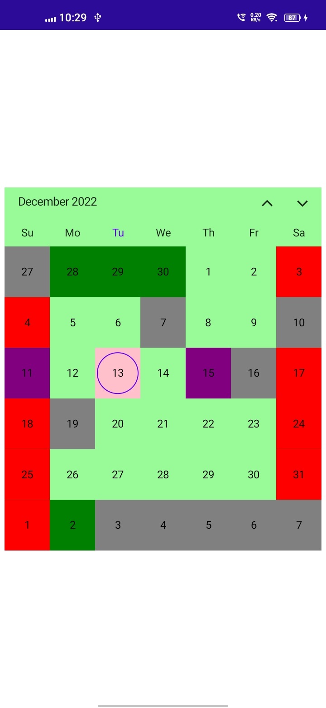
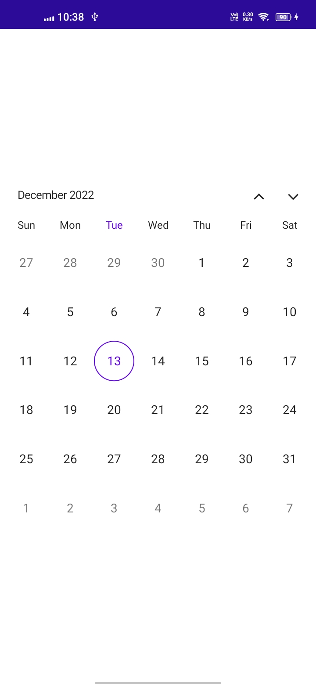
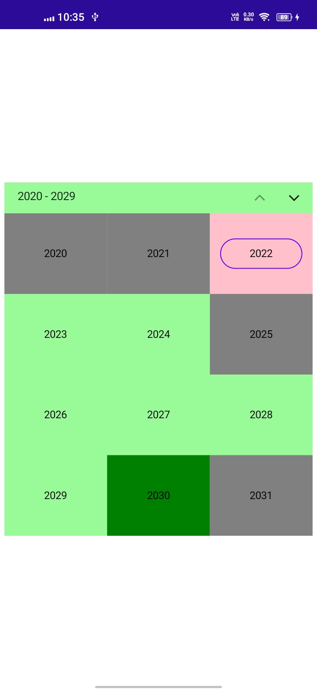
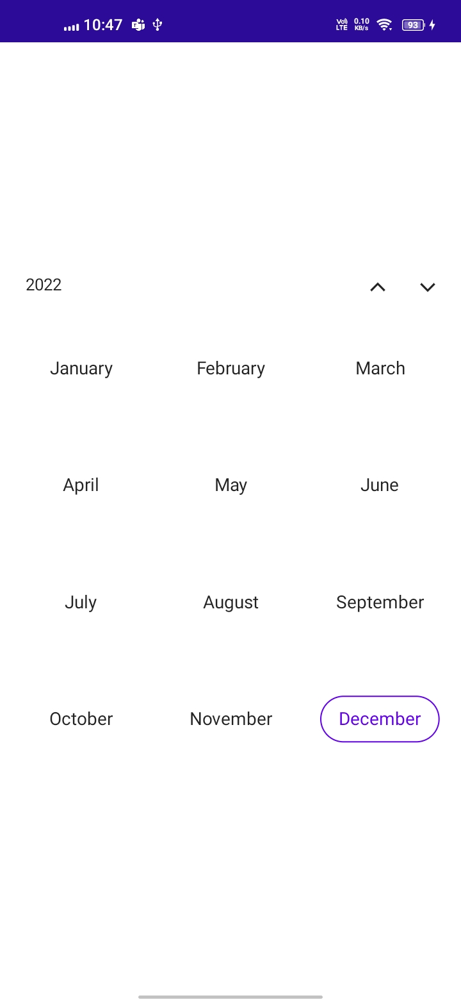
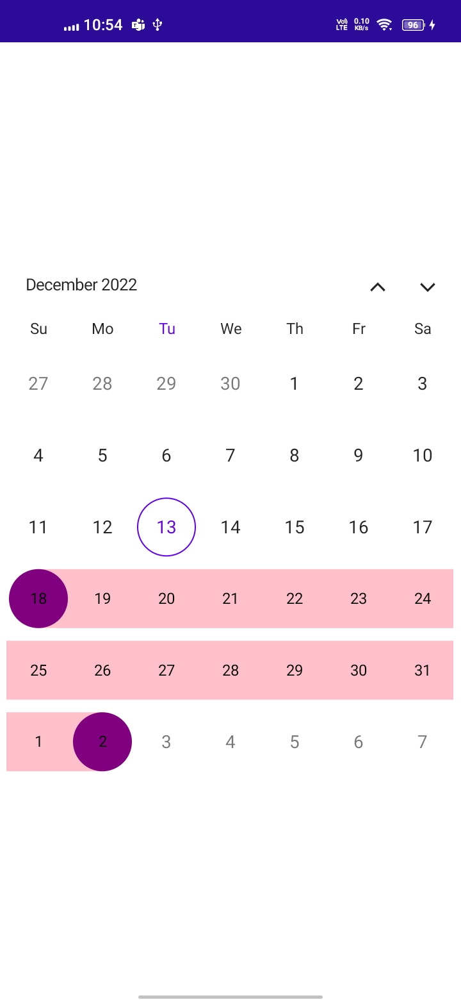

# Customizations in MAUI Calendar (SfCalendar)
Each cell of the Month, Year, Decade and Century can be customized in [MAUI Calendar](https://www.syncfusion.com/maui-widgets/maui-calendar) (SfCalendar).

## Month cell customization
You can customize the calendar month view cell by using the `MonthView` property of `SfCalendar`.

*    **Month dates** – You can customize the month date's text style and background of the `Calendar` by using the [TextStyle](https://pub.dev/documentation/syncfusion_maui_calendar/latest/calendar/CalendarMonthView/textStyle.html) and [Background](https://pub.dev/documentation/syncfusion_maui_calendar/latest/calendar/CalendarMonthView/background.html) properties of [MonthView](https://pub.dev/documentation/syncfusion_maui_calendar/latest/calendar/CalendarMonthView-class.html).

*    **Today date** – You can customize the today date text style and background of the `Calendar` by using the [TodayTextStyle](https://pub.dev/documentation/syncfusion_maui_calendar/latest/calendar/CalendarMonthView/TodayTextStyle.html) and [TodayBackground](https://pub.dev/documentation/syncfusion_maui_calendar/latest/calendar/CalendarMonthView/TodayBackground.html) properties of [MonthView](https://pub.dev/documentation/syncfusion_maui_calendar/latest/calendar/CalendarMonthView-class.html).

*    **Trailing and Leading dates** – You can hide the trailing and leading date by using the [ShowTrailingAndLeadingDates](https://pub.dev/documentation/syncfusion_maui_calendar/latest/calendar/CalendarMonthView/ShowTrailingAndLeadingDates.html) property in the [CalendarMonthView](https://pub.dev/documentation/syncfusion_maui_calendar/latest/calendar/CalendarMonthView-class.html) class. You can also customize the Trailing and Leading dates text style and background of the `Calendar` by using the [TrailingLeadingDatesTextStyle](https://pub.dev/documentation/syncfusion_maui_calendar/latest/calendar/CalendarMonthView/TrailingLeadingDatesTextStyle.html) and [TrailingLeadingDatesBackground](https://pub.dev/documentation/syncfusion_maui_calendar/latest/calendar/CalendarMonthView/TrailingLeadingDatesBackground.html) properties of [MonthView](https://pub.dev/documentation/syncfusion_maui_calendar/latest/calendar/CalendarMonthView-class.html).

*    **Disabled dates** – You can disable the date by using the MinimumDate, MaximumDate, EnablePastDates and SelectableDayPredicate callback. The date before `MinimumDate` is said to disabled date, the date after the `MaximumDate` is said to disabled date, if you want disable the date before today date by using the `EnablePastDates` and if you want to disable any particular date by using `SelectableDayPredicate` property. You can also customize the disabled dates text style and background of the `Calendar` by using the [DisabledDatesTextStyle](https://pub.dev/documentation/syncfusion_maui_calendar/latest/calendar/CalendarMonthView/DisabledDatesTextStyle.html) and [DisabledDatesBackground](https://pub.dev/documentation/syncfusion_maui_calendar/latest/calendar/CalendarMonthView/DisabledDatesBackground.html) properties of [MonthView](https://pub.dev/documentation/syncfusion_maui_calendar/latest/calendar/CalendarMonthView-class.html).

*    **Special Dates** – You can add special dates to the `DateRangePicker` by using [SpecialDates](https://pub.dev/documentation/syncfusion_maui_calendar/latest/calendar/CalendarMonthView/SpecialDates.html) property and you can customize the special dates textstyle and background of the `Calendar` by using the [SpecialDatesTextStyle](https://pub.dev/documentation/syncfusion_maui_calendar/latest/calendar/CalendarMonthView/SpecialDatesTextStyle.html) and [SpecialDatesBackground](https://pub.dev/documentation/syncfusion_maui_calendar/latest/calendar/CalendarMonthView/SpecialDatesBackground.html) properties of [MonthView](https://pub.dev/documentation/syncfusion_maui_calendar/latest/calendar/CalendarMonthView-class.html).

*    **Weekend Dates** – You can customize the weekend dates textstyle and background of the `Calendar` by using the [WeekendDatesTextStyle](https://pub.dev/documentation/syncfusion_maui_calendar/latest/calendar/CalendarMonthView/WeekendDatesTextStyle.html) and [WeekendDatesBackground](https://pub.dev/documentation/syncfusion_maui_calendar/latest/calendar/CalendarMonthView/WeekendDatesBackground.html) properties of [MonthView](https://pub.dev/documentation/syncfusion_maui_calendar/latest/calendar/CalendarMonthView-class.html).









        CalendarTextStyle textStyle = new CalendarTextStyle()
        {
            TextColor = Colors.Black,
            FontSize = 12,
        };

        this.Calendar.MinimumDate = DateTime.Now.AddDays(-15);
        this.Calendar.MaximumDate = DateTime.Now.AddDays(20);
        this.Calendar.EnablePastDates = true;
        this.Calendar.SelectableDayPredicate = (date) =>
        {
            if (date.Date == DateTime.Now.AddDays(3).Date || date.Date == DateTime.Now.AddDays(6).Date || date.Date == DateTime.Now.AddDays(-3).Date || date.Date == DateTime.Now.AddDays(-6).Date)
            {
                return false;
            }

            return true;
        };

        this.Calendar.MonthView.SpecialDates = new List<DateTime>
        {
            DateTime.Now.AddDays(2),
            DateTime.Now.AddDays(-2),
        };

        this.Calendar.MonthView.WeekendDays = new List<DayOfWeek>
        {
            DayOfWeek.Sunday,
            DayOfWeek.Saturday,
        };

        this.Calendar.Background = Colors.PaleGreen;
        this.Calendar.MonthView.TextStyle = textStyle;
        this.Calendar.MonthView.TodayBackground = Colors.Pink;
        this.Calendar.MonthView.TodayTextStyle = textStyle;
        this.Calendar.ShowTrailingAndLeadingDates = true;
        this.Calendar.MonthView.TrailingLeadingDatesBackground = Colors.Green;
        this.Calendar.MonthView.TrailingLeadingDatesTextStyle = textStyle;
        this.Calendar.MonthView.DisabledDatesBackground = Colors.Grey;
        this.Calendar.MonthView.DisabledDatesTextStyle = textStyle;
        this.Calendar.MonthView.SpecialDatesBackground = Colors.Purple;
        this.Calendar.MonthView.SpecialDatesTextStyle = textStyle;
        this.Calendar.MonthView.WeekendDatesBackground = Colors.Red;
        this.Calendar.MonthView.WeekendDatesTextStyle = textStyle;




>**NOTE**
* The Background color and text style will be applied based on the following order: selectableDayPredicate dates, special dates, disable dates, today date, trailingLeading Dates and weekend dates.

## Month View Header format
You can customize the month format of the `Calendar` by using the [TextFormat](https://pub.dev/documentation/syncfusion_maui_calendar/latest/calendar/SfCalendar/CalendarMonthView/CalendarMonthHeaderView/TextFormat.html) property.









this.Calendar.MonthView.HeaderView = new CalendarMonthHeaderView()
{
    TextFormat = "ddd",
};




## Year cell customization
You can customize the calendar `year`, `decade` and `century` view by using the `YearView` property of `SfCalendar`. 

*   **Year cell dates** – You can customize the year view date's text style and background of the `Calendar` by using the [TextStyle](https://pub.dev/documentation/syncfusion_maui_calendar/latest/calendar/CalendarYearView/textStyle.html) and [Background](https://pub.dev/documentation/syncfusion_maui_calendar/latest/calendar/CalendarYearView/background.html) properties of [YearView](https://pub.dev/documentation/syncfusion_maui_calendar/latest/calendar/CalendarYearView-class.html).

*    **Disabled dates** – You can disable the date by using the MinimumDate, MaximumDate, EnablePastDates and SelectableDayPredicate callback. The date before `MinimumDate` is said to disabled date, the date after the `MaximumDate` is said to disabled date, if you want disable the date before today date by using the `EnablePastDates` and if you want to disable any particular date by using `SelectableDayPredicate` property. You can also customize the disabled dates text style and background of the `Calendar` by using the [DisabledDatesTextStyle](https://pub.dev/documentation/syncfusion_maui_calendar/latest/calendar/CalendarYearView/DisabledDatesTextStyle.html) and [DisabledDatesBackground](https://pub.dev/documentation/syncfusion_maui_calendar/latest/calendar/CalendarYearView/DisabledDatesBackground.html) properties of [YearView](https://pub.dev/documentation/syncfusion_maui_calendar/latest/calendar/CalendarYearView-class.html).

*    **Leading dates** – You can hide the Leading date by using the [ShowTrailingAndLeadingDates](https://pub.dev/documentation/syncfusion_maui_calendar/latest/calendar/CalendarYearView/ShowTrailingAndLeadingDates.html) property in the [SfCalendar](https://pub.dev/documentation/syncfusion_maui_calendar/latest/calendar/CalendarYearView-class.html) class. You can also customize the Leading dates text style and background of the `Calendar` by using the [LeadingDatesTextStyle](https://pub.dev/documentation/syncfusion_maui_calendar/latest/calendar/CalendarYearView/LeadingDatesTextStyle.html) and [LeadingDatesBackground](https://pub.dev/documentation/syncfusion_maui_calendar/latest/calendar/CalendarYearView/LeadingDatesBackground.html) properties of [YearView](https://pub.dev/documentation/syncfusion_maui_calendar/latest/calendar/CalendarYearView-class.html). It is not applicable for Year view.

*    **Today date** – You can customize the today date text style and background of the `Calendar` by using the [TodayTextStyle](https://pub.dev/documentation/syncfusion_maui_calendar/latest/calendar/CalendarYearView/TodayTextStyle.html) and [TodayBackground](https://pub.dev/documentation/syncfusion_maui_calendar/latest/calendar/CalendarYearView/TodayBackground.html) properties of [YearView](https://pub.dev/documentation/syncfusion_maui_calendar/latest/calendar/CalendarYearView-class.html).









        CalendarTextStyle textStyle = new CalendarTextStyle()
        {
            TextColor = Colors.Black,
            FontSize = 12,
        };

        this.Calendar.View = CalendarView.Decade;
        this.Calendar.MinimumDate = DateTime.Now.AddYears(-1);
        this.Calendar.MaximumDate = DateTime.Now.AddYears(8);
        this.Calendar.EnablePastDates = false;
        this.Calendar.SelectableDayPredicate = (date) =>
        {
            if (date.Year == DateTime.Now.AddYears(3).Year)
            {
                return false;
            }
            return true;
        };

        this.Calendar.Background = Colors.PaleGreen;
        this.Calendar.YearView.TextStyle = textStyle;
        this.Calendar.YearView.TodayBackground = Colors.Pink;
        this.Calendar.YearView.TodayTextStyle = textStyle;
        this.Calendar.ShowTrailingAndLeadingDates = true;
        this.Calendar.YearView.LeadingDatesBackground = Colors.Green;
        this.Calendar.YearView.LeadingDatesTextStyle = textStyle;
        this.Calendar.YearView.DisabledDatesBackground = Colors.Grey;
        this.Calendar.YearView.DisabledDatesTextStyle = textStyle;




>**NOTE**
* The Background color and text style will be applied based on the following order: selectableDayPredicate dates, disable dates, today date and leading Dates.

## Year View Text format
You can customize the month format of the `Calendar` by using the [MonthFormat](https://pub.dev/documentation/syncfusion_maui_calendar/latest/calendar/SfCalendar/MonthFormat.html) property in `YearView` class.









this.Calendar.YearView = new CalendarYearView()
{
    MonthFormat = "MMMM",
};




## Selection cell customization

You can customize the Selection cell background and textStyle in Month, Year, Decade and Century view by using the `SfCalendar`.

*    **Selection Background** - The Selected date background can be customized by using the [SelectionBackground](https://pub.dev/documentation/syncfusion_maui_calendar/latest/calendar/SfCalendar/SelectionBackground.html) property in `SfCalendar`. This property is used in `Single`, `Multiple` and in between selected date of `Range` selection.

*    **Selection TextStyle** - The Selected date textstyle can be customized by using the [SelectionTextStyle](https://pub.dev/documentation/syncfusion_maui_calendar/latest/calendar/SfCalendar/MonthView/SelectionTextStyle.html) property in `MonthView`. This property is used in `Single`, `Multiple` and start and end date of the selected date range of `Range` selection.

*    **Start Range Selection Background** - The Start range date background can be customized by using the [StartRangeSelectionBackground](https://pub.dev/documentation/syncfusion_maui_calendar/latest/calendar/SfCalendar/StartRangeSelectionBackground.html) property in `SfCalendar`. This property is used in Start range selected date of `Range` selection.

*    **End Range Selection Background** -  The End range date background can be customized by using the [EndRangeSelectionBackground](https://pub.dev/documentation/syncfusion_maui_calendar/latest/calendar/SfCalendar/EndRangeSelectionBackground.html) property in `SfCalendar`. This property is used in End range selected date of `Range` selection.

*    **Range TextStyle** – The in between selected date range textstyle can be customized by using the [RangeTextStyle](https://pub.dev/documentation/syncfusion_maui_calendar/latest/calendar/SfCalendar/MonthView/RangeTextStyle.html) property in `MonthView`. This property is used in between selected date range of `Range` selection.









        CalendarTextStyle textStyle = new CalendarTextStyle()
        {
            TextColor = Colors.Black,
            FontSize = 12,
        };

        this.Calendar.SelectedDateRange = new CalendarDateRange(DateTime.Now.AddDays(5).Date, DateTime.Now.AddDays(20).Date);
        this.Calendar.View = CalendarView.Month;
        this.Calendar.SelectionMode = CalendarSelectionMode.Range;
        this.Calendar.StartRangeSelectionBackground = Colors.Purple;
        this.Calendar.EndRangeSelectionBackground = Colors.Purple;
        this.Calendar.SelectionBackground = Colors.Pink;
        this.Calendar.MonthView.SelectionTextStyle = textStyle;
        this.Calendar.MonthView.RangeTextStyle = textStyle;




