# Customizations in .NET MAUI Calendar (SfCalendar)
Each cell of the Month, Year, Decade and Century views can be customized in [.NET MAUI Calendar](https://www.syncfusion.com/maui-controls/maui-calendar) (SfCalendar).

To get start quickly with our .NET MAUI Calendar customizations, you can check the below video.


    
## Month cell customization
You can customize the calendar month view cell by using the `MonthView` property of `SfCalendar`.

*    **Month dates** – You can customize the month dates text style and background of the `Calendar` by using the [TextStyle](https://help.syncfusion.com/cr/maui/Syncfusion.Maui.Calendar.CalendarMonthView.html#Syncfusion_Maui_Calendar_CalendarMonthView_TextStyle) and [Background](https://help.syncfusion.com/cr/maui/Syncfusion.Maui.Calendar.CalendarMonthView.html#Syncfusion_Maui_Calendar_CalendarMonthView_Background) properties of [MonthView](https://help.syncfusion.com/cr/maui/Syncfusion.Maui.Calendar.CalendarMonthView.html).

*    **Today date** – You can customize the today date text style and background of the `Calendar` by using the [TodayTextStyle](https://help.syncfusion.com/cr/maui/Syncfusion.Maui.Calendar.CalendarMonthView.html#Syncfusion_Maui_Calendar_CalendarMonthView_TodayTextStyle) and [TodayBackground](https://help.syncfusion.com/cr/maui/Syncfusion.Maui.Calendar.CalendarMonthView.html#Syncfusion_Maui_Calendar_CalendarMonthView_TodayBackground) properties of [MonthView](https://help.syncfusion.com/cr/maui/Syncfusion.Maui.Calendar.CalendarMonthView.html).

*    **Trailing and leading dates** – You can hide the trailing and leading dates using the [ShowTrailingAndLeadingDates](https://help.syncfusion.com/cr/maui/Syncfusion.Maui.Calendar.SfCalendar.html#Syncfusion_Maui_Calendar_SfCalendar_ShowTrailingAndLeadingDates) property in the [SfCalendar](https://help.syncfusion.com/cr/maui/Syncfusion.Maui.Calendar.SfCalendar.html) class. You can also customize the trailing and leading dates text style and background of the `Calendar` using the [TrailingLeadingDatesTextStyle](https://help.syncfusion.com/cr/maui/Syncfusion.Maui.Calendar.CalendarMonthView.html#Syncfusion_Maui_Calendar_CalendarMonthView_TrailingLeadingDatesTextStyle) and [TrailingLeadingDatesBackground](https://help.syncfusion.com/cr/maui/Syncfusion.Maui.Calendar.CalendarMonthView.html#Syncfusion_Maui_Calendar_CalendarMonthView_TrailingLeadingDatesBackground) properties of the [MonthView](https://help.syncfusion.com/cr/maui/Syncfusion.Maui.Calendar.CalendarMonthView.html).

*    **Disabled dates** – You can disable the date by using the MinimumDate, MaximumDate, EnablePastDates and SelectableDayPredicate. The date before [MinimumDate](https://help.syncfusion.com/cr/maui/Syncfusion.Maui.Calendar.SfCalendar.html#Syncfusion_Maui_Calendar_SfCalendar_MinimumDate) is said to disabled date, the date after the [MaximumDate](https://help.syncfusion.com/cr/maui/Syncfusion.Maui.Calendar.SfCalendar.html#Syncfusion_Maui_Calendar_SfCalendar_MaximumDate) is said to disabled date, if you want to disable the date before today date by using the [EnablePastDates](https://help.syncfusion.com/cr/maui/Syncfusion.Maui.Calendar.SfCalendar.html#Syncfusion_Maui_Calendar_SfCalendar_EnablePastDates) and if you want to disable any particular date by using [SelectableDayPredicate](https://help.syncfusion.com/cr/maui/Syncfusion.Maui.Calendar.SfCalendar.html#Syncfusion_Maui_Calendar_SfCalendar_SelectableDayPredicate) property. You can also customize the disabled dates text style and background of the `Calendar` by using the [DisabledDatesTextStyle](https://help.syncfusion.com/cr/maui/Syncfusion.Maui.Calendar.CalendarMonthView.html#Syncfusion_Maui_Calendar_CalendarMonthView_DisabledDatesTextStyle) and [DisabledDatesBackground](https://help.syncfusion.com/cr/maui/Syncfusion.Maui.Calendar.CalendarMonthView.html#Syncfusion_Maui_Calendar_CalendarMonthView_DisabledDatesBackground) properties of [MonthView](https://help.syncfusion.com/cr/maui/Syncfusion.Maui.Calendar.CalendarMonthView.html).

*    **Weekend dates** – You can customize the weekend dates text style and background of the `Calendar` using the [WeekendDatesTextStyle](https://help.syncfusion.com/cr/maui/Syncfusion.Maui.Calendar.CalendarMonthView.html#Syncfusion_Maui_Calendar_CalendarMonthView_WeekendDatesTextStyle) and [WeekendDatesBackground](https://help.syncfusion.com/cr/maui/Syncfusion.Maui.Calendar.CalendarMonthView.html#Syncfusion_Maui_Calendar_CalendarMonthView_WeekendDatesBackground) properties of the [MonthView](https://help.syncfusion.com/cr/maui/Syncfusion.Maui.Calendar.CalendarMonthView.html).




<calendar:SfCalendar  x:Name="calendar" 
                        View="Month"
                        Background="PaleGreen">
            <Calendar:SfCalendar.MonthView>
                <Calendar:CalendarMonthView
                TodayBackground="Pink" DisabledDatesBackground="Grey" SpecialDatesBackground="#FFEFD2" WeekendDatesBackground="#E2F9F3"/>
            </Calendar:SfCalendar.MonthView>
</calendar:SfCalendar>




        CalendarTextStyle textStyle = new CalendarTextStyle()
        {
            TextColor = Colors.Black,
            FontSize = 12,
        };

        this.calendar.MinimumDate = DateTime.Now.AddDays(-15);
        this.calendar.MaximumDate = DateTime.Now.AddDays(20);
        this.calendar.EnablePastDates = true;
        this.calendar.SelectableDayPredicate = (date) =>
        {
            if (date.Date == DateTime.Now.AddDays(3).Date || date.Date == DateTime.Now.AddDays(6).Date || date.Date == DateTime.Now.AddDays(-3).Date || date.Date == DateTime.Now.AddDays(-6).Date)
            {
                return false;
            }

            return true;
        };

        this.calendar.Background = Colors.PaleGreen.WithAlpha(0.3f);
        this.calendar.ShowTrailingAndLeadingDates = true;
        this.calendar.MonthView = new CalendarMonthView()
        {
            WeekendDays = new List<DayOfWeek>
            {
                DayOfWeek.Sunday,
                DayOfWeek.Saturday,
            },

            TextStyle = textStyle,
            TodayBackground = Colors.Pink,
            TodayTextStyle = textStyle,
            DisabledDatesBackground = Colors.Grey.WithAlpha(0.3f),
            DisabledDatesTextStyle = textStyle,
            TrailingLeadingDatesBackground = Colors.Red.WithAlpha(0.3f),
            TrailingLeadingDatesTextStyle = textStyle,
            SpecialDatesBackground = Color.FromArgb("#FFEFD2"),
            SpecialDatesTextStyle = textStyle,
            WeekendDatesBackground = Color.FromArgb("#E2F9F3"),
            WeekendDatesTextStyle = textStyle,
        };




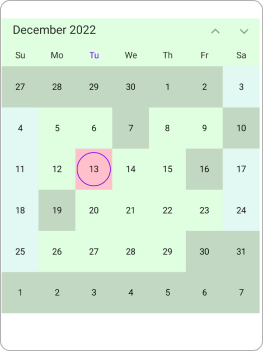

*    **Special day predicate** - The special day predicate decides whether the month cell date is a special date or not in the calendar. You can add a special date to the `Calendar` using the [SpecialDayPredicate](https://help.syncfusion.com/cr/maui/Syncfusion.Maui.Calendar.CalendarMonthView.html#Syncfusion_Maui_Calendar_CalendarMonthView_SpecialDayPredicate) property, and you can also customize the special day text style and background of the `Calendar` using the [SpecialDatesTextStyle](https://help.syncfusion.com/cr/maui/Syncfusion.Maui.Calendar.CalendarMonthView.html#Syncfusion_Maui_Calendar_CalendarMonthView_SpecialDatesTextStyle) and [SpecialDatesBackground](https://help.syncfusion.com/cr/maui/Syncfusion.Maui.Calendar.CalendarMonthView.html#Syncfusion_Maui_Calendar_CalendarMonthView_SpecialDatesBackground) properties of [MonthView](https://help.syncfusion.com/cr/maui/Syncfusion.Maui.Calendar.CalendarMonthView.html). You can customize the special day with icons such as dots, hearts, diamonds, stars, and bells in the `MonthView` and also customize the icon color. If you do not wish to add any icon details, you can set them to be transparent.




<calendar:SfCalendar  x:Name="calendar"  View="Month">
</calendar:SfCalendar>




this.calendar.MonthView.SpecialDayPredicate = (date) =>
{
    if (date.Date == DateTime.Now.AddDays(2).Date)
    {
        CalendarIconDetails iconDetails = new CalendarIconDetails();
        iconDetails.Icon = CalendarIcon.Circle;
        iconDetails.Fill = Colors.Red;
        return iconDetails;
    }
    else if (date.Date == DateTime.Now.AddDays(3).Date)
    {
        CalendarIconDetails iconDetails = new CalendarIconDetails();
        iconDetails.Icon = CalendarIcon.Triangle;
        iconDetails.Fill = Colors.Blue;
        return iconDetails;
    }
    else if (date.Date == DateTime.Now.AddDays(4).Date)
    {
        CalendarIconDetails iconDetails = new CalendarIconDetails();
        iconDetails.Icon = CalendarIcon.Square;
        iconDetails.Fill = Colors.Green;
        return iconDetails;
    }
    else if (date.Date == DateTime.Now.AddDays(5).Date)
    {
        CalendarIconDetails iconDetails = new CalendarIconDetails();
        iconDetails.Icon = CalendarIcon.Heart;
        iconDetails.Fill = Colors.Red;
        return iconDetails;
    }
    else if (date.Date == DateTime.Now.AddDays(6).Date)
    {
        CalendarIconDetails iconDetails = new CalendarIconDetails();
        iconDetails.Icon = CalendarIcon.Diamond;
        iconDetails.Fill = Colors.Blue;
        return iconDetails;
    }
    else if (date.Date == DateTime.Now.AddDays(7).Date)
    {
        CalendarIconDetails iconDetails = new CalendarIconDetails();
        iconDetails.Icon = CalendarIcon.Bell;
        iconDetails.Fill = Colors.Black;
        return iconDetails;
    }
    else if (date.Date == DateTime.Now.AddDays(8).Date)
    {
        CalendarIconDetails iconDetails = new CalendarIconDetails();
        iconDetails.Icon = CalendarIcon.Star;
        iconDetails.Fill = Colors.Green;
        return iconDetails;
    }

    return null;
};




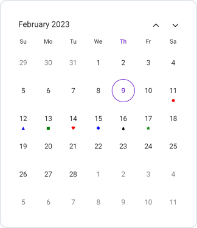
>**NOTE**
* The Background color and text style will be applied based on the following order: selectableDayPredicate dates, special dates, disable dates, today date, weekend dates, trailingLeading dates, and normal dates.

*    **Special day predicate On Demand** - The on-demand refresh feature allows the `SfCalendar` to dynamically update special dates after new data is fetched. You can explicitly trigger a refresh to re-invoke the [SpecialDayPredicate](https://help.syncfusion.com/cr/maui/Syncfusion.Maui.Calendar.CalendarMonthView.html#Syncfusion_Maui_Calendar_CalendarMonthView_SpecialDayPredicate), ensuring that visual indicators such as icons, text styles, and backgrounds reflect the latest metadata only after the update. The new [UpdateSpecialDayPredicate]https://help.syncfusion.com/cr/maui/Syncfusion.Maui.Calendar.CalendarMonthView.html#Syncfusion_Maui_Calendar_UpdateSpecialDayPredicate) provides a direct way to force this re-evaluation, guaranteeing that special-day indicators display the most recent data after a refresh.




<calendar:SfCalendar  x:Name="calendar"  View="Month">
</calendar:SfCalendar>




public class MainPage : ContentPage
{

    public List<DateTime> SpecialDatesCollection = new List<DateTime>();

    public MainPage()
    {
        InitializeComponent();
        calendar.ViewChanged += Calendar_ViewChanged;
        this.calendar.MonthView.SpecialDayPredicate = (date) =>
        {
            foreach (DateTime dates in SpecialDatesCollection)
            {
                if (date.Date == dates.Date)
                {
                    CalendarIconDetails calendarIcon = GetSpecialDates(dates);
                    return calendarIcon;
                }
            }
            return null;
        };
    }

    private CalendarIconDetails GetSpecialDates(DateTime date)
    {
        if (SpecialDatesCollection.Contains(date.Date)) 
        {
            CalendarIconDetails calendarIconDetails=new CalendarIconDetails()
            {
                Icon = CalendarIcon.Diamond,
                Fill = Colors.Red, 
            };
            return calendarIconDetails;
        }
        return null;
    }

    private async void Calendar_ViewChanged(object sender, CalendarViewChangedEventArgs e)
    {
        SpecialDatesCollection.Clear();
        await LoadSpecialDatesFromAPIAsync(e.NewVisibleDates);
        calendar.UpdateSpecialDayPredicate();
    }

    private async Task LoadSpecialDatesFromAPIAsync(CalendarDateRange range)
    {
        var httpClient = new HttpClient();
        var requestData = new { StartDate = range.StartDate.Date, EndDate = range.EndDate.Date };
        var response = await httpClient.PostAsJsonAsync("https://your-api.com/special-dates", requestData);
        response.EnsureSuccessStatusCode();
        var apiResponse = await response.Content.ReadFromJsonAsync<ApiSpecialDatesResponse>();
        if (apiResponse?.SpecialDates != null)
        {
            foreach (var dateStr in apiResponse.SpecialDates)
            {
                if (DateTime.TryParse(dateStr, out var date))
                    specialDates.Add(date.Date);
            }
        }
    }
}




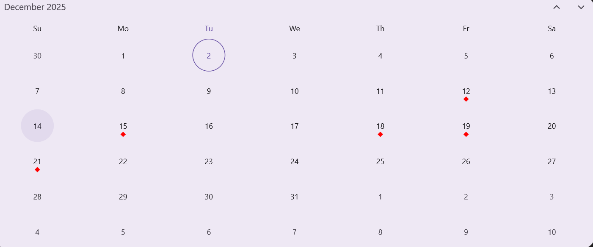

## Year cell customization
You can customize the calendar `year`, `decade`, and `century` views by using the `YearView` property of `SfCalendar`.

*   **Year cell dates** – You can customize the year view date's text style and background of the `Calendar` by using the [TextStyle](https://help.syncfusion.com/cr/maui/Syncfusion.Maui.Calendar.CalendarYearView.html#Syncfusion_Maui_Calendar_CalendarYearView_TextStyle) and [Background](https://help.syncfusion.com/cr/maui/Syncfusion.Maui.Calendar.CalendarYearView.html#Syncfusion_Maui_Calendar_CalendarYearView_Background) properties of [YearView](https://help.syncfusion.com/cr/maui/Syncfusion.Maui.Calendar.CalendarYearView.html).

*    **Disabled dates** – You can disable the date by using the MinimumDate, MaximumDate, EnablePastDates and SelectableDayPredicate. The date before [MinimumDate](https://help.syncfusion.com/cr/maui/Syncfusion.Maui.Calendar.SfCalendar.html#Syncfusion_Maui_Calendar_SfCalendar_MinimumDate) is said to disabled date, the date after the [MaximumDate](https://help.syncfusion.com/cr/maui/Syncfusion.Maui.Calendar.SfCalendar.html#Syncfusion_Maui_Calendar_SfCalendar_MaximumDate) is said to disabled date, if you want disable the date before today date by using the [EnablePastDates](https://help.syncfusion.com/cr/maui/Syncfusion.Maui.Calendar.SfCalendar.html#Syncfusion_Maui_Calendar_SfCalendar_EnablePastDates) and if you want to disable any particular date by using [SelectableDayPredicate](https://help.syncfusion.com/cr/maui/Syncfusion.Maui.Calendar.SfCalendar.html#Syncfusion_Maui_Calendar_SfCalendar_SelectableDayPredicate) property. You can also customize the disabled dates text style and background of the `Calendar` by using the [DisabledDatesTextStyle](https://help.syncfusion.com/cr/maui/Syncfusion.Maui.Calendar.CalendarYearView.html#Syncfusion_Maui_Calendar_CalendarYearView_DisabledDatesTextStyle) and [DisabledDatesBackground](https://help.syncfusion.com/cr/maui/Syncfusion.Maui.Calendar.CalendarYearView.html#Syncfusion_Maui_Calendar_CalendarYearView_DisabledDatesBackground) properties of [YearView](https://help.syncfusion.com/cr/maui/Syncfusion.Maui.Calendar.CalendarYearView.html).

*    **Leading dates** – You can hide the leading dates by using the [ShowTrailingAndLeadingDates](https://help.syncfusion.com/cr/maui/Syncfusion.Maui.Calendar.SfCalendar.html#Syncfusion_Maui_Calendar_SfCalendar_ShowTrailingAndLeadingDates) property in the `SfCalendar` class. You can also customize the leading dates text style and background of the `Calendar` by using the [LeadingDatesTextStyle](https://help.syncfusion.com/cr/maui/Syncfusion.Maui.Calendar.CalendarYearView.html#Syncfusion_Maui_Calendar_CalendarYearView_LeadingDatesTextStyle) and [LeadingDatesBackground](https://help.syncfusion.com/cr/maui/Syncfusion.Maui.Calendar.CalendarYearView.html#Syncfusion_Maui_Calendar_CalendarYearView_LeadingDatesBackground) properties of [YearView](https://help.syncfusion.com/cr/maui/Syncfusion.Maui.Calendar.CalendarYearView.html).

*    **Today date** – You can customize the today date text style and background of the `Calendar` by using the [TodayTextStyle](https://help.syncfusion.com/cr/maui/Syncfusion.Maui.Calendar.CalendarYearView.html#Syncfusion_Maui_Calendar_CalendarYearView_TodayTextStyle) and [TodayBackground](https://help.syncfusion.com/cr/maui/Syncfusion.Maui.Calendar.CalendarYearView.html#Syncfusion_Maui_Calendar_CalendarYearView_TodayBackground) properties of [YearView](https://help.syncfusion.com/cr/maui/Syncfusion.Maui.Calendar.CalendarYearView.html).




<calendar:SfCalendar  x:Name="calendar" 
                        View="Decade"
                        Background="PaleGreen">
            <Calendar:SfCalendar.YearView>
                <Calendar:CalendarYearView TodayBackground="Pink" DisabledDatesBackground="Grey" LeadingDatesBackground="Red" />
            </Calendar:SfCalendar.YearView>
</calendar:SfCalendar>




        CalendarTextStyle textStyle = new CalendarTextStyle()
        {
            TextColor = Colors.Black,
            FontSize = 12,
        };

        this.calendar.View = CalendarView.Decade;
        this.calendar.MinimumDate = DateTime.Now.AddYears(-1);
        this.calendar.MaximumDate = DateTime.Now.AddYears(8);
        this.calendar.EnablePastDates = false;
        this.calendar.Background = Colors.PaleGreen.WithAlpha(0.3f);
        this.calendar.ShowTrailingAndLeadingDates = true;
        this.calendar.YearView = new CalendarYearView()
        {
            TextStyle = textStyle,
            TodayBackground = Colors.Pink,
            TodayTextStyle = textStyle,
            DisabledDatesBackground = Colors.Grey.WithAlpha(0.3f),
            DisabledDatesTextStyle = textStyle,
            LeadingDatesBackground = Colors.Red.WithAlpha(0.3f),
            LeadingDatesTextStyle = textStyle,
        };




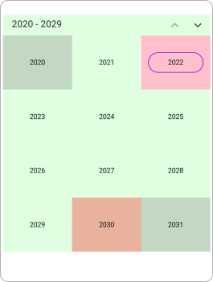

>**NOTE**
* The Background color and text style will be applied based on the following order: selectableDayPredicate dates, disable dates, today date and leading Dates.

## Year view text format
You can customize the month format of the `Calendar` by using the [MonthFormat](https://help.syncfusion.com/cr/maui/Syncfusion.Maui.Calendar.CalendarYearView.html#Syncfusion_Maui_Calendar_CalendarYearView_MonthFormat) property in [YearView](https://help.syncfusion.com/cr/maui/Syncfusion.Maui.Calendar.CalendarYearView.html).




<calendar:SfCalendar  x:Name="calendar" 
                      View="Year">
            <Calendar:SfCalendar.YearView>
                <Calendar:CalendarYearView MonthFormat="MMMM" />
            </Calendar:SfCalendar.YearView>
</calendar:SfCalendar>




this.calendar.YearView = new CalendarYearView()
{
    MonthFormat = "MMMM",
};




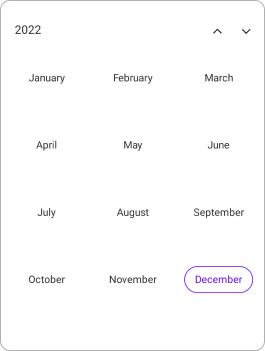

## Selection cell customization

You can customize the selection cell background and text style in Month, Year, Decade, and Century view by using the `SfCalendar`.

*    **Selection Background** - The Selected date background can be customized by using the [SelectionBackground](https://help.syncfusion.com/cr/maui/Syncfusion.Maui.Calendar.SfCalendar.html#Syncfusion_Maui_Calendar_SfCalendar_SelectionBackground) property in `SfCalendar`. This property is used in `Single`, `Multiple` and in between selected date of `Range` selection.

*    **Selection TextStyle** - The Selected date text style can be customized by using the [SelectionTextStyle](https://help.syncfusion.com/cr/maui/Syncfusion.Maui.Calendar.CalendarYearView.html#Syncfusion_Maui_Calendar_CalendarMonthView_SelectionTextStyle) property in `MonthView`. This property is used in `Single`, `Multiple` and start and end date of the selected date range of `Range` selection.

*    **Start Range Selection Background** - The Start range date background can be customized by using the [StartRangeSelectionBackground](https://help.syncfusion.com/cr/maui/Syncfusion.Maui.Calendar.SfCalendar.html#Syncfusion_Maui_Calendar_SfCalendar_StartRangeSelectionBackground) property in `SfCalendar`. This property is used in Start range selected date of `Range` selection.

*    **End Range Selection Background** -  The End range date background can be customized by using the [EndRangeSelectionBackground](https://help.syncfusion.com/cr/maui/Syncfusion.Maui.Calendar.SfCalendar.html#Syncfusion_Maui_Calendar_SfCalendar_EndRangeSelectionBackground) property in `SfCalendar`. This property is used in End range selected date of `Range` selection.

*    **Range TextStyle** – The in between selected date range text style can be customized by using the [RangeTextStyle](https://help.syncfusion.com/cr/maui/Syncfusion.Maui.Calendar.CalendarYearView.html#Syncfusion_Maui_Calendar_CalendarMonthView_RangeTextStyle) property in `MonthView`. This property is used in between selected date range of `Range` selection.




<calendar:SfCalendar  x:Name="calendar" 
                      View="Month"
                      Background="PaleGreen"
                      StartRangeSelectionBackground="Purple" EndRangeSelectionBackground="Purple" SelectionBackground="Pink">
</calendar:SfCalendar>




        CalendarTextStyle textStyle = new CalendarTextStyle()
        {
            TextColor = Colors.Black,
            FontSize = 12,
        };

        this.calendar.SelectedDateRange = new CalendarDateRange(DateTime.Now.AddDays(6).Date, DateTime.Now.AddDays(17).Date);
        this.calendar.View = CalendarView.Month;
        this.calendar.SelectionMode = CalendarSelectionMode.Range;
        this.calendar.StartRangeSelectionBackground = Colors.Purple;
        this.calendar.EndRangeSelectionBackground = Colors.Purple;
        this.calendar.SelectionBackground = Colors.Pink;
        this.calendar.MonthView.SelectionTextStyle = textStyle;
        this.calendar.MonthView.RangeTextStyle = textStyle;




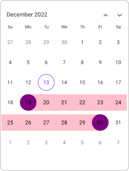

## Month cell appearance using DataTemplate

The month cell appearance can be customized using the [CellTemplate](https://help.syncfusion.com/cr/maui/Syncfusion.Maui.Calendar.CalendarMonthView.html#Syncfusion_Maui_Calendar_CalendarMonthView_CellTemplate) property of [MonthView](https://help.syncfusion.com/cr/maui/Syncfusion.Maui.Calendar.CalendarMonthView.html) in the `SfCalendar`.




<Grid>
    <Frame IsVisible="True" x:Name="frame" Background="White" HasShadow="False" CornerRadius="10"  HorizontalOptions="Center" VerticalOptions="Center" Margin="0" Padding="5">
        <calendar:SfCalendar x:Name="calendar"
                                ShowTrailingAndLeadingDates="False"
                                NavigationDirection="Horizontal"
                                TodayHighlightBrush="#0A3A74"
                                AllowViewNavigation="False">
            <calendar:SfCalendar.MonthView>
                <calendar:CalendarMonthView CellTemplate="{Binding Template}">
                    <calendar:CalendarMonthView.HeaderView>
                        <calendar:CalendarMonthHeaderView Background="#F1F7FF"/>
                    </calendar:CalendarMonthView.HeaderView>
                </calendar:CalendarMonthView>
            </calendar:SfCalendar.MonthView>
            <calendar:SfCalendar.BindingContext>
                <local:MonthTemplate/>
            </calendar:SfCalendar.BindingContext>
        </calendar:SfCalendar>
    </Frame>
</Grid>




public class MonthTemplate
{
    private DataTemplate circleTemplate;

    private DataTemplate template;

    public DataTemplate Template
    {
        get
        {
            return this.template;
        }
        set
        {
            this.template = value;
        }
    }

    public MonthTemplate()
    {
        this.circleTemplate = new DataTemplate(() =>
        {
            Grid grid = new Grid();

            Border border = new Border();
            border.BackgroundColor = Color.FromRgba("#F5F5F5");
            border.StrokeShape = new RoundRectangle()
            {
                CornerRadius = new CornerRadius(25)
            };

            border.SetBinding(Border.StrokeThicknessProperty, "Date", converter: new DateToStrokeConverter());
            border.Stroke = Color.FromArgb("#0A3A74");

            Label label = new Label();
            label.SetBinding(Label.TextProperty, "Date.Day");
            label.HorizontalOptions = LayoutOptions.Center;
            label.VerticalOptions = LayoutOptions.Center;
            label.Padding = new Thickness(2);
            border.Content = label;

            grid.Add(border);
            grid.Padding = new Thickness(1);

            return grid;
        });

        this.template = this.circleTemplate;
    }
}




internal class DateToStrokeConverter : IValueConverter
{
    public object Convert(object value, Type targetType, object parameter, CultureInfo culture)
    {
        var date = value as DateTime?;
        if (date.HasValue && date.Value.Date == DateTime.Now.Date)
        {
            return 2;
        }

        return 0;
    }

    public object? ConvertBack(object value, Type targetType, object parameter, CultureInfo culture)
    {
        return null;
    }
}




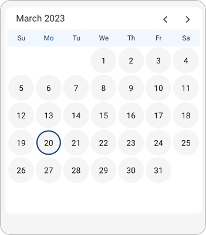

## Month cell appearance using DataTemplateSelector

You can customize the month cell appearance using the [CellTemplate](https://help.syncfusion.com/cr/maui/Syncfusion.Maui.Calendar.CalendarMonthView.html#Syncfusion_Maui_Calendar_CalendarMonthView_CellTemplate) property of [MonthView](https://help.syncfusion.com/cr/maui/Syncfusion.Maui.Calendar.CalendarMonthView.html) in the `SfCalendar`. The `DataTemplateSelector` for a calendar can be used to choose a different data template for each cell in the calendar based on the cell's data. It allows customizing the appearance of a particular cell based on certain conditions.




<Grid>
    <Grid.Resources>
        <DataTemplate x:Key="normalDateTemplate">
            <Grid Background = "Pink" >
                <Label HorizontalTextAlignment="Center" VerticalTextAlignment="Center" TextColor="Black" Text="{Binding Date.Day}"/>
            </Grid>
        </DataTemplate>
        <DataTemplate x:Key="todayDateTemplate">
            <Grid Background = "PaleGreen">
                <Label HorizontalTextAlignment="Center" VerticalTextAlignment="Center" TextColor="Black" Text="{Binding Date.Day}"/>
            </Grid>
        </DataTemplate>
        <DataTemplate x:Key="leadingTraililngDateTemplate">
            <Grid Background = "Purple">
                <Label HorizontalTextAlignment="Center" VerticalTextAlignment="Center" TextColor="Black" Text="{Binding Date.Day}"/>
            </Grid>
        </DataTemplate>
        <local:MonthCellTemplateSelector x:Key="monthCellTemplateSelector" 
                                         TodayDateTemplate="{StaticResource todayDateTemplate}" 
                                         NormalDateTemplate="{StaticResource normalDateTemplate}" 
                                         LeadingTrailingDateTemplate="{StaticResource leadingTraililngDateTemplate}"/>
    </Grid.Resources>
    <calendar:SfCalendar x:Name="calendar" 
                        View="Month" >
        <calendar:SfCalendar.MonthView>
            <calendar:CalendarMonthView CellTemplate="{StaticResource monthCellTemplateSelector}" />
        </calendar:SfCalendar.MonthView>
    </calendar:SfCalendar>
    </Grid>




public class MonthCellTemplateSelector : DataTemplateSelector
{
    public MonthCellTemplateSelector()
    {
    }
    public DataTemplate NormalDateTemplate { get; set; }
    public DataTemplate TodayDateTemplate { get; set; }
    public DataTemplate LeadingTrailingDateTemplate { get; set; }

    protected override DataTemplate OnSelectTemplate(object item, BindableObject container)
    {
        var monthCellDetails = item as CalendarCellDetails;
        if (monthCellDetails.Date == DateTime.Today.Date)
            return TodayDateTemplate;
        else if (monthCellDetails.IsTrailingOrLeadingDate)
            return LeadingTrailingDateTemplate;
        else
            return NormalDateTemplate;
    }
}




this.calendar.View = CalendarView.Month;




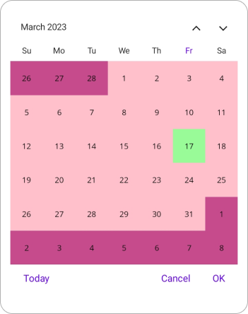

## Year cell appearance using DataTemplate

The year cell appearance can be customized using the [CellTemplate](https://help.syncfusion.com/cr/maui/Syncfusion.Maui.Calendar.CalendarYearView.html#Syncfusion_Maui_Calendar_CalendarYearView_CellTemplate) property of [YearView](https://help.syncfusion.com/cr/maui/Syncfusion.Maui.Calendar.CalendarYearView.html) in the `SfCalendar`.




<Grid>
    <Frame IsVisible="True" x:Name="frame" Background="White" HasShadow="False" CornerRadius="10"  HorizontalOptions="Center" VerticalOptions="Center" Margin="0" Padding="5">
        <calendar:SfCalendar x:Name="calendar"
                                View="Decade"
                                ShowTrailingAndLeadingDates="False"
                                NavigationDirection="Horizontal"
                                TodayHighlightBrush="#0A3A74"
                                AllowViewNavigation="False">
            <calendar:SfCalendar.YearView>
                <calendar:CalendarYearView CellTemplate="{Binding Template}">
                </calendar:CalendarYearView>
            </calendar:SfCalendar.YearView>
            <calendar:SfCalendar.BindingContext>
                <local:DecadeTemplate/>
            </calendar:SfCalendar.BindingContext>
        </calendar:SfCalendar>
    </Frame>
</Grid>




public class DecadeTemplate
{
    private DataTemplate circleTemplate;

    private DataTemplate template;

    public DataTemplate Template
    {
        get
        {
            return this.template;
        }
        set
        {
            this.template = value;
        }
    }

    public DecadeTemplate()
    {
        this.circleTemplate = new DataTemplate(() =>
        {
            Grid grid = new Grid();

            Border border = new Border();
            border.BackgroundColor = Color.FromRgba("#F5F5F5");
            border.StrokeShape = new RoundRectangle()
            {
                CornerRadius = new CornerRadius(25)
            };

            border.SetBinding(Border.StrokeThicknessProperty, "Date", converter: new DateToStrokeConverter());
            border.Stroke = Color.FromArgb("#0A3A74");

            Label label = new Label();
            label.SetBinding(Label.TextProperty, "Date.Year");
            label.HorizontalOptions = LayoutOptions.Center;
            label.VerticalOptions = LayoutOptions.Center;
            label.Padding = new Thickness(2);
            border.Content = label;

            grid.Add(border);
            grid.Padding = new Thickness(1);

            return grid;
        });

        this.template = this.circleTemplate;
    }
}




internal class DateToStrokeConverter : IValueConverter
{
    public object Convert(object value, Type targetType, object parameter, CultureInfo culture)
    {
        var date = value as DateTime?;
        if (date.HasValue && date.Value.Year == DateTime.Now.Year)
        {
            return 2;
        }

        return 0;
    }

    public object? ConvertBack(object value, Type targetType, object parameter, CultureInfo culture)
    {
        return null;
    }
}




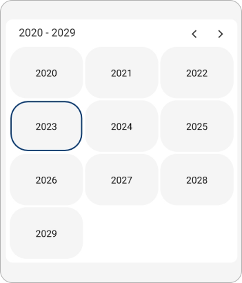

## Year cell appearance using DataTemplateSelector

You can customize the year cell appearance by using the [CellTemplate](https://help.syncfusion.com/cr/maui/Syncfusion.Maui.Calendar.CalendarYearView.html#Syncfusion_Maui_Calendar_CalendarYearView_CellTemplate) property of [YearView](https://help.syncfusion.com/cr/maui/Syncfusion.Maui.Calendar.CalendarYearView.html) in the `SfCalendar`. The `DataTemplateSelector` for a calendar can be used to choose a different data template for each cell in the calendar based on the cell's data. It allows customizing the appearance of a particular cell based on certain conditions.




<Grid>
    <Grid.Resources>
        <DataTemplate x:Key="normalDateTemplate">
            <Grid Background = "Pink" >
                <Label HorizontalTextAlignment="Center" VerticalTextAlignment="Center" TextColor="Black" Text="{Binding Date.Year}"/>
            </Grid>
        </DataTemplate>
        <DataTemplate x:Key="todayDateTemplate">
            <Grid Background = "PaleGreen">
                <Label HorizontalTextAlignment="Center" VerticalTextAlignment="Center" TextColor="Black" Text="{Binding Date.Year}"/>
            </Grid>
        </DataTemplate>
        <DataTemplate x:Key="leadingDateTemplate">
            <Grid Background = "Purple">
                <Label HorizontalTextAlignment="Center" VerticalTextAlignment="Center" TextColor="Black" Text="{Binding Date.Year}"/>
            </Grid>
        </DataTemplate>
        <local:MonthCellTemplateSelector x:Key="monthCellTemplateSelector" 
                                         TodayDateTemplate="{StaticResource todayDateTemplate}" 
                                         NormalDateTemplate="{StaticResource normalDateTemplate}" 
                                         LeadingDateTemplate="{StaticResource leadingDateTemplate}"/>
    </Grid.Resources>
    <calendar:SfCalendar x:Name="calendar" 
                        View="Decade">
        <calendar:SfCalendar.YearView>
            <calendar:CalendarYearView CellTemplate="{StaticResource yearCellTemplateSelector}" />
        </calendar:SfCalendar.YearView>
    </calendar:SfCalendar>
    </Grid>




public class YearCellTemplateSelector : DataTemplateSelector
{
    public YearCellTemplateSelector()
    {
    }
    public DataTemplate NormalDateTemplate { get; set; }
    public DataTemplate TodayDateTemplate { get; set; }
    public DataTemplate LeadingDateTemplate { get; set; }

    protected override DataTemplate OnSelectTemplate(object item, BindableObject container)
    {
        var yearCellDetails = item as CalendarCellDetails;
        if (yearCellDetails.Year == DateTime.Today.Year)
            return TodayDateTemplate;
        else if (yearCellDetails.IsTrailingOrLeadingDate)
            return LeadingDateTemplate;
        else
            return NormalDateTemplate;
    }
}




this.calendar.View = CalendarView.Decade;




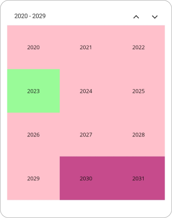

## Selection cell appearance on month view using DataTemplate

The `SfCalendar` provides the [SelectionCellTemplate](https://help.syncfusion.com/cr/maui/Syncfusion.Maui.Calendar.SfCalendar.html#Syncfusion_Maui_Calendar_SfCalendar_SelectionCellTemplate) property to customize the appearance of selected date cells in the MonthView. This property is of type DataTemplate and allows you to define a custom layout specifically for the selected cell.




<calendar:SfCalendar View="Month" WidthRequest="350" HeightRequest="400" 
                        SelectionCellTemplate="{Binding Template}">
    <calendar:SfCalendar.BindingContext>
        <local:SelectionCellTemplateView/>
    </calendar:SfCalendar.BindingContext>
</calendar:SfCalendar>




internal class SelectionCellTemplateView
{
    private DataTemplate template;

    public DataTemplate Template
    {
        get
        {
            return template;
        }
        set
        {
            template = value;
        }
    }

    public SelectionCellTemplateView()
    {
        this.template = new DataTemplate(() =>
        {
            // Create a Grid with two columns
            Grid grid = new Grid
            {
                RowDefinitions =
            {
                new RowDefinition { Height = GridLength.Star },
                new RowDefinition { Height = GridLength.Star }
            },
                Padding = new Thickness(1),
                VerticalOptions = LayoutOptions.Center,
                HeightRequest = 40
            };

            // Create a Border with rounded corners
            Border border = new Border
            {
                BackgroundColor = Color.FromArgb("#4285F4"),
                Stroke = Colors.Transparent,
                StrokeShape = new RoundRectangle
                {
                    CornerRadius = new CornerRadius(10)
                }
            };

            // Create Label and bind to Date.Year
            Label label = new Label
            {
                TextColor = Colors.White,
                HorizontalTextAlignment = TextAlignment.Center,
                VerticalTextAlignment = TextAlignment.Center,
                HorizontalOptions = LayoutOptions.Center,
                VerticalOptions = LayoutOptions.Center
            };
            label.SetBinding(Label.TextProperty, "Date.Day");

            // Create Image
            Image image = new Image
            {
                Source = "tick_image2.png",
                HeightRequest = 17,
                WidthRequest = 17,
                HorizontalOptions = LayoutOptions.Center,
                VerticalOptions = LayoutOptions.Center
            };

            // Add label and image to inner grid
            grid.Add(label, 0, 0);
            grid.Add(image, 0, 1);

            // Set content of border
            border.Content = grid;

            // Add border to outer grid
            //grid.Add(border);

            return border;
        });
    }
}




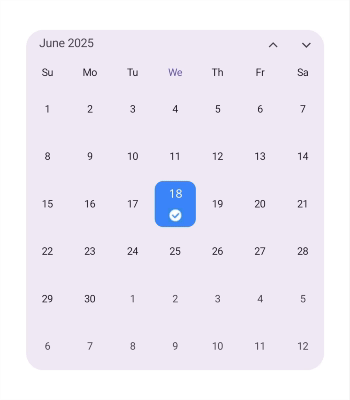

N>
The `SelectionCellTemplate` is applicable only when the [SelectionMode](https://help.syncfusion.com/cr/maui/Syncfusion.Maui.Calendar.SfCalendar.html#Syncfusion_Maui_Calendar_SfCalendar_SelectionMode) is set to Single. It is not applied in Multiple or Range selection modes. You can customize the selection cell appearance using `DataTemplateSelector`.

## Selection cell appearance on year view using DataTemplate

The `SfCalendar` provides the [SelectionCellTemplate](https://help.syncfusion.com/cr/maui/Syncfusion.Maui.Calendar.SfCalendar.html#Syncfusion_Maui_Calendar_SfCalendar_SelectionCellTemplate) property to customize the appearance of selected date cells in the YearView. This property is of type DataTemplate and allows you to define a custom layout for the selected cells in the YearView.




<calendar:SfCalendar View="Decade" AllowViewNavigation="False" 
                        WidthRequest="350" HeightRequest="400" 
                        SelectionCellTemplate="{Binding Template}">
    <calendar:SfCalendar.BindingContext>
        <local:SelectionCellTemplateView/>
    </calendar:SfCalendar.BindingContext>
</calendar:SfCalendar>




internal class SelectionCellTemplateView
{
    private DataTemplate template;

    public DataTemplate Template
    {
        get
        {
            return template;
        }
        set
        {
            template = value;
        }
    }

    public SelectionCellTemplateView()
    {
        this.template = new DataTemplate(() =>
        {
            // Create a Grid with two columns
            Grid grid = new Grid
            {
                ColumnDefinitions =
            {
                new ColumnDefinition { Width = GridLength.Star },
                new ColumnDefinition { Width = GridLength.Star }
            },
                Padding = new Thickness(1),
                VerticalOptions = LayoutOptions.Center,
                HeightRequest = 40
            };

            // Create a Border with rounded corners
            Border border = new Border
            {
                BackgroundColor = Color.FromArgb("#4285F4"),
                Stroke = Colors.Transparent,
                StrokeShape = new RoundRectangle
                {
                    CornerRadius = new CornerRadius(10)
                }
            };

            // Create Label and bind to Date.Year
            Label label = new Label
            {
                TextColor = Colors.White,
                HorizontalTextAlignment = TextAlignment.Center,
                VerticalTextAlignment = TextAlignment.Center,
                HorizontalOptions = LayoutOptions.Center,
                VerticalOptions = LayoutOptions.Center
            };
            label.SetBinding(Label.TextProperty, "Date.Year");

            // Create Image
            Image image = new Image
            {
                Source = "tick_image2.png",
                HeightRequest = 17,
                WidthRequest = 17,
                HorizontalOptions = LayoutOptions.Center,
                VerticalOptions = LayoutOptions.Center
            };

            // Add label and image to inner grid
            grid.Add(label, 0, 0);
            grid.Add(image, 1, 0);

            // Set content of border
            border.Content = grid;

            // Add border to outer grid
            //grid.Add(border);

            return border;
        });
    }
}




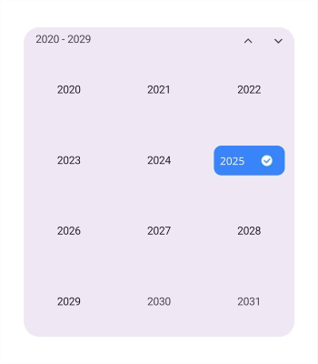

N>
The `SelectionCellTemplate` is applicable only when the [SelectionMode](https://help.syncfusion.com/cr/maui/Syncfusion.Maui.Calendar.SfCalendar.html#Syncfusion_Maui_Calendar_SfCalendar_SelectionMode) is set to Single and [AllowViewNavigation](https://help.syncfusion.com/cr/maui/Syncfusion.Maui.Calendar.SfCalendar.html#Syncfusion_Maui_Calendar_SfCalendar_AllowViewNavigation) is false. It is not applied in Multiple or Range selection modes. You can customize the selection cell appearance using `DataTemplateSelector`.
