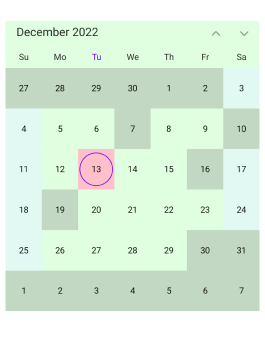
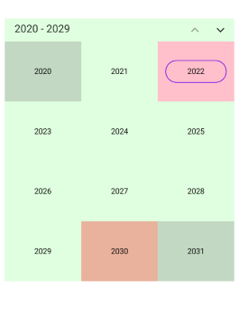
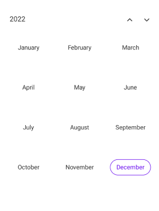
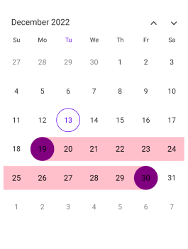

# Customizations in .NET MAUI Calendar (SfCalendar)
Each cell of the Month, Year, Decade and Century views can be customized in [.NET MAUI Calendar](https://www.syncfusion.com/maui-controls/maui-calendar) (SfCalendar).
    
## Month cell customization
You can customize the calendar month view cell by using the `MonthView` property of `SfCalendar`.

*    **Month dates** – You can customize the month dates text style and background of the `Calendar` by using the [TextStyle](https://help.syncfusion.com/cr/maui/Syncfusion.Maui.Calendar.CalendarMonthView.html#Syncfusion_Maui_Calendar_CalendarMonthView_TextStyle) and [Background](https://help.syncfusion.com/cr/maui/Syncfusion.Maui.Calendar.CalendarMonthView.html#Syncfusion_Maui_Calendar_CalendarMonthView_Background) properties of [MonthView](https://help.syncfusion.com/cr/maui/Syncfusion.Maui.Calendar.CalendarMonthView.html).

*    **Today date** – You can customize the today date text style and background of the `Calendar` by using the [TodayTextStyle](https://help.syncfusion.com/cr/maui/Syncfusion.Maui.Calendar.CalendarMonthView.html#Syncfusion_Maui_Calendar_CalendarMonthView_TodayTextStyle) and [TodayBackground](https://help.syncfusion.com/cr/maui/Syncfusion.Maui.Calendar.CalendarMonthView.html#Syncfusion_Maui_Calendar_CalendarMonthView_TodayBackground) properties of [MonthView](https://help.syncfusion.com/cr/maui/Syncfusion.Maui.Calendar.CalendarMonthView.html).

*    **Trailing and Leading dates** – You can hide the trailing and leading dates by using the [ShowTrailingAndLeadingDates](https://help.syncfusion.com/cr/maui/Syncfusion.Maui.Calendar.SfCalendar.html#Syncfusion_Maui_Calendar_SfCalendar_ShowTrailingAndLeadingDates) property in the [CalendarMonthView](https://help.syncfusion.com/cr/maui/Syncfusion.Maui.Calendar.CalendarMonthView.html) class. You can also customize the trailing and leading dates text style and background of the `Calendar` by using the [TrailingLeadingDatesTextStyle](https://help.syncfusion.com/cr/maui/Syncfusion.Maui.Calendar.CalendarMonthView.html#Syncfusion_Maui_Calendar_CalendarMonthView_TrailingLeadingDatesTextStyle) and [TrailingLeadingDatesBackground](https://help.syncfusion.com/cr/maui/Syncfusion.Maui.Calendar.CalendarMonthView.html#Syncfusion_Maui_Calendar_CalendarMonthView_TrailingLeadingDatesBackground) properties of [MonthView](https://help.syncfusion.com/cr/maui/Syncfusion.Maui.Calendar.CalendarMonthView.html).

*    **Disabled dates** – You can disable the date by using the MinimumDate, MaximumDate, EnablePastDates and SelectableDayPredicate. The date before [MinimumDate](https://help.syncfusion.com/cr/maui/Syncfusion.Maui.Calendar.SfCalendar.html#Syncfusion_Maui_Calendar_SfCalendar_MinimumDate) is said to disabled date, the date after the [MaximumDate](https://help.syncfusion.com/cr/maui/Syncfusion.Maui.Calendar.SfCalendar.html#Syncfusion_Maui_Calendar_SfCalendar_MaximumDate) is said to disabled date, if you want to disable the date before today date by using the [EnablePastDates](https://help.syncfusion.com/cr/maui/Syncfusion.Maui.Calendar.SfCalendar.html#Syncfusion_Maui_Calendar_SfCalendar_EnablePastDates) and if you want to disable any particular date by using [SelectableDayPredicate](https://help.syncfusion.com/cr/maui/Syncfusion.Maui.Calendar.SfCalendar.html#Syncfusion_Maui_Calendar_SfCalendar_SelectableDayPredicate) property. You can also customize the disabled dates text style and background of the `Calendar` by using the [DisabledDatesTextStyle](https://help.syncfusion.com/cr/maui/Syncfusion.Maui.Calendar.CalendarMonthView.html#Syncfusion_Maui_Calendar_CalendarMonthView_DisabledDatesTextStyle) and [DisabledDatesBackground](https://help.syncfusion.com/cr/maui/Syncfusion.Maui.Calendar.CalendarMonthView.html#Syncfusion_Maui_Calendar_CalendarMonthView_DisabledDatesBackground) properties of [MonthView](https://help.syncfusion.com/cr/maui/Syncfusion.Maui.Calendar.CalendarMonthView.html).

*    **Special Dates** – You can add special dates to the `Calendar` by using the [SpecialDates](https://help.syncfusion.com/cr/maui/Syncfusion.Maui.Calendar.CalendarMonthView.html#Syncfusion_Maui_Calendar_CalendarMonthView_SpecialDates) property and you can also customize the special dates text style and background of the `Calendar` by using the [SpecialDatesTextStyle](https://help.syncfusion.com/cr/maui/Syncfusion.Maui.Calendar.CalendarMonthView.html#Syncfusion_Maui_Calendar_CalendarMonthView_SpecialDatesTextStyle) and [SpecialDatesBackground](https://help.syncfusion.com/cr/maui/Syncfusion.Maui.Calendar.CalendarMonthView.html#Syncfusion_Maui_Calendar_CalendarMonthView_SpecialDatesBackground) properties of [MonthView](https://help.syncfusion.com/cr/maui/Syncfusion.Maui.Calendar.CalendarMonthView.html).

*    **Weekend Dates** – You can customize the weekend dates text style and background of the `Calendar` by using the [WeekendDatesTextStyle](https://help.syncfusion.com/cr/maui/Syncfusion.Maui.Calendar.CalendarMonthView.html#Syncfusion_Maui_Calendar_CalendarMonthView_WeekendDatesTextStyle) and [WeekendDatesBackground](https://help.syncfusion.com/cr/maui/Syncfusion.Maui.Calendar.CalendarMonthView.html#Syncfusion_Maui_Calendar_CalendarMonthView_WeekendDatesBackground) properties of [MonthView](https://help.syncfusion.com/cr/maui/Syncfusion.Maui.Calendar.CalendarMonthView.html).




<calendar:SfCalendar  x:Name="Calendar" 
                        View="Month"
                        Background="PaleGreen">
            <Calendar:SfCalendar.MonthView>
                <Calendar:CalendarMonthView
                TodayBackground="Pink" DisabledDatesBackground="Grey" SpecialDatesBackground="#FFEFD2" WeekendDatesBackground="#E2F9F3"/>
            </Calendar:SfCalendar.MonthView>
</calendar:SfCalendar>




        CalendarTextStyle textStyle = new CalendarTextStyle()
        {
            TextColor = Colors.Black,
            FontSize = 12,
        };

        this.Calendar.MinimumDate = DateTime.Now.AddDays(-15);
        this.Calendar.MaximumDate = DateTime.Now.AddDays(20);
        this.Calendar.EnablePastDates = true;
        this.Calendar.SelectableDayPredicate = (date) =>
        {
            if (date.Date == DateTime.Now.AddDays(3).Date || date.Date == DateTime.Now.AddDays(6).Date || date.Date == DateTime.Now.AddDays(-3).Date || date.Date == DateTime.Now.AddDays(-6).Date)
            {
                return false;
            }

            return true;
        };

        this.Calendar.MonthView.SpecialDates = new List<DateTime>
        {
            DateTime.Now.AddDays(2),
            DateTime.Now.AddDays(-2),
        };

        this.Calendar.MonthView.WeekendDays = new List<DayOfWeek>
        {
            DayOfWeek.Sunday,
            DayOfWeek.Saturday,
        };

        this.calendar.Background = Colors.PaleGreen.WithAlpha(0.3f);
        this.Calendar.ShowTrailingAndLeadingDates = true;
        this.calendar.MonthView = new CalendarMonthView()
        {
            TextStyle = textStyle,
            TodayBackground = Colors.Pink,
            TodayTextStyle = textStyle,
            DisabledDatesBackground = Colors.Grey.WithAlpha(0.3f),
            DisabledDatesTextStyle = textStyle,
            TrailingLeadingDatesBackground = Colors.Red.WithAlpha(0.3f),
            TrailingLeadingDatesTextStyle = textStyle,
            SpecialDatesBackground = Color.FromArgb("#FFEFD2"),
            SpecialDatesTextStyle = textStyle,
            WeekendDatesBackground = Color.FromArgb("#E2F9F3"),
            WeekendDatesTextStyle = textStyle,
        };




>**NOTE**
* The Background color and text style will be applied based on the following order: selectableDayPredicate dates, special dates, disable dates, today date, weekend dates, trailingLeading dates, and normal dates.

### Month cell appearance using DataTemplate

The month cell appearance can be customized by using the `CellTemplate` property of `MonthView` in the `SfCalendar`.




<calendar:SfCalendar x:Name="Calendar" View="Month">
    <calendar:SfCalendar.MonthView>
        <calendar:CalendarMonthView>
            <calendar:CalendarMonthView.CellTemplate>
                <DataTemplate>
                    <Grid Background="Pink">
                        <Label
                        HorizontalTextAlignment="Center" 
                        VerticalTextAlignment="Center" 
                        TextColor="Purple" 
                        Text="{Binding Date.Day}"/>
                    </Grid>
                </DataTemplate>
            </calendar:CalendarMonthView.CellTemplate>
        </calendar:CalendarMonthView>
    </calendar:SfCalendar.MonthView>
</calendar:SfCalendar>




this.Calendar.MonthView = new CalendarMonthView()
{
    CellTemplate = dataTemplate,
};

DataTemplate dataTemplate = new DataTemplate(() =>
{
    Grid grid = new Grid
    {
        Background = Colors.Pink
    };

    Label label = new Label
    {
        HorizontalTextAlignment = TextAlignment.Center,
        VerticalTextAlignment = TextAlignment.Center,
        TextColor = Colors.Purple
    };

    label.SetBinding(Label.TextProperty, new Binding("Date.Day"));
    grid.Children.Add(label);
    return grid;
});




### Month cell appearance using DataTemplateSelector

You can customize the month cell appearance by using the `CellTemplate` property of `MonthView` in the `SfCalendar`. The `DataTemplateSelector` for a calendar can be used to choose a different data template for each cell in the calendar based on the cell's data. It allows to customize the appearance of a particular cell based on certain conditions.




<Grid>
    <Grid.Resources>
        <DataTemplate x:Key="normalDateTemplate">
            <Grid Background = "Pink" >
                <Label HorizontalTextAlignment="Center" VerticalTextAlignment="Center" TextColor="Black" Text="{Binding Date.Day}"/>
            </Grid>
        </DataTemplate>
        <DataTemplate x:Key="todayDateTemplate">
            <Grid Background = "PaleGreen">
                <Label HorizontalTextAlignment="Center" VerticalTextAlignment="Center" TextColor="Black" Text="{Binding Date.Day}"/>
            </Grid>
        </DataTemplate>
        <DataTemplate x:Key="leadingTraililngDateTemplate">
            <Grid Background = "Purple">
                <Label HorizontalTextAlignment="Center" VerticalTextAlignment="Center" TextColor="Black" Text="{Binding Date.Day}"/>
            </Grid>
        </DataTemplate>
        <local:MonthCellTemplateSelector x:Key="monthCellTemplateSelector" 
                                         TodayDateTemplate="{StaticResource todayDateTemplate}" 
                                         NormalDateTemplate="{StaticResource normalDateTemplate}" 
                                         LeadingTrailingDateTemplate="{StaticResource leadingTraililngDateTemplate}"/>
    </Grid.Resources>
    <calendar:SfCalendar x:Name="Calendar" 
                        View="Month" >
        <calendar:SfCalendar.MonthView>
            <calendar:CalendarMonthView CellTemplate="{StaticResource monthCellTemplateSelector}" />
        </calendar:SfCalendar.MonthView>
    </calendar:SfCalendar>
    </Grid>




public class MonthCellTemplateSelector : DataTemplateSelector
{
    public MonthCellTemplateSelector()
    {
    }
    public DataTemplate NormalDateTemplate { get; set; }
    public DataTemplate TodayDateTemplate { get; set; }
    public DataTemplate LeadingTrailingDateTemplate { get; set; }

    protected override DataTemplate OnSelectTemplate(object item, BindableObject container)
    {
        var monthCellDetails = item as CalendarCellDetails;
        if (monthCellDetails.Date == DateTime.Today.Date)
            return TodayDateTemplate;
        else if (monthCellDetails.IsTrailingOrLeadingDate)
            return LeadingTrailingDateTemplate;
        else
            return NormalDateTemplate;
    }
}



this.Calendar.View = CalendarView.Month;




## Year cell customization
You can customize the calendar `year`, `decade`, and `century` views by using the `YearView` property of `SfCalendar`.

*   **Year cell dates** – You can customize the year view date's text style and background of the `Calendar` by using the [TextStyle](https://help.syncfusion.com/cr/maui/Syncfusion.Maui.Calendar.CalendarYearView.html#Syncfusion_Maui_Calendar_CalendarYearView_TextStyle) and [Background](https://help.syncfusion.com/cr/maui/Syncfusion.Maui.Calendar.CalendarYearView.html#Syncfusion_Maui_Calendar_CalendarYearView_Background) properties of [YearView](https://help.syncfusion.com/cr/maui/Syncfusion.Maui.Calendar.CalendarYearView.html).

*    **Disabled dates** – You can disable the date by using the MinimumDate, MaximumDate, EnablePastDates and SelectableDayPredicate. The date before [MinimumDate](https://help.syncfusion.com/cr/maui/Syncfusion.Maui.Calendar.SfCalendar.html#Syncfusion_Maui_Calendar_SfCalendar_MinimumDate) is said to disabled date, the date after the [MaximumDate](https://help.syncfusion.com/cr/maui/Syncfusion.Maui.Calendar.SfCalendar.html#Syncfusion_Maui_Calendar_SfCalendar_MaximumDate) is said to disabled date, if you want disable the date before today date by using the [EnablePastDates](https://help.syncfusion.com/cr/maui/Syncfusion.Maui.Calendar.SfCalendar.html#Syncfusion_Maui_Calendar_SfCalendar_EnablePastDates) and if you want to disable any particular date by using [SelectableDayPredicate](https://help.syncfusion.com/cr/maui/Syncfusion.Maui.Calendar.SfCalendar.html#Syncfusion_Maui_Calendar_SfCalendar_SelectableDayPredicate) property. You can also customize the disabled dates text style and background of the `Calendar` by using the [DisabledDatesTextStyle](https://help.syncfusion.com/cr/maui/Syncfusion.Maui.Calendar.CalendarYearView.html#Syncfusion_Maui_Calendar_CalendarYearView_DisabledDatesTextStyle) and [DisabledDatesBackground](https://help.syncfusion.com/cr/maui/Syncfusion.Maui.Calendar.CalendarYearView.html#Syncfusion_Maui_Calendar_CalendarYearView_DisabledDatesBackground) properties of [YearView](https://help.syncfusion.com/cr/maui/Syncfusion.Maui.Calendar.CalendarYearView.html).

*    **Leading dates** – You can hide the leading dates by using the [ShowTrailingAndLeadingDates](https://help.syncfusion.com/cr/maui/Syncfusion.Maui.Calendar.SfCalendar.html#Syncfusion_Maui_Calendar_SfCalendar_ShowTrailingAndLeadingDates) property in the `SfCalendar` class. You can also customize the leading dates text style and background of the `Calendar` by using the [LeadingDatesTextStyle](https://help.syncfusion.com/cr/maui/Syncfusion.Maui.Calendar.CalendarYearView.html#Syncfusion_Maui_Calendar_CalendarYearView_LeadingDatesTextStyle) and [LeadingDatesBackground](https://help.syncfusion.com/cr/maui/Syncfusion.Maui.Calendar.CalendarYearView.html#Syncfusion_Maui_Calendar_CalendarYearView_LeadingDatesBackground) properties of [YearView](https://help.syncfusion.com/cr/maui/Syncfusion.Maui.Calendar.CalendarYearView.html).

*    **Today date** – You can customize the today date text style and background of the `Calendar` by using the [TodayTextStyle](https://help.syncfusion.com/cr/maui/Syncfusion.Maui.Calendar.CalendarYearView.html#Syncfusion_Maui_Calendar_CalendarYearView_TodayTextStyle) and [TodayBackground](https://help.syncfusion.com/cr/maui/Syncfusion.Maui.Calendar.CalendarYearView.html#Syncfusion_Maui_Calendar_CalendarYearView_TodayBackground) properties of [YearView](https://help.syncfusion.com/cr/maui/Syncfusion.Maui.Calendar.CalendarYearView.html).




<calendar:SfCalendar  x:Name="Calendar" 
                        View="Decade"
                        Background="PaleGreen">
            <Calendar:SfCalendar.YearView>
                <Calendar:CalendarYearView TodayBackground="Pink" DisabledDatesBackground="Grey" LeadingDatesBackground="Red" />
            </Calendar:SfCalendar.YearView>
</calendar:SfCalendar>




        CalendarTextStyle textStyle = new CalendarTextStyle()
        {
            TextColor = Colors.Black,
            FontSize = 12,
        };

        this.Calendar.View = CalendarView.Decade;
        this.Calendar.MinimumDate = DateTime.Now.AddYears(-1);
        this.Calendar.MaximumDate = DateTime.Now.AddYears(8);
        this.Calendar.EnablePastDates = false;
        this.calendar.Background = Colors.PaleGreen.WithAlpha(0.3f);
        this.calendar.ShowTrailingAndLeadingDates = true;
        this.calendar.YearView = new CalendarYearView()
        {
            TextStyle = textStyle,
            TodayBackground = Colors.Pink,
            TodayTextStyle = textStyle,
            DisabledDatesBackground = Colors.Grey.WithAlpha(0.3f),
            DisabledDatesTextStyle = textStyle,
            LeadingDatesBackground = Colors.Red.WithAlpha(0.3f),
            LeadingDatesTextStyle = textStyle,
        };




>**NOTE**
* The Background color and text style will be applied based on the following order: selectableDayPredicate dates, disable dates, today date and leading Dates.

## Year view text format
You can customize the month format of the `Calendar` by using the [MonthFormat](https://help.syncfusion.com/cr/maui/Syncfusion.Maui.Calendar.CalendarYearView.html#Syncfusion_Maui_Calendar_CalendarYearView_MonthFormat) property in [YearView](https://help.syncfusion.com/cr/maui/Syncfusion.Maui.Calendar.CalendarYearView.html).




<calendar:SfCalendar  x:Name="Calendar" 
                      View="Year">
            <Calendar:SfCalendar.YearView>
                <Calendar:CalendarYearView MonthFormat="MMMM" />
            </Calendar:SfCalendar.YearView>
</calendar:SfCalendar>




this.Calendar.YearView = new CalendarYearView()
{
    MonthFormat = "MMMM",
};




## Selection cell customization

You can customize the selection cell background and text style in Month, Year, Decade, and Century view by using the `SfCalendar`.

*    **Selection Background** - The Selected date background can be customized by using the [SelectionBackground](https://help.syncfusion.com/cr/maui/Syncfusion.Maui.Calendar.SfCalendar.html#Syncfusion_Maui_Calendar_SfCalendar_SelectionBackground) property in `SfCalendar`. This property is used in `Single`, `Multiple` and in between selected date of `Range` selection.

*    **Selection TextStyle** - The Selected date text style can be customized by using the [SelectionTextStyle](https://help.syncfusion.com/cr/maui/Syncfusion.Maui.Calendar.CalendarYearView.html#Syncfusion_Maui_Calendar_CalendarMonthView_SelectionTextStyle) property in `MonthView`. This property is used in `Single`, `Multiple` and start and end date of the selected date range of `Range` selection.

*    **Start Range Selection Background** - The Start range date background can be customized by using the [StartRangeSelectionBackground](https://help.syncfusion.com/cr/maui/Syncfusion.Maui.Calendar.SfCalendar.html#Syncfusion_Maui_Calendar_SfCalendar_StartRangeSelectionBackground) property in `SfCalendar`. This property is used in Start range selected date of `Range` selection.

*    **End Range Selection Background** -  The End range date background can be customized by using the [EndRangeSelectionBackground](https://help.syncfusion.com/cr/maui/Syncfusion.Maui.Calendar.SfCalendar.html#Syncfusion_Maui_Calendar_SfCalendar_EndRangeSelectionBackground) property in `SfCalendar`. This property is used in End range selected date of `Range` selection.

*    **Range TextStyle** – The in between selected date range text style can be customized by using the [RangeTextStyle](https://help.syncfusion.com/cr/maui/Syncfusion.Maui.Calendar.CalendarYearView.html#Syncfusion_Maui_Calendar_CalendarMonthView_RangeTextStyle) property in `MonthView`. This property is used in between selected date range of `Range` selection.




<calendar:SfCalendar  x:Name="Calendar" 
                      View="Month"
                      Background="PaleGreen"
                      StartRangeSelectionBackground="Purple" EndRangeSelectionBackground="Purple" SelectionBackground="Pink">
</calendar:SfCalendar>




        CalendarTextStyle textStyle = new CalendarTextStyle()
        {
            TextColor = Colors.Black,
            FontSize = 12,
        };

        this.Calendar.SelectedDateRange = new CalendarDateRange(DateTime.Now.AddDays(6).Date, DateTime.Now.AddDays(17).Date);
        this.Calendar.View = CalendarView.Month;
        this.Calendar.SelectionMode = CalendarSelectionMode.Range;
        this.Calendar.StartRangeSelectionBackground = Colors.Purple;
        this.Calendar.EndRangeSelectionBackground = Colors.Purple;
        this.Calendar.SelectionBackground = Colors.Pink;
        this.Calendar.MonthView.SelectionTextStyle = textStyle;
        this.Calendar.MonthView.RangeTextStyle = textStyle;




### Year cell appearance using DataTemplate

The year cell appearance can be customized by using the `CellTemplate` property of `YearView` in the `SfCalendar`.




<calendar:SfCalendar x:Name="Calendar" View="Decade">
    <calendar:SfCalendar.YearView>
        <calendar:CalendarYearView>
            <calendar:CalendarYearView.CellTemplate>
                <DataTemplate>
                    <Grid Background="Pink">
                        <Label
                        HorizontalTextAlignment="Center" 
                        VerticalTextAlignment="Center" 
                        TextColor="Purple" 
                        Text="{Binding Date.Year}"/>
                    </Grid>
                </DataTemplate>
            </calendar:CalendarYearView.CellTemplate>
        </calendar:CalendarYearView>
    </calendar:SfCalendar.YearView>
</calendar:SfCalendar>




this.Calendar.YearView = new CalendarYearView()
{
    CellTemplate = dataTemplate,
};

DataTemplate dataTemplate = new DataTemplate(() =>
{
    Grid grid = new Grid
    {
        Background = Colors.Pink
    };

    Label label = new Label
    {
        HorizontalTextAlignment = TextAlignment.Center,
        VerticalTextAlignment = TextAlignment.Center,
        TextColor = Colors.Purple
    };

    label.SetBinding(Label.TextProperty, new Binding("Date.Year"));
    grid.Children.Add(label);
    return grid;
});




### Year cell appearance using DataTemplateSelector

You can customize the month cell appearance by using the `CellTemplate` property of `YearView` in the `SfCalendar`. The `DataTemplateSelector` for a calendar can be used to choose a different data template for each cell in the calendar based on the cell's data. It allows to customize the appearance of a particular cell based on certain conditions.




<Grid>
    <Grid.Resources>
        <DataTemplate x:Key="normalDateTemplate">
            <Grid Background = "Pink" >
                <Label HorizontalTextAlignment="Center" VerticalTextAlignment="Center" TextColor="Black" Text="{Binding Date.Year}"/>
            </Grid>
        </DataTemplate>
        <DataTemplate x:Key="todayDateTemplate">
            <Grid Background = "PaleGreen">
                <Label HorizontalTextAlignment="Center" VerticalTextAlignment="Center" TextColor="Black" Text="{Binding Date.Year}"/>
            </Grid>
        </DataTemplate>
        <DataTemplate x:Key="leadingDateTemplate">
            <Grid Background = "Purple">
                <Label HorizontalTextAlignment="Center" VerticalTextAlignment="Center" TextColor="Black" Text="{Binding Date.Year}"/>
            </Grid>
        </DataTemplate>
        <local:MonthCellTemplateSelector x:Key="monthCellTemplateSelector" 
                                         TodayDateTemplate="{StaticResource todayDateTemplate}" 
                                         NormalDateTemplate="{StaticResource normalDateTemplate}" 
                                         LeadingDateTemplate="{StaticResource leadingDateTemplate}"/>
    </Grid.Resources>
    <calendar:SfCalendar x:Name="Calendar" 
                        View="Decade" >
        <calendar:SfCalendar.YearView>
            <calendar:CalendarYearView CellTemplate="{StaticResource yearCellTemplateSelector}" />
        </calendar:SfCalendar.YearView>
    </calendar:SfCalendar>
    </Grid>




public class YearCellTemplateSelector : DataTemplateSelector
{
    public YearCellTemplateSelector()
    {
    }
    public DataTemplate NormalDateTemplate { get; set; }
    public DataTemplate TodayDateTemplate { get; set; }
    public DataTemplate LeadingDateTemplate { get; set; }

    protected override DataTemplate OnSelectTemplate(object item, BindableObject container)
    {
        var yearCellDetails = item as CalendarCellDetails;
        if (yearCellDetails.Year == DateTime.Today.Year)
            return TodayDateTemplate;
        else if (yearCellDetails.IsTrailingOrLeadingDate)
            return LeadingDateTemplate;
        else
            return NormalDateTemplate;
    }
}



this.Calendar.View = CalendarView.Decade;


