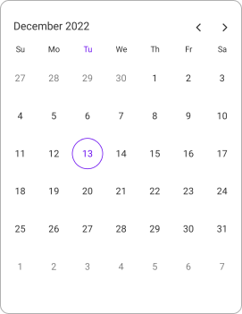

# Date Navigations in .NET MAUI Calendar (SfCalendar)

## Programmatic date navigation
It allows you to navigate using the Dates programmatically in the calendar control using the [DisplayDate](https://help.syncfusion.com/cr/maui/Syncfusion.Maui.Calendar.SfCalendar.html#Syncfusion_Maui_Calendar_SfCalendar_DisplayDate) property of [SfCalendar](https://help.syncfusion.com/cr/maui/Syncfusion.Maui.Calendar.SfCalendar.html).




<calendar:SfCalendar  x:Name="Calendar" 
                        View="Month">
</calendar:SfCalendar>




this.Calendar.DisplayDate = DateTime.Now.AddMonths(2).Date;




## Programmatic view navigation
It allows you to navigate using the views programmatically in the calendar control using the [View](https://help.syncfusion.com/cr/maui/Syncfusion.Maui.Calendar.SfCalendar.html#Syncfusion_Maui_Calendar_SfCalendar_View) property of [SfCalendar](https://help.syncfusion.com/cr/maui/Syncfusion.Maui.Calendar.SfCalendar.html).




<calendar:SfCalendar  x:Name="Calendar" 
                        View="Month">
</calendar:SfCalendar>




this.Calendar.View = CalendarView.Month;




## Allow view navigation
It allows you to navigate using the `AllowViewNavigation` property by tapping interaction on the cell or header. By using this property, you can restrict the view navigation and allow you to select the cells in the Year, Decade, and Century views.

The following code shows when the [AllowViewNavigation](https://help.syncfusion.com/cr/maui/Syncfusion.Maui.Calendar.SfCalendar.html#Syncfusion_Maui_Calendar_SfCalendar_AllowViewNavigation) property is `true`.




<calendar:SfCalendar  x:Name="Calendar" 
                        View="Month"
                        AllowViewNavigation="True">
</calendar:SfCalendar>




this.Calendar.AllowViewNavigation = true;




## Navigating Adjacent Months with Leading and Trailing Dates
You can navigate to the next or previous month in the Calendar control by tapping on the leading or trailing dates. Tapping on a leading date moves the calendar to the previous month, while tapping on a trailing date moves it to the next month. In `SfCalendar`, this functionality can be enabled or disabled using the [NavigateToAdjacentMonth]() property.

The following code shows the Navigation by using `NavigateToAdjacentMonth` property.




<calendar:SfCalendar  x:Name="Calendar" 
                        View="Month"
                        NavigateToAdjacentMonth="true">
</calendar:SfCalendar>




this.Calendar.NavigateToAdjacentMonth = true;




## Programmatically change to adjacent dates
The next and previous views can be navigated by swiping the Calendar control from right to left and left to right. In the `SfCalendar`, view can be changed programmatically by using the [Forward](https://help.syncfusion.com/cr/maui/Syncfusion.Maui.Calendar.SfCalendar.html#Syncfusion_Maui_Calendar_SfCalendar_Forward) and [Backward](https://help.syncfusion.com/cr/maui/Syncfusion.Maui.Calendar.SfCalendar.html#Syncfusion_Maui_Calendar_SfCalendar_Backward) methods.

### Forward
The `Forward` navigation allows you to view the next immediate date of the calendar based on the CalendarViews.




<Grid>
        <Grid.RowDefinitions>
            <RowDefinition />
            <RowDefinition Height="30"/>
        </Grid.RowDefinitions>
        <Calendar:SfCalendar x:Name="Calendar"
                             View="Month" />
        <Button x:Name="button" Grid.Row="1" Text="Forward"
                Clicked="button_Clicked" />
</Grid>




private void button_Clicked(object sender, EventArgs e)
{
  this.Calendar.Forward();
}




### Backward
The `Backward` navigation allows you to view the immediate previous date of the calendar based on the CalendarViews.




<Grid>
        <Grid.RowDefinitions>
            <RowDefinition />
            <RowDefinition Height="30"/>
        </Grid.RowDefinitions>
        <Calendar:SfCalendar x:Name="Calendar"
                             View="Month" />
        <Button x:Name="button" Grid.Row="1" Text="Backward"
                Clicked="button_Clicked" />
</Grid>




private void button_Clicked(object sender, EventArgs e)
{
  this.Calendar.Backward();
}




## Navigation direction
Views can be navigated by using the `Navigation direction` property, either `Vertical` or `Horizontal` direction by setting the `NavigationDirection` property of `Calendar`. The default [NavigationDirection](https://help.syncfusion.com/cr/maui/Syncfusion.Maui.Calendar.SfCalendar.html#Syncfusion_Maui_Calendar_SfCalendar_NavigationDirection) is `Vertical`.

The following code shows the Navigation in the `Horizontal` direction.




<calendar:SfCalendar  x:Name="Calendar" 
                        View="Month"
                        NavigationDirection="Horizontal">
</calendar:SfCalendar>




this.Calendar.NavigationDirection = CalendarNavigationDirection.Horizontal;




## Show navigation arrows
By using the `ShowNavigationArrows` property of the `Calendar`, you can navigate to the next or previous view of the calendar without swiping.  By default, the value of [ShowNavigationArrows](https://help.syncfusion.com/cr/maui/Syncfusion.Maui.Calendar.CalendarHeaderView.html#Syncfusion_Maui_Calendar_CalendarHeaderView_ShowNavigationArrows) is `true`.




<calendar:SfCalendar  x:Name="Calendar" 
                        View="Month">
                        <Calendar:SfCalendar.HeaderView>
                            <Calendar:CalendarHeaderView ShowNavigationArrows="False" />
                        </Calendar:SfCalendar.HeaderView>
</calendar:SfCalendar>




this.Calendar.HeaderView.ShowNavigationArrows = false;




