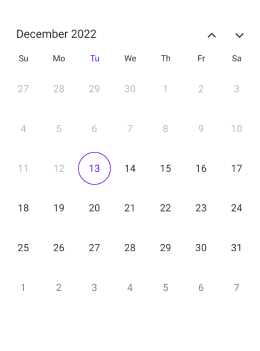
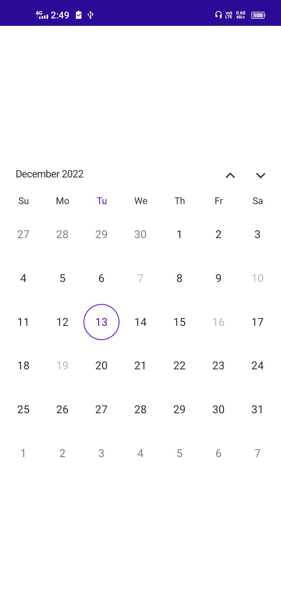

# Date Restrictions in MAUI Calendar (SfCalendar)

## Minimum DateTime
The [MinimumDateTime](https://help.syncfusion.com/cr/maui/Syncfusion.Maui.Calendar.SfCalendar.html#Syncfusion_Maui_Calendar_SfCalendar_MinimumDate) property will restrict the backward navigation of date selection and also you cannot swipe beyond the minimum date range.









  this.Calendar.MinimumDateTime = DateTime.Now.AddDays(-5);




## Maximum DateTime
The [MaximumDateTime](https://help.syncfusion.com/cr/maui/Syncfusion.Maui.Calendar.SfCalendar.html#Syncfusion_Maui_Calendar_SfCalendar_MaximumDate) property will restrict the forward navigation of date selection and also you cannot swipe beyond the maximum date range.









this.Calendar.MaximumDateTime = DateTime.Now.AddDays(5);




## Enable past dates
To enable or disable the dates before today's date using the [EnablePastDates](https://help.syncfusion.com/cr/maui/Syncfusion.Maui.Calendar.SfCalendar.html#Syncfusion_Maui_Calendar_SfCalendar_EnablePastDates)
property of the `SfCalendar` and you cannot select the dates before the today date while it is disabled.




<calendar:SfCalendar  x:Name="Calendar" 
                        View="Month"
                        EnablePastDates="false">
</calendar:SfCalendar>




this.Calendar.EnablePastDates = false;




## SelectableDayPredicate
The [SelectableDayPredicate](https://help.syncfusion.com/cr/maui/Syncfusion.Maui.Calendar.SfCalendar.html#Syncfusion_Maui_Calendar_SfCalendar_SelectableDayPredicate) of the `SfCalendar` decides whether the cell is selectable or not in calendar and if you want to disable the particular selected date in a calendar. Easily prevent the selection of weekends by disabling them. If the callback returns true, the date will be selectable in the Calendar.









this.Calendar.SelectableDayPredicate = (date) =>
{
  if (date.Date == DateTime.Now.AddDays(3) || date.Date == DateTime.Now.AddDays(6) || date.Date == DateTime.Now.AddDays(-4) || date.Date == DateTime.Now.AddDays(-2))
  {
    return false;
  }
  
  return true;
};




