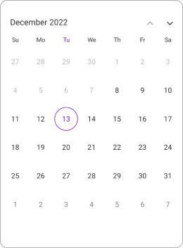
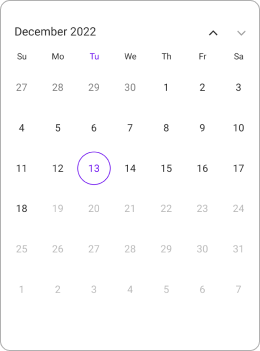
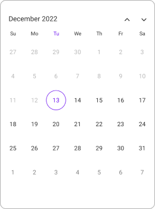
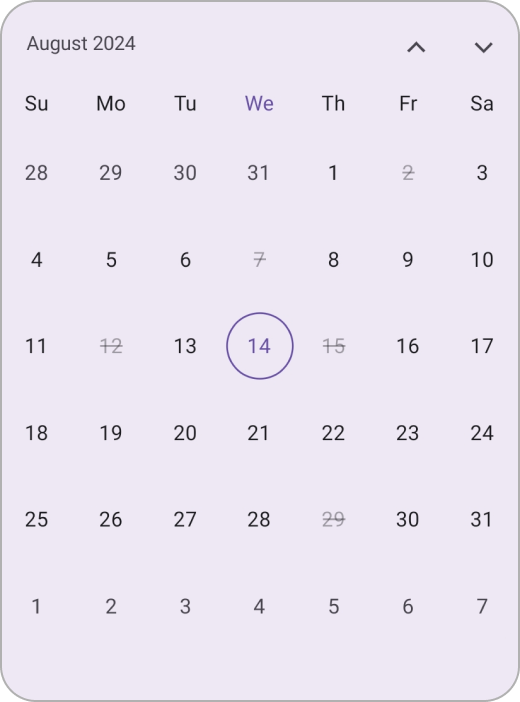

# Date Restrictions in .NET MAUI Calendar (SfCalendar)

## Minimum date
The [MinimumDate](https://help.syncfusion.com/cr/maui/Syncfusion.Maui.Calendar.SfCalendar.html#Syncfusion_Maui_Calendar_SfCalendar_MinimumDate) property will restrict the backward navigation of date selection and also you cannot swipe beyond the minimum date range.




<ContentPage
    . . .
    xmlns:calendar="clr-namespace:Syncfusion.Maui.Calendar;assembly=Syncfusion.Maui.Calendar">

    <calendar:SfCalendar x:Name="calendar" 
                        View="Month">
    </calendar:SfCalendar>

</ContentPage>




  using Syncfusion.Maui.Calendar;
  . . .

  this.calendar.MinimumDate = DateTime.Now.AddDays(-5);




## Maximum date
The [MaximumDate](https://help.syncfusion.com/cr/maui/Syncfusion.Maui.Calendar.SfCalendar.html#Syncfusion_Maui_Calendar_SfCalendar_MaximumDate) property will restrict the forward navigation of date selection and also you cannot swipe beyond the maximum date range.




<ContentPage
    . . .
    xmlns:calendar="clr-namespace:Syncfusion.Maui.Calendar;assembly=Syncfusion.Maui.Calendar">

    <calendar:SfCalendar x:Name="calendar" 
                        View="Month">
    </calendar:SfCalendar>

</ContentPage>




using Syncfusion.Maui.Calendar;
. . .

this.calendar.MaximumDate = DateTime.Now.AddDays(5);




## Enable past dates
Use the [EnablePastDates](https://help.syncfusion.com/cr/maui/Syncfusion.Maui.Calendar.SfCalendar.html#Syncfusion_Maui_Calendar_SfCalendar_EnablePastDates) property of the `SfCalendar` to enable or disable the dates before today's date. When disabled, the dates before today cannot be selected.




<ContentPage
    . . .
    xmlns:calendar="clr-namespace:Syncfusion.Maui.Calendar;assembly=Syncfusion.Maui.Calendar">

    <calendar:SfCalendar x:Name="calendar" 
                        View="Month"
                        EnablePastDates="false">
    </calendar:SfCalendar>

</ContentPage>




using Syncfusion.Maui.Calendar;
. . .

this.calendar.EnablePastDates = false;




## Selectable day predicate
The [SelectableDayPredicate](https://help.syncfusion.com/cr/maui/Syncfusion.Maui.Calendar.SfCalendar.html#Syncfusion_Maui_Calendar_SfCalendar_SelectableDayPredicate) of the `SfCalendar` decides whether a cell is selectable in the calendar, and can be used to disable particular dates. Use it to easily prevent the selection of weekends by disabling them. If the callback returns true, the date is selectable in the Calendar.




<ContentPage
    . . .
    xmlns:calendar="clr-namespace:Syncfusion.Maui.Calendar;assembly=Syncfusion.Maui.Calendar">

    <calendar:SfCalendar x:Name="calendar" 
                        View="Month">
    </calendar:SfCalendar>

</ContentPage>




using Syncfusion.Maui.Calendar;
. . .

this.calendar.SelectableDayPredicate = (date) =>
{
  if (date.Date == DateTime.Now.AddDays(-2).Date || date.Date == DateTime.Now.AddDays(-7).Date || date.Date == DateTime.Now.AddDays(-12).Date || date.Date == DateTime.Now.AddDays(1).Date || date.Date == DateTime.Now.AddDays(15).Date)
  {
    return false;
  }

  return true;
};




{:width="271" height="351"}