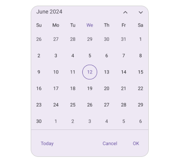
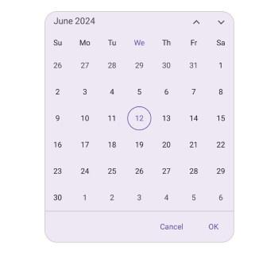
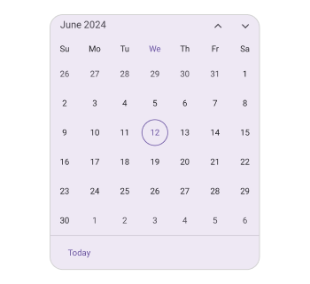
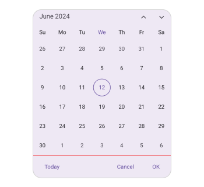

# Footer in .NET MAUI Calendar (SfCalendar)
You can customize all the properties of the Footer view using [FooterView](https://help.syncfusion.com/cr/maui/Syncfusion.Maui.Calendar.SfCalendar.html#Syncfusion_Maui_Calendar_SfCalendar_FooterView). By using this property, you can customize the [Background](https://help.syncfusion.com/cr/maui/Syncfusion.Maui.Calendar.CalendarFooterView.html#Syncfusion_Maui_Calendar_CalendarFooterView_Background), [Height](https://help.syncfusion.com/cr/maui/Syncfusion.Maui.Calendar.CalendarFooterView.html#Syncfusion_Maui_Calendar_CalendarFooterView_Height), [DividerColor](https://help.syncfusion.com/cr/maui/Syncfusion.Maui.Calendar.CalendarFooterView.html#Syncfusion_Maui_Calendar_CalendarFooterView_DividerColor), [TextStyle](https://help.syncfusion.com/cr/maui/Syncfusion.Maui.Calendar.CalendarFooterView.html#Syncfusion_Maui_Calendar_CalendarFooterView_TextStyle), [ShowActionButtons](https://help.syncfusion.com/cr/maui/Syncfusion.Maui.Calendar.CalendarFooterView.html#Syncfusion_Maui_Calendar_CalendarFooterView_ShowActionButtons) and [ShowTodayButton](https://help.syncfusion.com/cr/maui/Syncfusion.Maui.Calendar.CalendarFooterView.html#Syncfusion_Maui_Calendar_CalendarFooterView_ShowTodayButton) of the Calendar.

## Customize the header Height
You can customize the Footer Height [Calendar](https://help.syncfusion.com/cr/maui/Syncfusion.Maui.Calendar.SfCalendar.html) by using the [Height](https://help.syncfusion.com/cr/maui/Syncfusion.Maui.Calendar.CalendarFooterView.html#Syncfusion_Maui_Calendar_CalendarFooterView_Height) property.




<calendar:SfCalendar  x:Name="Calendar"
                      View="Month">
            <calendar:SfCalendar.FooterView>
                <calendar:CalendarFooterView Height="70" ShowActionButtons="True" ShowTodayButton="True" />
            </calendar:SfCalendar.FooterView>
</calendar:SfCalendar>




this.Calendar.FooterView.Height = 70;




## Action buttons

You can display action buttons at the Footer of the Calendar by using the [ShowActionButtons](https://help.syncfusion.com/cr/maui/Syncfusion.Maui.Calendar.CalendarFooterView.html#Syncfusion_Maui_Calendar_CalendarFooterView_ShowActionButtons) property of the [SfCalendar](https://help.syncfusion.com/cr/maui/Syncfusion.Maui.Calendar.SfCalendar.html). It allows you to confirm or cancel the selected date, dates, and range of dates in Calendar views of the [SfCalendar](https://help.syncfusion.com/cr/maui/Syncfusion.Maui.Calendar.SfCalendar.html).




<calendar:SfCalendar  x:Name="Calendar"
                      View="Month">
            <calendar:SfCalendar.FooterView>
                <calendar:CalendarFooterView ShowActionButtons="true" />
            </calendar:SfCalendar.FooterView>
</calendar:SfCalendar>




this.Calendar.FooterView.ShowActionButtons = true;




## Today button

The today button can be displayed at the Footer of the Calendar using the [ShowTodayButton](https://help.syncfusion.com/cr/maui/Syncfusion.Maui.Calendar.CalendarFooterView.html#Syncfusion_Maui_Calendar_CalendarFooterView_ShowTodayButton) property of the [SfCalendar](https://help.syncfusion.com/cr/maui/Syncfusion.Maui.Calendar.SfCalendar.html), allowing you to quickly navigate from the current view to today's view.




<calendar:SfCalendar  x:Name="Calendar"
                      View="Month">
            <calendar:SfCalendar.FooterView>
                <calendar:CalendarFooterView ShowTodayButton="True" />
            </calendar:SfCalendar.FooterView>
</calendar:SfCalendar>




this.Calendar.FooterView.ShowTodayButton = true;




## Set the Divider color

You can customize the Footer divider color by setting the [DividerColor](https://help.syncfusion.com/cr/maui/Syncfusion.Maui.Calendar.CalendarFooterView.html#Syncfusion_Maui_Calendar_CalendarFooterView_DividerColor) property of the [CalendarFooterView](https://help.syncfusion.com/cr/maui/Syncfusion.Maui.Calendar.CalendarFooterView.html).




<calendar:SfCalendar  x:Name="Calendar"
                      View="Month">
            <calendar:SfCalendar.FooterView>
                <calendar:CalendarFooterView DividerColor="Red" ShowActionButtons="True" ShowTodayButton="True" />
            </calendar:SfCalendar.FooterView>
</calendar:SfCalendar>




this.Calendar.FooterView.Height = 70;




## Customization of the Footer 

You can customize the Footer text style and Background color of the Calendar Footer view using the [TextStyle](https://help.syncfusion.com/cr/maui/Syncfusion.Maui.Calendar.CalendarFooterView.html#Syncfusion_Maui_Calendar_CalendarFooterView_TextStyle) and [Background](https://help.syncfusion.com/cr/maui/Syncfusion.Maui.Calendar.CalendarFooterView.html#Syncfusion_Maui_Calendar_CalendarFooterView_Background) properties of the [CalendarFooterView](https://help.syncfusion.com/cr/maui/Syncfusion.Maui.Calendar.CalendarFooterView.html).




<calendar:SfCalendar x:Name="Calendar" >
    <calendar:SfCalendar.FooterView >
        <calendar:CalendarFooterView Background="#D3D3D3" ShowActionButtons="True" ShowTodayButton="True" >
            <calendar:CalendarFooterView.TextStyle >
                <calendar:CalendarTextStyle FontSize="15" TextColor="Black" />
            </calendar:CalendarFooterView.TextStyle>
        </calendar:CalendarFooterView>
    </calendar:SfCalendar.FooterView>
</calendar:SfCalendar>




SfCalendar calendar = new SfCalendar();
calendar.FooterView = new CalendarFooterView()
{
    Background = Color.FromArgb("#D3D3D3"),
    TextStyle = new CalendarTextStyle()
    {
        TextColor = Colors.Black,
        FontSize = 15,
    }
};

this.Content = calendar;




