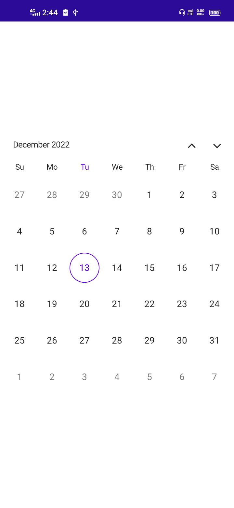
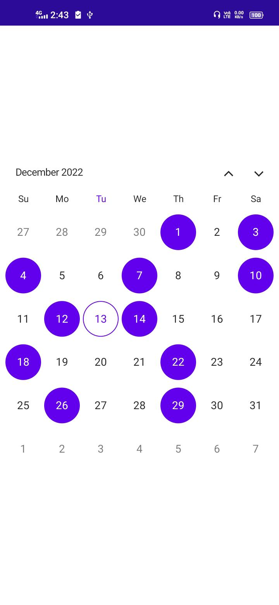

# Getting started with MAUI Calendar (SfCalendar)
This section explains the steps required to add the [calendar](https://www.syncfusion.com/maui-widgets/maui-calendar) widget. This section covers only basic features needed to get started with Syncfusion Calendar.

## Creating an application using the .NET MAUI Calendar

1. Create a new .NET MAUI application in Visual Studio.

2. Syncfusion .NET MAUI components are available in [nuget.org](https://www.nuget.org/). To add SfCalendar to your project, open the NuGet package manager in Visual Studio, search for [Syncfusion.Maui.Calendar](https://www.nuget.org/packages/Syncfusion.Maui.Calendar) and then install it.

3. To initialize the control, import the control namespace `Syncfusion.Maui.Calendar` in XAML or C# code.

4. Initialize `SfCalendar.`




<ContentPage   
    . . .
    xmlns:calendar="clr-namespace:Syncfusion.Maui.Calendar;assembly=Syncfusion.Maui.Calendar">

    <calendar:SfCalendar />
</ContentPage>




using Syncfusion.Maui.Calendar;
. . .

public partial class MainPage : ContentPage
{
    public MainPage()
    {
        InitializeComponent();
        SfCalendar calendar = new SfCalendar();
        this.Content = calendar;
    }
}




## Register the handler

The `Syncfusion.Maui.Core` nuget is a dependent package for all Syncfusion controls of .NET MAUI. In the `MauiProgram.cs` file, register the handler for Syncfusion core.




using Syncfusion.Maui.Core.Hosting;
namespace GettingStarted
{
    public static class MauiProgram
    {
        public static MauiApp CreateMauiApp()
        {
            var builder = MauiApp.CreateBuilder();

            builder.ConfigureSyncfusionCore();
            builder
            .UseMauiApp<App>()
            .ConfigureFonts(fonts =>
            {
                fonts.AddFont("OpenSans-Regular.ttf", "OpenSansRegular");
                fonts.AddFont("Segoe-mdl2.ttf", "SegoeMDL2");
            });

            return builder.Build();
        }
    }
}




## Change different calendar views

The [.NET MAUI Calendar](https://help.syncfusion.com/cr/maui/Syncfusion.Maui.Calendar.SfCalendar.html) control provides four different types of views to display dates and it can be assigned to the control by using the [View](https://help.syncfusion.com/cr/maui/Syncfusion.Maui.Calendar.SfCalendar.html#Syncfusion_Maui_Calendar_SfCalendar_View) property. The control is assigned to the [Month](https://help.syncfusion.com/cr/maui/Syncfusion.Maui.Calendar.CalendarView.html#Syncfusion_Maui_Calendar_CalendarView_Month) view by default. The current date will be displayed initially for all the Calendar views.









this.Calendar.View = CalendarView.Month;




## Change first day of week

The default first day of week is `Sunday`. But the Calendar allows customization to change the first day of the week with the [FirstDayOfWeek](https://help.syncfusion.com/cr/maui/Syncfusion.Maui.Calendar.SfCalendar.html#Syncfusion_Maui_Scheduler_SfScheduler_FirstDayOfWeek) property.

The following code shows the Calendar with `Wednesday` as the first day of the week.

  







this.Calendar.MonthView.FirstDayOfWeek = DayOfWeek.Wednesday;

  


## Change Selection mode

Calendar allows the user to select the dates in all the four calendar views. Supports Single, Multiple and Range selection to select the dates. The default selection mode is `Defalut`. 

The selection details can be obtained by using call back method which return `CalendarSelectionChangedEventArgs` holds the details of selected date or range.

The following code shows the Calendar with `Multiple` as the Selection mode.

  







this.Calendar.SelectionMode = CalendarSelectionMode.Multiple;

  


