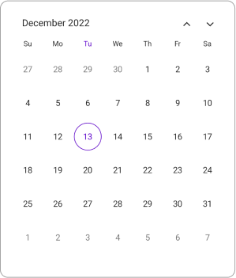

# Getting Started with the .NET MAUI Calendar

This section explains how to add the [.NET MAUI Calendar](https://www.syncfusion.com/maui-controls/maui-calendar) control. This section covers only the basic features needed to get started with Syncfusion&reg; Calendar. Follow the steps below to add .NET MAUI calendar control to your project.

To get start quickly with our .NET MAUI Calendar, you can check the below video.






## Prerequisites

Before proceeding, ensure the following are set up:

1. Install [.NET 9 SDK](https://dotnet.microsoft.com/en-us/download/dotnet/9.0) or later.
2. Set up a .NET MAUI environment with Visual Studio 2022 v17.12 or later.

## Step 1: Create a New .NET MAUI Project

1. Go to **File > New > Project** and choose the **.NET MAUI App** template.
2. Name the project and choose a location. Then click **Next**.
3. Select the .NET framework version and click **Create**.

## Step 2: Install the Syncfusion&reg; .NET MAUI Calendar NuGet Package

1. In **Solution Explorer,** right-click the project and choose **Manage NuGet Packages.**
2. Search for [Syncfusion.Maui.Calendar](https://www.nuget.org/packages/Syncfusion.Maui.Calendar/) and install the latest version.
3. Ensure the necessary dependencies are installed correctly, and the project is restored.




## Prerequisites

Before proceeding, ensure the following are set up:

1. Install [.NET 9 SDK](https://dotnet.microsoft.com/en-us/download/dotnet/9.0) or later.
2. Set up a .NET MAUI environment with Visual Studio Code.
3. Ensure that the .NET MAUI workloads are installed and configured as described [here](https://learn.microsoft.com/en-us/dotnet/maui/get-started/installation?view=net-maui-9.0&tabs=visual-studio-code).

## Step 1: Create a New .NET MAUI Project

1. Open the command palette by pressing `Ctrl+Shift+P` and type **.NET:New Project** and enter.
2. Choose the **.NET MAUI App** template.
3. Select the project location, type the project name and press **Enter**.
4. Then choose **Create project.**

## Step 2: Install the Syncfusion&reg; .NET MAUI Calendar NuGet Package

1. Press <kbd>Ctrl</kbd> + <kbd>`</kbd> (backtick) to open the integrated terminal in Visual Studio Code.
2. Ensure you're in the project root directory where your .csproj file is located.
3. Run the command `dotnet add package Syncfusion.Maui.Calendar` to install the Syncfusion® .NET MAUI Calendar NuGet package.
4. To ensure all dependencies are installed, run `dotnet restore`.





## Prerequisites

Before proceeding, ensure the following are set up:

1. Install [.NET 9 SDK](https://dotnet.microsoft.com/en-us/download/dotnet/9.0) or later.
2. Set up a .NET MAUI environment with JetBrains Rider 2024.3 or later.
3. Make sure the MAUI workloads are installed and configured as described [here.](https://www.jetbrains.com/help/rider/MAUI.html#before-you-start)

## Step 1: Create a new .NET MAUI Project

1. Go to **File > New Solution,** Select .NET (C#) and choose the .NET MAUI App template.
2. Enter the Project Name, Solution Name, and Location.
3. Select the .NET framework version and click Create.

## Step 2: Install the Syncfusion® MAUI Calendar NuGet Package

1. In **Solution Explorer,** right-click the project and choose **Manage NuGet Packages.**
2. Search for [Syncfusion.Maui.Calendar](https://www.nuget.org/packages/Syncfusion.Maui.Calendar/) and install the latest version.
3. Ensure the necessary dependencies are installed correctly, and the project is restored. If not, Open the Terminal in Rider and manually run: `dotnet restore`




## Step 3: Register Syncfusion handler
 
Make sure to add the namespace.
 


using Syncfusion.Maui.Core.Hosting;


 
Register the Syncfusion core handler in your `CreateMauiApp` method of `MauiProgram.cs` file to use Syncfusion controls.
 


builder.ConfigureSyncfusionCore();



## Step 4: Import the Calendar namespace

Add the following namespace in your XAML or C#.



xmlns:calendar="clr-namespace:Syncfusion.Maui.Calendar;assembly=Syncfusion.Maui.Calendar"


using Syncfusion.Maui.Calendar;



## Step 5: Add the Calendar component

Create an instance for the Calendar control. The [.NET MAUI Calendar](https://help.syncfusion.com/cr/maui/Syncfusion.Maui.Calendar.SfCalendar.html) control provides four different types of views to display dates, and it can be assigned to the control using the [View](https://help.syncfusion.com/cr/maui/Syncfusion.Maui.Calendar.SfCalendar.html#Syncfusion_Maui_Calendar_SfCalendar_View) property. By default, the control is assigned to the [Month](https://help.syncfusion.com/cr/maui/Syncfusion.Maui.Calendar.CalendarView.html#Syncfusion_Maui_Calendar_CalendarView_Month) view. Initially, all Calendar views will show the current date.



<calendar:SfCalendar  x:Name="calendar" 
                        View="Month">
</calendar:SfCalendar>


SfCalendar calendar = new SfCalendar();
calendar.View = CalendarView.Month;



The following screenshot illustrates the result of the above code.

You can download the Calendar Getting Started sample from [GitHub](https://github.com/SyncfusionExamples/getting-started-with-the-dotnet-maui-calendar-control).
