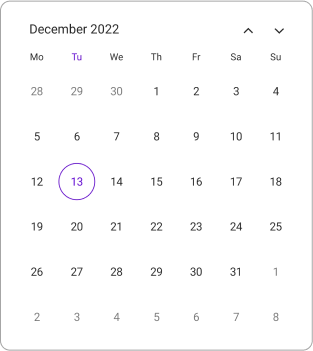
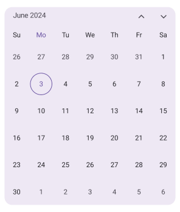

> **Notice**: After **Volume 1 2025 (Mid of March 2025)**, feature enhancements for this control will no longer be available in the Syncfusion&reg; package. Please switch to the **Syncfusion Toolkit for .NET MAUI** for continued support. For a smooth transition refer this [migration document](https://help.syncfusion.com/maui-toolkit/migration).

# Getting Started with the .NET MAUI Calendar

This section explains how to add the [.NET MAUI Calendar](https://www.syncfusion.com/maui-controls/maui-calendar) control. This section covers only the basic features needed to get started with Syncfusion&reg; Calendar. Follow the steps below to add .NET MAUI calendar control to your project.

To get start quickly with our .NET MAUI Calendar, you can check the below video.






## Prerequisites

Before proceeding, ensure the following are set up:
1. Install .NET SDK
  - [.NET 9 SDK](https://dotnet.microsoft.com/en-us/download/dotnet/9.0) or later must be installed.
2. Set up a .NET MAUI Environment with Visual Studio. Supported Visual Studio Versions:
  - Visual Studio 2022: Version 17.13 or later (e.g., 17.14.7) for .NET 9 development.
  - Visual Studio 2026: Required for .NET 10 development.

## Step 1: Create a New .NET MAUI Project

1. Go to **File > New > Project** and choose the **.NET MAUI App** template.
2. Name the project and choose a location. Then click **Next**.
3. Select the .NET framework version and click **Create**.

## Step 2: Install the Syncfusion&reg; .NET MAUI Calendar NuGet Package

1. In **Solution Explorer,** right-click the project and choose **Manage NuGet Packages.**
2. Search for [Syncfusion.Maui.Calendar](https://www.nuget.org/packages/Syncfusion.Maui.Calendar/) and install the latest version.
3. Ensure the necessary dependencies are installed correctly, and the project is restored.

## Step 3: Register the handler

The [Syncfusion.Maui.Core](https://www.nuget.org/packages/Syncfusion.Maui.Core/) NuGet is a dependent package for all Syncfusion controls of .NET MAUI. In the **MauiProgram.cs** file, register the handler for Syncfusion core.




using Syncfusion.Maui.Core.Hosting;
namespace GettingStarted
{
    public static class MauiProgram
    {
        public static MauiApp CreateMauiApp()
        {
            var builder = MauiApp.CreateBuilder();

            builder.ConfigureSyncfusionCore();
            builder
            .UseMauiApp<App>()
            .ConfigureFonts(fonts =>
            {
                fonts.AddFont("OpenSans-Regular.ttf", "OpenSansRegular");
            });

            return builder.Build();
        }
    }
}




## Step 4: Add .NET MAUI Calendar control

1. To initialize the control, import the `Syncfusion.Maui.Calendar` namespace into your code.
2. Initialize [SfCalendar](https://help.syncfusion.com/cr/maui/Syncfusion.Maui.Calendar.SfCalendar.html).




<ContentPage   
    . . .
    xmlns:calendar="clr-namespace:Syncfusion.Maui.Calendar;assembly=Syncfusion.Maui.Calendar">

    <calendar:SfCalendar />
</ContentPage>




using Syncfusion.Maui.Calendar;
. . .

public partial class MainPage : ContentPage
{
    public MainPage()
    {
        InitializeComponent();
        SfCalendar calendar = new SfCalendar();
        this.Content = calendar;
    }
}







## Prerequisites

Before proceeding, ensure the following are set up:

1. Install [.NET 9 SDK](https://dotnet.microsoft.com/en-us/download/dotnet/9.0) or later is installed.
2. Set up a .NET MAUI environment with Visual Studio Code.
3. Ensure that the .NET MAUI extension is installed and configured as described [here.](https://learn.microsoft.com/en-us/dotnet/maui/get-started/installation?view=net-maui-8.0&tabs=visual-studio-code)

## Step 1: Create a New .NET MAUI Project

1. Open the command palette by pressing `Ctrl+Shift+P` and type **.NET:New Project** and enter.
2. Choose the **.NET MAUI App** template.
3. Select the project location, type the project name and press **Enter**.
4. Then choose **Create project.**

## Step 2: Install the Syncfusion&reg; .NET MAUI Calendar NuGet Package

1. Press <kbd>Ctrl</kbd> + <kbd>`</kbd> (backtick) to open the integrated terminal in Visual Studio Code.
2. Ensure you're in the project root directory where your .csproj file is located.
3. Run the command `dotnet add package Syncfusion.Maui.Calendar` to install the Syncfusion® .NET MAUI Calendar NuGet package.
4. To ensure all dependencies are installed, run `dotnet restore`.

## Step 3: Register the handler

The [Syncfusion.Maui.Core](https://www.nuget.org/packages/Syncfusion.Maui.Core/) NuGet is a dependent package for all Syncfusion controls of .NET MAUI. In the **MauiProgram.cs** file, register the handler for Syncfusion core.




using Syncfusion.Maui.Core.Hosting;
namespace GettingStarted
{
    public static class MauiProgram
    {
        public static MauiApp CreateMauiApp()
        {
            var builder = MauiApp.CreateBuilder();

            builder.ConfigureSyncfusionCore();
            builder
            .UseMauiApp<App>()
            .ConfigureFonts(fonts =>
            {
                fonts.AddFont("OpenSans-Regular.ttf", "OpenSansRegular");
            });

            return builder.Build();
        }
    }
}




## Step 4: Add .NET MAUI Calendar control

1. To initialize the control, import the `Syncfusion.Maui.Calendar` namespace into your code.
2. Initialize [SfCalendar](https://help.syncfusion.com/cr/maui/Syncfusion.Maui.Calendar.SfCalendar.html).




<ContentPage   
    . . .
    xmlns:calendar="clr-namespace:Syncfusion.Maui.Calendar;assembly=Syncfusion.Maui.Calendar">

    <calendar:SfCalendar />
</ContentPage>




using Syncfusion.Maui.Calendar;
. . .

public partial class MainPage : ContentPage
{
    public MainPage()
    {
        InitializeComponent();
        SfCalendar calendar = new SfCalendar();
        this.Content = calendar;
    }
}








## Prerequisites

Before proceeding, ensure the following are set up:

1. Ensure you have the latest version of JetBrains Rider.
2. Install [.NET 9 SDK](https://dotnet.microsoft.com/en-us/download/dotnet/9.0) or later is installed.
3. Make sure the MAUI workloads are installed and configured as described [here.](https://www.jetbrains.com/help/rider/MAUI.html#before-you-start)

## Step 1: Create a new .NET MAUI Project

1. Go to **File > New Solution,** Select .NET (C#) and choose the .NET MAUI App template.
2. Enter the Project Name, Solution Name, and Location.
3. Select the .NET framework version and click Create.

## Step 2: Install the Syncfusion® MAUI Calendar NuGet Package

1. In **Solution Explorer,** right-click the project and choose **Manage NuGet Packages.**
2. Search for [Syncfusion.Maui.Calendar](https://www.nuget.org/packages/Syncfusion.Maui.Calendar/) and install the latest version.
3. Ensure the necessary dependencies are installed correctly, and the project is restored. If not, Open the Terminal in Rider and manually run: `dotnet restore`

## Step 3: Register the handler

The [Syncfusion.Maui.Core](https://www.nuget.org/packages/Syncfusion.Maui.Core/) NuGet is a dependent package for all Syncfusion controls of .NET MAUI. In the **MauiProgram.cs** file, register the handler for Syncfusion core.




using Syncfusion.Maui.Core.Hosting;
namespace GettingStarted
{
    public static class MauiProgram
    {
        public static MauiApp CreateMauiApp()
        {
            var builder = MauiApp.CreateBuilder();

            builder.ConfigureSyncfusionCore();
            builder
            .UseMauiApp<App>()
            .ConfigureFonts(fonts =>
            {
                fonts.AddFont("OpenSans-Regular.ttf", "OpenSansRegular");
            });

            return builder.Build();
        }
    }
}




## Step 4: Add .NET MAUI Calendar control

1. To initialize the control, import the `Syncfusion.Maui.Calendar` namespace into your code.
2. Initialize [SfCalendar](https://help.syncfusion.com/cr/maui/Syncfusion.Maui.Calendar.SfCalendar.html).




<ContentPage   
    . . .
    xmlns:calendar="clr-namespace:Syncfusion.Maui.Calendar;assembly=Syncfusion.Maui.Calendar">

    <calendar:SfCalendar />
</ContentPage>




using Syncfusion.Maui.Calendar;
. . .

public partial class MainPage : ContentPage
{
    public MainPage()
    {
        InitializeComponent();
        SfCalendar calendar = new SfCalendar();
        this.Content = calendar;
    }
}







## Change different calendar views

The [.NET MAUI Calendar](https://help.syncfusion.com/cr/maui/Syncfusion.Maui.Calendar.SfCalendar.html) control provides four different types of views to display dates, and it can be assigned to the control using the [View](https://help.syncfusion.com/cr/maui/Syncfusion.Maui.Calendar.SfCalendar.html#Syncfusion_Maui_Calendar_SfCalendar_View) property. By default, the control is assigned to the [Month](https://help.syncfusion.com/cr/maui/Syncfusion.Maui.Calendar.CalendarView.html#Syncfusion_Maui_Calendar_CalendarView_Month) view. Initially, all Calendar views will show the current date.




<calendar:SfCalendar  x:Name="calendar" 
                        View="Month">
</calendar:SfCalendar>




this.calendar.View = CalendarView.Month;




## Change first day of week

The Calendar control is rendered with `Sunday` as the first day of the week and it allows customization to change the first day of the week using the [FirstDayOfWeek](https://help.syncfusion.com/cr/maui/Syncfusion.Maui.Calendar.CalendarMonthView.html#Syncfusion_Maui_Calendar_CalendarMonthView_FirstDayOfWeek) property in month view.

The following code explains how to show the Calendar with `Monday` as the first day of the week.

  


<calendar:SfCalendar x:Name="calendar">
    <calendar:SfCalendar.MonthView>
        <calendar:CalendarMonthView FirstDayOfWeek="Monday"/>
    </calendar:SfCalendar.MonthView>
 </calendar:SfCalendar>




this.calendar.MonthView.FirstDayOfWeek = DayOfWeek.Monday;

  


## Date selection

The [Calendar](https://help.syncfusion.com/cr/maui/Syncfusion.Maui.Calendar.SfCalendar.html) allows the user to select a single date, multiple dates, or a range of dates by interaction or programmatic selection. The default selection mode is `Single`.

The selection details can be obtained by using the [SelectionChanged](https://help.syncfusion.com/cr/maui/Syncfusion.Maui.Calendar.SfCalendar.html#Syncfusion_Maui_Calendar_SfCalendar_SelectionChanged) event of the calendar. It returns `CalendarSelectionChangedEventArgs`, which holds the details about the selected date or range.

The following code explains how to show the Calendar with `Multiple` as the Selection mode.

  


<calendar:SfCalendar  x:Name="calendar" 
                      SelectionMode="Multiple">
</calendar:SfCalendar>




this.calendar.SelectionMode = CalendarSelectionMode.Multiple;

  


## Corner radius

You can customize the corner radius of the calendar using the [CornerRadius](https://help.syncfusion.com/cr/maui/Syncfusion.Maui.Calendar.SfCalendar.html#Syncfusion_Maui_Calendar_SfCalendar_CornerRadius) property of the SfCalendar, allowing you to set the desired roundness for the corners of the calendar. The default value of the `CornerRadius` property is `20`.

  


<calendar:SfCalendar x:Name="calendar" 
                     View="Month"
                     CornerRadius="15">
 </calendar:SfCalendar>




this.calendar.CornerRadius = 15;




N> You can also explore our [.NET MAUI Calendar Example](https://github.com/syncfusion/maui-demos/tree/master/MAUI/Calendar) that shows you how to render the Calendar in .NET MAUI.