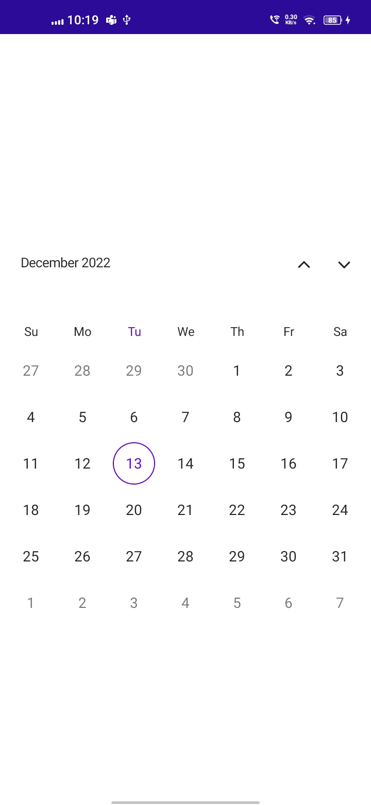

# Headers in MAUI Calendar (SfCalendar)
You can customize all the properties of the Header view using `HeaderView`. By using this property you can customize the Background, Height, TextFormat, TextStyle and ShowNavigationArrows in the Calendar.

## Customize the header height
You can customize the header height `Calendar` by using the `Height` property.




<calendar:SfCalendar  x:Name="Calendar"
                      View="Month">
            <Calendar:SfCalendar.HeaderView>
                <Calendar:CalendarHeaderView Height="70" />
            </Calendar:SfCalendar.HeaderView>
</calendar:SfCalendar>




this.Calendar.HeaderView = new CalendarHeaderView()
{
    Height = 70,
};




## Header appearance
You can customize the header style of the `Calendar` by using the [Background], [TextStyle], and [TextFormat] properties of [ShowNavigationArrows].




<calendar:SfCalendar  x:Name="Calendar"
                      View="Month">
            <Calendar:SfCalendar.HeaderView>
                <Calendar:CalendarHeaderView Background="Grey" TextFormat="MMM yy" ShowNavigationArrows="True">
                    <Calendar:CalendarHeaderView.TextStyle>
                        <Calendar:CalendarTextStyle TextColor="Black" FontSize="14" />
                    </Calendar:CalendarHeaderView.TextStyle>
                </Calendar:CalendarHeaderView>
            </Calendar:SfCalendar.HeaderView>
</calendar:SfCalendar>




CalendarTextStyle textStyle = new CalendarTextStyle()
{
    TextColor = Colors.Black,
    FontSize = 14,
};

this.Calendar.HeaderView = new CalendarHeaderView()
{
    Background = Colors.Grey,
    TextFormat = "MMM yy",
    ShowNavigationArrows = true,
    TextStyle = textStyle,
};




## View header
You can customize all the properties of the View Header using [HeaderView]. By using this property you can customize the Background, Height, TextFormat and TextStyle in the Calendar.

### Customize view header height
You can customize the View Header height `Calendar` by using the `Height` property.




<calendar:SfCalendar  x:Name="Calendar"
                      View="Month">
            <Calendar:SfCalendar.MonthView>
                <Calendar:CalendarMonthView>
                    <Calendar:CalendarMonthView.HeaderView>
                        <Calendar:CalendarMonthHeaderView Height="50" />
                    </Calendar:CalendarMonthView.HeaderView>
                </Calendar:CalendarMonthView>
            </Calendar:SfCalendar.MonthView>
</calendar:SfCalendar>




this.Calendar.MonthView.HeaderView = new CalendarMonthHeaderView
{
    Height = 50,
};




### View header appearance
You can customize the view header style of the `Calendar` by using the [Background], [TextStyle], and [TextFormat] properties.




<calendar:SfCalendar  x:Name="Calendar"
                      View="Month">
            <Calendar:SfCalendar.MonthView>
                <Calendar:CalendarMonthView>
                    <Calendar:CalendarMonthView.HeaderView>
                        <Calendar:CalendarMonthHeaderView Background="Grey" TextFormat="ddd">
                            <Calendar:CalendarMonthHeaderView.TextStyle>
                                <Calendar:CalendarTextStyle TextColor="Black" FontSize="14" />
                            </Calendar:CalendarMonthHeaderView.TextStyle>
                        </Calendar:CalendarMonthHeaderView>
                    </Calendar:CalendarMonthView.HeaderView>
                </Calendar:CalendarMonthView>
            </Calendar:SfCalendar.MonthView>
</calendar:SfCalendar>




CalendarTextStyle textStyle = new CalendarTextStyle()
{
    TextColor = Colors.Black,
    FontSize = 14,
};

this.Calendar.MonthView.HeaderView = new CalendarMonthHeaderView
{
    Background = Colors.Grey,
    TextFormat = "ddd",
    TextStyle = textStyle,
};




