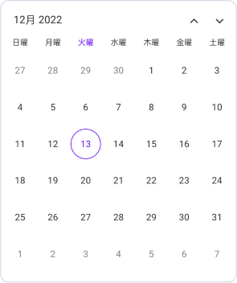

# Localization in .NET MAUI Calendar (SfCalendar)

By default, the calendar control supports US English localizations. You can change to other languages by adding the `Globalization` namespace to your application.

The application culture can be changed by setting `CurrentUICulture`. in the `App.xaml.cs` file.




using Syncfusion.Maui.Calendar;
using System.Globalization;

public partial class App : Application
{
	public App()
	{
		InitializeComponent();
		CultureInfo.CurrentUICulture = CultureInfo.CreateSpecificCulture("ja-JP");
	}
}




