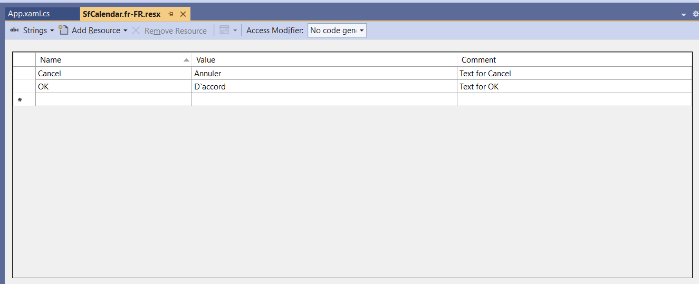

# Localization in .NET MAUI Calendar (SfCalendar)

By default, the calendar control supports US English localizations. You can change to other languages by adding the `Globalization` namespace to your application.

The application culture can be changed by setting `CurrentUICulture`. in the `App.xaml.cs` file.




using Syncfusion.Maui.Calendar;
using System.Globalization;

public partial class App : Application
{
	public App()
	{
		InitializeComponent();
		CultureInfo.CurrentUICulture = CultureInfo.CreateSpecificCulture("ja-JP");
	}
}




## Localize application level

To localize the `Calendar` based on `CurrentUICulture` using `resource` files, follow the below steps.

   1. Create new folder, named as `Resources` in the application.

   2. Right-click on the `Resources` folder, select `Add` and then `NewItem.`

   3. In Add New Item wizard, select the Resource File option and name the filename as `SfCalendar.<culture name>.resx.` For example, give the name as `SfCalendar.fr-FR.resx` for French culture.

   4. The culture name indicates the name of the language and country.

        

   5. Now, select `Add` option to add the resource file in **Resources** folder.

        

   6. Add the Name/Value pair in Resource Designer of `SfCalendar.fr-FR.resx` file and change its corresponding value to corresponding culture.

   
