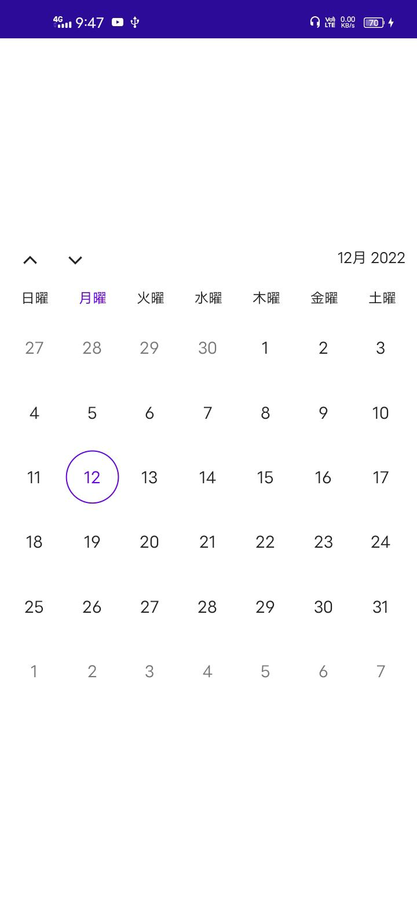

# Overview of .NET MAUI Calendar (SfCalendar)

The Syncfusion .NET MAUI Calendar (SfCalendar) is a lightweight calendar control that allows user to easily select a single, multiple and a range of dates. It provides month, year, decade, and century view options to quickly navigate to the desired date. It supports minimum, maximum, enable past dates and disabled dates to restrict date selection.

## Key features

* **Multiple calendar views**: Display month, year, decade, and century views that allows user to easily select and navigate between built-in views. Supports programmatic navigation.




{% endcolumn}


{% endcolumn}


{% endcolumn}


{% endcolumn}


* **Quick navigation**: You can easily navigate to the different views in the SfCalendar.

* **Allow view Navigation**: Allows you to navigate through tap interaction on the cell or header when it is enabled. Restrict users from navigating to different calendar views and allows you to select the dates in the year, decade and century view when this property is not enabled.




{% endcolumn}


{% endcolumn}


{% endcolumn}


{% endcolumn}


* **Enable Past Dates**: Indicates whether the dates are enabled or disabled before the today date. If this property is disabled, you cannot able to select the dates before the today date and the dates before the today date are considered as disabled dates.

   

* **Date selection**: The Selection mode is specified in the calendar property enumeration, allows you to select single, multiple, and a range of dates through interaction. It also supports programmatic selection.




{% endcolumn}


{% endcolumn}

!
{% endcolumn}


* **Limit the date selection range**: By setting the minimum and maximum days, you can only able to select the date within the minimum and maximum number of days(span of days).

   

* **Change first day of week**: You Can customize the first day of the week as needed. The default first day of the week is Sunday.

* **Selectable Day Predicate**: This property decides whether the cell is selectable or not in calendar and if you want to disable the particular date in a calendar. Easily prevent the selection of weekends by disabling them.

   

* **Highlight weekends and special dates**: Can highlight any special dates or every weekend in a month using different background color and textstyles in MAUI Calendar.

   

* **Right to left (RTL)** - You can use the Right-to-left property to change the text direction in the Calendar. Supports users for working in RTL languages like Hebrew and Arabic.

   

* **Globalization** - Displays the current date and time based on the globalized date and time formats. You can able to change the culture of the calendar.

   
