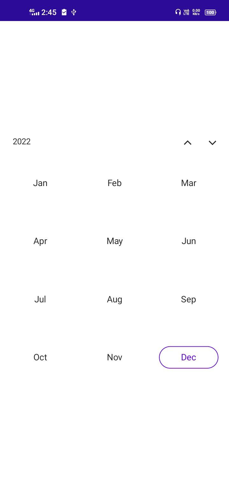
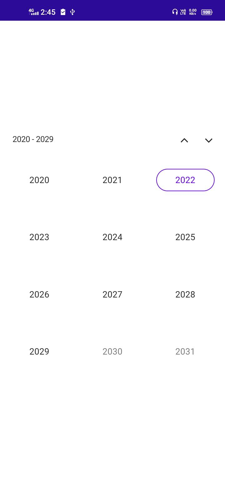
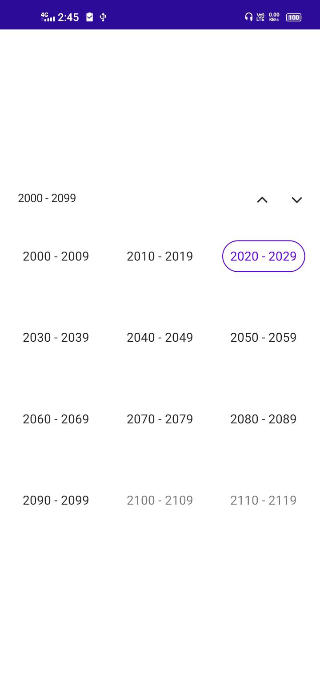

# Overview of .NET MAUI Calendar (SfCalendar)

The Syncfusion .NET MAUI Calendar (SfCalendar) allows user to select a Single date, Multiple dates or a Range of dates. It provides Month, Year, Decade, and Century view options for quickly navigate to the desired date. It supports minimum dates, maximum dates, enable past dates, and disabled dates to restrict the date selection.

## Key features

* **Multiple calendar view modes**: For selection and navigation, use the month, year, decade, and century calendar views.

   
   
   
   {% endcolumn}
   
   
   {% endcolumn}
   
   
   {% endcolumn}
   
   
   {% endcolumn}
   

* **Quick navigation**: You can easily navigate to the desired date using different calendar views in the SfCalendar.

* **Enable and disable built-in view switching**: Restricts or enable navigation to different calendar views through interaction.

   % multiple_column split:2 %}
   
   
   {% endcolumn}
   
   
   {% endcolumn}
   
   
   {% endcolumn}
   
   
   {% endcolumn}
   

* **Enable Past Dates**: The dates before the current date are considered as disabled date if this feature is disabled and you won't be able to select or access them.

   

* **Date selection**: Date selection allows you to select Single date, Multiple dates or a Range of dates by interaction or programmatic selection.

   % multiple_column split:2 %}
   
   
   {% endcolumn}
   
   
   {% endcolumn}
   
   !
   {% endcolumn}
   

* **Limit date selection**: Restrict interaction and navigation beyond specified minimum and maximum dates.

   

* **Change first day of week**: You can customize the starting day of the week as needed. The default first day of the week is Sunday.

   

* **Selectable Day Predicate**: Disable interaction for calendar view dates and easily prevent the selection of weekends by disabling them.

   

* **Highlight weekends and special dates**: Can highlight special dates and weekend in a month using different background color and textstyles in MAUI Calendar.

   

* **Right to left (RTL)**: The Calendar's text direction can be changed by using the Right-to-left property. Enables user to work with RTL languages, such as Hebrew and Arabic.

   

* **Globalization**: Displays the current date and time based on the globalized date and time formats.

   
