# Overview of .NET MAUI Calendar (SfCalendar)

The Syncfusion .NET MAUI Calendar (SfCalendar) control allows user to easily select a Single, Multiple and a Range of dates. It offers Month, Year, Decade, and Century view options to quickly navigate to the desired date. To restrict the date selection by using the minimum, maximum, enable past dates, and disabled dates.

## Key features

* **Multiple calendar views**: The user can easily select and switch between the built-in month, year, decade, and century views by displaying them. Supports programmatic navigation.

   
   
   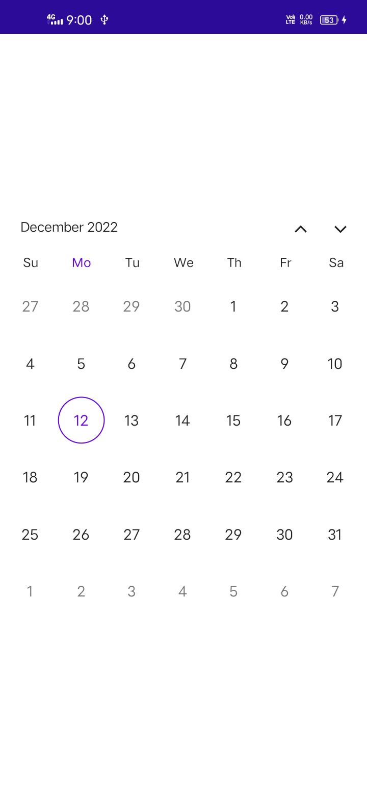
   {% endcolumn}
   
   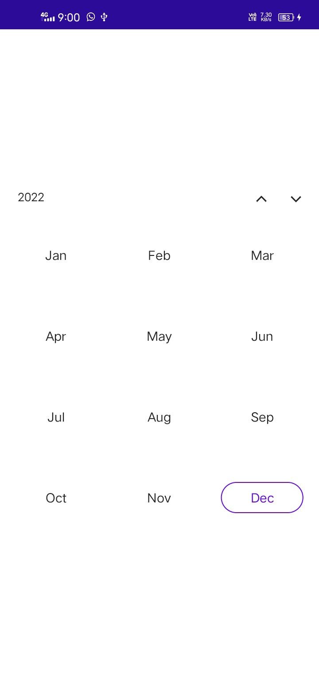
   {% endcolumn}
   
   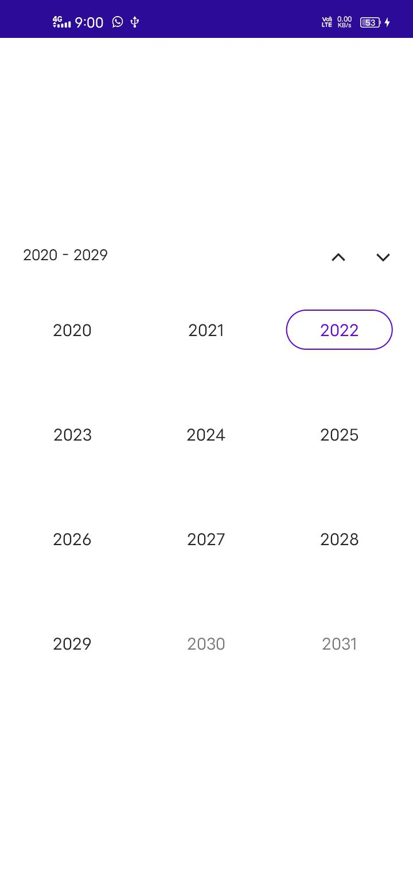
   {% endcolumn}
   
   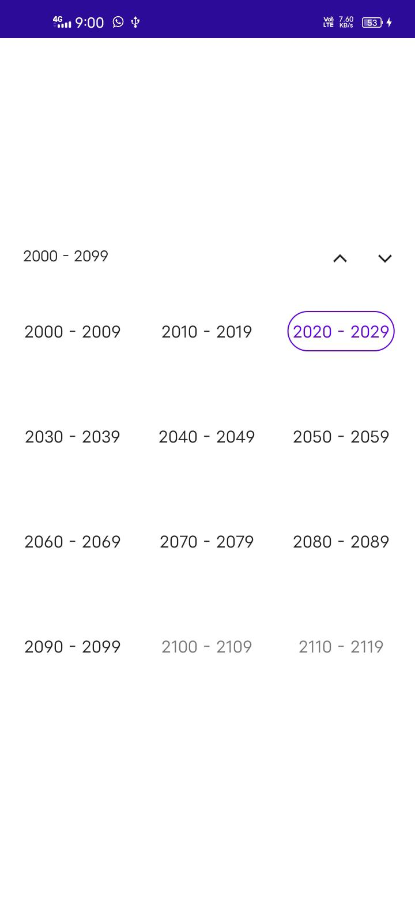
   {% endcolumn}
   

* **Quick navigation**: You can easily navigate to the desired date using different calendar views in the SfCalendar.

* **Allow view Navigation**: If this feature is disabled, restrict users from navigating to different calendar views and you can select the dates in the Year, Decade and Century view cells.

   
   
   
   {% endcolumn}
   
   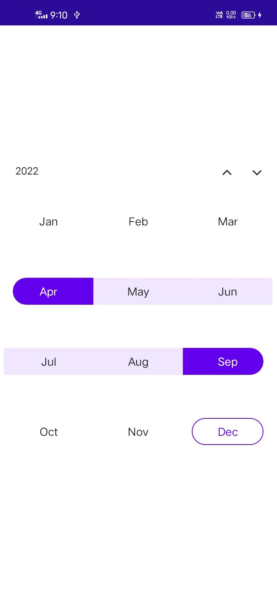
   {% endcolumn}
   
   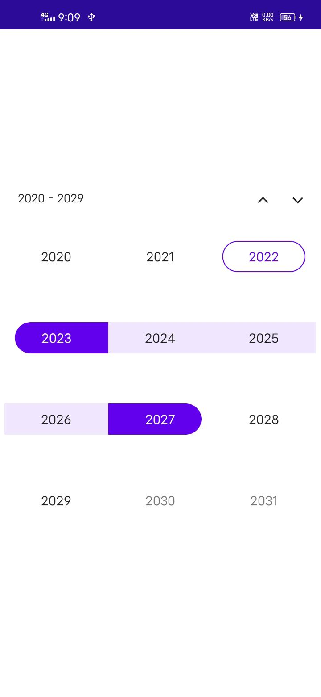
   {% endcolumn}
   
   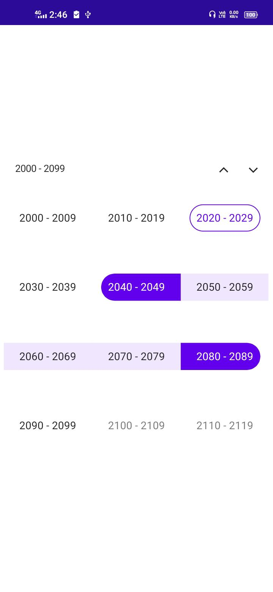
   {% endcolumn}
   

* **Enable Past Dates**: The dates before the current date are considered as disabled date if this feature is disabled and you won't be able to select or access them.

   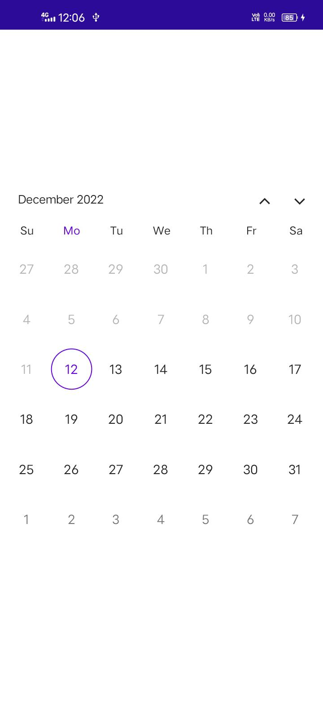

* **Date selection**: Date selection allows you to select Single, Multiple, and a Range of dates. It also supports programmatic selection.

   
   
   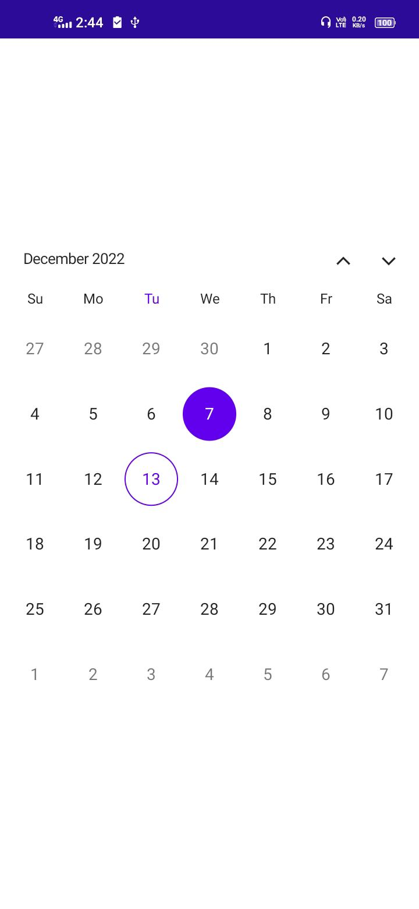
   {% endcolumn}
   
   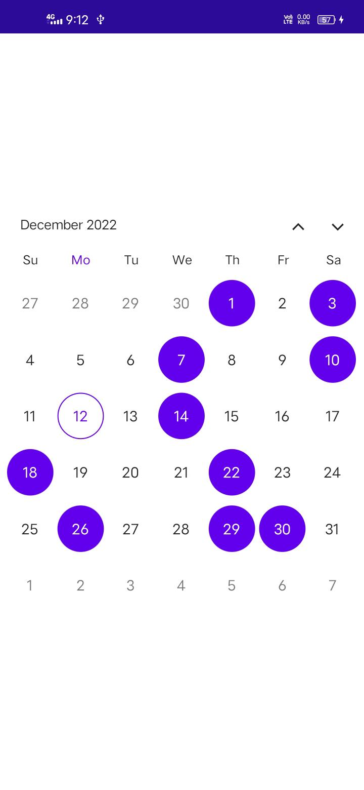
   {% endcolumn}
   
   !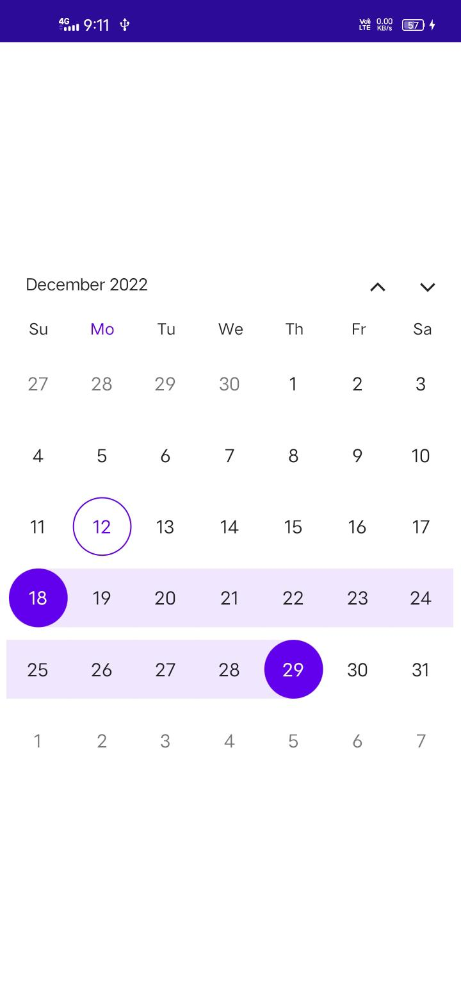
   {% endcolumn}
   

* **Limit the date selection range**: The minimum and maximum days option allows you to choose the date only a specific range of minimum and maximum number of days (span of days). The dates before the minimum date and after the maximum date are considered as disbaled date.

   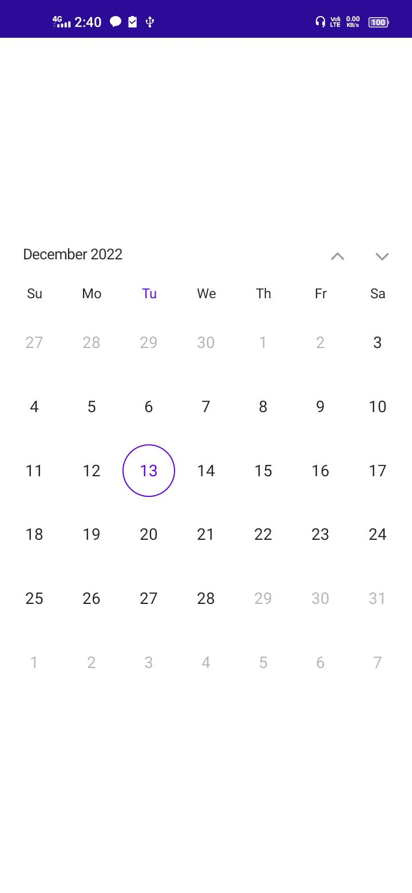

* **Change first day of week**: You can customize the first day of the week as needed. The default first day of the week is Sunday.

   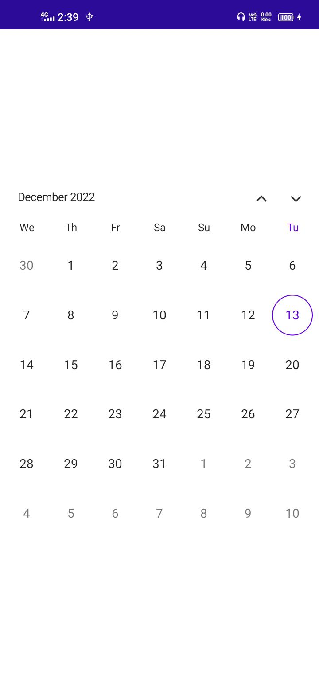

* **Selectable Day Predicate**: This property decides whether the cell is selectable or not in calendar and if you want to disable the particular date in a calendar. Easily prevent the selection of weekends by disabling them.

   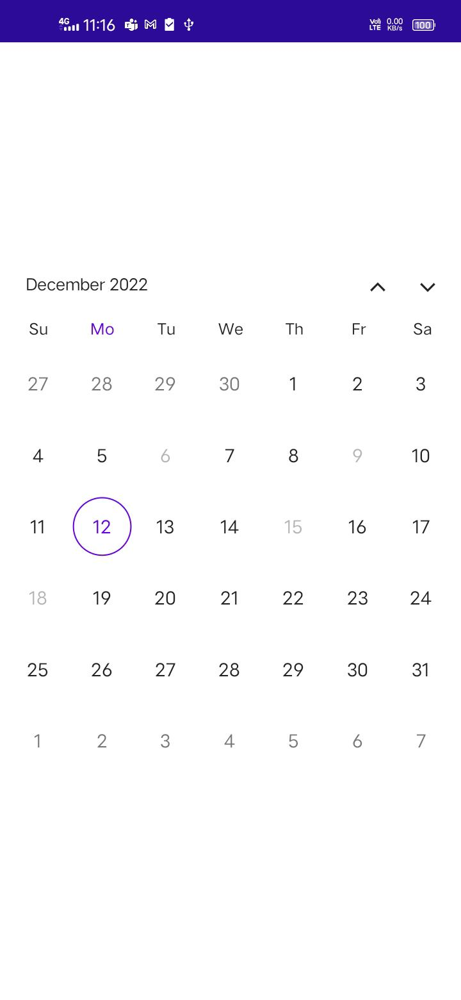

* **Highlight weekends and special dates**: Can highlight any special dates or every weekend in a month using different background color and textstyles in MAUI Calendar.

   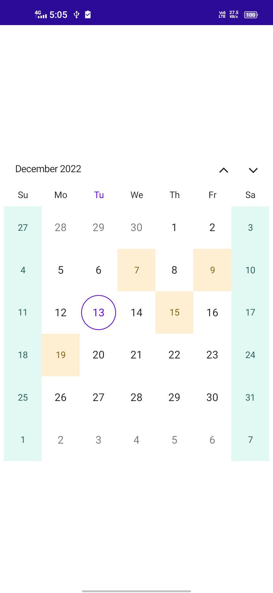

* **Right to left (RTL)**: The Calendar's text direction can be changed by using the Right-to-left property. Enables user to work with RTL languages, such as Hebrew and Arabic.

   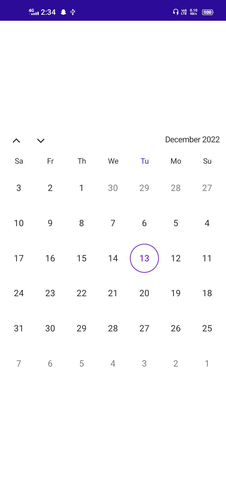

* **Globalization**: Displays the current date and time based on the globalized date and time formats. You can able to change the culture of the calendar.

   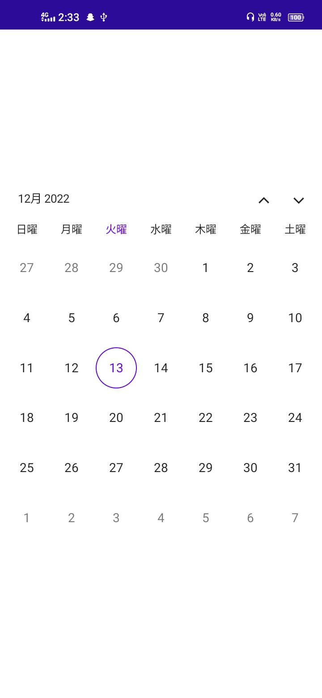
