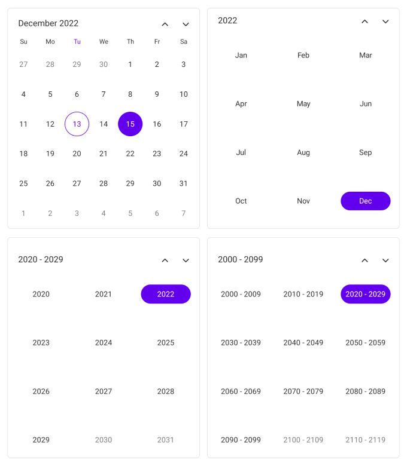
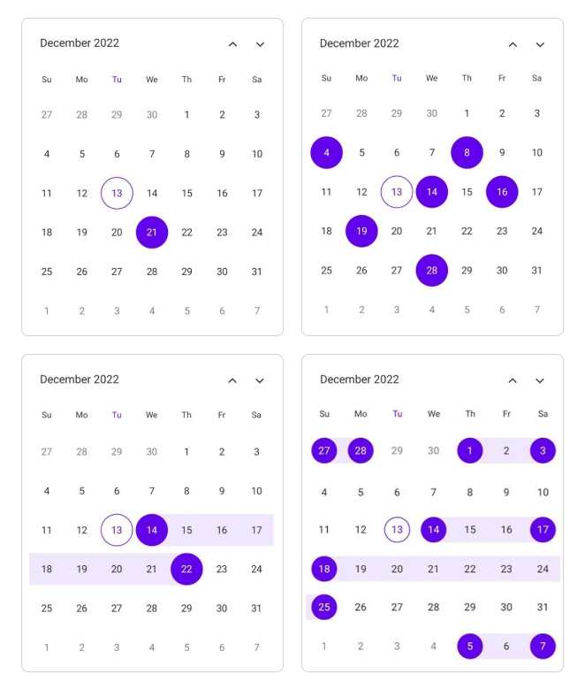
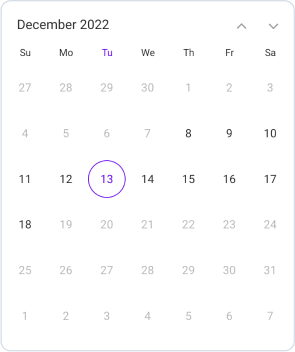
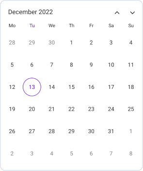
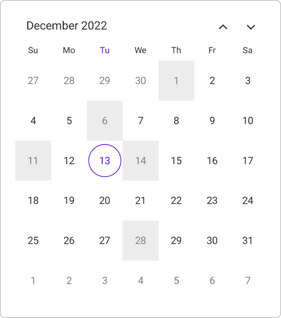
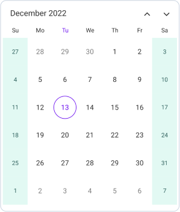
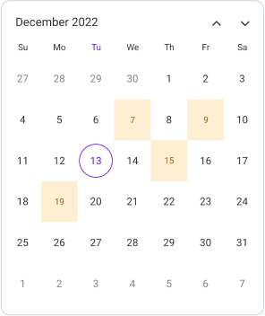
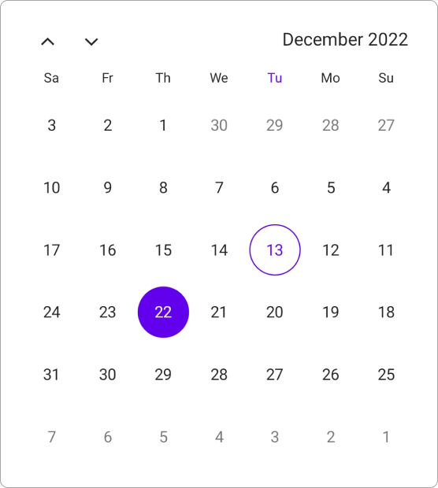
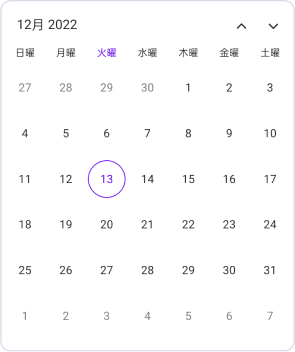

**Notice**: After **Volume 1 2025 (Mid of March 2025)**, updates, bug fixes, and feature enhancements for this control will no longer be available in the Syncfusion package. Please switch to the **Syncfusion Toolkit for .NET MAUI** for continued support. For a smooth transition refer this [migration document](https://help.syncfusion.com/maui-toolkit/migration).

# Overview of .NET MAUI Calendar (SfCalendar)

Syncfusion .NET MAUI Calendar (SfCalendar) is a calendar control that allows users to select a Single date, Multiple dates, or a Range of dates. It provides various view options such as a Month, Year, Decade, and Century, which allow users to quickly navigate to the desired date. It also supports minimum dates, maximum dates, enable past dates, and disabled dates to restrict the date selection.

## Key features

* **Multiple calendar view modes**: For selection and navigation, use Month, Year, Decade, and Century calendar views.

   

* **Quick navigation**: You can easily navigate to the desired date using different calendar views in the `SfCalendar`.

* **Enable and disable built-in view switching**: Restricts or enables navigation to different calendar views using interaction.

   

* **Date selection**: Date selection allows you to select a Single date, Multiple dates, Range of dates, or a Multiple range of dates by interaction or programmatic selection.

   

* **Limit date selection**: Restricts interaction and navigation beyond the specified minimum and maximum dates.

   

* **Change first day of week**: You can customize the starting day of the week. The default first day of the week is Sunday.

   

* **Selectable day predicate**: Disable the interaction for calendar view dates and easily prevent the selection of weekends by disabling them.

   

* **Highlight weekends and special dates**: In MAUI Calendar, you can highlight special dates and weekend dates in the month view using different background colors and text styles.

   

   

* **Right to left (RTL)**: The Calendars' text direction can be changed by using the `Right-to-left` property. Enables the user to work with RTL languages, such as Hebrew and Arabic.

   

* **Globalization**: Displays the current date and time based on the globalized date and time formats.

   
