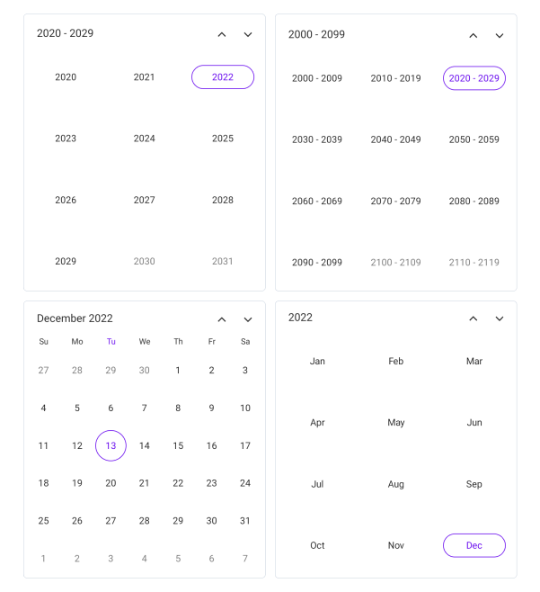
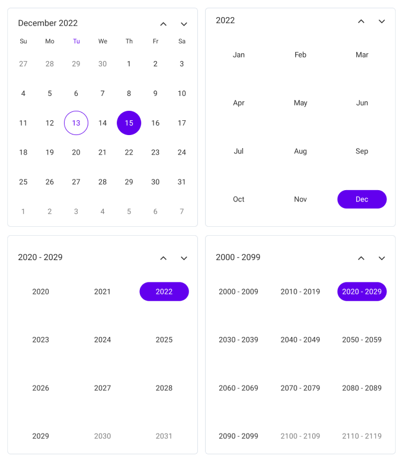
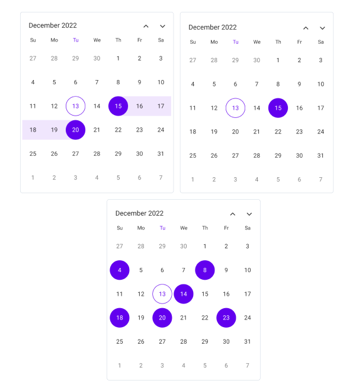
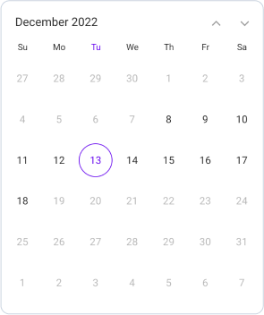
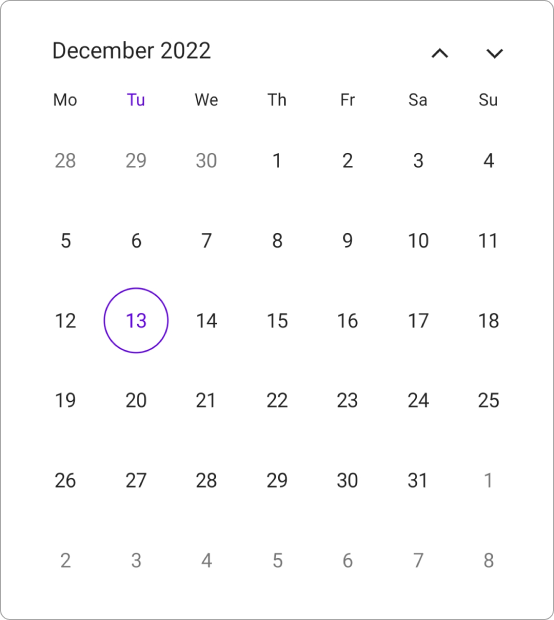
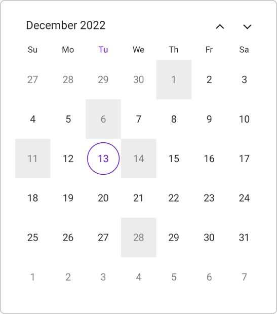
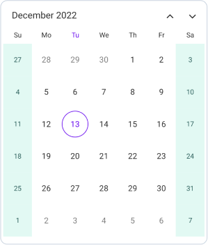
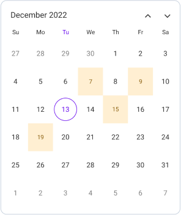
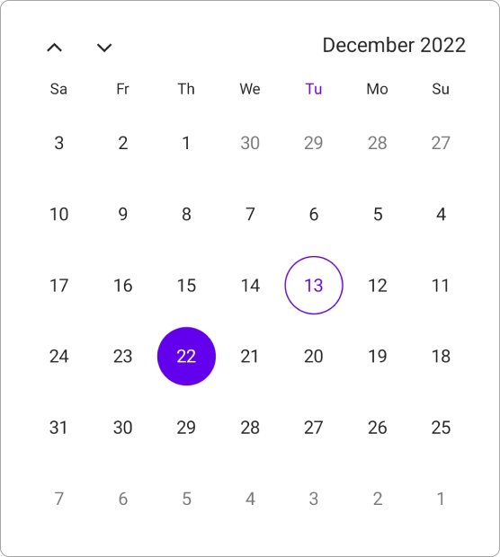
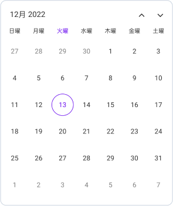

> **Notice**: After **Volume 1 2025 (Mid of March 2025)**, feature enhancements for this control will no longer be available in the Syncfusion&reg; package. Please switch to the **Syncfusion Toolkit for .NET MAUI** for continued support. For a smooth transition refer this [migration document](https://help.syncfusion.com/maui-toolkit/migration).

# Overview of .NET MAUI Calendar (SfCalendar)

- The Syncfusion&reg; .NET MAUI Calendar (SfCalendar) control enables users to **select and navigate dates efficiently** using multiple calendar views.

- It supports single, multiple, and range date selection and provides different navigation levels such as **Month, Year, Decade, and Century**, making it easy to work with date-based inputs in applications.

## Control Highlights

- Select single, multiple, or range of dates  
- Navigate easily across Month, Year, Decade, and Century views  
- Restrict date selection using minimum and maximum limits  
- Highlight important dates such as weekends and special days  
- Customize calendar behavior and navigation options 

## Key Features

- **Multiple Calendar View Modes** – Switch between Month, Year, Decade, and Century views for easy navigation  

   

- **Quick Navigation** – Navigate to specific dates quickly using hierarchical calendar views  

- **View Switching Control** – Enable or restrict navigation between calendar views based on interaction  

   

- **Date Selection Modes** – Select Single, Multiple, Range, or Multiple Range of dates through user interaction or programmatically  

   

- **Limit Date Selection** – Restrict navigation and selection using minimum and maximum date values  

   

- **First Day of the Week** – Customize the starting day of the week based on regional or application preferences  

   

- **Selectable Day Predicate** – Disable specific dates (such as weekends or holidays) to control user interaction  

   

- **Highlight Weekends & Special Dates** – Visually distinguish weekends and custom dates using styles and colors 

   

   

## Globalization

- Supports right-to-left (RTL) layouts for languages like Arabic and Hebrew  

   

- Displays dates and calendar formats based on regional and cultural settings  

   

## Real-World Scenarios

- Booking and appointment selection systems  
- Travel and scheduling applications  
- Form-based date inputs (single or range selection)  
- Business applications requiring date filtering and tracking  

## Related Controls

- **Scheduler** – Manage appointments and time-based events  
- **DatePicker / DateTimePicker** – Provide simplified date input selection  
- **DataForm** – Use calendar inputs within form-based data entry  
- **DataGrid** – Display date-based data in tabular scenarios  

## Next Steps

Explore further:

- [Getting Started](https://help.syncfusion.com/maui-toolkit/calendar/getting-started)  
- [Customization Options](https://help.syncfusion.com/maui/calendar/customizations)
- [Selection Guide](https://help.syncfusion.com/maui/calendar/selections) 

## Learning & Demos

<!-- Card 1 -->

<h3 class="form-title">Explore Blogs
<a href="https://www.syncfusion.com/blogs/category/net-maui"
              target="_blank"
              class="source-icon"
              title="View Source">
<svg xmlns="http://www.w3.org/2000/svg"
                    width="18"
                    height="18"
                    fill="currentColor"
                    viewBox="0 0 16 16">
<path d="M8 0C3.58 0 0 3.58 0 8c0 3.54 2.29 6.53 5.47 7.59.4.07.55-.17.55-.38
                   0-.19-.01-.82-.01-1.49-2.01.37-2.53-.49-2.69-.94-.09-.23-.48-.94-.82-1.13-.28-.15-.68-.52
                   -.01-.53.63-.01 1.08.58 1.23.82.72 1.21 1.87.87 2.33.66.07-.52.28-.87.51-1.07
                   -1.78-.2-3.64-.89-3.64-3.95 0-.87.31-1.59.82-2.15-.08-.2-.36-1.02.08-2.12
                   0 0 .67-.21 2.2.82a7.56 7.56 0 0 1 2-.27c.68 0 1.36.09 2 .27 1.53-1.04
                   2.2-.82 2.2-.82.44 1.1.16 1.92.08 2.12.51.56.82 1.27.82 2.15
                   0 3.07-1.87 3.75-3.65 3.95.29.25.54.73.54 1.48
                   0 1.07-.01 1.93-.01 2.2 0 .21.15.46.55.38A8.013 8.013 0 0 0 16 8
                   c0-4.42-3.58-8-8-8z"/>
</svg>
</a>
</h3>

              Read insights, tutorials, and developer journeys.

<!-- Card 2 -->

<h3 class="form-title">Explore KB's
<a href="https://support.syncfusion.com/kb/cross-platforms/category/76"
              target="_blank"
              class="source-icon"
              title="View Source">
<svg xmlns="http://www.w3.org/2000/svg"
                    width="18"
                    height="18"
                    fill="currentColor"
                    viewBox="0 0 16 16">
<path d="M8 0C3.58 0 0 3.58 0 8c0 3.54 2.29 6.53 5.47 7.59.4.07.55-.17.55-.38
                   0-.19-.01-.82-.01-1.49-2.01.37-2.53-.49-2.69-.94-.09-.23-.48-.94-.82-1.13-.28-.15-.68-.52
                   -.01-.53.63-.01 1.08.58 1.23.82.72 1.21 1.87.87 2.33.66.07-.52.28-.87.51-1.07
                   -1.78-.2-3.64-.89-3.64-3.95 0-.87.31-1.59.82-2.15-.08-.2-.36-1.02.08-2.12
                   0 0 .67-.21 2.2.82a7.56 7.56 0 0 1 2-.27c.68 0 1.36.09 2 .27 1.53-1.04
                   2.2-.82 2.2-.82.44 1.1.16 1.92.08 2.12.51.56.82 1.27.82 2.15
                   0 3.07-1.87 3.75-3.65 3.95.29.25.54.73.54 1.48
                   0 1.07-.01 1.93-.01 2.2 0 .21.15.46.55.38A8.013 8.013 0 0 0 16 8
                   c0-4.42-3.58-8-8-8z"/>
</svg>
</a>
</h3>

               Find quick solutions and step‑by‑step guidance.

<!-- card 3 -->

<h3 class="form-title">Feature Tour
<a href="https://www.syncfusion.com/maui-controls/maui-calendar"
              target="_blank"
              class="source-icon"
              title="View Source">
<svg xmlns="http://www.w3.org/2000/svg"
                    width="18"
                    height="18"
                    fill="currentColor"
                    viewBox="0 0 16 16">
<path d="M8 0C3.58 0 0 3.58 0 8c0 3.54 2.29 6.53 5.47 7.59.4.07.55-.17.55-.38
                   0-.19-.01-.82-.01-1.49-2.01.37-2.53-.49-2.69-.94-.09-.23-.48-.94-.82-1.13-.28-.15-.68-.52
                   -.01-.53.63-.01 1.08.58 1.23.82.72 1.21 1.87.87 2.33.66.07-.52.28-.87.51-1.07
                   -1.78-.2-3.64-.89-3.64-3.95 0-.87.31-1.59.82-2.15-.08-.2-.36-1.02.08-2.12
                   0 0 .67-.21 2.2.82a7.56 7.56 0 0 1 2-.27c.68 0 1.36.09 2 .27 1.53-1.04
                   2.2-.82 2.2-.82.44 1.1.16 1.92.08 2.12.51.56.82 1.27.82 2.15
                   0 3.07-1.87 3.75-3.65 3.95.29.25.54.73.54 1.48
                   0 1.07-.01 1.93-.01 2.2 0 .21.15.46.55.38A8.013 8.013 0 0 0 16 8
                   c0-4.42-3.58-8-8-8z"/>
</svg>
</a>
</h3>

               Walk through highlights and core capabilities.

<!-- card 4 -->

<h3 class="form-title">Showcase Demos
<a href="https://github.com/syncfusion/maui-demos/tree/master/MAUI/Calendar"
              target="_blank"
              class="source-icon"
              title="View Source">
<svg xmlns="http://www.w3.org/2000/svg"
                    width="18"
                    height="18"
                    fill="currentColor"
                    viewBox="0 0 16 16">
<path d="M8 0C3.58 0 0 3.58 0 8c0 3.54 2.29 6.53 5.47 7.59.4.07.55-.17.55-.38
                   0-.19-.01-.82-.01-1.49-2.01.37-2.53-.49-2.69-.94-.09-.23-.48-.94-.82-1.13-.28-.15-.68-.52
                   -.01-.53.63-.01 1.08.58 1.23.82.72 1.21 1.87.87 2.33.66.07-.52.28-.87.51-1.07
                   -1.78-.2-3.64-.89-3.64-3.95 0-.87.31-1.59.82-2.15-.08-.2-.36-1.02.08-2.12
                   0 0 .67-.21 2.2.82a7.56 7.56 0 0 1 2-.27c.68 0 1.36.09 2 .27 1.53-1.04
                   2.2-.82 2.2-.82.44 1.1.16 1.92.08 2.12.51.56.82 1.27.82 2.15
                   0 3.07-1.87 3.75-3.65 3.95.29.25.54.73.54 1.48
                   0 1.07-.01 1.93-.01 2.2 0 .21.15.46.55.38A8.013 8.013 0 0 0 16 8
                   c0-4.42-3.58-8-8-8z"/>
</svg>
</a>
</h3>

                Discover polished real‑world app scenarios.

