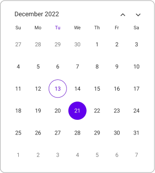
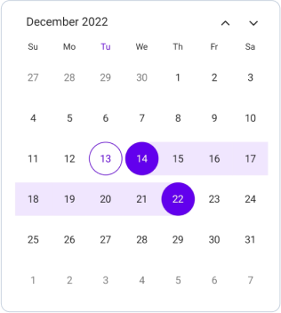
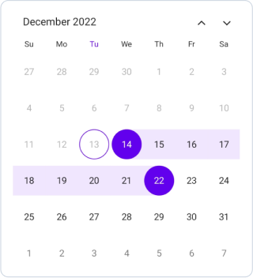
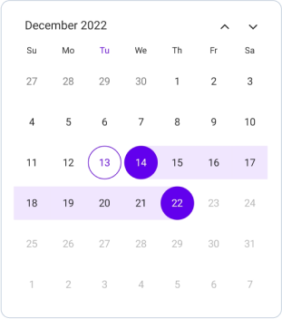
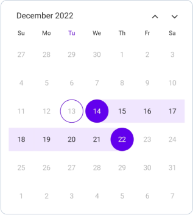
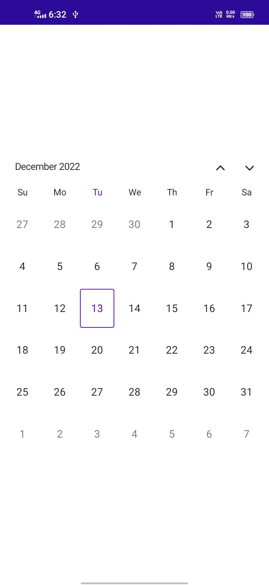

# Selections in MAUI Calendar (SfCalendar)
The Selection mode is specified in the Calendar property enumeration. You can select the dates by tapping the cell in the calendar. `SfCalendar` provides three types of modes such as `Single`, `Multiple`, and `Range` Selection. The default [SelectionMode](https://help.syncfusion.com/cr/maui/Syncfusion.Maui.Calendar.SfCalendar.html#Syncfusion_Maui_Calendar_SfCalendar_SelectionMode) is Single, which allows the user to select only one date at a time.

>**NOTE** You can select the cells in the Year, Decade, and Century views in the calendar only when the `AllowViewNavigation` property is set to false.

## Single selection
The `Single` selection can be performed in the Calendar by setting the `CalendarSelectionMode` property to `Single`. In this selection, you can select a single date from the cell.




<calendar:SfCalendar  x:Name="Calendar" 
                        View="Month"
                        SelectionMode="Single">
</calendar:SfCalendar>




this.Calendar.SelectionMode = CalendarSelectionMode.Single;






>**NOTE**
* In the Year, Decade, and Century views, you can select the cells, only when the `AllowViewNavigation` property is set to false.
* In this scenario, the `selection changed` callback will return the first date of the month, year, decade or century of the selected cell.
Eg: 
* In the year view, when the Dec month cell is selected then the selected date value will be 01-12-2022.
* In the decade view, when the (2022) year cell is selected then the selected date value will be 01-01-2022.
* In the century view, when the (2020-2029) decade cell is selected then the selected date value will be 01-01-2020.

## Multiple selection
The `Multiple` selection can be performed in the Calendar by setting the `CalendarSelectionMode` property to `Multiple`. In this selection, you can select multiple dates from the cell. If you want to remove the selected cell, click the same cell again.




<calendar:SfCalendar  x:Name="Calendar" 
                        View="Month"
                        SelectionMode="Multiple">
</calendar:SfCalendar>




this.Calendar.SelectionMode = CalendarSelectionMode.Multiple;




## Range selection
The `Range` selection can be performed in the Calendar by setting the `CalendarSelectionMode` property to `Range`. In this Selection, you can able to select a range of dates from the cell by interacting the cell either tap or swipe action. Swipe action can only performed by setting the [enableSwipeSelection] property to `true` in the calendar.




<calendar:SfCalendar  x:Name="Calendar" 
                        View="Month"
                        SelectionMode="Range">
</calendar:SfCalendar>




this.Calendar.SelectionMode = CalendarSelectionMode.Range;




>**NOTE**
* In the Year, Decade and Century views can able to select the cells, only when the `allowViewNavigation` property is set to false.
* In this scenario, the `selection changed` callback will return the first  and last date of the month, year, decade or century of the selected cell when the seletionmodeis set to `range `.
Eg: 
* In the year view, when the range is selected as Sep - Dec, then the range value will be 01-09-2022 to 31-12-2022.
* In the decade view, when the range is selected as 2022 - 2025, then the range value will be 01-01-2022 to 31-12-2025.
* In the century view, when the range is selected as 2020-2029 to 2030-2039, then the range value will be 01-01-2020 to 31-12-2039.

### Range selection direction
The Range Selection Direction is specified in the calendar property enumeration, which is used to select the range based on the direction. The `RangeSelectionDirection` provides five types of direction such as `Default`, `Forward`, `Backward`, `Both`, and `None`. The default [RangeSelectionDirection](https://help.syncfusion.com/cr/maui/Syncfusion.Maui.Calendar.SfCalendar.html#Syncfusion_Maui_Calendar_SfCalendar_RangeSelectionDirection) is `Default` in the SfCalendar.

#### Range selection direction - forward
If you set the `RangeSelectionDirection` property to `Forward`, you can select only the dates after the selected range start date, while dates before the range start date are considered disabled. The start date will not be changed.




<calendar:SfCalendar  x:Name="Calendar" 
                        View="Month"
                        SelectionMode="Range"
                        RangeSelectionDirection="Forward">
</calendar:SfCalendar>




this.Calendar.SelectionMode = CalendarSelectionMode.Range;
this.Calendar.RangeSelectionDirection = CalendarRangeSelectionDirection.Forward;




#### Range selection direction - backward
If you set the `RangeSelectionDirection` property to `Backward`, you can select only the dates before the selected range end date, while dates after the range end date are considered disabled. The end date will not be changed.




<calendar:SfCalendar  x:Name="Calendar" 
                        View="Month"
                        SelectionMode="Range"
                        RangeSelectionDirection="Backward">
</calendar:SfCalendar>




this.Calendar.SelectionMode = CalendarSelectionMode.Range;
this.Calendar.RangeSelectionDirection = CalendarRangeSelectionDirection.Backward;




#### Range Selection Direction - Both
If you set the `RangeSelectionDirection` property to `Both`, you can extend the selection from the selected range. Then, the tapped date is considered based on the (if the date is nearby the start date, then the start date is updated, else if the date is nearby the end date, then the end date is updated, else if in-between the start and end date and both have the same distance, then the start date is updated).




<calendar:SfCalendar  x:Name="Calendar" 
                        View="Month"
                        SelectionMode="Range"
                        RangeSelectionDirection="Both">
</calendar:SfCalendar>




this.Calendar.SelectionMode = CalendarSelectionMode.Range;
this.Calendar.RangeSelectionDirection = CalendarRangeSelectionDirection.Both;




#### Range selection direction - none
If you set the `RangeSelectionDirection` property to `None`, you can select only the single range, while dates after the range end date and before the start date are considered disabled. It will remain in the initial range.




<calendar:SfCalendar  x:Name="Calendar" 
                        View="Month"
                        SelectionMode="Range"
                        RangeSelectionDirection="None">
</calendar:SfCalendar>




this.Calendar.SelectionMode = CalendarSelectionMode.Range;
this.Calendar.RangeSelectionDirection = CalendarRangeSelectionDirection.None;




## Selection shape
The Selected date will render based on the `SelectionShape` property. The default [SelectionShape](https://help.syncfusion.com/cr/maui/Syncfusion.Maui.Calendar.SfCalendar.html#Syncfusion_Maui_Calendar_SfCalendar_SelectionShape) is `Circle`. You can customize the selection shape either `Rectangle` or `Circle`.




<calendar:SfCalendar  x:Name="Calendar"
                      View="Month"
                      SelectionShape="Rectangle">
</calendar:SfCalendar>




this.Calendar.SelectionShape = CalendarSelectionShape.Rectangle;




## Enable swipe selection
You can select the dates by swiping using the `EnableSwipeSelection` property. By default, [EnableSwipeSelection](https://help.syncfusion.com/cr/maui/Syncfusion.Maui.Calendar.SfCalendar.html#Syncfusion_Maui_Calendar_SfCalendar_EnableSwipeSelection) property is false.




<calendar:SfCalendar  x:Name="Calendar"
                      View="Month"
                      EnableSwipeSelection="true">
</calendar:SfCalendar>




this.Calendar.EnableSwipeSelection = true;




## Toggle day selection
You can deselect the date by using the `CanToggleDaySelection` property. By default, [CanToggleDaySelection](https://help.syncfusion.com/cr/maui/Syncfusion.Maui.Calendar.SfCalendar.html#Syncfusion_Maui_Calendar_SfCalendar_CanToggleDaySelection) property is false.




<calendar:SfCalendar  x:Name="Calendar"
                      View="Month"
                      CanToggleDaySelection="true">
</calendar:SfCalendar>




this.Calendar.CanToggleDaySelection = true;


