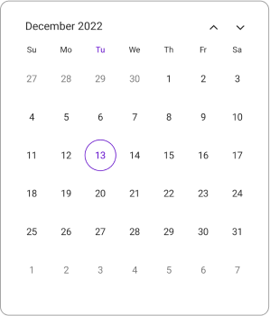
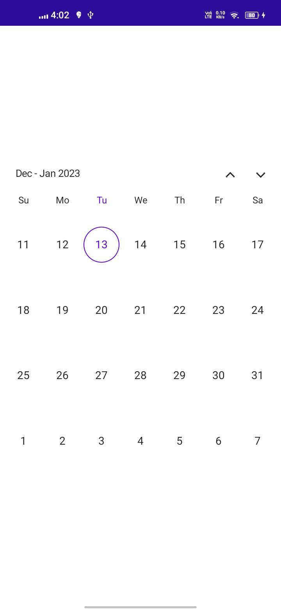
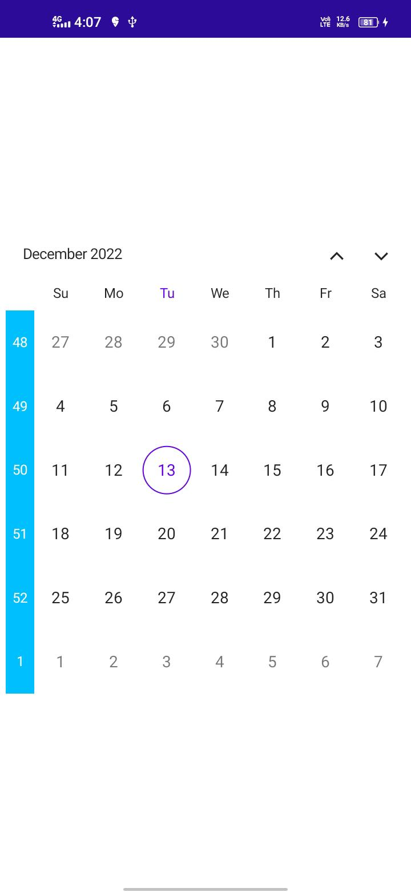
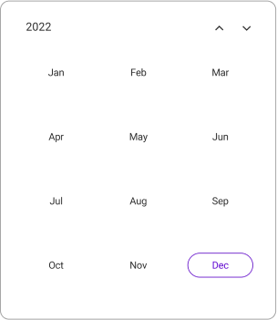
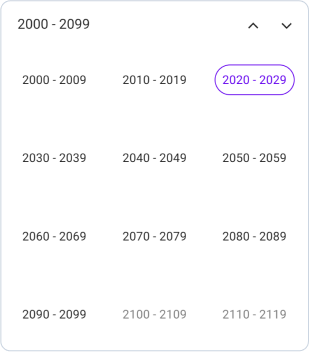

# Multiple Calendar Views in MAUI (SfCalendar)
The `SfCalendar` widget has four Calendar views to display. It can be assigned to the widget by using the `View` property. `Month` view is initially rendered by Default. The current date will be displayed initially for all the Calendar views.

## Month view
The Month view displays the current month days, and usually a few days of previous and next month. By default, initially displays the current month dates and the current date is highlighted by a separate color different from the rest of the dates color in `Month` view.









this.Calendar.View = CalendarView.Month;




### Number Of Visible Weeks view
In the month view, number of visible weeks can be customized by using the `NumberOfVisibleWeeks` property in the Calendar. By default, Month view displays with the NumberOfVisibleWeeks as `6`.

The following code shows the Calendar month view with `NumberOfVisibleWeeks` is `4`.




<calendar:SfCalendar  x:Name="Calendar"
                      View="Month">
                      <Calendar:SfCalendar.MonthView>
                        <Calendar:CalendarMonthView NumberOfVisibleWeeks = 4/>
                      </Calendar:SfCalendar.MonthView>                    
</calendar:SfCalendar>




this.Calendar.MonthView = new CalendarMonthView()
{
    NumberOfVisibleWeeks = 4,
};




### Week number
It displays week number for the current view dates in the month view by setting the `ShowWeekNumber` property. By default, the ShowWeekNumber is `false`. If you need to show the week number in the month view by setting the ShowWeekNumber as true. Week numbers will be displayed based on the ISO standard.




<calendar:SfCalendar  x:Name="Calendar" View="Month"> 
                      <Calendar:SfCalendar.MonthView>
                        <Calendar:CalendarMonthView ShowWeekNumber="True"/>
                      </Calendar:SfCalendar.MonthView>>
</calendar:SfCalendar>




this.Calendar.MonthView = new CalendarMonthView()
{
    ShowWeekNumber = true,
};




#### Week number appearance
Week number Background and TextStyle can be customized in the month view. Background color can be changed by using the [Background] property and the textStyle can be changed by using the [TextStyle] property.




<calendar:SfCalendar  x:Name="Calendar"  View="Month">
            <Calendar:SfCalendar.MonthView>
                <Calendar:CalendarMonthView ShowWeekNumber="True">
                    <Calendar:CalendarMonthView.WeekNumberStyle>
                        <Calendar:CalendarWeekNumberStyle Background="DeepSkyBlue">
                            <Calendar:CalendarWeekNumberStyle.TextStyle>
                                <Calendar:CalendarTextStyle TextColor="White" FontSize="12" />
                            </Calendar:CalendarWeekNumberStyle.TextStyle>
                        </Calendar:CalendarWeekNumberStyle>
                    </Calendar:CalendarMonthView.WeekNumberStyle>
                </Calendar:CalendarMonthView>
            </Calendar:SfCalendar.MonthView>
</calendar:SfCalendar>




this.Calendar.MonthView = new CalendarMonthView()
{
    ShowWeekNumber = true,
};

CalendarTextStyle textStyle = new CalendarTextStyle()
{
    TextColor = Colors.Black,
    FontSize = 12,
};

this.Calendar.MonthView.WeekNumberStyle = new CalendarWeekNumberStyle()
{
    Background = Colors.DeepSkyBlue,
    TextStyle = textStyle,
};




## Year view
The Year view displays the current year's month. A calendar year is a one-year period that begins on January 1 and ends on December 31. By default, initially displays the current years month and the current month is highlighted by a separate color different from the rest of the month color in `Year` view. Can easily navigate to the desired month dates from the year view.




<calendar:SfCalendar  x:Name="Calendar" 
                        View="Year">
</calendar:SfCalendar>




this.Calendar.View = CalendarView.Year;




## Decade view
The Decade view displays the period of ten years and some years of next view. By default, initially displays the current year view and the current year is highlighted by a separate color different from the rest of the years color in `Decade` view. Can easily navigate to the desired year in the Year view from the decade view.




<calendar:SfCalendar  x:Name="Calendar" 
                        View="Decade">
</calendar:SfCalendar>




this.Calendar.View = CalendarView.Deacde;




## Century view
The Century view displays the period of hundred years and some years of next view. By default, initially displays the current range of years and the current year range is highlighted by a separate color different from the rest of the years color in `Century` view. Can easily navigate to the Decade view from the Century view.




<calendar:SfCalendar  x:Name="Calendar" 
                        View="Century">
</calendar:SfCalendar>




this.Calendar.View = CalendarView.Century;




