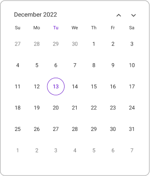
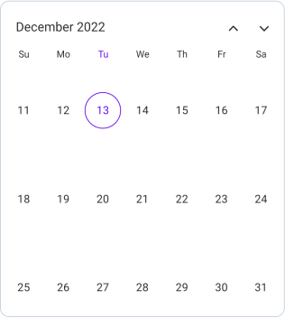
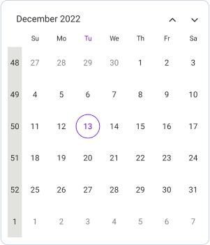
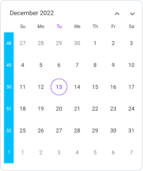
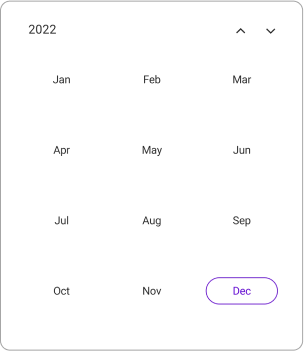
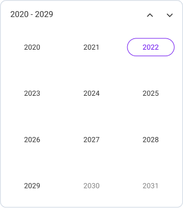
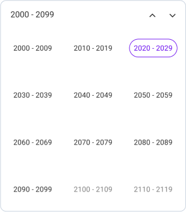

# Multiple Calendar Views in .NET MAUI (SfCalendar)
The `SfCalendar` control has four Calendar views to display. It can be assigned to the control by using the [View](https://help.syncfusion.com/cr/maui/Syncfusion.Maui.Calendar.SfCalendar.html#Syncfusion_Maui_Calendar_SfCalendar_View) property. By default, the `Month` view is initially rendered. The current date will be displayed initially for all the Calendar views.

## Month view
The Month view displays the current month days, and usually a few days of previous and next month. By default, initially displays the current month dates and the current date is highlighted by a separate color different from the rest of the dates color in `Month` view.




<calendar:SfCalendar  x:Name="calendar" 
                        View="Month">
</calendar:SfCalendar>




this.calendar.View = CalendarView.Month;




### Number of visible weeks view
The number of visible weeks in the month view can be customized by using the [NumberOfVisibleWeeks](https://help.syncfusion.com/cr/maui/Syncfusion.Maui.Calendar.CalendarMonthView.html#Syncfusion_Maui_Calendar_CalendarMonthView_NumberOfVisibleWeeks) property in the Calendar. By default, the Month view displays with the NumberOfVisibleWeeks as `6`.

The following code explains how to show the Calendar month view with `NumberOfVisibleWeeks` as `3`.




<calendar:SfCalendar  x:Name="calendar"
                      View="Month">
                      <Calendar:SfCalendar.MonthView>
                        <Calendar:CalendarMonthView NumberOfVisibleWeeks = 3/>
                      </Calendar:SfCalendar.MonthView>
</calendar:SfCalendar>




this.calendar.MonthView.NumberOfVisibleWeeks = 3;




### Week number
By setting the `ShowWeekNumber` property, it displays the week number for the current view dates in the month view. By default, the [ShowWeekNumber](https://help.syncfusion.com/cr/maui/Syncfusion.Maui.Calendar.CalendarMonthView.html#Syncfusion_Maui_Calendar_CalendarMonthView_ShowWeekNumber) is set to `false`. The week numbers will be displayed based on the ISO standard.




<calendar:SfCalendar  x:Name="calendar" View="Month"> 
                      <Calendar:SfCalendar.MonthView>
                        <Calendar:CalendarMonthView ShowWeekNumber="True"/>
                      </Calendar:SfCalendar.MonthView>>
</calendar:SfCalendar>




this.calendar.MonthView.ShowWeekNumber = true;




#### Week number appearance
Week number Background and TextStyle can be customized in the month view. Background color can be changed by using the [Background](https://help.syncfusion.com/cr/maui/Syncfusion.Maui.Calendar.CalendarWeekNumberStyle.html#Syncfusion_Maui_Calendar_CalendarWeekNumberStyle_Background) property and the textStyle can be changed by using the [TextStyle](https://help.syncfusion.com/cr/maui/Syncfusion.Maui.Calendar.CalendarWeekNumberStyle.html#Syncfusion_Maui_Calendar_CalendarWeekNumberStyle_TextStyle) property.




<calendar:SfCalendar  x:Name="calendar"  View="Month">
            <Calendar:SfCalendar.MonthView>
                <Calendar:CalendarMonthView ShowWeekNumber="True">
                    <Calendar:CalendarMonthView.WeekNumberStyle>
                        <Calendar:CalendarWeekNumberStyle Background="DeepSkyBlue">
                            <Calendar:CalendarWeekNumberStyle.TextStyle>
                                <Calendar:CalendarTextStyle TextColor="White" FontSize="12" />
                            </Calendar:CalendarWeekNumberStyle.TextStyle>
                        </Calendar:CalendarWeekNumberStyle>
                    </Calendar:CalendarMonthView.WeekNumberStyle>
                </Calendar:CalendarMonthView>
            </Calendar:SfCalendar.MonthView>
</calendar:SfCalendar>




CalendarTextStyle textStyle = new CalendarTextStyle()
{
    TextColor = Colors.Black,
    FontSize = 12,
};

this.calendar.MonthView = new CalendarMonthView()
{
    ShowWeekNumber = true,
    WeekNumberStyle = new CalendarWeekNumberStyle()
    {
        Background = Colors.DeepSkyBlue,
        TextStyle = textStyle,
    }
};




## Year view
The Year view displays the current year's month. A calendar year is a one-year period that begins on January 1 and ends on December 31. By default, displays the current year's month and the current month is highlighted by a separate color that is different from the rest of the month color in the `Year view`. You can easily navigate to the desired month dates from the year view.




<calendar:SfCalendar  x:Name="calendar" 
                        View="Year">
</calendar:SfCalendar>




this.calendar.View = CalendarView.Year;




## Decade view
The Decade view shows the period of ten years and some years ahead. By default, it displays the current year view, with the current year highlighted in a different color than the other years in the `Decade view`. From the decade view, you can easily navigate to the desired year in the Year view.




<calendar:SfCalendar  x:Name="calendar" 
                        View="Decade">
</calendar:SfCalendar>




this.calendar.View = CalendarView.Deacde;




## Century view
The Century view displays the period of hundred years and some years ahead. By default, displays the current range of years, and the current year range is highlighted by a separate color different from the rest of the years' color in the `Century view`. You can easily navigate to the Decade view from the Century view.




<calendar:SfCalendar  x:Name="calendar" 
                        View="Century">
</calendar:SfCalendar>




this.calendar.View = CalendarView.Century;




## Autofit
Autofit dynamically adjusts the row height based on the number of weeks in the current month. It is applicable only in the `Month view` when the [ShowTrailingAndLeadingDates](https://help.syncfusion.com/cr/maui/Syncfusion.Maui.Calendar.SfCalendar.html?tabs=tabid-6%2Ctabid-12%2Ctabid-18%2Ctabid-50%2Ctabid-10%2Ctabid-8%2Ctabid-14%2Ctabid-4%2Ctabid-22%2Ctabid-26%2Ctabid-24%2Ctabid-16%2Ctabid-2%2Ctabid-20#Syncfusion_Maui_Calendar_SfCalendar_ShowTrailingAndLeadingDates) property is set to `false`, and the [Mode](https://help.syncfusion.com/cr/maui/Syncfusion.Maui.Calendar.SfCalendar.html#Syncfusion_Maui_Calendar_SfCalendar_Mode) property is set to [Dialog](https://help.syncfusion.com/cr/maui/Syncfusion.Maui.Calendar.CalendarMode.html#Syncfusion_Maui_Calendar_CalendarMode_Dialog) or [RelativeDialog](https://help.syncfusion.com/cr/maui/Syncfusion.Maui.Calendar.CalendarMode.html#Syncfusion_Maui_Calendar_CalendarMode_RelativeDialog).

N>
Autofit is Not applicable when
* [NumberOfVisibleWeeks](https://help.syncfusion.com/cr/maui/Syncfusion.Maui.Calendar.CalendarMonthView.html?tabs=tabid-2#Syncfusion_Maui_Calendar_CalendarMonthView_NumberOfVisibleWeeks) is less than 6.
* [PopupHeight](https://help.syncfusion.com/cr/maui/Syncfusion.Maui.Calendar.SfCalendar.html?tabs=tabid-6%2Ctabid-12%2Ctabid-18%2Ctabid-50%2Ctabid-10%2Ctabid-8%2Ctabid-14%2Ctabid-4%2Ctabid-22%2Ctabid-26%2Ctabid-24%2Ctabid-16%2Ctabid-2%2Ctabid-20#Syncfusion_Maui_Calendar_SfCalendar_PopupHeight) is less than 0.
* [ShowTrailingAndLeadingDates](https://help.syncfusion.com/cr/maui/Syncfusion.Maui.Calendar.SfCalendar.html?tabs=tabid-6%2Ctabid-12%2Ctabid-18%2Ctabid-50%2Ctabid-10%2Ctabid-8%2Ctabid-14%2Ctabid-4%2Ctabid-22%2Ctabid-26%2Ctabid-24%2Ctabid-16%2Ctabid-2%2Ctabid-20#Syncfusion_Maui_Calendar_SfCalendar_ShowTrailingAndLeadingDates) is set to true.
* [View](https://help.syncfusion.com/cr/maui/Syncfusion.Maui.Calendar.SfCalendar.html#Syncfusion_Maui_Calendar_SfCalendar_View) is set to [Year](https://help.syncfusion.com/cr/maui/Syncfusion.Maui.Calendar.CalendarView.html#Syncfusion_Maui_Calendar_CalendarView_Year), [Decade](https://help.syncfusion.com/cr/maui/Syncfusion.Maui.Calendar.CalendarView.html#Syncfusion_Maui_Calendar_CalendarView_Decade), or [Century](https://help.syncfusion.com/cr/maui/Syncfusion.Maui.Calendar.CalendarView.html#Syncfusion_Maui_Calendar_CalendarView_Century).
* [Mode](https://help.syncfusion.com/cr/maui/Syncfusion.Maui.Calendar.SfCalendar.html#Syncfusion_Maui_Calendar_SfCalendar_Mode) is in [Default](https://help.syncfusion.com/cr/maui/Syncfusion.Maui.Calendar.CalendarMode.html#Syncfusion_Maui_Calendar_CalendarMode_Default).




<Grid>
    <calendar:SfCalendar x:Name="calendar"
                     Mode="Dialog"
                     ShowTrailingAndLeadingDates="False"/>
    <Button Text="Open Calendar" 
        x:Name="calendarButton"
        Clicked="Button_Clicked"
        HorizontalOptions="Center"
        VerticalOptions="Center"
        HeightRequest="50" 
        WidthRequest="150">
    </Button>
</Grid>




private void Button_Clicked(object sender, EventArgs e)
{
    this.calendar.IsOpen = true;
}


