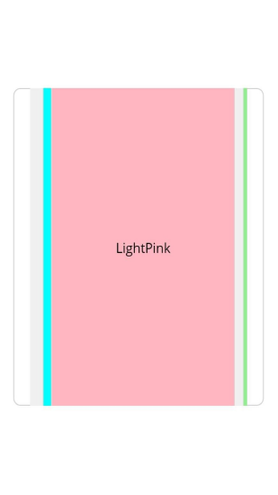
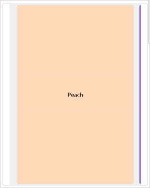
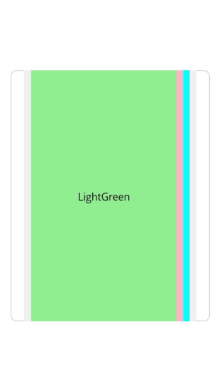
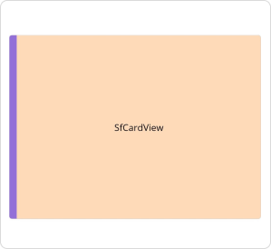

# Customization in MAUI Cards

## ShowSwipedCard

Enabling the `ShowSwipedCard` option allows the swiped cards to be displayed at the edge of the card layout.

 



<cards:SfCardLayout ShowSwipedCard="true">
</cards:SfCardLayout>
 




SfCardLayout cardLayout = new SfCardLayout()
{
  ShowSwipedCard = true
};





## VisibleIndex

The `VisibleIndex` is utilized when providing the index of the card that is intended to be displayed at the front of the card layout.

 



<cards:SfCardLayout VisibleIndex="1">
</cards:SfCardLayout>
 




SfCardLayout cardLayout = new SfCardLayout()
{
  VisibleIndex = 1
};





## SwipeDirection

The `SwipeDirection` property specifies the direction of swiping, which can be left, right, top, or bottom. Default value of swipe direction is right.

 



<cards:SfCardLayout SwipeDirection="Left">
</cards:SfCardLayout>
 




SfCardLayout cardLayout = new SfCardLayout()
{
    SwipeDirection = CardSwipeDirection.Left
};





## Customization in CardView

Customization of the border color, thickness, and card corner radius can be achieved by the following properties.

[BorderColor]() - Used to customize the card view border color.

[BorderWidth]() - Used to customize the card view border thickness.

[CornerRadius]() - Used to customize the card view corner radius.

 



<cards:SfCardView Background="#472902">
    <Grid Padding="20">
        <Grid.RowDefinitions>
            <RowDefinition Height="Auto"/>
            <RowDefinition Height="Auto"/>
            <RowDefinition Height="30"/>
            <RowDefinition Height="Auto"/>
        </Grid.RowDefinitions>
        <Label Text="Wells Fargo" HorizontalOptions="Start" TextColor="White" FontSize="20" FontAttributes="Bold"/>
        <Grid Grid.Row="1" Padding="0,20,0,15">
            <Grid.ColumnDefinitions>
                <ColumnDefinition Width="60"/>
                <ColumnDefinition Width="*"/>
            </Grid.ColumnDefinitions>
            <Image Source="cardchip.png" WidthRequest="60" HeightRequest="30" HorizontalOptions="Center" VerticalOptions="Center"/>
            <Label Grid.Column="1" Text="Business Elite" FontAttributes="Bold" TextColor="White" FontSize="17" HorizontalOptions="Start" VerticalOptions="Center" Padding="30,0,0,0"/>
        </Grid>
        <Label Grid.Row="2" HorizontalOptions="Start" VerticalOptions="End" Text="Rick Sanchez" FontSize="17" FontAttributes="Bold" TextColor="White"/>
        <Label Grid.Row="3" HorizontalOptions="Start" VerticalOptions="End" Text="9 0 5 7    4 0 8 1    2 1 7 5    0 0 5 6" TextColor="White" Padding="0,10,0,0"/>
    </Grid>
</cards:SfCardView>





	Grid mainStack = new Grid()
	{
		Children =
		{
			new SfCardView(){
			Content =  new Grid()
			{
				Padding = 20,
				Children =
				{
					new Label(){Text="Wells Fargo", HorizontalOptions=LayoutOptions.Start, TextColor=Colors.White, FontSize=20, FontAttributes=FontAttributes.Bold},
					new Grid(){
						Children=
						{
							new Image(){Source="cardchip.png", WidthRequest=60, HeightRequest=30, HorizontalOptions=LayoutOptions.Center, VerticalOptions=LayoutOptions.Center},
							new Label(){Text="Business Elite", FontAttributes=FontAttributes.Bold, TextColor=Colors.White, FontSize=17, HorizontalOptions=LayoutOptions.Center,VerticalOptions=LayoutOptions.Center ,Padding=30 }
						} },
					new Label(){HorizontalOptions=LayoutOptions.Start ,VerticalOptions=LayoutOptions.End, Text="Rick Sanchez", FontSize=17, FontAttributes=FontAttributes.Bold, TextColor=Colors.White},
					new Label(){HorizontalOptions=LayoutOptions.Start,  VerticalOptions=LayoutOptions.End, Text="9 0 5 7    4 0 8 1    2 1 7 5    0 0 5 6", TextColor=Colors.White, Padding=10},
				}
			},
			BackgroundColor = Colors.Brown
			}
		}
	};
           




### Indicator customization

Indicators are used to signify or communicate the state or level of something.

 



<cards:SfCardView IndicatorColor="LightGreen" BackgroundColor="LightGoldenrodYellow" HeightRequest="300" IndicatorThickness="12" IndicatorPosition="Left" >
    <Label  Text="SfCardView" VerticalTextAlignment="Center" HorizontalTextAlignment="Center"/>
</cards:SfCardView>





SfCardView cardView = new SfCardView() 
{     
    Content = new Label() 
    { 
        Text = "SfCardView", 
        HorizontalTextAlignment = TextAlignment.Center, 
        VerticalTextAlignment =  TextAlignment.Center
    },
    IndicatorThickness = 12,
    HeightRequest = 300,
    IndicatorPosition = IndicatorPosition.Left,
    IndicatorColor = Colors.LightGreen,
	BackgroundColor = Colors.LightGoldenrodYellow
};
           





### FadeOutOnSwiping

The `FadeOutOnSwiping` option can be enabled when the card view is intended to fade in response to swiping.

 



    <cards:SfCardView FadeOutOnSwiping="true"/>
 




SfCardView cardView = new SfCardView()
{
  FadeOutOnSwiping = true
};





N> This property won't work when adding the SfCardView as a child of SfCardLayout.

