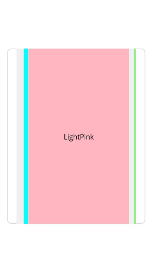
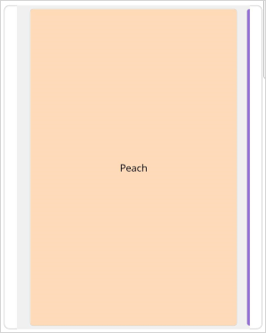
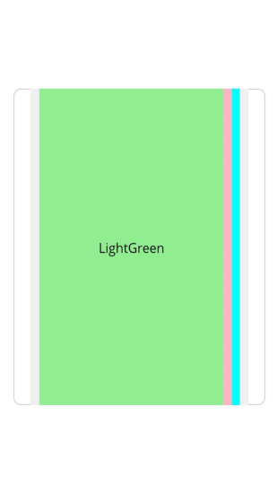
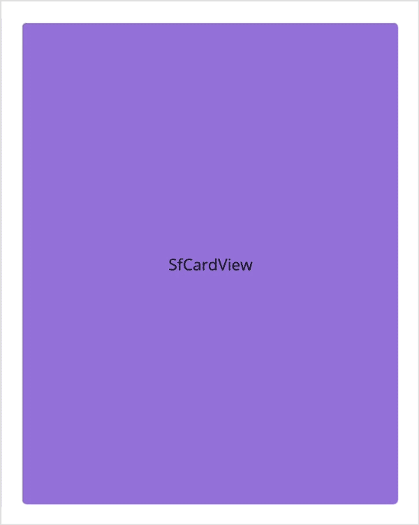
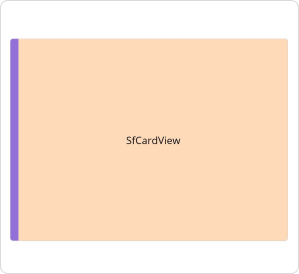

# Customization in MAUI Cards

## Define the card layout

Initialize a card layout with a card view using the provided code sample below.




<cards:SfCardLayout HeightRequest="500" BackgroundColor="#F0F0F0">

    <cards:SfCardView CornerRadius="10">
        <Label  Text="Peach" BackgroundColor="PeachPuff"/>
    </cards:SfCardView>

    <cards:SfCardView CornerRadius="10">
        <Label  Text="MediumPurple" BackgroundColor="MediumPurple"/>
    </cards:SfCardView>

    <cards:SfCardView CornerRadius="10" >
        <Label  Text="LightPink" BackgroundColor="LightPink"/>
    </cards:SfCardView>

</cards:SfCardLayout>



    SfCardLayout cardLayout = new SfCardLayout();

    //Add children for card layout 
    cardLayout.Children.Add(new SfCardView() { Content = new Label() { Text = "Peach", BackgroundColor = Colors.PeachPuff }, CornerRadius = 15 });

    cardLayout.Children.Add(new SfCardView() { Content = new Label() { Text = "MediumPurple", BackgroundColor = Colors.MediumPurple },CornerRadius = 15 });

    cardLayout.Children.Add(new SfCardView() { Content = new Label() { Text = "LightPink", BackgroundColor = Colors.LightPink },CornerRadius = 15 });

    this.Content = cardLayout;

	

The following screenshot illustrates the result of the above code.

## ShowSwipedCard

Enabling the [ShowSwipedCard](https://help.syncfusion.com/cr/maui/Syncfusion.Maui.Cards.SfCardLayout.html#Syncfusion_Maui_Cards_SfCardLayout_ShowSwipedCard) option allows the swiped cards to be displayed at the edge of the card layout.

 



<cards:SfCardLayout ShowSwipedCard="true">
</cards:SfCardLayout>
 




SfCardLayout cardLayout = new SfCardLayout()
{
  ShowSwipedCard = true
};





## VisibleIndex

The [VisibleIndex](https://help.syncfusion.com/cr/maui/Syncfusion.Maui.Cards.SfCardLayout.html#Syncfusion_Maui_Cards_SfCardLayout_VisibleIndex) is utilized when providing the index of the card that is intended to be displayed at the front of the card layout.

 



<cards:SfCardLayout VisibleIndex="1">
</cards:SfCardLayout>
 




SfCardLayout cardLayout = new SfCardLayout()
{
  VisibleIndex = 1
};





## SwipeDirection

The [SwipeDirection](https://help.syncfusion.com/cr/maui/Syncfusion.Maui.Cards.SfCardLayout.html#Syncfusion_Maui_Cards_SfCardLayout_SwipeDirection) property specifies the direction of swiping, which can be `Left`, `Right`, `Top`, or `Bottom`. Default value of `SwipeDirection` is "Right".

 



<cards:SfCardLayout SwipeDirection="Left">
</cards:SfCardLayout>
 




SfCardLayout cardLayout = new SfCardLayout()
{
    SwipeDirection = CardSwipeDirection.Left
};





## SwipeToDismiss

The [SwipeToDismiss](https://help.syncfusion.com/cr/maui/Syncfusion.Maui.Cards.SfCardView.html#Syncfusion_Maui_Cards_SfCardView_SwipeToDismiss) property enables or disables the swiping feature in SfCardView.




<cards:SfCardView SwipeToDismiss="true">
    <Label Text="SfCardView" Background="MediumPurple" HorizontalTextAlignment="Center" VerticalTextAlignment="Center"/>
</cards:SfCardView>




using Syncfusion.Maui.Cards;
. . .

public partial class MainPage : ContentPage
{
    public MainPage()
    {
        InitializeComponent();
        SfCardView cardView = new SfCardView();
        cardView.SwipeToDismiss = true;

        cardView.Content = new Label()
        {
            Text="SfCardView",
            HorizontalTextAlignment = TextAlignment.Center,
            VerticalTextAlignment = TextAlignment.Center,
            BackgroundColor = Colors.MediumPurple
        };
        this.Content = cardView;
    }
}


	

N> This property will not work when adding the SfCardView as a child of SfCardLayout.

## Dismiss the card programmatically

The [IsDismissed](https://help.syncfusion.com/cr/maui/Syncfusion.Maui.Cards.SfCardView.html#Syncfusion_Maui_Cards_SfCardView_IsDismissed) property enables you to retrieve the view state of the card, and also provides the capability for the user to programmatically modify the card's view state.




<card:SfCardView IsDismissed="true">
     <Label Text="SfCardView"/>
</card:SfCardView>




using Syncfusion.Maui.Cards;
. . .

public partial class MainPage : ContentPage
{
    public MainPage()
    {
        InitializeComponent();
        SfCardView cardView = new SfCardView();
        cardView.IsDismissed = true;
        cardView.Content = new Label(){ Text="SfCardView" };
        this.Content = cardView;
    }
}


	

## Customization in CardView

Customization of the border color, thickness, and card corner radius can be achieved by the following properties.

* [BorderColor](https://help.syncfusion.com/cr/maui/Syncfusion.Maui.Cards.SfCardView.html#Syncfusion_Maui_Cards_SfCardView_BorderColor) - Used to customize the card view border color.

* [BorderWidth](https://help.syncfusion.com/cr/maui/Syncfusion.Maui.Cards.SfCardView.html#Syncfusion_Maui_Cards_SfCardView_BorderWidth) - Used to customize the card view border thickness.

* [CornerRadius](https://help.syncfusion.com/cr/maui/Syncfusion.Maui.Cards.SfCardView.html#Syncfusion_Maui_Cards_SfCardView_CornerRadius) - Used to customize the card view corner radius.

 



<cards:SfCardView Background="#472902">
    <Grid Padding="20">
        <Grid.RowDefinitions>
            <RowDefinition Height="Auto"/>
            <RowDefinition Height="Auto"/>
            <RowDefinition Height="30"/>
            <RowDefinition Height="Auto"/>
        </Grid.RowDefinitions>
        <Label Text="Wells Fargo" HorizontalOptions="Start" TextColor="White" FontSize="20" FontAttributes="Bold"/>
        <Grid Grid.Row="1" Padding="0,20,0,15">
            <Grid.ColumnDefinitions>
                <ColumnDefinition Width="60"/>
                <ColumnDefinition Width="*"/>
            </Grid.ColumnDefinitions>
            <Image Source="cardchip.png" WidthRequest="60" HeightRequest="30" HorizontalOptions="Center" VerticalOptions="Center"/>
            <Label Grid.Column="1" Text="Business Elite" FontAttributes="Bold" TextColor="White" FontSize="17" HorizontalOptions="Start" VerticalOptions="Center" Padding="30,0,0,0"/>
        </Grid>
        <Label Grid.Row="2" HorizontalOptions="Start" VerticalOptions="End" Text="Rick Sanchez" FontSize="17" FontAttributes="Bold" TextColor="White"/>
        <Label Grid.Row="3" HorizontalOptions="Start" VerticalOptions="End" Text="9 0 5 7    4 0 8 1    2 1 7 5    0 0 5 6" TextColor="White" Padding="0,10,0,0"/>
    </Grid>
</cards:SfCardView>





	Grid mainStack = new Grid()
	{
		Children =
		{
			new SfCardView(){
			Content =  new Grid()
			{
				Padding = 20,
				Children =
				{
					new Label(){Text="Wells Fargo", HorizontalOptions=LayoutOptions.Start, TextColor=Colors.White, FontSize=20, FontAttributes=FontAttributes.Bold},
					new Grid(){
						Children=
						{
							new Image(){Source="cardchip.png", WidthRequest=60, HeightRequest=30, HorizontalOptions=LayoutOptions.Center, VerticalOptions=LayoutOptions.Center},
							new Label(){Text="Business Elite", FontAttributes=FontAttributes.Bold, TextColor=Colors.White, FontSize=17, HorizontalOptions=LayoutOptions.Center,VerticalOptions=LayoutOptions.Center ,Padding=30 }
						} },
					new Label(){HorizontalOptions=LayoutOptions.Start ,VerticalOptions=LayoutOptions.End, Text="Rick Sanchez", FontSize=17, FontAttributes=FontAttributes.Bold, TextColor=Colors.White},
					new Label(){HorizontalOptions=LayoutOptions.Start,  VerticalOptions=LayoutOptions.End, Text="9 0 5 7    4 0 8 1    2 1 7 5    0 0 5 6", TextColor=Colors.White, Padding=10},
				}
			},
			BackgroundColor = Colors.Brown
			}
		}
	};
           




### Indicator customization

Indicators are used to signify or communicate the state or level of something.

 



<cards:SfCardView IndicatorColor="MediumPurple" BackgroundColor="PeachPuff" HeightRequest="300" IndicatorThickness="12" IndicatorPosition="Left" >
    <Label  Text="SfCardView" VerticalTextAlignment="Center" HorizontalTextAlignment="Center"/>
</cards:SfCardView>





SfCardView cardView = new SfCardView() 
{     
    Content = new Label() 
    { 
        Text = "SfCardView", 
        HorizontalTextAlignment = TextAlignment.Center, 
        VerticalTextAlignment =  TextAlignment.Center
    },
    IndicatorThickness = 12,
    HeightRequest = 300,
    IndicatorPosition = IndicatorPosition.Left,
    IndicatorColor = Colors.MediumPurple,
	BackgroundColor = Colors.PeachPuff
};
           





### FadeOutOnSwiping

The [FadeOutOnSwiping](https://help.syncfusion.com/cr/maui/Syncfusion.Maui.Cards.SfCardView.html#Syncfusion_Maui_Cards_SfCardView_FadeOutOnSwiping) option can be enabled when the card view is intended to fade in response to swiping.

 



    <cards:SfCardView FadeOutOnSwiping="true"/>
 




SfCardView cardView = new SfCardView()
{
  FadeOutOnSwiping = true
};





N> This property won't work when adding the SfCardView as a child of SfCardLayout.

