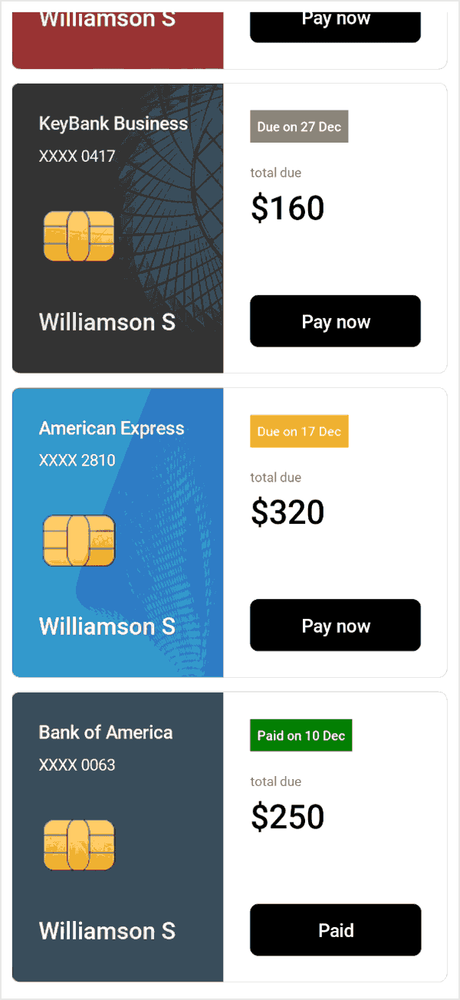

# Overview of .NET MAUI Cards (SfCards)  

The new Cards control empowers you to generate either a dismissible card or a stack of cards, with only one card being visible initially, requires a swipe to reveal the subsequent card.

## Key features

* This feature enables you to create dismissible cards.
* This feature allows you to dismiss cards in both left and right directions.
* This functionality allows you to customize the background, border width, border color, corner radius, indicator thickness, and indicator position.
* This functionality allows you to limit or restrict the dismissal of the card.
* This functionality permits you to create a stack of cards.
* This capability allows you to dismiss and retrieve the card in the left, right, top, and bottom directions.
* This feature enables you to display the swiped card.

