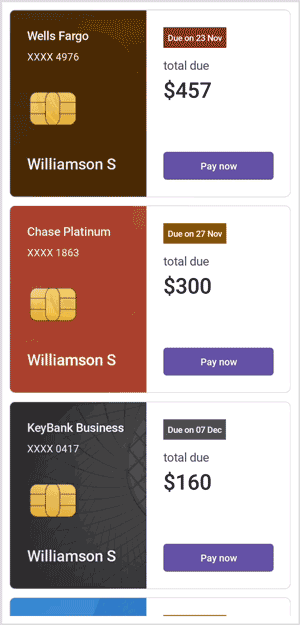

# MAUI Cards Overview

The new Cards control empowers you to generate either a dismissible card or a stack of cards. Initially, only one card is visible; a swipe is required to reveal the subsequent card.

## Key Features

- Enables the creation of dismissible cards.
- Allows dismissal of cards in both left and right directions.
- Provides customization options for background, border width, border color, corner radius, indicator thickness, and indicator position.
- Offers the ability to limit or restrict the dismissal of cards.
- Permits the creation of a stack of cards.
- Supports dismissal and retrieval of cards in left, right, top, and bottom directions.
- Enables the display of the swiped card.

