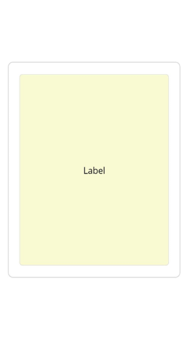
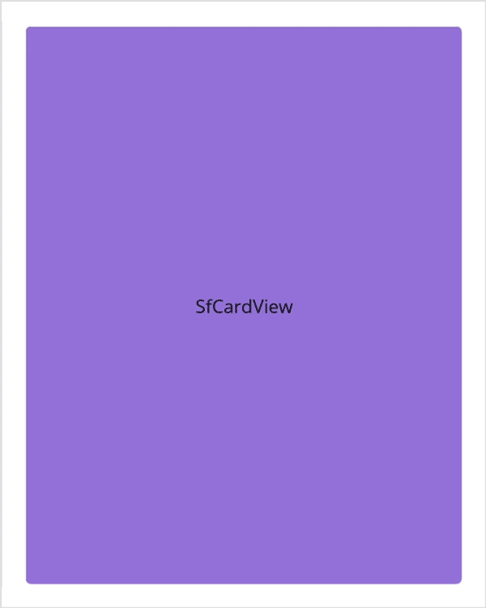
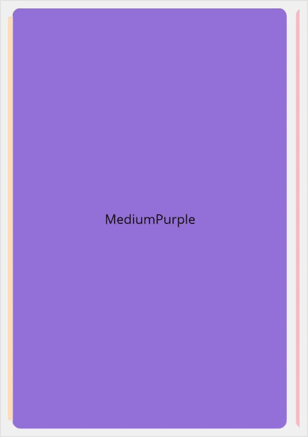

# Getting started with .NET MAUI Card
This section details the process of integrating the [.NET MAUI Cards](https://www.syncfusion.com/maui-controls/maui-cards) control and focuses solely on the fundamental features required for initiating your exploration of Syncfusion Card. Follow the steps below to add a .NET MAUI Cards control to your project.

To get start quickly with our .NET MAUI Cards, you can check the below video.



## Prerequisites

Before proceeding, ensure the following are set up:
1. Install [.NET 7 SDK](https://dotnet.microsoft.com/en-us/download/dotnet/7.0) or later is installed.
2. Set up a .NET MAUI environment with Visual Studio 2022 (v17.3 or later) or VS Code. For VS Code users, ensure that the .NET MAUI workload is installed and configured as described [here.](https://learn.microsoft.com/en-us/dotnet/maui/get-started/installation?view=net-maui-8.0&tabs=visual-studio-code)

## Step 1: Create a New .NET MAUI Project

### Visual Studio

1. Go to **File > New > Project** and choose the **.NET MAUI App** template.
2. Name the project and choose a location, then click **Next**.
3. Select the .NET framework version and click **Create**.

### Visual Studio Code

1. Open the command palette by pressing `Ctrl+Shift+P` and type **.NET:New Project** and enter.
2. Choose the **.NET MAUI App** template.
3. Select the project location, type the project name and press enter.
4. Then choose **Create project.**

## Step 2: Install the Syncfusion .NET MAUI Cards NuGet Package

1. In **Solution Explorer,** right-click the project and choose **Manage NuGet Packages.**
2. Search for [Syncfusion.Maui.Cards](https://www.nuget.org/packages/Syncfusion.Maui.Cards/) and install the latest version.
3. Ensure the necessary dependencies are installed correctly, and the project is restored.

## Step 3: Register the handler

The [Syncfusion.Maui.Core](https://www.nuget.org/packages/Syncfusion.Maui.Core/) NuGet is a dependent package for all Syncfusion controls of .NET MAUI. In the **MauiProgram.cs** file, register the handler for Syncfusion core.




using Syncfusion.Maui.Core.Hosting;
namespace GettingStarted
{
    public static class MauiProgram
    {
        public static MauiApp CreateMauiApp()
        {
            var builder = MauiApp.CreateBuilder();

            builder.ConfigureSyncfusionCore();
            builder
            .UseMauiApp<App>()
            .ConfigureFonts(fonts =>
            {
                fonts.AddFont("OpenSans-Regular.ttf", "OpenSansRegular");
            });

            return builder.Build();
        }
    }
}




## Step 4: Add .NET MAUI Cards control

1. To initialize the control, import the cards namespace into your code.
2. Initialize [SfCards](https://help.syncfusion.com/cr/maui/Syncfusion.Maui.Cards.html).




<ContentPage   
    . . .
    xmlns:cards="clr-namespace:Syncfusion.Maui.Cards;assembly=Syncfusion.Maui.Cards">

<cards:SfCardView>
    <Label Text="CardView" Background="PeachPuff" HorizontalTextAlignment="Center" VerticalTextAlignment="Center"/>
</cards:SfCardView>

</ContentPage>




using Syncfusion.Maui.Cards;
. . .

public partial class MainPage : ContentPage
{
    public MainPage()
    {
        InitializeComponent();
        SfCardView cardView = new SfCardView();

        cardView.Content = new Label()
        {
            Text = "CardView",
            HorizontalTextAlignment = TextAlignment.Center,
            VerticalTextAlignment = TextAlignment.Center,
            BackgroundColor = Colors.PeachPuff
        };
        this.Content = cardView;
    }
}




## SwipeToDismiss

The [SwipeToDismiss](https://help.syncfusion.com/cr/maui/Syncfusion.Maui.Cards.SfCardView.html#Syncfusion_Maui_Cards_SfCardView_SwipeToDismiss) property enables or disables the swiping feature in SfCardView.




<cards:SfCardView SwipeToDismiss="true">
    <Label Text="SfCardView" Background="MediumPurple" HorizontalTextAlignment="Center" VerticalTextAlignment="Center"/>
</cards:SfCardView>




using Syncfusion.Maui.Cards;
. . .

public partial class MainPage : ContentPage
{
    public MainPage()
    {
        InitializeComponent();
        SfCardView cardView = new SfCardView();
        cardView.SwipeToDismiss = true;

        cardView.Content = new Label()
        {
            Text="SfCardView",
            HorizontalTextAlignment = TextAlignment.Center,
            VerticalTextAlignment = TextAlignment.Center,
            BackgroundColor = Colors.MediumPurple
        };
        this.Content = cardView;
    }
}


	

N> This property will not work when adding the SfCardView as a child of SfCardLayout.

## Dismiss the card programmatically

The [IsDismissed](https://help.syncfusion.com/cr/maui/Syncfusion.Maui.Cards.SfCardView.html#Syncfusion_Maui_Cards_SfCardView_IsDismissed) property enables you to retrieve the view state of the card, and also provides the capability for the user to programmatically modify the card's view state.




<card:SfCardView IsDismissed="true">
     <Label Text="SfCardView"/>
</card:SfCardView>




using Syncfusion.Maui.Cards;
. . .

public partial class MainPage : ContentPage
{
    public MainPage()
    {
        InitializeComponent();
        SfCardView cardView = new SfCardView();
        cardView.IsDismissed = true;
        cardView.Content = new Label(){ Text="SfCardView" };
        this.Content = cardView;
    }
}


	

### SfCardLayout

Initialize a card layout with a card view using the provided code sample below.




<cards:SfCardLayout HeightRequest="500" BackgroundColor="#F0F0F0">

    <cards:SfCardView CornerRadius="10">
        <Label  Text="Peach" BackgroundColor="PeachPuff" VerticalTextAlignment="Center" HorizontalTextAlignment="Center"/>
    </cards:SfCardView>

    <cards:SfCardView CornerRadius="10">
        <Label  Text="MediumPurple" BackgroundColor="MediumPurple" VerticalTextAlignment="Center" HorizontalTextAlignment="Center"/>
    </cards:SfCardView>

    <cards:SfCardView CornerRadius="10" >
        <Label  Text="LightPink" BackgroundColor="LightPink" VerticalTextAlignment="Center" HorizontalTextAlignment="Center"/>
    </cards:SfCardView>

</cards:SfCardLayout>




using Syncfusion.Maui.Cards;
. . .

public partial class MainPage : ContentPage
{
	public MainPage()
	{
		InitializeComponent();
		SfCardLayout cardLayout = new SfCardLayout();

		//Add children for card layout 
		cardLayout.Children.Add(new SfCardView() { Content = new Label() { Text = "Peach", BackgroundColor = Colors.PeachPuff, HorizontalTextAlignment = TextAlignment.Center, VerticalTextAlignment = TextAlignment.Center }, CornerRadius = 15 });

		cardLayout.Children.Add(new SfCardView() { Content = new Label() { Text = "MediumPurple", BackgroundColor = Colors.MediumPurple, HorizontalTextAlignment = TextAlignment.Center, VerticalTextAlignment = TextAlignment.Center },CornerRadius = 15 });

		cardLayout.Children.Add(new SfCardView() { Content = new Label() { Text = "LightPink", BackgroundColor = Colors.LightPink, HorizontalTextAlignment = TextAlignment.Center, VerticalTextAlignment = TextAlignment.Center },CornerRadius = 15 });

		this.Content = cardLayout;
	}
}


	

N> You can refer to our [.NET MAUI Cards](https://www.syncfusion.com/maui-controls/maui-cards) feature tour page for its groundbreaking feature representations. You can also explore our [.NET MAUI Cards Example](https://github.com/syncfusion/maui-demos/tree/master/MAUI/Cards) that shows you how to render and configure the Cards in .NET MAUI.