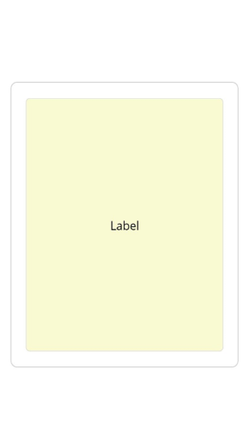
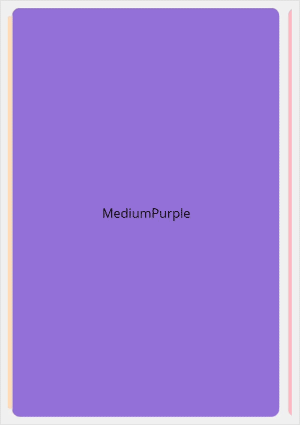

# Getting started with .NET MAUI Card
This section details the process of integrating the [.NET MAUI Cards](https://www.syncfusion.com/maui-controls/maui-cards) control and focuses solely on the fundamental features required for initiating your exploration of Syncfusion&reg; Card. Follow the steps below to add a .NET MAUI Cards control to your project.

To get start quickly with our .NET MAUI Cards, you can check the below video.






## Prerequisites

Before proceeding, ensure the following are set up:

1. Install [.NET 9 SDK](https://dotnet.microsoft.com/en-us/download/dotnet/9.0) or later.
2. Set up a .NET MAUI environment with Visual Studio 2022 v17.12 or later.

## Step 1: Create a New .NET MAUI Project

1. Go to **File > New > Project** and choose the **.NET MAUI App** template.
2. Name the project and choose a location. Then click **Next**.
3. Select the .NET framework version and click **Create**.

## Step 2: Install the Syncfusion&reg; .NET MAUI Cards NuGet Package

1. In **Solution Explorer,** right-click the project and choose **Manage NuGet Packages.**
2. Search for [Syncfusion.Maui.Cards](https://www.nuget.org/packages/Syncfusion.Maui.Cards/) and install the latest version.
3. Ensure the necessary dependencies are installed correctly, and the project is restored.




## Prerequisites

Before proceeding, ensure the following are set up:

1. Install [.NET 9 SDK](https://dotnet.microsoft.com/en-us/download/dotnet/9.0) or later.
2. Set up a .NET MAUI environment with Visual Studio Code.
3. Ensure that the .NET MAUI workloads are installed and configured as described [here](https://learn.microsoft.com/en-us/dotnet/maui/get-started/installation?view=net-maui-9.0&tabs=visual-studio-code).

## Step 1: Create a New .NET MAUI Project

1. Open the command palette by pressing `Ctrl+Shift+P` and type **.NET:New Project** and enter.
2. Choose the **.NET MAUI App** template.
3. Select the project location, type the project name and press **Enter**.
4. Then choose **Create project.**

## Step 2: Install the Syncfusion&reg; .NET MAUI Cards NuGet Package

1. Press <kbd>Ctrl</kbd> + <kbd>`</kbd> (backtick) to open the integrated terminal in Visual Studio Code.
2. Ensure you're in the project root directory where your .csproj file is located.
3. Run the command `dotnet add package Syncfusion.Maui.Cards` to install the Syncfusion® .NET MAUI Cards NuGet package.
4. To ensure all dependencies are installed, run `dotnet restore`.





## Prerequisites

Before proceeding, ensure the following are set up:

1. Install [.NET 9 SDK](https://dotnet.microsoft.com/en-us/download/dotnet/9.0) or later.
2. Set up a .NET MAUI environment with JetBrains Rider 2024.3 or later.
3. Make sure the MAUI workloads are installed and configured as described [here.](https://www.jetbrains.com/help/rider/MAUI.html#before-you-start)

## Step 1: Create a new .NET MAUI Project

1. Go to **File > New Solution,** Select .NET (C#) and choose the .NET MAUI App template.
2. Enter the Project Name, Solution Name, and Location.
3. Select the .NET framework version and click Create.

## Step 2: Install the Syncfusion® MAUI Cards NuGet Package

1. In **Solution Explorer,** right-click the project and choose **Manage NuGet Packages.**
2. Search for [Syncfusion.Maui.Cards](https://www.nuget.org/packages/Syncfusion.Maui.Cards/) and install the latest version.
3. Ensure the necessary dependencies are installed correctly, and the project is restored. If not, Open the Terminal in Rider and manually run: `dotnet restore`




## Step 3: Register Syncfusion handler
 
Make sure to add the namespace.
 


using Syncfusion.Maui.Core.Hosting;


 
Register the Syncfusion core handler in your `CreateMauiApp` method of `MauiProgram.cs` file to use Syncfusion controls.
 


builder.ConfigureSyncfusionCore();



## Step 4: Import the Card namespace

Add the following namespace in your XAML or C#.



xmlns:cards="clr-namespace:Syncfusion.Maui.Cards;assembly=Syncfusion.Maui.Cards"


using Syncfusion.Maui.Cards;



## Step 5: Add the Card component

Create an instance for the Card control.



<cards:SfCardView>
    <Label Text="CardView"
           Background="PeachPuff" 
           HorizontalTextAlignment="Center" 
           VerticalTextAlignment="Center"/>
</cards:SfCardView>


SfCardView cardView = new SfCardView();
cardView.Content = new Label()
{
    Text = "CardView",
    HorizontalTextAlignment = TextAlignment.Center,
    VerticalTextAlignment = TextAlignment.Center,
    BackgroundColor = Colors.PeachPuff
};



The following screenshot illustrates the result of the above code.

### Define the card layout

Initialize a card layout with a card view using the provided code sample below.




<cards:SfCardLayout HeightRequest="500" BackgroundColor="#F0F0F0">

    <cards:SfCardView CornerRadius="10">
        <Label  Text="Peach" BackgroundColor="PeachPuff"/>
    </cards:SfCardView>

    <cards:SfCardView CornerRadius="10">
        <Label  Text="MediumPurple" BackgroundColor="MediumPurple"/>
    </cards:SfCardView>

    <cards:SfCardView CornerRadius="10" >
        <Label  Text="LightPink" BackgroundColor="LightPink"/>
    </cards:SfCardView>

</cards:SfCardLayout>



SfCardLayout cardLayout = new SfCardLayout();

cardLayout.Children.Add(new SfCardView() { Content = new Label() { Text = "Peach", BackgroundColor = Colors.PeachPuff }, CornerRadius = 15 });

cardLayout.Children.Add(new SfCardView() { Content = new Label() { Text = "MediumPurple", BackgroundColor = Colors.MediumPurple },CornerRadius = 15 });

cardLayout.Children.Add(new SfCardView() { Content = new Label() { Text = "LightPink", BackgroundColor = Colors.LightPink },CornerRadius = 15 });

	

The following screenshot illustrates the result of the above code.

You can download the Card Getting Started sample from [GitHub](https://github.com/SyncfusionExamples/dotnet-maui-cards-sample)

N> You can refer to our [.NET MAUI Cards](https://www.syncfusion.com/maui-controls/maui-cards) feature tour page for its groundbreaking feature representations. You can also explore our [.NET MAUI Cards Example](https://github.com/syncfusion/maui-demos/tree/master/MAUI/Cards) that shows you how to render and configure the Cards in .NET MAUI.