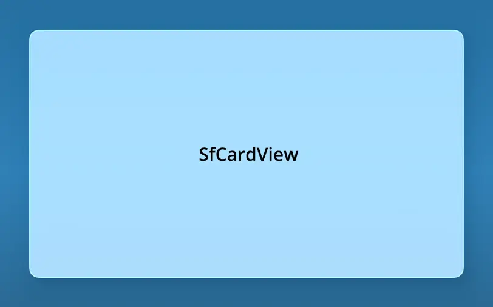

# Liquid Glass Effect in .NET MAUI Cards (SfCards)

The Liquid Glass Effect introduces a modern, translucent design with adaptive color tinting and light refraction, creating a sleek, glass like user experience that remains clear and accessible. This section explains how to enable and customize the effect in the Syncfusion® .NET MAUI Cards (SfCards) control.

## Apply liquid glass effect

Follow these steps to enable and configure the Liquid Glass Effect in the Card View:

### Step 1: Enable the liquid glass effect on Card View

Set the [EnableLiquidGlassEffect](https://help.syncfusion.com/cr/maui/Syncfusion.Maui.Cards.SfCardView.html#Syncfusion_Maui_Cards_SfCardView_EnableLiquidGlassEffect) property to `true` in the [SfCardView](https://help.syncfusion.com/cr/maui/Syncfusion.Maui.Cards.SfCardView.html) to apply the Liquid Glass Effect.

### Step 2: Customize the background

To achieve a glass like background in the card view, set the `Background` property to `Transparent`. The background will then be treated as a tinted color, ensuring a consistent glass effect across the controls.

The following code snippet demonstrates how to apply the Liquid Glass Effect to the [SfCardView](https://help.syncfusion.com/cr/maui/Syncfusion.Maui.Cards.SfCardView.html):




<ContentPage
    xmlns="http://schemas.microsoft.com/dotnet/2021/maui"
    xmlns:x="http://schemas.microsoft.com/winfx/2009/xaml"
    xmlns:cards="clr-namespace:Syncfusion.Maui.Cards;assembly=Syncfusion.Maui.Cards"
    x:Class="AcrylicCardsPage">
    <Grid>
        <Grid.Background>
            <LinearGradientBrush StartPoint="0,0"
                                 EndPoint="0,1">
                <GradientStop Color="#0F4C75"
                              Offset="0.0"/>
                <GradientStop Color="#3282B8"
                              Offset="0.5"/>
                <GradientStop Color="#1B262C"
                              Offset="1.0"/>
            </LinearGradientBrush>
        </Grid.Background>
        <Grid>
            <cards:SfCardView x:Name="cardView" EnableLiquidGlassEffect="True"
                    Background="Transparent"
                    BorderColor="Transparent"
                    WidthRequest="350"
                    HeightRequest="200">
                <Label Text="SfCardView"
                        HorizontalOptions="Center"
                        VerticalOptions="Center"/>
            </cards:SfCardView>
        </Grid>
    </Grid>
</ContentPage>




// Outer grid with gradient background
var mainGrid = new Grid()
{
    Background = new LinearGradientBrush()
    {
        StartPoint = new Point(0, 0),
        EndPoint = new Point(0, 1),
        GradientStops =
        {
            new GradientStop { Color = Color.FromArgb("#0F4C75"), Offset = 0.0f },
            new GradientStop { Color = Color.FromArgb("#3282B8"), Offset = 0.5f },
            new GradientStop { Color = Color.FromArgb("#1B262C"), Offset = 1.0f }
        }
    }
};

var innerGrid = new Grid();

var card = new SfCardView()
{
    EnableLiquidGlassEffect = true,
    Background = Colors.Transparent,
    BorderColor = Colors.Transparent,
    WidthRequest = 350,
    HeightRequest = 200,
};

card.Content = new Label()
{
    Text = "SfCardView",
    HorizontalOptions = LayoutOptions.Center,
    VerticalOptions = LayoutOptions.Center
};

innerGrid.Add(card);
mainGrid.Add(innerGrid);
this.Content = mainGrid;




N>
* Supported on `macOS 26 or higher` and `iOS 26 or higher`.
* This feature is available only in `.NET 10.`