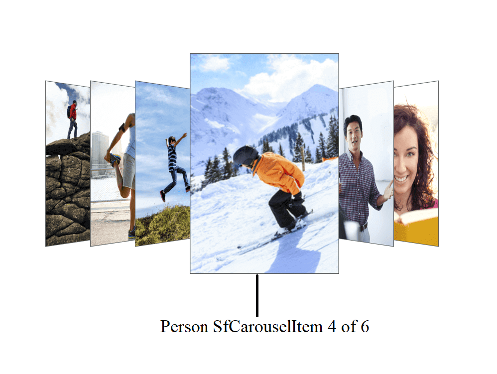

# Accessibility in .NET MAUI Carousel View (SfCarousel)

The `SfCarousel`control has built-in `AutomationId` for inner elements. The `AutomationId` API allows the automation framework to find and interact with the inner elements of the `SfCarousel` control. To keep unique AutomationId, these inner elements' AutomationIds are updated based on the control's `AutomationId`.

 For example, if you set SfCarouselItem's `AutomationId` as "Person", then the automation framework will interact the fourth carousel item as "Person SfCarouselItem 4 of 6" (6 denotes the total count). 
 
 The following screenshot illustrates the AutomationIds of inner elements. If the SfCarousel's `AutomationId` as Gallery, then the Automation framework will interact the LoadMore as "Gallery LoadMore. Tap to load more items". You cannot interact with the carousel item when you want to select an index that is not visible in the view.

 N> You cannot provide AutomationId when the carousel item is populated with custom template.

