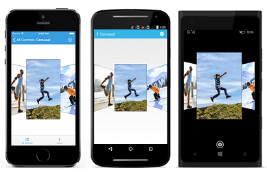

# Transformation in .NET MAUI Carousel View (SfCarousel)

The `Offset` between selected and unselected item can be customized in  `SfCarousel` control. And also the items can be scaled to the specified value.

## Tilt Non Selected Items

The `RotationAngle` property in the `SfCarousel` control is utilized to tilt all unselected items at a specified angle in the `Default` mode.

N> If the angle value is positive, then the rotation is in the clockwise direction. If the angle value is negative, the rotation is in the counterclockwise direction. 





<carousel:SfCarousel x:Name="carousel"
                     ItemHeight="300"
                     ItemWidth="200"
                     RotationAngle="30"/>
	




SfCarousel carousel = new SfCarousel()
{
    ItemWidth = 200,
    ItemHeight = 300,
    RotationAngle = 30
};

carousel.SetBinding(SfCarousel.ItemsSourceProperty, "ImageCollection");





## Set Gap between Selected Item

Distance between the selected item and other items can be customized by using `SelectedItemOffset` property of the  `SfCarousel` control in the Default mode.





<carousel:SfCarousel x:Name="carousel"
                     ItemHeight="170"
                     ItemWidth="270"
                     SelectedItemOffset="60"/>

	




SfCarousel carousel = new SfCarousel()
{
    ItemWidth = 170,
    ItemHeight = 250,
    SelectedItemOffset = 60,
};

carousel.SetBinding(SfCarousel.ItemsSourceProperty, "ImageCollection");





## Set Gap between unselected Items

The `Offset` property is used to define the accurate distance between unselected items in the `SfCarousel` panel in the Default mode.

N> The default offset value is 40 for desktop platforms and 18 for mobile platforms.





<carousel:SfCarousel x:Name="carousel"
                     ItemHeight="170"
                     ItemWidth="270"
                     Offset="60"/>

	




SfCarousel carousel = new SfCarousel()
{
    ItemWidth = 170,
    ItemHeight = 250,
    Offset = 60
};

carousel.SetBinding(SfCarousel.ItemsSourceProperty, "ImageCollection");





## Set Scaling for Carousel Items

The `ScaleOffset` property in the  `SfCarousel` control is used to scale all the items to the specified scale value in the Default mode.





<carousel:SfCarousel x:Name="carousel"
                     ItemsSource="{Binding ImageCollection}"
                     ItemHeight="200"
                     ItemWidth="200"
                     ScaleOffset="0.5"/>





SfCarousel carousel = new SfCarousel()
{
    ItemHeight = 200,
    ItemWidth = 200,
    ScaleOffset = 0.5f
};

carousel.SetBinding(SfCarousel.ItemsSourceProperty, "ImageCollection");





## Spacing between the Items in Linear mode

Spacing of all the items in Linear mode can be determined by using `ItemSpacing` property.





<carousel:SfCarousel x:Name="carousel"
                     ItemsSource="{Binding ImageCollection}"
                     ItemHeight="200"
                     ItemWidth="200"
                     ItemSpacing="60"
                     ViewMode="Linear"/>
	




SfCarousel carousel = new SfCarousel()
{
    ItemHeight = 200,
    ItemWidth = 200,
    ItemSpacing = 60,
    ViewMode = ViewMode.Linear
};

carousel.SetBinding(SfCarousel.ItemsSourceProperty, "ImageCollection");





