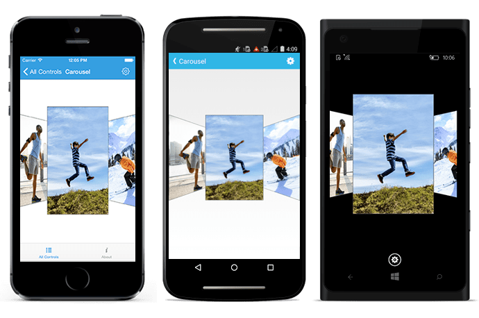

# .NET MAUI Carousel View (SfCarousel) Overview

The .NET MAUI Carousel control allows users to navigate through image data in an interactive way so that it can be viewed or selected. It provides various customization options for its item arrangements.

## Key Features:

* Offset: Specify the space between the unselected items in the Carousel.
* Rotation angle: Rotate all the items to a specified angle.
* Duration: Specify the time it should take to move an item to the selected item position.
