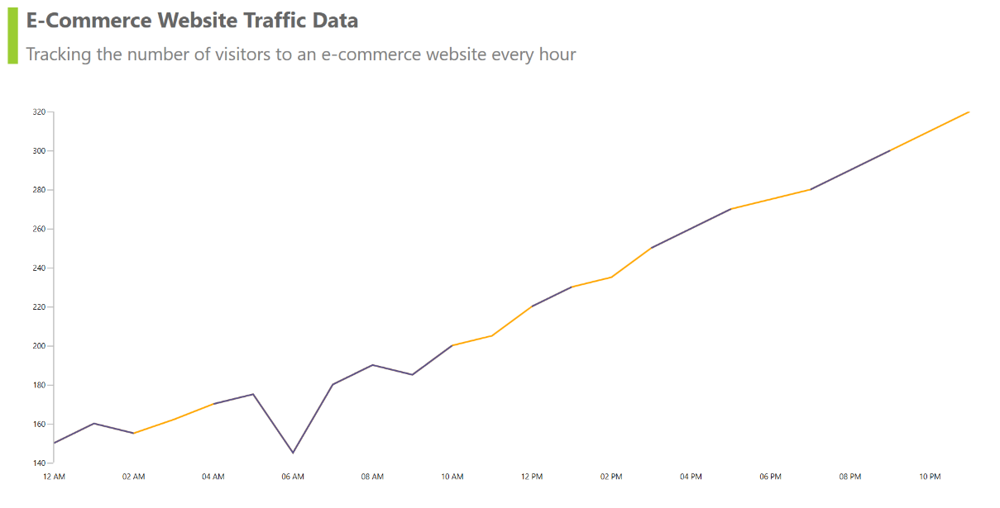

# AI Powered data cleaning and preprocessing in .NET MAUI Chart.

Raw datasets often contain missing values, outliers, or noise that can distort visualizations and analysis. This is common in web traffic data, which may have gaps or spikes. Before visualizing such data, it’s essential to clean it.

This guide shows how to use Azure OpenAI to clean and preprocessing e-commerce website traffic data, then visualize the results using [Syncfusion .NET MAUI Charts](https://help.syncfusion.com/maui/cartesian-charts/getting-started).

## Integrating Azure OpenAI for cleaning and preprocessing the data

Azure OpenAI can process your raw data and return a cleaned version, handling missing values and outliers automatically. This integration allows you to focus on analysis and visualization, rather than manual data correction.

### 1. Configure Azure OpenAI Service

To get started, ensure you have access to [Azure OpenAI](https://azure.microsoft.com/en-in/products/ai-services/openai-service) and have deployed a model in the Azure portal. You will need your endpoint and API key to connect your application to the service. You can find the [Azure.AI.OpenAI](https://www.nuget.org/packages/Azure.AI.OpenAI/1.0.0-beta.12) NuGet package from the [NuGet Gallery](https://www.nuget.org/).





internal class AzureOpenAIService
{

    internal const string Endpoint = "YOUR_END_POINT_NAME";

    internal const string DeploymentName = "DEPLOYMENT_NAME";

    internal const string ImageDeploymentName = "IMAGE_DEPOLYMENT_NAME";

    internal const string Key = "API_KEY";

    public AzureOpenAIService()
    {

    }
}





To set up a connection to the Azure OpenAI service, Create an `OpenAIClient` instance when needed. This connection allows you to send prompts to the model and receive responses, which you can use for data-cleaning tasks.





//At the time of required.
var client = new OpenAIClient(new Uri(endpoint), new AzureKeyCredential(key));





### 2. Generate Prompts for clean the raw data

Prepare your raw data and format a prompt for Azure OpenAI. The prompt should describe the cleaning task and provide the data in a clear format.

Example raw data:

| Date       | Visitors |
|------------|----------|
| 2024-08-01 | 1200     | 
| 2024-08-02 |          | // Missing value
| 2024-08-03 | 1300     | 
| 2024-08-04 | 1500     |
| 2024-08-05 | 10000    | // Outlier

Send the prompt and receive the cleaned data from Azure OpenAI. Here’s an example of how you can frame your prompt and receive the response.





var prompt = $"Clean the following e-commerce website traffic data, resolve outliers, and fill missing values:\n{string.Join("\n", rawData.Select(d => $"{d.DateTime:yyyy-MM-dd-HH-m-ss}: {d.Visitors}"))} and the output cleaned data should be in the yyyy-MM-dd-HH-m-ss:Value";

var client = new OpenAIClient(new Uri(endpoint), new AzureKeyCredential(key));
var response = await client.GetChatCompletionsAsync(chatCompletionsOptions);





You can use this approach for any time-series or tabular data that needs preprocessing before visualization.

### 3. Implement the Syncfusion .NET MAUI chart to disply data.

Define classes to represent your website traffic data and manage both raw and cleaned datasets.This structure allows you to easily bind both raw and cleaned data to your chart.





// Data model.
public class WebsiteTrafficData
{
    public DateTime DateTime { get; set; }
    public double Visitors { get; set; }
}

public class ViewModel : INotifyPropertyChanged 
{ 
    public ObservableCollection<WebsiteTrafficData> RawData { get; set; } 
    
    private ObservableCollection<WebsiteTrafficData> cleanData; 
    public ObservableCollection<WebsiteTrafficData> CleanedData 
    { 
       get { return cleanData; } 
       set 
       { 
           cleanData = value; 
           PropertyChanged?.Invoke(this, new PropertyChangedEventArgs("CleanedData")); 
       } 
    } 
    
    public ViewModel() 
    { 
        IsBusy = false; 
        RawData = new ObservableCollection() 
        { 
           new WebsiteTrafficData{ DateTime = new DateTime(2024, 07, 01, 00, 00, 00), Visitors = 150 }, 
           new WebsiteTrafficData{ DateTime = new DateTime(2024, 07, 01, 01, 00, 00), Visitors = 160 }, 
           new WebsiteTrafficData{ DateTime = new DateTime(2024, 07, 01, 02, 00, 00), Visitors = 155 }, 
           new WebsiteTrafficData{ DateTime = new DateTime(2024, 07, 01, 03, 00, 00), Visitors = double.NaN }, 
       
           // Missing data 
           new WebsiteTrafficData{ DateTime = new DateTime(2024, 07, 01, 04, 00, 00), Visitors = 170 }, 
           
           // Some more data. 
           … 
        }; 

        CleanedData = new ObservableCollection<WebsiteTrafficData>(); 
    } 
}





### 4. Display Data Using Syncfusion Chart

Bind your ViewModel to the chart and display raw data and cleaned data. 

To visualize website traffic data, use two line series to show data for before and after AI data cleaning.





<chart:SfCartesianChart Grid.Row="0" x:Name="Chart" Margin="5" PaletteBrushes="{Binding PaletteBrushes}">
 
    <chart:SfCartesianChart.Title>
        <StackLayout Orientation="Vertical">
            <Label Text="E-Commerce Website Traffic Data" FontSize="18" FontAttributes="Bold" HorizontalTextAlignment="Center" />
            <Label Text="AI-powered data cleaning and preprocessing every hour, tracking hourly website visitors" LineBreakMode="WordWrap" HorizontalTextAlignment="Center" FontSize="14"/>
        </StackLayout>
    </chart:SfCartesianChart.Title>

    <chart:SfCartesianChart.XAxes>
        <chart:DateTimeAxis ShowMajorGridLines="False" EdgeLabelsDrawingMode="Shift">
            <chart:DateTimeAxis.LabelStyle>
                <chart:ChartAxisLabelStyle LabelFormat="hh tt"/>
            </chart:DateTimeAxis.LabelStyle>
        </chart:DateTimeAxis>
    </chart:SfCartesianChart.XAxes>

    <chart:SfCartesianChart.YAxes>
        <chart:NumericalAxis ShowMajorGridLines="False" Minimum="140" Interval="30" Maximum="320">
        </chart:NumericalAxis>
    </chart:SfCartesianChart.YAxes>

    <chart:LineSeries x:Name="CleanedDataSeries" ItemsSource="{Binding CleanedData}" XBindingPath="DateTime"
                            YBindingPath="Visitors" StrokeWidth="2"/>

    <chart:LineSeries x:Name="RawDataSeries" ItemsSource="{Binding RawData}" XBindingPath="DateTime"
                            YBindingPath="Visitors" StrokeWidth="2"/>

</chart:SfCartesianChart>





### 5. Trigger the AI Service for Data Cleaning

After your application loads, call the Azure OpenAI service to clean the raw data and update your chart with the results.





// At application start.
Task.Run(async () =>
{
    var service = new AzureOpenAIService("YOUR_Azure_AI_Key");
    CleanedData = await service.GetCleanedData(RawData);    
});





Now that your chart is set up with the cleaned data, you’ll see a smooth and accurate representation of your website traffic trends, free from anomalies and gaps.

You can also provide a button or menu option for users to trigger data cleaning on demand, allowing them to refresh the chart with newly cleaned data whenever needed.

The following image demonstrates the output of the above AI Powered data cleaning and preprocessing .NET MAUI chart.

For more information, please visit the [GitHub Sample](https://github.com/syncfusion/maui-demos/tree/master/MAUI/SmartDemos/SampleBrowser.Maui.SmartDemos/Samples/SmartDemos/DataPreprocessing)