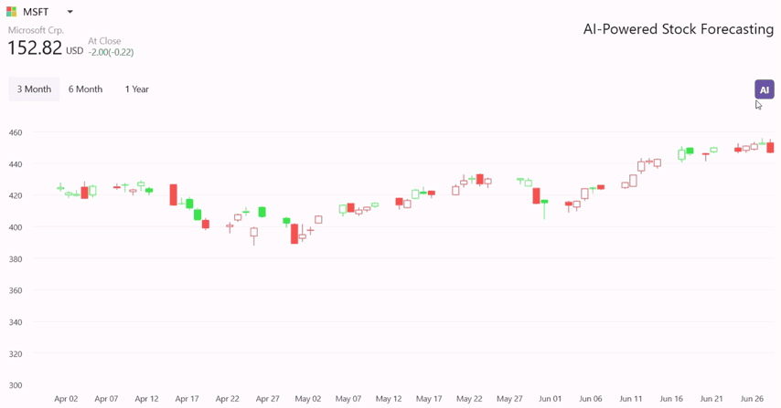

# AI Powered Stock Forecasting in Candle Chart

This guide demonstrates how to build an AI-powered [.NET MAUI Candle Chart](https://help.syncfusion.com/maui/cartesian-charts/candle) that forecasts stock prices for the next 45 days, helping traders make informed decisions using Syncfusion controls and Azure OpenAI.

## Integrating Azure OpenAI for Stock Forecasting

Azure OpenAI can analyze historical stock data and predict future trends. The model identifies patterns and generates financial (Open, High, Low, Close) values for upcoming days.

### 1. Configure Azure OpenAI Service

Ensure you have access to [Azure OpenAI](https://azure.microsoft.com/en-in/products/ai-services/openai-service) and a deployed model in the Azure portal. Set up the service endpoint and API key. You can find the [Azure.AI.OpenAI](https://www.nuget.org/packages/Azure.AI.OpenAI/1.0.0-beta.12) NuGet package from the [NuGet Gallery](https://www.nuget.org/).





internal class AzureOpenAIService
{

    internal const string Endpoint = "YOUR_END_POINT_NAME";

    internal const string DeploymentName = "DEPLOYMENT_NAME";

    internal const string ImageDeploymentName = "IMAGE_DEPOLYMENT_NAME";

    internal const string Key = "API_KEY";

    public AzureOpenAIService()
    {

    }
}





To set up a connection to the Azure OpenAI service, Create an `OpenAIClient` instance when needed:





//At the time of required.
var client = new OpenAIClient(new Uri(endpoint), new AzureKeyCredential(key));





### 2. Generate Prompts and Retrieve AI Predictions

Prepare a structured prompt with historical data for the AI model, this helps to get the more accurate predicted values.





//AI service.

internal string GeneratePrompt(List<DataModel> historicalData)
{
    var prompt = "Predicted OHLC values for the next 45 time step(s) for the following data:\n";
    foreach (var data in historicalData)
    {
        prompt += $"{data.Date:yyyy-MM-dd}: {data.High}, {data.Low}, {data.Open}, {data.Close}\n";
    }
    prompt += "and the prediction output data should be in the yyyy-MM-dd:High:Low:Open:Close, no other explanation required\n";
    return prompt;
}





Request predictions from Azure OpenAI using the 'GetChatCompletionsAsync':





//AI service.

. . .
public Task<ObservableCollection<DataModel>> GetAnswerFromGPT(string userPrompt, ViewModel viewModel, int index)
{
    try
    {
        if (IsCredentialValid && Client != null)
        {
            ChatHistory = string.Empty;
            // Add the system message and user message to the options
            ChatHistory = ChatHistory + userPrompt;
            var response = await Client.CompleteAsync(ChatHistory);

            //Helps to convert the response to respective data model
            return this.ConvertToCompaniesModelCollection(response.ToString());
        }
    }
    catch (Exception)
    {
        return viewModel.GenerateDataSource();
    }

    return viewModel.GenerateDataSource();
}





### 3. Implement the Syncfusion .NET MAUI Candle chart to display forecasted data.

The [Syncfusion .NET MAUI Candle chart](https://help.syncfusion.com/maui/cartesian-charts/candle) allows you to display the financial data's. Define the data Model that hold the financial data (High, Low, Open, Close) and ViewModel that hold the collection of data for binding.





//Model

. . .
public class DataModel
{
    public double High { get; set; }
    public double Low { get; set; }
    public DateTime Date { get; set; }
    public double Open { get; set; }
    public double Close { get; set; }
}

// ViewModel

public class ViewModel : INotifyPropertyChanged
{
    private ObservableCollection<DataModel> stockData;
    public ObservableCollection<DataModel> StockData {
       get { return stockData; }
       set
       {
           stockData = value;
           OnPropertyChanged(nameof(StockData));
       }
    }
    
    // Helps to store and display the Forecast data in view from AI response.
    public ObservableCollection<CompaniesModel> ForeCastData { get; set; }

    public const string msftStockSource = "6/28/2024\t453.07\t455.38\t446.41\t446.95\t28,362,270\r\n6/27/2024\t452.18\t456.17\t451.77\t452.85\t14,806,320\r\n6/26/20..."; // Complete data from CSV file downloaded.
   
    public event PropertyChangedEventHandler? PropertyChanged;

    public ViewModel()
    {
        stockData = GenerateColection(msftStockSource);
    }

    private ObservableCollection<DataModel> GenerateColection(string dataSource)
    {
        string[] alphapetRows = dataSource.Split(new[] { "\r\n", "\n" }, StringSplitOptions.RemoveEmptyEntries);
        ObservableCollection<DataModel> alphabetCollection = new ObservableCollection<DataModel>();

        foreach (string row in alphapetRows)
        {
            string[] columns = row.Split('\t');
            DataModel item = new DataModel(GetDateTime(columns[0]), GetDouble(columns[2]), GetDouble(columns[3]), GetDouble(columns[1]), GetDouble(columns[4]));
            alphabetCollection.Add(item);
        }

        return alphabetCollection;
    }
}





### 4. Display Data Using Syncfusion Candle Chart

Bind your ViewModel to the chart and display both historical and forecasted data:





<ContentPage.BindingContext>
 <local:ViewModel x:Name="viewModel"/>
</ContentPage.BindingContext>
. . . 
<chart:SfCartesianChart x:Name="chart" >

 <chart:SfCartesianChart.XAxes>

  <chart:DateTimeAxis x:Name="dateTime" LabelExtent="30" IntervalType="Months" ShowMajorGridLines="False" >

 </chart:SfCartesianChart.XAxes>
            
 <chart:SfCartesianChart.YAxes>

   <chart:NumericalAxis EdgeLabelsVisibilityMode="AlwaysVisible"  EdgeLabelsDrawingMode="Center">

   </chart:NumericalAxis>
 </chart:SfCartesianChart.YAxes>

 <chart:CandleSeries x:Name="candleSeries" ItemsSource="{Binding StockData}"                                      
                      XBindingPath="Date"
                      Open="Open"
                      High="High"    
                      Low="Low"
                      Close="Close" />

 <chart:CandleSeries x:Name="forecastCandle" 
                      ItemsSource="{Binding ForeCastData}"                                      
                      XBindingPath="Date"
                      Open="Open"
                      High="High"              
                      Low="Low"
                      Close="Close"   />

            
</chart:SfCartesianChart>





### 5. Trigger AI Forecasting

Invoke the AI service when the user clicks a button:





private async void AIButtonClicked(object sender, EventArgs e)
{
   AzureOpenAIService service = new AzureOpenAIService();
   var data = viewModel.StockData;
   var last10Items = data.Skip(Math.Max(0, data.Count - 10)).Take(10).ToList();

   //Build a prompt for AI. 
   var prompt = service.GeneratePrompt(last10Items);
   var value = await service.GetAnswerFromGPT(prompt, viewModel, selected_Index);
 
   //Update forecast value to chart.
   await viewModel.AddRangeWithDelayAsync(value, 300);  
}





After receiving the AI-predicted stock trends, the chart updates to display both historical and forecasted data, providing a visual representation of potential market movements.

The following image demonstrates the output of the above AI powered stock forecasting .NET MAUI Candle chart.

 

For more information, please visit the [GitHub Sample](https://github.com/syncfusion/maui-demos/tree/master/MAUI/SmartDemos/SampleBrowser.Maui.SmartDemos/Samples/SmartDemos/StockForecasting)