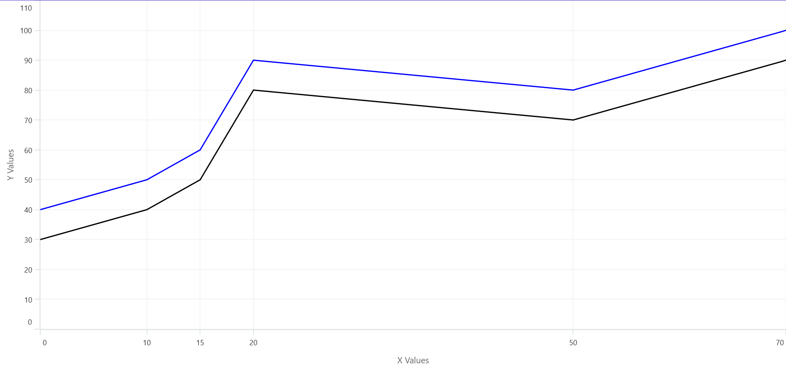

# Add custom labels to chart axis

[ChartAxis](https://help.syncfusion.com/cr/maui/Syncfusion.Maui.Charts.ChartAxis.html) provides the [OnCreateLabels](https://help.syncfusion.com/cr/maui/Syncfusion.Maui.Charts.ChartAxis.html#Syncfusion_Maui_Charts_ChartAxis_OnLabelCreated_Syncfusion_Maui_Charts_ChartAxisLabel_) override method to add custom labels to chart axis. [OnCreateLabels](https://help.syncfusion.com/cr/maui/Syncfusion.Maui.Charts.ChartAxis.html#Syncfusion_Maui_Charts_ChartAxis_OnLabelCreated_Syncfusion_Maui_Charts_ChartAxisLabel_) method called whenever new labels are generated. The following properties are available to add custom labels in chart axis.

* [VisibleLabels]() - This property of the chart axis can be used to get Observable Collection of visible axis labels.

* [VisibleMaximum]() - This property of the chart axis can be used to get the double value that represents the maximum observable value of the axis range.

* [VisibleMinimum]() - This property of the chart axis can be used to get the double value that represents the minimum observable value of the axis range.





    <chart:SfCartesianChart>
       . . .
       <chart:SfCartesianChart.XAxes>
            <model:CustomNumericalAxis />
       </chart:SfCartesianChart.XAxes>
       . . .
    </chart:SfCartesianChart>





    SfCartesianChart chart = new SfCartesianChart();
    .......
    CustomNumericalAxis primaryAxis = new CustomNumericalAxis();
    chart.XAxes.Add(primaryAxis);
    








    public class CustomNumericalAxis : NumericalAxis
    {
        protected override void OnCreateLabels()
        {
            base.OnCreateLabels();

            if (VisibleLabels != null)
            {
                VisibleLabels.Clear();

                VisibleLabels.Clear();
                ViewModel viewModel = BindingContext as ViewModel;

                for (int i = 0; i < viewModel.Data2.Count; i++)
                {
                    var data = viewModel.Data2[i];
                    VisibleLabels.Add(new ChartAxisLabel(data.XValue, data.XValue.ToString()));
                }
            }
        }
    }
    




N> This is applicable for all types of axis. Labels are rendered only if the label position presents within the visible range. The labels should be created only if users call the base of OnCreateLabels.