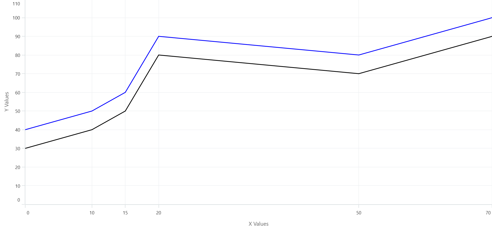

# Add custom labels to the chart axis

[ChartAxis](https://help.syncfusion.com/cr/maui/Syncfusion.Maui.Charts.ChartAxis.html) provides the [OnCreateLabels](https://help.syncfusion.com/cr/maui/Syncfusion.Maui.Charts.ChartAxis.html#Syncfusion_Maui_Charts_ChartAxis_OnCreateLabels) override method to add custom axis labels. The [OnCreateLabels](https://help.syncfusion.com/cr/maui/Syncfusion.Maui.Charts.ChartAxis.html#Syncfusion_Maui_Charts_ChartAxis_OnCreateLabels) method is called whenever new labels are generated. The following properties are available to add custom labels.

* [VisibleLabels](https://help.syncfusion.com/cr/maui/Syncfusion.Maui.Charts.ChartAxis.html#Syncfusion_Maui_Charts_ChartAxis_VisibleLabels) - This property is used to get an Observable Collection of visible axis labels.

* [VisibleMaximum](https://help.syncfusion.com/cr/maui/Syncfusion.Maui.Charts.ChartAxis.html#Syncfusion_Maui_Charts_ChartAxis_VisibleMaximum) - This property is used to get the double value that represents the maximum observable value of the axis range.

* [VisibleMinimum](https://help.syncfusion.com/cr/maui/Syncfusion.Maui.Charts.ChartAxis.html#Syncfusion_Maui_Charts_ChartAxis_VisibleMinimum) - This property is used to get the double value that represents the minimum observable value of the axis range.





<chart:SfCartesianChart>
    . . .
    <chart:SfCartesianChart.XAxes>
        <model:CustomNumericalAxis/>
    </chart:SfCartesianChart.XAxes>
    . . .
</chart:SfCartesianChart>





SfCartesianChart chart = new SfCartesianChart();
. . .
CustomNumericalAxis primaryAxis = new CustomNumericalAxis();
chart.XAxes.Add(primaryAxis);
. . .
this.Content = chart;
    








public class CustomNumericalAxis : NumericalAxis
{
    //Adding a custom axis label is achieved by displaying the axis label only on the x-axis values in the CustomNumericalAxis of the chart.
    
    protected override void OnCreateLabels()
    {
        base.OnCreateLabels();

        if (VisibleLabels != null)
        {
            VisibleLabels.Clear();

            ViewModel viewModel = BindingContext as ViewModel;

            for (int i = 0; i < viewModel.Data.Count; i++)
            {
                var data = viewModel.Data[i];
                VisibleLabels.Add(new ChartAxisLabel(data.XValue, data.XValue.ToString()));
            }
        }
    }
}
    




N> This applies to all types of axes. Labels are rendered only if the label position presents within the visible range. The labels should be created only if users call the base of `OnCreateLabels`.