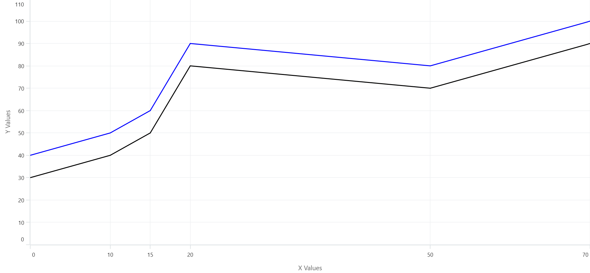

# Add custom labels to the chart axis in .NET MAUI Cartesian Chart

[ChartAxis](https://help.syncfusion.com/cr/maui/Syncfusion.Maui.Charts.ChartAxis.html) provides the [OnCreateLabels](https://help.syncfusion.com/cr/maui/Syncfusion.Maui.Charts.ChartAxis.html#Syncfusion_Maui_Charts_ChartAxis_OnCreateLabels) override method, called whenever new labels are generated (e.g., during layout, data update, zoom, or pan). The following properties are available when adding custom labels.

* [VisibleLabels](https://help.syncfusion.com/cr/maui/Syncfusion.Maui.Charts.ChartAxis.html#Syncfusion_Maui_Charts_ChartAxis_VisibleLabels) - Gets an `ObservableCollection<ChartAxisLabel>` of the visible axis labels.

* [VisibleMaximum](https://help.syncfusion.com/cr/maui/Syncfusion.Maui.Charts.ChartAxis.html#Syncfusion_Maui_Charts_ChartAxis_VisibleMaximum) - Gets the `double` value representing the maximum value of the visible axis range.

* [VisibleMinimum](https://help.syncfusion.com/cr/maui/Syncfusion.Maui.Charts.ChartAxis.html#Syncfusion_Maui_Charts_ChartAxis_VisibleMinimum) - Gets the `double` value representing the minimum value of the visible axis range.

N> **Prerequisite:** Ensure that the required NuGet package is installed, the necessary namespaces are imported, and the **SfCartesianChart** control is properly configured in your application. For detailed setup and configuration instructions, refer to the **[Getting Started](https://help.syncfusion.com/maui/cartesian-charts/getting-started)** guide.





<chart:SfCartesianChart>
    <chart:SfCartesianChart.XAxes>
        <model:CustomNumericalAxis/>
    </chart:SfCartesianChart.XAxes>
    <!-- code omitted for brevity -->
</chart:SfCartesianChart>





SfCartesianChart chart = new SfCartesianChart();

CustomNumericalAxis primaryAxis = new CustomNumericalAxis();
chart.XAxes.Add(primaryAxis);
// code omitted for brevity
this.Content = chart;
    




## Create a custom axis by overriding OnCreateLabels

Create a class deriving from [NumericalAxis](https://help.syncfusion.com/cr/maui/Syncfusion.Maui.Charts.NumericalAxis.html) (or any other axis type) and override `OnCreateLabels`. After calling `base.OnCreateLabels()`, clear the existing labels and add custom ones using the [ChartAxisLabel](https://help.syncfusion.com/cr/maui/Syncfusion.Maui.Charts.ChartAxisLabel.html) constructor, which accepts a `double` position (the axis value) and a `string` content (the label text).





public class CustomNumericalAxis : NumericalAxis
{
    // Adds a custom axis label for each data point's XValue.
    protected override void OnCreateLabels()
    {
        base.OnCreateLabels();

        if (VisibleLabels != null)
        {
            VisibleLabels.Clear();

            ViewModel viewModel = BindingContext as ViewModel;

            if (viewModel != null)
            {
                for (int i = 0; i < viewModel.Data.Count; i++)
                {
                    var data = viewModel.Data[i];
                    VisibleLabels.Add(new ChartAxisLabel(data.XValue, data.XValue.ToString()));
                }
            }
        }
    }
}





N> This applies to all axis types. Labels are rendered only if the label position falls within the visible range. Custom labels must be added after calling `base.OnCreateLabels()`. If labels do not appear, verify that the axis `BindingContext` is set, the data collection is not empty, and the label positions are within the `VisibleMinimum` and `VisibleMaximum` range.