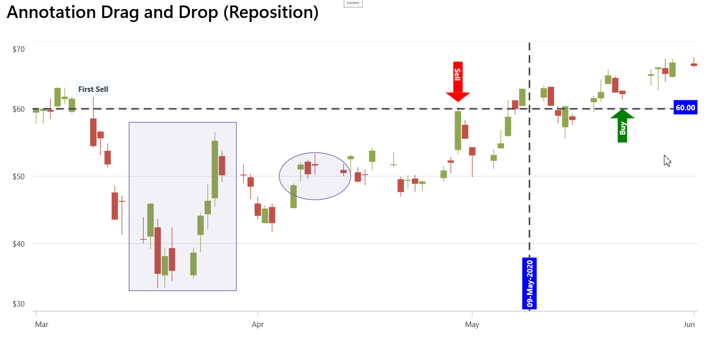

# Annotation Drag and Reposition

The .NET MAUI Cartesian Chart enables **dynamic annotation repositioning** through touch interaction. By implementing custom annotation classes that inherit from Syncfusion annotation types and override touch interaction methods, annotations such as [TextAnnotation](https://help.syncfusion.com/cr/maui/Syncfusion.Maui.Charts.TextAnnotation.html), [ShapeAnnotation](https://help.syncfusion.com/cr/maui/Syncfusion.Maui.Charts.ShapeAnnotation.html), and [ViewAnnotation](https://help.syncfusion.com/cr/maui/Syncfusion.Maui.Charts.ViewAnnotation.html) can be dragged and repositioned within the chart area, enhancing interactivity and data analysis capabilities.

## Touch Interaction Methods

The annotation interaction is managed through the following protected override methods:

* **OnTouchDown** – Triggered when touch starts on the annotation.

* **OnTouchMove** – Triggered when moving (dragging) the finger or mouse across the annotation. Calculates the difference between current and previous touch positions and applies these changes to the annotation's position properties (`X1`, `Y1`, `X2`, `Y2`).

* **OnTouchUp** – Triggered when touch ends by lifting the finger or releasing the mouse from the annotation. Completes the drag operation and finalizes the annotation's new position.

These methods together provide smooth drag-and-drop repositioning for annotations.

## See also

[How to drag and drop the annotation in .NET MAUI Cartesian Chart?](https://support.syncfusion.com/agent/kb/22185)