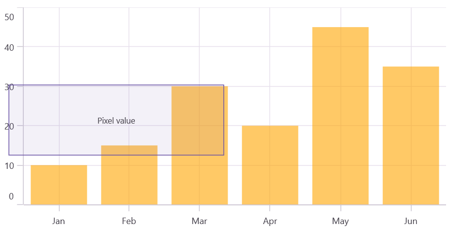

# Annotation in .NET MAUI Chart

[SfCartesianChart]() supports annotations that allow you to mark specific areas of interest in the chart area. It allows you to add text, images, and custom views.

The following annotations are supported in [SfCartesianChart]():

* Text annotation
* Shape annotation
* View annotation

## Adding Annotations

You can create an instance of any type of annotation and add it to the Annotations collection. For example, the [EllipseAnnotation]() can be added.





    <chart:SfCartesianChart>
    ...
        <chart:SfCartesianChart.Annotations>

            <chart:EllipseAnnotation X1="2" X2="4" Y1="10" Y2="15" Text="Ellipse"/>
        
        </chart:SfCartesianChart.Annotations>
    
    </chart:SfCartesianChart>





    SfCartesianChart chart = new SfCartesianChart();
    ...
    var ellipse = new EllipseAnnotation()
    {
        X1 = 2,
        Y1 = 10,
        X2 = 4,
        Y2 = 15,
        Text = "Ellipse"
    };

    chart.Annotations.Add(ellipse);

    this.Content = chart;





## Positioning the annotation

[Annotations]() can be positioned in the plot area based on the [X1]() and [Y1]() properties. For shape annotations, specify the [X2]() and [Y2]() properties, if needed. The X and Y values can be specified using axis units or pixel units, which can be identified by the [CoordinateUnit]() property.
 
## Positioning based on CoordinateUnit as pixels

To position the annotation based on pixel values, set the [CoordinateUnit]() value to [Pixels](). Then, set the pixel values in the [X1](),[Y1](), [X2](), and [Y2]() properties of the annotation, as shown in the following code snippet:



 

        <chart:SfCartesianChart>
        ...

        <chart:SfCartesianChart.Annotations>
        
        <chart:RectangleAnnotation X1="10" Y1="105" X2="300" Y2="200" Text="Pixel value" CoordinateUnit="Pixel"/>

    </chart:SfCartesianChart.Annotations>

        </chart:SfCartesianChart>

  


    
        SfCartesianChart chart = new SfCartesianChart();
        
        var rectangle = new RectangleAnnotation()
        {
            X1 = 10,
            Y1 = 105,
            X2 = 300,
            Y2 = 200,
            CoordinateUnit = ChartCoordinateUnit.Pixel,
            Text = "Pixel value"
        };

        chart.Annotations.Add(rectangle);

        this.Content = chart;





## Adding annotation for multiple axes

When there are multiple axes, annotations can be added to a particular axis using the [XAxisName]() and [YAxisName]() properties. This is demonstrated in the code snippet below:



 

    <chart:SfCartesianChart>
    ...

    <chart:SfCartesianChart.YAxes>
        <chart:NumericalAxis Minimum="0" Maximum="1"/>
        <chart:NumericalAxis Name="YAxis" CrossesAt="{Static x:Double.MaxValue}"/>
    </chart:SfCartesianChart.YAxes>

    <chart:SfCartesianChart.Annotations>

        <chart:EllipseAnnotation X1="2" X2="4" Y1="10" Y2="15" Text="Ellipse" YAxisName="YAxis"/>

    </chart:SfCartesianChart.Annotations>

    </chart:SfCartesianChart>

 



    SfCartesianChart chart = new SfCartesianChart();

    NumericalAxis yAxis1 = new NumericalAxis();
    yAxis1.Minimum = 0;
    yAxis1.Maximum = 1;
    chart.XAxes.Add(yAxis1);
    NumericalAxis yAxis2 = new NumericalAxis();
    yAxis2.Name = "YAxis";
    yAxis2.CrossesAt = double.MaxValue;
    chart.YAxes.Add(yAxis2);

    var ellipse = new EllipseAnnotation()
    {
        X1 = 2,
        Y1 = 10,
        X2 = 4,
        Y2 = 15,
        Text = "Ellipse",
        YAxisName = "YAxis"
    };

    chart.Annotations.Add(ellipse);

    this.Content = chart;





## Text annotation

The [TextAnnotation]() is used to add simple text at specific points in the chart area using the [Text]() property.



 

    <chart:SfCartesianChart>
    ...

        <chart:SfCartesianChart.Annotations>
        
            <chart:TextAnnotation X1="2" Y1="25" Text="Text Annotation"/>
            
        </chart:SfCartesianChart.Annotations>

    </chart:SfCartesianChart>
 



    SfCartesianChart chart = new SfCartesianChart();

    var text = new TextAnnotation()
    {
        X1 = 2,
        Y1 = 25,
        Text = "Text Annotation"    
    };

    chart.Annotations.Add(text);

    this.Content = chart;





## Text Customization

The [TextAnnotation]() can be customized using the [LabelStyle]() property. The [LabelStyle]() property provides options to customize the font-family, font-size, font-attributes and text color of axis labels. The following properties are used to customize the text:

* [TextColor]() - Gets or sets the color for the text of the label.
* [BackgroundColor]() -Gets or sets the background color of the labels.
* [Margin]() - Gets or sets the margin of the label to customize the appearance of label.
* [FontFamily]() -  Gets or sets the font family name for the label.
* [FontAttributes]() - Gets or sets the font style for the label.
* [FontSize]() - Gets or sets the font size for the label.
* [HorizontalTextAlignment]() - Aligns the text horizontally at the Start, Center, or End.
* [VerticalTextAlignment]() - Aligns the text vertically at the Start, Center, or End.

## Shape annotation

The [ShapeAnnotation]() allows you to add annotations in the form of shapes such as rectangles, ellipses, horizontal lines, vertical lines, etc., at specific areas of interest in the chart area.

* [RectangleAnnotation]() - Used to draw a rectangle over the chart area.
* [EllipseAnnotation]() - Used to draw a circle or an ellipse over the chart area.
* [LineAnnotation]() - Used to draw a line over the chart area.
* [VerticalLineAnnotation]() - Used to draw a vertical line across the chart area.
* [HorizontalLineAnnotation]() - Used to draw a horizontal line across the chart area.

The following APIs are commonly used in all ShapeAnnotation:

* [X2]() - Represents the X2 coordinate of the shape annotation.
* [Y2]() - Represents the Y2 coordinate of the shape annotation.
* [Fill]() - Represents the background color of the shape annotation.
* [Stroke]() - Represents the stroke color of the shape annotation.
* [StrokeWidth]() - Represents the stroke width of the shape annotation.
* [StrokeDashArray]() - Represents the stroke dash pattern of the shape annotation.
* [Text]() - Represents the annotation text of the shape annotation.
* [LabelStyle]() - Represents the style for customizing the annotation text of the shape annotation.

## Rectangle annotation

The [RectangleAnnotation]() is used to draw a rectangle or a square at specific points in the chart area.



 

    <chart:SfCartesianChart>
     ...

    <chart:SfCartesianChart.Annotations>
        <chart:RectangleAnnotation X1="1" Y1="40" X2="2" Y2="20"/>
    </chart:SfCartesianChart.Annotations>

    </chart:SfCartesianChart>





    SfCartesianChart chart = new SfCartesianChart();

    var rectangle = new RectangleAnnotation()
    {
        X1 = 1,
        Y1 = 40,
        X2 = 2,
        Y2 = 20,                
    };

    chart.Annotations.Add(rectangle);

    this.Content = chart;





## Ellipse annotation

The [EllipseAnnotation]() is used to draw an oval or a circle at specific points in the chart area. You can also specify the height and width of the [EllipseAnnotation]() by using the Height and Width properties, respectively.



 

    <chart:SfCartesianChart>
    ...
    <chart:SfCartesianChart.Annotations>
        <chart:EllipseAnnotation X1="2" X2="4" Y1="10" Y2="15"/>
    </chart:SfCartesianChart.Annotations>

    </chart:SfCartesianChart>

 



    SfCartesianChart chart = new SfCartesianChart();

    var ellipse = new EllipseAnnotation()
    {
        X1 = 2,
        Y1 = 10,
        X2 = 4,
        Y2 = 15,    
    };

    chart.Annotations.Add(ellipse);

    this.Content = chart;





N> When the [X2]() and [Y2]() properties of the [EllipseAnnotation]() are set, the [Height]() and [Width]() properties become ineffective.

## Line annotation

The [LineAnnotation]() is used to draw a line at specific points in the chart area.



 

    <chart:SfCartesianChart>
    ...

    <chart:SfCartesianChart.Annotations>
        <chart:LineAnnotation X1="0.5" Y1="10" X2="3.5" Y2="20" Text="Line"/>
    </chart:SfCartesianChart.Annotations>

    </chart:SfCartesianChart>

 



    SfCartesianChart chart = new SfCartesianChart();
    var line = new LineAnnotation()
    {
        X1 = 0.5,
        Y1 = 10,
        X2 = 3.5,
        Y2 = 20,
        Text = "Line"
    };

    chart.Annotations.Add(line);

    this.Content = chart;




   

## Vertical and Horizontal line annotation

The [VerticalLineAnnotation]() and [HorizontalLineAnnotation]() are used to draw vertical and horizontal lines at specific points in the chart area.



 

    <chart:SfCartesianChart>
    ...
        <chart:SfCartesianChart.Annotations>
            <chart:VerticalLineAnnotation X1="2"/>
            <chart:HorizontalLineAnnotation Y1="20"/>
        </chart:SfCartesianChart.Annotations>

    </chart:SfCartesianChart>

 



    SfCartesianChart chart = new SfCartesianChart();

    var vertical = new VerticalLineAnnotation()
    {
        X1 = 2,
    };

    var horizontal = new HorizontalLineAnnotation()
    {
        Y1 = 20,
    };

    chart.Annotations.Add(vertical);
    chart.Annotations.Add(horizontal);

    this.Content = chart;



  

## Displaying axis label for vertical and horizontal line annotations

The [VerticalLineAnnotation]() and [HorizontalLineAnnotation]() display the axis labels where the line is placed. The [ShowAxisLabel]() property is used to show or hide the axis’s label. This feature can be enabled by setting the [ShowAxisLabel]() property to true, as shown in the code snippet below:



 

    <chart:SfCartesianChart>
    ...
    <chart:SfCartesianChart.Annotations>
        <chart:VerticalLineAnnotation X1="2.5" ShowAxisLabel="True"/>
        <chart:HorizontalLineAnnotation Y1="25" ShowAxisLabel="True"/>
    </chart:SfCartesianChart.Annotations>

    </chart:SfCartesianChart>

 



    SfCartesianChart chart = new SfCartesianChart();

    var vertical = new VerticalLineAnnotation()
    {
        X1 = 2.5,
        ShowAxisLabel= true
    };

    var horizontal = new HorizontalLineAnnotation()
    {
        Y1 = 25,
        ShowAxisLabel= true
    };

    chart.Annotations.Add(vertical);
    chart.Annotations.Add(horizontal);

    this.Content = chart;



  

## Axis label customization

The default appearance of the axis label can also be customized using the [AxisLabelStyle]() property. The following styles are used to customize the axis label:

The [ChartLabelStyle]() property allows you to customize the axis labels by changing the font family, font size, font attributes, and text color. It is the default style for the [AxisLabelStyle]() property. The following properties can be used to customize the axis label:

* [TextColor]() - Gets or sets the color for the text of the label.
* [Background]() - Gets or sets the background color of the labels.
* [Margin]() -  Gets or sets the margin of the label to customize the appearance of label.
* [FontFamily]() -Gets or sets the font family name for the label.
* [FontAttributes]() -  Gets or sets the font style for the label.
* [FontSize]() - Gets or sets the font size for the label.

## Adding arrow to vertical and horizontal line annotations

To display a single-headed arrow, set the [LineCap]() property to [Arrow](). The default value of the [LineCap]() property is [None]().



 

    <chart:SfCartesianChart>
    ...
    <chart:SfCartesianChart.Annotations>
        <chart:VerticalLineAnnotation X1="2.5" LineCap="Arrow"/>
        <chart:HorizontalLineAnnotation Y1="25" LineCap="Arrow"/>
    </chart:SfCartesianChart.Annotations>

    </chart:SfCartesianChart>

 



    SfCartesianChart chart = new SfCartesianChart();

    var vertical = new VerticalLineAnnotation()
    {
        X1 = 2,
        LineCap = ChartLineCap.Arrow
    };

    var horizontal = new HorizontalLineAnnotation()
    {
        Y1 = 20,
        LineCap = ChartLineCap.Arrow
    };

    chart.Annotations.Add(vertical);
    chart.Annotations.Add(horizontal);

    this.Content = chart;



  

N> The [LineCap]() is applicable to line, horizontal, and vertical annotations by setting [LineCap]() to '[Arrow]()'.

## Adding text in shape annotation

For all shape annotations, the text can be displayed using the [Text]() property.





    <chart:SfCartesianChart>
    ...
        <chart:SfCartesianChart.Annotations>

        <chart:EllipseAnnotation X1="2" X2="4" Y1="10" Y2="15" Text="Ellipse"/>
        
        </chart:SfCartesianChart.Annotations>
    
    </chart:SfCartesianChart>





    SfCartesianChart chart = new SfCartesianChart();
    ...
    var ellipse = new EllipseAnnotation()
    {
        X1 = 2,
        Y1 = 10,
        X2 = 4,
        Y2 = 15,
        Text = "Ellipse"
    };

    chart.Annotations.Add(ellipse);

    this.Content = chart;





## Text customization in shape annotation

The [Text]() in shape annotation also can be customized by using the [LabelStyle]() property. The [LabelStyle]() property provides options to customize the font-family, font-size, font-attributes and text color of axis labels. The following properties are used to customize the text:

* [TextColor]() - Gets or sets the color for the text of the label.
* [Background]() - Gets or sets the background color of the labels.
* [Margin]() - Gets or sets the margin of the label to customize the appearance of label.
* [FontFamily]() - Gets or sets the font family name for the label.
* [FontAttributes]() - Gets or sets the font style for the label.
* [FontSize]() - Gets or sets the font size for the label.
* [HorizontalTextAlignment]() - Used to align the text horizontally.
* [VerticalTextAlignment]() - Used to align the text vertically.

## View annotation

The [ViewAnnotation]() allows you to add annotations in the form of your own custom view using the [View]() property at a specific area of interest in the chart area. Additionally, the [ViewAnnotation]() can be aligned using the [VerticalAlignment]() and [HorizontalAlignment]() properties.





    <chart:SfCartesianChart>
    ...
        <chart:SfCartesianChart.Annotations>
            <chart:ViewAnnotation X1="3" Y1="30">
                    <chart:ViewAnnotation.View>
                        <Image Source="cloud.png"/>
                    </chart:ViewAnnotation.View>
            </chart:ViewAnnotation>
        </chart:SfCartesianChart.Annotations>
    </chart:SfCartesianChart>





    SfCartesianChart chart = new SfCartesianChart();
    ...

    var viewAnnotation = new ViewAnnotation()
    {
        X1 = 3,
        Y1 = 30,
        View = new Image { Source = "cloud.png" }
    };

    chart.Annotations.Add(viewAnnotation);

    this.Content = chart;





## Annotation Visibility

The [IsVisible]() property of [ChartAnnotation]() is used to toggle the visibility of the annotation.





    <chart:SfCartesianChart>
    ...

        <chart:SfCartesianChart.Annotations>
            <chart:EllipseAnnotation X1="2" X2="4" Y1="10" Y2="15" Text="Ellipse" IsVisible="False"/>
        </chart:SfCartesianChart.Annotations>

    </chart:SfCartesianChart>





    SfCartesianChart chart = new SfCartesianChart();
    ...
    var ellipse = new EllipseAnnotation()
    {
        X1 = 2,
        Y1 = 10,
        X2 = 4,
        Y2 = 15,
        Text = "Ellipse",
        IsVisible = false
    };

    chart.Annotations.Add(ellipse);

    this.Content = chart;




