# Annotations in .NET MAUI Chart

[SfCartesianChart](https://help.syncfusion.com/cr/maui/Syncfusion.Maui.Charts.SfCartesianChart.html) provides annotation support that allows you to mark specific areas of interest in the chart area. This feature enables you to add text, images, and custom views using the following annotations.

* Text annotation
* Shape annotation
* View annotation

To learn how to add and customize annotations in .NET MAUI Cartesian Charts quickly, you can check the below video.



## Adding Annotations

To add annotations, create an instance of any type of annotation and add it to the [Annotations](https://help.syncfusion.com/cr/maui/Syncfusion.Maui.Charts.SfCartesianChart.html#Syncfusion_Maui_Charts_SfCartesianChart_Annotations) collection. For example, the [EllipseAnnotation](https://help.syncfusion.com/cr/maui/Syncfusion.Maui.Charts.EllipseAnnotation.html) can be added.





<chart:SfCartesianChart>
    ...
    <chart:SfCartesianChart.Annotations>
        <chart:EllipseAnnotation X1="2" X2="4" Y1="10" Y2="15" Text="Ellipse"/>        
    </chart:SfCartesianChart.Annotations>    
</chart:SfCartesianChart>





SfCartesianChart chart = new SfCartesianChart();
...
var ellipse = new EllipseAnnotation()
{
    X1 = 2,
    Y1 = 10,
    X2 = 4,
    Y2 = 15,
    Text = "Ellipse"
};

chart.Annotations.Add(ellipse);
this.Content = chart;





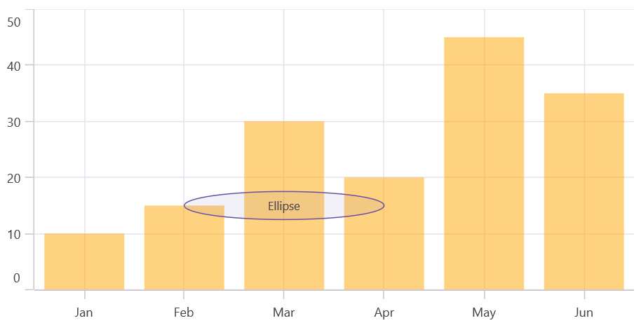

## Positioning the annotation

[Annotations](https://help.syncfusion.com/cr/maui/Syncfusion.Maui.Charts.SfCartesianChart.html#Syncfusion_Maui_Charts_SfCartesianChart_Annotations) can be positioned in the plot area based on the [X1](https://help.syncfusion.com/cr/maui/Syncfusion.Maui.Charts.ChartAnnotation.html#Syncfusion_Maui_Charts_ChartAnnotation_X1) and [Y1](https://help.syncfusion.com/cr/maui/Syncfusion.Maui.Charts.ChartAnnotation.html#Syncfusion_Maui_Charts_ChartAnnotation_Y1) properties. For shape annotations, specify the [X2](https://help.syncfusion.com/cr/maui/Syncfusion.Maui.Charts.ShapeAnnotation.html#Syncfusion_Maui_Charts_ShapeAnnotation_X2) and [Y2](https://help.syncfusion.com/cr/maui/Syncfusion.Maui.Charts.ShapeAnnotation.html#Syncfusion_Maui_Charts_ShapeAnnotation_Y2) properties, if needed. The X and Y values can be specified using axis units or pixel units, which can be identified by the [CoordinateUnit](https://help.syncfusion.com/cr/maui/Syncfusion.Maui.Charts.ChartAnnotation.html#Syncfusion_Maui_Charts_ChartAnnotation_CoordinateUnit) property, as shown in the following code snippet:





<chart:SfCartesianChart>
    ...
    <chart:SfCartesianChart.Annotations>        
        <chart:RectangleAnnotation X1="0" Y1="100" X2="300" Y2="400" Text="Pixel value" CoordinateUnit="Pixel"/>
    </chart:SfCartesianChart.Annotations>
</chart:SfCartesianChart>




    
SfCartesianChart chart = new SfCartesianChart(); 
. . .    
var rectangle = new RectangleAnnotation()
{
    X1 = 0,
    Y1 = 100,
    X2 = 300,
    Y2 = 400,
    CoordinateUnit = ChartCoordinateUnit.Pixel,
    Text = "Pixel value"
};

chart.Annotations.Add(rectangle);
this.Content = chart;





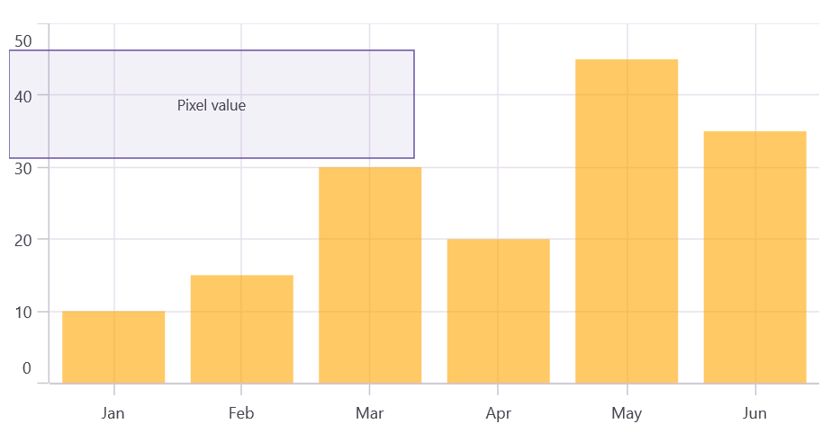

## Adding annotation for multiple axes

When there are multiple axes, annotations can be added to a particular axis using the [XAxisName](https://help.syncfusion.com/cr/maui/Syncfusion.Maui.Charts.ChartAnnotation.html#Syncfusion_Maui_Charts_ChartAnnotation_XAxisName) and [YAxisName](https://help.syncfusion.com/cr/maui/Syncfusion.Maui.Charts.ChartAnnotation.html#Syncfusion_Maui_Charts_ChartAnnotation_YAxisName) properties. This is demonstrated in the code snippet below:





<chart:SfCartesianChart>
    ...
    <chart:SfCartesianChart.YAxes>
        <chart:NumericalAxis Minimum="0" Maximum="1"/>
        <chart:NumericalAxis Name="YAxis" CrossesAt="{Static x:Double.MaxValue}"/>
    </chart:SfCartesianChart.YAxes>

    <chart:SfCartesianChart.Annotations>
        <chart:EllipseAnnotation X1="2" X2="4" Y1="10" Y2="15" Text="Ellipse" YAxisName="YAxis"/>
    </chart:SfCartesianChart.Annotations>
</chart:SfCartesianChart>





SfCartesianChart chart = new SfCartesianChart();
. . .    
NumericalAxis yAxis1 = new NumericalAxis();
yAxis1.Minimum = 0;
yAxis1.Maximum = 1;
chart.YAxes.Add(yAxis1);

NumericalAxis yAxis2 = new NumericalAxis();
yAxis2.Name = "YAxis";
yAxis2.CrossesAt = double.MaxValue;
chart.YAxes.Add(yAxis2);

var ellipse = new EllipseAnnotation()
{
    X1 = 2,
    Y1 = 10,
    X2 = 4,
    Y2 = 15,
    Text = "Ellipse",
    YAxisName = "YAxis"
};

chart.Annotations.Add(ellipse);
this.Content = chart;





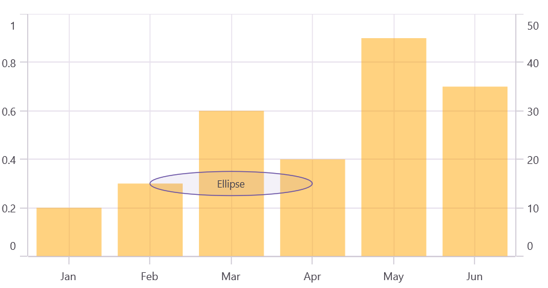

## Text annotation

The [TextAnnotation](https://help.syncfusion.com/cr/maui/Syncfusion.Maui.Charts.TextAnnotation.html) is used to add simple text at specific points in the chart area using the [Text](https://help.syncfusion.com/cr/maui/Syncfusion.Maui.Charts.TextAnnotation.html#Syncfusion_Maui_Charts_TextAnnotation_Text) property.





<chart:SfCartesianChart>
    ...
    <chart:SfCartesianChart.Annotations>
        <chart:TextAnnotation X1="2" Y1="25" Text="Text Annotation"/>
    </chart:SfCartesianChart.Annotations>
</chart:SfCartesianChart>





SfCartesianChart chart = new SfCartesianChart();
. . .    
var text = new TextAnnotation()
{
    X1 = 2,
    Y1 = 25,
    Text = "Text Annotation"    
};

chart.Annotations.Add(text);
this.Content = chart;





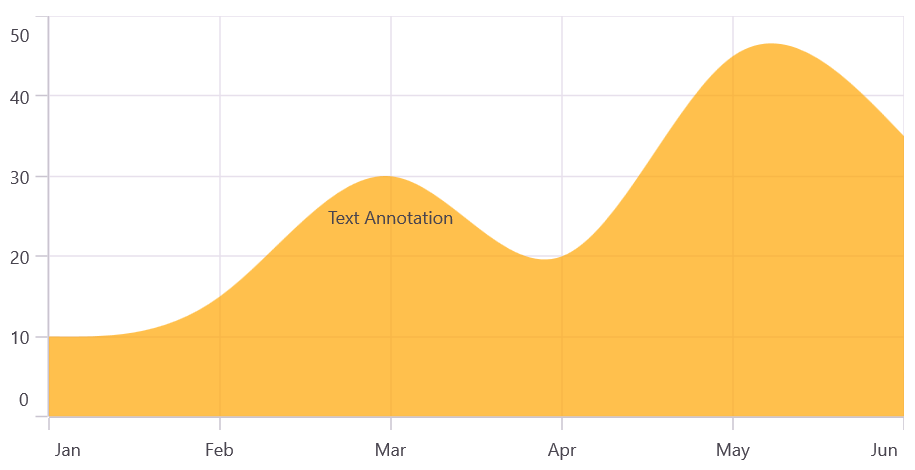

## Text Customization

The [TextAnnotation](https://help.syncfusion.com/cr/maui/Syncfusion.Maui.Charts.TextAnnotation.html) can be customized using the [LabelStyle](https://help.syncfusion.com/cr/maui/Syncfusion.Maui.Charts.TextAnnotation.html#Syncfusion_Maui_Charts_TextAnnotation_LabelStyle) property. The [LabelStyle](https://help.syncfusion.com/cr/maui/Syncfusion.Maui.Charts.TextAnnotation.html#Syncfusion_Maui_Charts_TextAnnotation_LabelStyle) property provides options to customize the font-family, font-size, font-attributes, and text color of axis labels. The following properties are used to customize the text:

* [TextColor](https://help.syncfusion.com/cr/maui/Syncfusion.Maui.Charts.ChartLabelStyle.html#Syncfusion_Maui_Charts_ChartLabelStyle_TextColor) - Gets or sets the text color of the label.
* [Background](https://help.syncfusion.com/cr/maui/Syncfusion.Maui.Charts.ChartLabelStyle.html#Syncfusion_Maui_Charts_ChartLabelStyle_Background) - Gets or sets the background color of the labels.
* [Margin](https://help.syncfusion.com/cr/maui/Syncfusion.Maui.Charts.ChartLabelStyle.html#Syncfusion_Maui_Charts_ChartLabelStyle_Margin) - Gets or sets the margin of the label to customize the appearance of label.
* [FontFamily](https://help.syncfusion.com/cr/maui/Syncfusion.Maui.Charts.ChartLabelStyle.html#Syncfusion_Maui_Charts_ChartLabelStyle_FontFamily) -  Gets or sets the font family name for the label.
* [FontAttributes](https://help.syncfusion.com/cr/maui/Syncfusion.Maui.Charts.ChartLabelStyle.html#Syncfusion_Maui_Charts_ChartLabelStyle_FontAttributes) - Gets or sets the font style for the label.
* [FontSize](https://help.syncfusion.com/cr/maui/Syncfusion.Maui.Charts.ChartLabelStyle.html#Syncfusion_Maui_Charts_ChartLabelStyle_FontSize) - Gets or sets the font size for the label.
* [HorizontalTextAlignment](https://help.syncfusion.com/cr/maui/Syncfusion.Maui.Charts.ChartAnnotationLabelStyle.html#Syncfusion_Maui_Charts_ChartAnnotationLabelStyle_HorizontalTextAlignment) - Gets or sets the horizontal alignment of the label.
* [VerticalTextAlignment](https://help.syncfusion.com/cr/maui/Syncfusion.Maui.Charts.ChartAnnotationLabelStyle.html#Syncfusion_Maui_Charts_ChartAnnotationLabelStyle_VerticalTextAlignment) - Gets or sets the vertical alignment of the label.
  
## Shape annotation

The [ShapeAnnotation](https://help.syncfusion.com/cr/maui/Syncfusion.Maui.Charts.ShapeAnnotation.html) allows you to add annotations in the form of shapes such as rectangles, ellipses, lines, horizontal lines, and vertical lines at specific areas of interest in the chart area.

* [RectangleAnnotation](https://help.syncfusion.com/cr/maui/Syncfusion.Maui.Charts.RectangleAnnotation.html) - Used to draw a rectangle over the chart area.
* [EllipseAnnotation](https://help.syncfusion.com/cr/maui/Syncfusion.Maui.Charts.EllipseAnnotation.html) - Used to draw a circle or an ellipse over the chart area.
* [LineAnnotation](https://help.syncfusion.com/cr/maui/Syncfusion.Maui.Charts.LineAnnotation.html) - Used to draw a line over the chart area.
* [VerticalLineAnnotation](https://help.syncfusion.com/cr/maui/Syncfusion.Maui.Charts.VerticalLineAnnotation.html) - Used to draw a vertical line across the chart area.
* [HorizontalLineAnnotation](https://help.syncfusion.com/cr/maui/Syncfusion.Maui.Charts.HorizontalLineAnnotation.html) - Used to draw a horizontal line across the chart area.

The following APIs are commonly used in all ShapeAnnotation:

* [X2](https://help.syncfusion.com/cr/maui/Syncfusion.Maui.Charts.ShapeAnnotation.html#Syncfusion_Maui_Charts_ShapeAnnotation_X2) - Gets or sets the X2 coordinate of the shape annotation.
* [Y2](https://help.syncfusion.com/cr/maui/Syncfusion.Maui.Charts.ShapeAnnotation.html#Syncfusion_Maui_Charts_ShapeAnnotation_Y2) - Gets or sets the Y2 coordinate of the shape annotation.
* [Fill](https://help.syncfusion.com/cr/maui/Syncfusion.Maui.Charts.ShapeAnnotation.html#Syncfusion_Maui_Charts_ShapeAnnotation_Fill) - Gets or sets the background color of the shape annotation.
* [Stroke](https://help.syncfusion.com/cr/maui/Syncfusion.Maui.Charts.ShapeAnnotation.html#Syncfusion_Maui_Charts_ShapeAnnotation_Stroke) - Gets or sets the stroke color of the shape annotation.
* [StrokeWidth](https://help.syncfusion.com/cr/maui/Syncfusion.Maui.Charts.ShapeAnnotation.html#Syncfusion_Maui_Charts_ShapeAnnotation_StrokeWidth) - Gets or sets the stroke width of the shape annotation.
* [StrokeDashArray](https://help.syncfusion.com/cr/maui/Syncfusion.Maui.Charts.ShapeAnnotation.html#Syncfusion_Maui_Charts_ShapeAnnotation_StrokeDashArray) - Gets or sets the stroke dash pattern of the shape annotation.
* [Text](https://help.syncfusion.com/cr/maui/Syncfusion.Maui.Charts.ShapeAnnotation.html#Syncfusion_Maui_Charts_ShapeAnnotation_Text) - Gets or sets the annotation text of the shape annotation.
* [LabelStyle](https://help.syncfusion.com/cr/maui/Syncfusion.Maui.Charts.ShapeAnnotation.html#Syncfusion_Maui_Charts_ShapeAnnotation_LabelStyle) - Gets or sets the style for customizing the annotation text of the shape annotation.

## Rectangle annotation

The [RectangleAnnotation](https://help.syncfusion.com/cr/maui/Syncfusion.Maui.Charts.RectangleAnnotation.html) is used to draw a rectangle or a square at specific points in the chart area.





<chart:SfCartesianChart>
    ...
    <chart:SfCartesianChart.Annotations>
        <chart:RectangleAnnotation X1="1" Y1="40" X2="2" Y2="20"/>
    </chart:SfCartesianChart.Annotations>
</chart:SfCartesianChart>





SfCartesianChart chart = new SfCartesianChart();
. . . 
var rectangle = new RectangleAnnotation()
{
    X1 = 1,
    Y1 = 40,
    X2 = 2,
    Y2 = 20,                
};

chart.Annotations.Add(rectangle);
this.Content = chart;





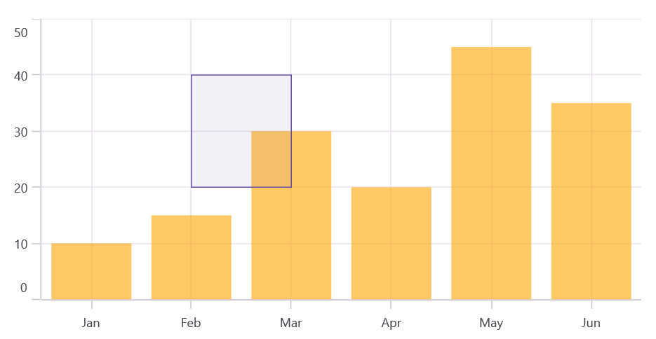

## Ellipse annotation

The [EllipseAnnotation](https://help.syncfusion.com/cr/maui/Syncfusion.Maui.Charts.EllipseAnnotation.html) is used to draw an oval or a circle at specific points in the chart area. You can also specify the height and width of the [EllipseAnnotation](https://help.syncfusion.com/cr/maui/Syncfusion.Maui.Charts.EllipseAnnotation.html) by using the [Height](https://help.syncfusion.com/cr/maui/Syncfusion.Maui.Charts.EllipseAnnotation.html#Syncfusion_Maui_Charts_EllipseAnnotation_Height) and [Width](https://help.syncfusion.com/cr/maui/Syncfusion.Maui.Charts.EllipseAnnotation.html#Syncfusion_Maui_Charts_EllipseAnnotation_Width) properties, respectively.





<chart:SfCartesianChart>
    ...
    <chart:SfCartesianChart.Annotations>
        <chart:EllipseAnnotation X1="2" X2="4" Y1="10" Y2="15" Width="20" Height="20"/>
    </chart:SfCartesianChart.Annotations>
</chart:SfCartesianChart>

 



SfCartesianChart chart = new SfCartesianChart();
. . .
var ellipse = new EllipseAnnotation()
{
    X1 = 2,
    Y1 = 10,
    X2 = 4,
    Y2 = 15,    
    Width = 20,
    Height = 20
};

chart.Annotations.Add(ellipse);
this.Content = chart;





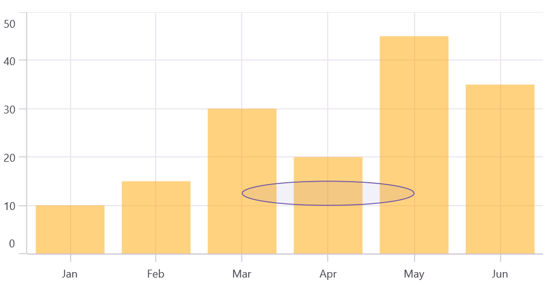

N> When the [X2](https://help.syncfusion.com/cr/maui/Syncfusion.Maui.Charts.ShapeAnnotation.html#Syncfusion_Maui_Charts_ShapeAnnotation_X2) and [Y2](https://help.syncfusion.com/cr/maui/Syncfusion.Maui.Charts.ShapeAnnotation.html#Syncfusion_Maui_Charts_ShapeAnnotation_Y2) properties of the [EllipseAnnotation](https://help.syncfusion.com/cr/maui/Syncfusion.Maui.Charts.EllipseAnnotation.html) are set, the [Height](https://help.syncfusion.com/cr/maui/Syncfusion.Maui.Charts.EllipseAnnotation.html#Syncfusion_Maui_Charts_EllipseAnnotation_Height) and [Width](https://help.syncfusion.com/cr/maui/Syncfusion.Maui.Charts.EllipseAnnotation.html#Syncfusion_Maui_Charts_EllipseAnnotation_Width) properties become ineffective.

## Line annotation

The [LineAnnotation](https://help.syncfusion.com/cr/maui/Syncfusion.Maui.Charts.LineAnnotation.html) is used to draw a line at specific points in the chart area.





<chart:SfCartesianChart>
    ...
    <chart:SfCartesianChart.Annotations>
        <chart:LineAnnotation X1="0.5" Y1="10" X2="3.5" Y2="20" Text="Line"/>
    </chart:SfCartesianChart.Annotations>
</chart:SfCartesianChart>

 



SfCartesianChart chart = new SfCartesianChart();
. . . 
var line = new LineAnnotation()
{
    X1 = 0.5,
    Y1 = 10,
    X2 = 3.5,
    Y2 = 20,
    Text = "Line"
};

chart.Annotations.Add(line);
this.Content = chart;




   
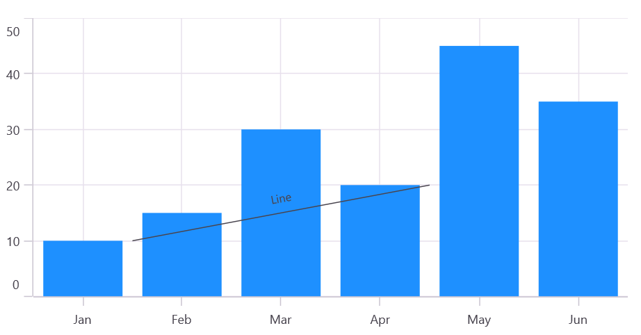

## Vertical and Horizontal line annotations

The [VerticalLineAnnotation](https://help.syncfusion.com/cr/maui/Syncfusion.Maui.Charts.VerticalLineAnnotation.html) and [HorizontalLineAnnotation](https://help.syncfusion.com/cr/maui/Syncfusion.Maui.Charts.HorizontalLineAnnotation.html) are used to draw vertical and horizontal lines at specific points in the chart area.





<chart:SfCartesianChart>
    ...
    <chart:SfCartesianChart.Annotations>
        <chart:VerticalLineAnnotation X1="2"/>
        <chart:HorizontalLineAnnotation Y1="20"/>
    </chart:SfCartesianChart.Annotations>
</chart:SfCartesianChart>

 



SfCartesianChart chart = new SfCartesianChart();
. . .
var verticalLineAnnotation = new VerticalLineAnnotation()
{
    X1 = 2,
};

var horizontalLineAnnotation = new HorizontalLineAnnotation()
{
    Y1 = 20,
};

chart.Annotations.Add(verticalLineAnnotation);
chart.Annotations.Add(horizontalLineAnnotation);
this.Content = chart;



  

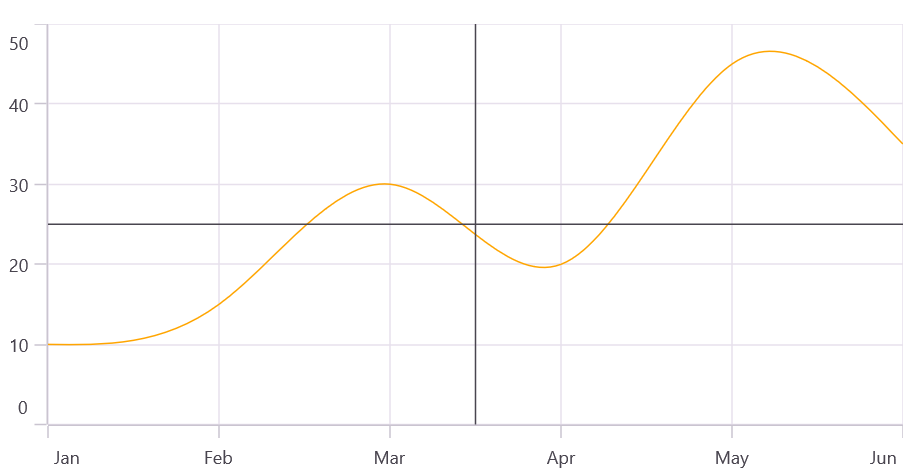

## Displaying axis label for vertical and horizontal line annotations

The [VerticalLineAnnotation](https://help.syncfusion.com/cr/maui/Syncfusion.Maui.Charts.VerticalLineAnnotation.html) and [HorizontalLineAnnotation](https://help.syncfusion.com/cr/maui/Syncfusion.Maui.Charts.HorizontalLineAnnotation.html) allow for the display of axis labels at the line's position using the [ShowAxisLabel](https://help.syncfusion.com/cr/maui/Syncfusion.Maui.Charts.VerticalLineAnnotation.html#Syncfusion_Maui_Charts_VerticalLineAnnotation_ShowAxisLabel) property. The default value of the [ShowAxisLabel](https://help.syncfusion.com/cr/maui/Syncfusion.Maui.Charts.HorizontalLineAnnotation.html#Syncfusion_Maui_Charts_HorizontalLineAnnotation_ShowAxisLabel) property is 'false' as shown in the code snippet below:





<chart:SfCartesianChart>
    ...
    <chart:SfCartesianChart.Annotations>
        <chart:VerticalLineAnnotation X1="2.5" ShowAxisLabel="True"/>
        <chart:HorizontalLineAnnotation Y1="25" ShowAxisLabel="True"/>
    </chart:SfCartesianChart.Annotations>
</chart:SfCartesianChart>

 



SfCartesianChart chart = new SfCartesianChart();
. . .
var verticalLineAnnotation = new VerticalLineAnnotation()
{
    X1 = 2.5,
    ShowAxisLabel = true
};

var horizontalLineAnnotation = new HorizontalLineAnnotation()
{
    Y1 = 25,
    ShowAxisLabel = true
};

chart.Annotations.Add(verticalLineAnnotation);
chart.Annotations.Add(horizontalLineAnnotation);
this.Content = chart;



  

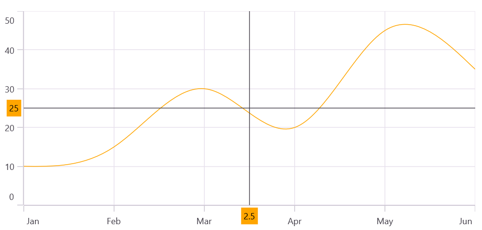

## Axis label customization

The default appearance of the axis label can also be customized using the [AxisLabelStyle](https://help.syncfusion.com/cr/maui/Syncfusion.Maui.Charts.HorizontalLineAnnotation.html#Syncfusion_Maui_Charts_HorizontalLineAnnotation_AxisLabelStyle) property. The [AxisLabelStyle](https://help.syncfusion.com/cr/maui/Syncfusion.Maui.Charts.HorizontalLineAnnotation.html#Syncfusion_Maui_Charts_HorizontalLineAnnotation_AxisLabelStyle) property allows you to customize the axis labels by changing the font family, font size, font attributes, and text color. The following styles are used to customize the axis label:

* [TextColor](https://help.syncfusion.com/cr/maui/Syncfusion.Maui.Charts.ChartLabelStyle.html#Syncfusion_Maui_Charts_ChartLabelStyle_TextColor) - Gets or sets the text color of the label.
* [Background](https://help.syncfusion.com/cr/maui/Syncfusion.Maui.Charts.ChartLabelStyle.html#Syncfusion_Maui_Charts_ChartLabelStyle_Background) - Gets or sets the background color of the labels.
* [Margin](https://help.syncfusion.com/cr/maui/Syncfusion.Maui.Charts.ChartLabelStyle.html#Syncfusion_Maui_Charts_ChartLabelStyle_Margin) - Gets or sets the margin of the label to customize the appearance of label.
* [FontFamily](https://help.syncfusion.com/cr/maui/Syncfusion.Maui.Charts.ChartLabelStyle.html#Syncfusion_Maui_Charts_ChartLabelStyle_FontFamily) - Gets or sets the font family name for the label.
* [FontAttributes](https://help.syncfusion.com/cr/maui/Syncfusion.Maui.Charts.ChartLabelStyle.html#Syncfusion_Maui_Charts_ChartLabelStyle_FontAttributes) - Gets or sets the font style for the label.
* [FontSize](https://help.syncfusion.com/cr/maui/Syncfusion.Maui.Charts.ChartLabelStyle.html#Syncfusion_Maui_Charts_ChartLabelStyle_FontSize) - Gets or sets the font size for the label.

## Adding arrow to vertical and horizontal line annotations

To display a single-headed arrow, set the [LineCap](https://help.syncfusion.com/cr/maui/Syncfusion.Maui.Charts.LineAnnotation.html#Syncfusion_Maui_Charts_LineAnnotation_LineCap) property to [Arrow](https://help.syncfusion.com/cr/maui/Syncfusion.Maui.Charts.ChartLineCap.html#Syncfusion_Maui_Charts_ChartLineCap_Arrow). The default value of the [LineCap](https://help.syncfusion.com/cr/maui/Syncfusion.Maui.Charts.LineAnnotation.html#Syncfusion_Maui_Charts_LineAnnotation_LineCap) property is [None](https://help.syncfusion.com/cr/maui/Syncfusion.Maui.Charts.ChartLineCap.html#Syncfusion_Maui_Charts_ChartLineCap_None).





<chart:SfCartesianChart>
    ...
    <chart:SfCartesianChart.Annotations>
        <chart:VerticalLineAnnotation X1="2.5" LineCap="Arrow"/>
        <chart:HorizontalLineAnnotation Y1="25" LineCap="Arrow"/>
    </chart:SfCartesianChart.Annotations>
</chart:SfCartesianChart>

 



SfCartesianChart chart = new SfCartesianChart();
. . .
var verticalLineAnnotation = new VerticalLineAnnotation()
{
    X1 = 2.5,
    LineCap = ChartLineCap.Arrow
};

var horizontalLineAnnotation = new HorizontalLineAnnotation()
{
    Y1 = 25,
    LineCap = ChartLineCap.Arrow
};

chart.Annotations.Add(verticalLineAnnotation);
chart.Annotations.Add(horizontalLineAnnotation);
this.Content = chart;



  

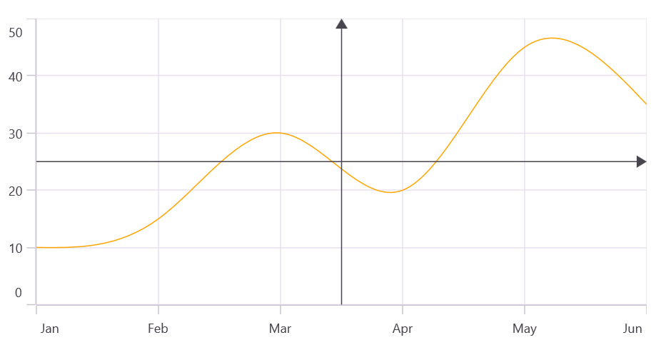

N> The [LineCap](https://help.syncfusion.com/cr/maui/Syncfusion.Maui.Charts.LineAnnotation.html#Syncfusion_Maui_Charts_LineAnnotation_LineCap) is applicable to line, horizontal, and vertical annotations.

## Adding text in shape annotation

For all shape annotations, the text can be displayed using the [Text](https://help.syncfusion.com/cr/maui/Syncfusion.Maui.Charts.ShapeAnnotation.html#Syncfusion_Maui_Charts_ShapeAnnotation_Text) property.





<chart:SfCartesianChart>
    ...
    <chart:SfCartesianChart.Annotations>
        <chart:EllipseAnnotation X1="2" X2="4" Y1="10" Y2="15" Text="Ellipse"/>
    </chart:SfCartesianChart.Annotations>
</chart:SfCartesianChart>





SfCartesianChart chart = new SfCartesianChart();
...
var ellipseAnnotation = new EllipseAnnotation()
{
    X1 = 2,
    Y1 = 10,
    X2 = 4,
    Y2 = 15,
    Text = "Ellipse"
};

chart.Annotations.Add(ellipseAnnotation);
this.Content = chart;





## Text customization in shape annotation

The [Text](https://help.syncfusion.com/cr/maui/Syncfusion.Maui.Charts.ShapeAnnotation.html#Syncfusion_Maui_Charts_ShapeAnnotation_Text) in shape annotation also can be customized by using the [LabelStyle](https://help.syncfusion.com/cr/maui/Syncfusion.Maui.Charts.ShapeAnnotation.html#Syncfusion_Maui_Charts_ShapeAnnotation_LabelStyle) property. The [LabelStyle](https://help.syncfusion.com/cr/maui/Syncfusion.Maui.Charts.ShapeAnnotation.html#Syncfusion_Maui_Charts_ShapeAnnotation_LabelStyle) property provides options to customize the font-family, font-size, font-attributes and text color of axis labels.

* [TextColor](https://help.syncfusion.com/cr/maui/Syncfusion.Maui.Charts.ChartLabelStyle.html#Syncfusion_Maui_Charts_ChartLabelStyle_TextColor) - Gets or sets the text color of the label.
* [Background](https://help.syncfusion.com/cr/maui/Syncfusion.Maui.Charts.ChartLabelStyle.html#Syncfusion_Maui_Charts_ChartLabelStyle_Background) - Gets or sets the background color of the labels.
* [Margin](https://help.syncfusion.com/cr/maui/Syncfusion.Maui.Charts.ChartLabelStyle.html#Syncfusion_Maui_Charts_ChartLabelStyle_Margin) - Gets or sets the margin of the label to customize the appearance of label.
* [FontFamily](https://help.syncfusion.com/cr/maui/Syncfusion.Maui.Charts.ChartLabelStyle.html#Syncfusion_Maui_Charts_ChartLabelStyle_FontFamily) - Gets or sets the font family name for the label.
* [FontAttributes](https://help.syncfusion.com/cr/maui/Syncfusion.Maui.Charts.ChartLabelStyle.html#Syncfusion_Maui_Charts_ChartLabelStyle_FontAttributes) - Gets or sets the font style for the label.
* [FontSize](https://help.syncfusion.com/cr/maui/Syncfusion.Maui.Charts.ChartLabelStyle.html#Syncfusion_Maui_Charts_ChartLabelStyle_FontSize) - Gets or sets the font size for the label.
* [HorizontalTextAlignment](https://help.syncfusion.com/cr/maui/Syncfusion.Maui.Charts.ChartAnnotationLabelStyle.html#Syncfusion_Maui_Charts_ChartAnnotationLabelStyle_HorizontalTextAlignment) -  Gets or sets the horizontal alignment of the label.
* [VerticalTextAlignment](https://help.syncfusion.com/cr/maui/Syncfusion.Maui.Charts.ChartAnnotationLabelStyle.html#Syncfusion_Maui_Charts_ChartAnnotationLabelStyle_VerticalTextAlignment) - Gets or sets the vertical alignment of the label.
  
## View annotation

The [ViewAnnotation](https://help.syncfusion.com/cr/maui/Syncfusion.Maui.Charts.ViewAnnotation.html) allows you to add annotations in the form of your own custom view using the [View](https://help.syncfusion.com/cr/maui/Syncfusion.Maui.Charts.ViewAnnotation.html#Syncfusion_Maui_Charts_ViewAnnotation_View) property at a specific area of interest in the chart area. Additionally, the [ViewAnnotation](https://help.syncfusion.com/cr/maui/Syncfusion.Maui.Charts.ViewAnnotation.html) can be aligned using the [VerticalAlignment](https://help.syncfusion.com/cr/maui/Syncfusion.Maui.Charts.ViewAnnotation.html#Syncfusion_Maui_Charts_ViewAnnotation_VerticalAlignment) and [HorizontalAlignment](https://help.syncfusion.com/cr/maui/Syncfusion.Maui.Charts.ViewAnnotation.html#Syncfusion_Maui_Charts_ViewAnnotation_HorizontalAlignment) properties.





<chart:SfCartesianChart>
    ...
    <chart:SfCartesianChart.Annotations>
        <chart:ViewAnnotation X1="3" Y1="30">
            <chart:ViewAnnotation.View>
                <Image Source="cloud.png"/>
            </chart:ViewAnnotation.View>
        </chart:ViewAnnotation>
    </chart:SfCartesianChart.Annotations>
</chart:SfCartesianChart>





SfCartesianChart chart = new SfCartesianChart();
...
var viewAnnotation = new ViewAnnotation()
{
    X1 = 3,
    Y1 = 30,
    View = new Image() { Source = "cloud.png" };
};

chart.Annotations.Add(viewAnnotation);
this.Content = chart;




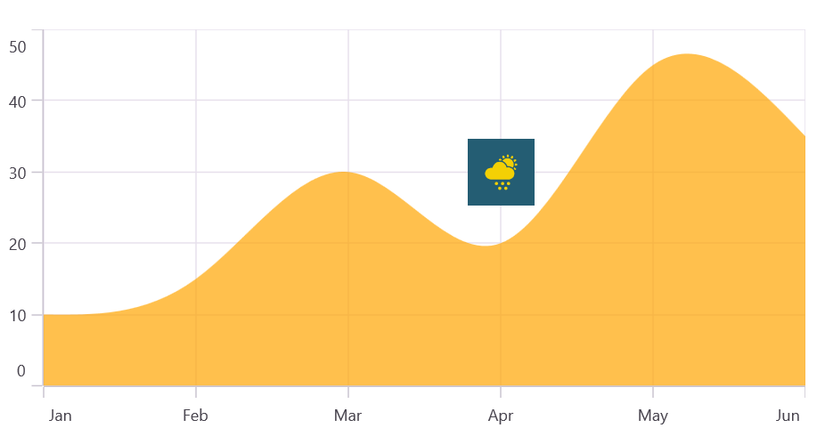

## Annotation Visibility

The [IsVisible](https://help.syncfusion.com/cr/maui/Syncfusion.Maui.Charts.ChartAnnotation.html#Syncfusion_Maui_Charts_ChartAnnotation_IsVisible) property of [ChartAnnotation](https://help.syncfusion.com/cr/maui/Syncfusion.Maui.Charts.ChartAnnotation.html) is used to toggle the visibility of the annotation.





<chart:SfCartesianChart>
    ...
    <chart:SfCartesianChart.Annotations>
        <chart:EllipseAnnotation X1="2" X2="4" Y1="10" Y2="15" Text="Ellipse" IsVisible="False"/>
    </chart:SfCartesianChart.Annotations>
</chart:SfCartesianChart>





SfCartesianChart chart = new SfCartesianChart();
...
var ellipseAnnotation = new EllipseAnnotation()
{
    X1 = 2,
    Y1 = 10,
    X2 = 4,
    Y2 = 15,
    Text = "Ellipse",
    IsVisible = false
};

chart.Annotations.Add(ellipse);
this.Content = chart;





## Event

**AnnotationTapped**

The [`AnnotationTapped`]() event is triggered when the user has clicked the annotation. The argument [`AnnotationTappedEventArgs`]() contains the following information.

* [`annotation`]() – used to get the instance of the annotation that was tapped.
* [`x`]() – used to get the x position of touch point on annotation.
* [`y`]() – used to get the y position of touch point on annotation.

## Public Methods

The following override methods are available in the annotation class to handle touch interactions:

* [`OnTouchDown`]() – occurs when touch down inside the annotation.
* [`OnTouchMove`]() – occurs while moving the finger or mouse inside the annotation.
* [`OnTouchUp`]() – occurs when touch up inside the annotation.





public class LineAnnotationExt : LineAnnotation
{
    protected override void OnTouchDown(float pointX, float pointY)
    {
       base.OnTouchDown(pointX, pointY);
    }

    protected override void OnTouchMove(float pointX, float pointY)
    {
       base.OnTouchMove(pointX, pointY);
    }

    protected override void OnTouchUp(float pointX, float pointY)
    {
       base.OnTouchUp(pointX, pointY);
    }
}



