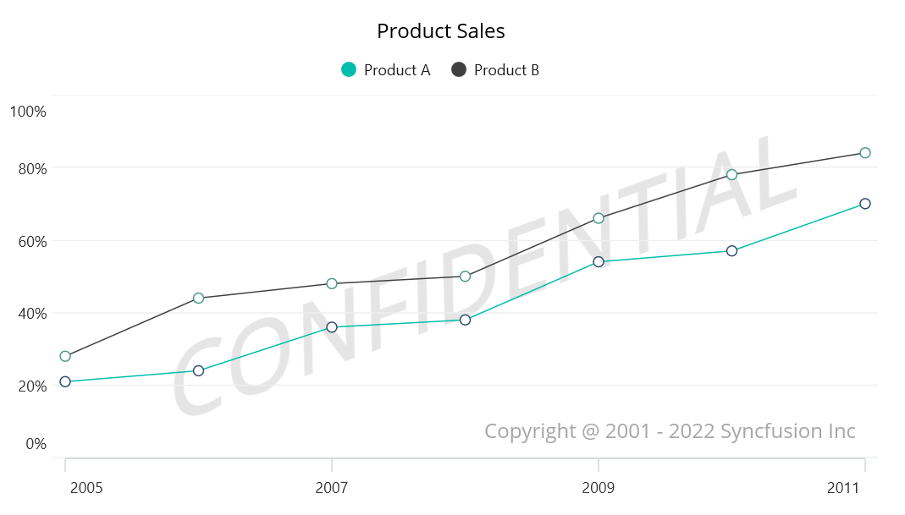

# Appearance in .NET MAUI Cartesian Chart

## Plotting Area Customization:

[SfCartesianChart](https://help.syncfusion.com/cr/maui/Syncfusion.Maui.Charts.SfCartesianChart.html?tabs=tabid-1) allows you to add any view to the chart plot area, which is useful for adding any relevant data, a watermark, or a color gradient to the background of the chart.The following code example shows how to configure plot area background view.





<chart:SfCartesianChart>
   <chart:SfCartesianChart.PlotAreaBackgroundView>
    <AbsoluteLayout>
      <Label Text="Copyright @ 2001 - 2022 Syncfusion Inc" FontSize="18" AbsoluteLayout.LayoutBounds="1,1,-1,-1"  AbsoluteLayout.LayoutFlags="PositionProportional" Opacity="0.4"/>
       <Label Text="CONFIDENTIAL" Rotation="340" FontSize="80" FontAttributes="Bold,Italic" TextColor="Gray" Margin="10,0,0,0"  AbsoluteLayout.LayoutBounds="0.5,0.5,-1,-1" AbsoluteLayout.LayoutFlags="PositionProportional" Opacity="0.3" />
    </AbsoluteLayout>
   </chart:SfCartesianChart.PlotAreaBackgroundView>
</chart:SfCartesianChart>





SfCartesianChart chart = new SfCartesianChart();
AbsoluteLayout absoluteLayout = new AbsoluteLayout();
var copyRight = new Label() {Text = "Copyright @ 2001 - 2022 Syncfusion Inc",FontSize = 18,Opacity = 0.4};
AbsoluteLayout.SetLayoutBounds(copyRight, new Rect(1, 1, -1, -1));
AbsoluteLayout.SetLayoutFlags(copyRight, Microsoft.Maui.Layouts.AbsoluteLayoutFlags.PositionProportional);
absoluteLayout.Children.Add(copyRight);
var watermark = new Label(){Text = "CONFIDENTIAL",Rotation = 340,FontSize = 80,FontAttributes = FontAttributes.Bold,TextColor = Colors.Gray, Opacity = 0.3};
AbsoluteLayout.SetLayoutBounds(watermark, new Rect(0.5, 0.5, -1, -1));
AbsoluteLayout.SetLayoutFlags(watermark, Microsoft.Maui.Layouts.AbsoluteLayoutFlags.PositionProportional);
absoluteLayout.Children.Add(watermark);
chart.PlotAreaBackgroundView = absoluteLayout;
this.Content = chart;





