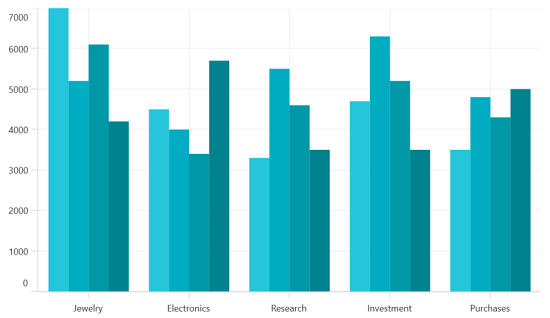
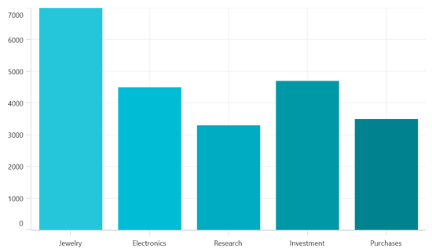
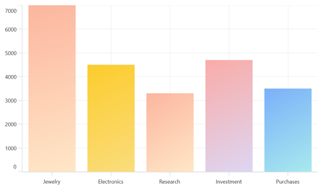
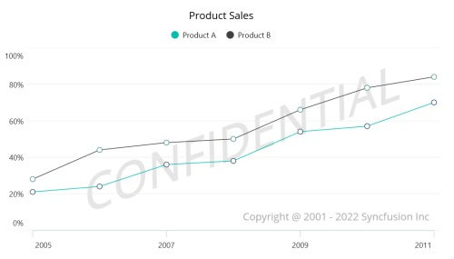

# Appearance in .NET MAUI Cartesian Chart
The appearance of [SfCartesianChart](https://help.syncfusion.com/cr/maui/Syncfusion.Maui.Charts.SfCartesianChart.html) can be customized by using the predefined brushes, custom brushes and gradient, which allows to enrich the application.

## Applying PaletteBrushes for Chart

By default, chart applies a set of predefined brushes to the series in a predefined order. [SfCartesianChart](https://help.syncfusion.com/cr/maui/Syncfusion.Maui.Charts.SfCartesianChart.html) provides [PaletteBrushes](https://help.syncfusion.com/cr/maui/Syncfusion.Maui.Charts.SfCartesianChart.html#Syncfusion_Maui_Charts_SfCartesianChart_PaletteBrushes) property for applying various kinds of custom palettes brushes.

### Custom PaletteBrushes

[SfCartesianChart](https://help.syncfusion.com/cr/maui/Syncfusion.Maui.Charts.SfCartesianChart.html) provides support to define own brushes for the chart with preferred order by using the [PaletteBrushes](https://help.syncfusion.com/cr/maui/Syncfusion.Maui.Charts.SfCartesianChart.html#Syncfusion_Maui_Charts_SfCartesianChart_PaletteBrushes) property, as shown in the following code example.





<chart:SfCartesianChart x:Name="chart" PaletteBrushes="{Binding CustomBrushes}">
. . .
</chart:SfCartesianChart>





SfCartesianChart chart = new SfCartesianChart();
List<Brush> CustomBrushes = new List<Brush>();
CustomBrushes.Add(new SolidColorBrush(Color.FromRgb(38, 198, 218)));
CustomBrushes.Add(new SolidColorBrush(Color.FromRgb(0, 172, 193)));
CustomBrushes.Add(new SolidColorBrush(Color.FromRgb(0, 151, 167)));
CustomBrushes.Add(new SolidColorBrush(Color.FromRgb(0, 131, 143)));

this.chart.PaletteBrushes = CustomBrushes;
. . .
this.Content = chart;





## Applying PaletteBrushes for Series

Cartesian chart provides support to set the palette to series for applying predefined brushes to the segment. The following code example shows you how to set the [PaletteBrushes](https://help.syncfusion.com/cr/maui/Syncfusion.Maui.Charts.ChartSeries.html#Syncfusion_Maui_Charts_ChartSeries_PaletteBrushes) for the series.





<chart:SfCartesianChart>
    . . .
    <chart:ColumnSeries ItemsSource="{Binding Data}"  
                        XBindingPath="XValue" 
                        YBindingPath="YValue" 
                        PaletteBrushes="{Binding CustomBrushes}"/>
</chart:SfCartesianChart>





public class ViewModel
{
	public ObservableCollection<Model> Data { get; set; }

	public List<Brush> CustomBrushes { get; set; }
	public ViewModel()
	{
		CustomBrushes = new List<Brush>();
		CustomBrushes.Add(new SolidColorBrush(Color.FromRgb(38, 198, 218)));
		CustomBrushes.Add(new SolidColorBrush(Color.FromRgb(0, 188, 212)));
		CustomBrushes.Add(new SolidColorBrush(Color.FromRgb(0, 172, 193)));
		CustomBrushes.Add(new SolidColorBrush(Color.FromRgb(0, 151, 167)));
		CustomBrushes.Add(new SolidColorBrush(Color.FromRgb(0, 131, 143)));
	}

. . .
}





## Applying Gradient

Gradient for the chart can be set by using the [PaletteBrushes](https://help.syncfusion.com/cr/maui/Syncfusion.Maui.Charts.ChartSeries.html#Syncfusion_Maui_Charts_ChartSeries_PaletteBrushes) property with the help of `LinearGradientBrush` or `RadialGradientBrush`.

The following code sample and screenshot illustrates how to apply the gradient brushes for the series using the [PaletteBrushes](https://help.syncfusion.com/cr/maui/Syncfusion.Maui.Charts.ChartSeries.html#Syncfusion_Maui_Charts_ChartSeries_PaletteBrushes) property.





<chart:SfCartesianChart>
    . . .
    <chart:ColumnSeries ItemsSource="{Binding Data}"  
                        XBindingPath="XValue" 
                        YBindingPath="YValue" 
                        PaletteBrushes="{Binding CustomBrushes}"/>
</chart:SfCartesianChart>





public class ViewModel
{
	public ObservableCollection<Model> Data { get; set; }

	public List<Brush> CustomBrushes { get; set; }
	public ViewModel()
	{
		CustomBrushes = new List<Brush>();
		LinearGradientBrush gradientColor1 = new LinearGradientBrush();
		gradientColor1.GradientStops = new GradientStopCollection()
		{
			new GradientStop() { Offset = 1, Color = Color.FromRgb(255, 231, 199) },
			new GradientStop() { Offset = 0, Color = Color.FromRgb(252, 182, 159) }
		};

		LinearGradientBrush gradientColor2 = new LinearGradientBrush();
		gradientColor2.GradientStops = new GradientStopCollection()
		{
			new GradientStop() { Offset = 1, Color = Color.FromRgb(250, 221, 125) },
			new GradientStop() { Offset = 0, Color = Color.FromRgb(252, 204, 45) }
		};

		LinearGradientBrush gradientColor3 = new LinearGradientBrush();
		gradientColor3.GradientStops = new GradientStopCollection()
		{
			new GradientStop() { Offset = 1, Color = Color.FromRgb(255, 231, 199) },
			new GradientStop() { Offset = 0, Color = Color.FromRgb(252, 182, 159) }
		};

		LinearGradientBrush gradientColor4 = new LinearGradientBrush();
		gradientColor4.GradientStops = new GradientStopCollection()
		{
			new GradientStop() { Offset = 1, Color = Color.FromRgb(221, 214, 243) },
			new GradientStop() { Offset = 0, Color = Color.FromRgb(250, 172, 168) }
		};

		LinearGradientBrush gradientColor5 = new LinearGradientBrush();
		gradientColor5.GradientStops = new GradientStopCollection()
		{
			new GradientStop() { Offset = 1, Color = Color.FromRgb(168, 234, 238) },
			new GradientStop() { Offset = 0, Color = Color.FromRgb(123, 176, 249) }
		};

		CustomBrushes.Add(gradientColor1);
		CustomBrushes.Add(gradientColor2);
		CustomBrushes.Add(gradientColor3);
		CustomBrushes.Add(gradientColor4);
		CustomBrushes.Add(gradientColor5);
	}

. . .
}





## Plotting Area Customization:

[SfCartesianChart](https://help.syncfusion.com/cr/maui/Syncfusion.Maui.Charts.SfCartesianChart.html?tabs=tabid-1) allows you to add any view to the chart plot area, which is useful for adding any relevant data, a watermark, or a color gradient to the background of the chart.





<chart:SfCartesianChart>
    <chart:SfCartesianChart.PlotAreaBackgroundView>
        <AbsoluteLayout>
      	    <Label Text="Copyright @ 2001 - 2022 Syncfusion Inc"
	           FontSize="18" AbsoluteLayout.LayoutBounds="1,1,-1,-1"
		   AbsoluteLayout.LayoutFlags="PositionProportional"
		   Opacity="0.4"/>
       	    <Label Text="CONFIDENTIAL"
		   Rotation="340"
		   FontSize="80"
		   FontAttributes="Bold,Italic"
		   TextColor="Gray"
		   Margin="10,0,0,0"
		   AbsoluteLayout.LayoutBounds="0.5,0.5,-1,-1"
		   AbsoluteLayout.LayoutFlags="PositionProportional"
		   Opacity="0.3"/>
        </AbsoluteLayout>
    </chart:SfCartesianChart.PlotAreaBackgroundView>
</chart:SfCartesianChart>





SfCartesianChart chart = new SfCartesianChart();
AbsoluteLayout absoluteLayout = new AbsoluteLayout();
var copyRight = new Label() 
{
	Text = "Copyright @ 2001 - 2022 Syncfusion Inc",
	FontSize = 18,
	Opacity = 0.4
};

AbsoluteLayout.SetLayoutBounds(copyRight, new Rect(1, 1, -1, -1));
AbsoluteLayout.SetLayoutFlags(copyRight, Microsoft.Maui.Layouts.AbsoluteLayoutFlags.PositionProportional);
absoluteLayout.Children.Add(copyRight);
var watermark = new Label()
{
	Text = "CONFIDENTIAL",Rotation = 340,
	FontSize = 80,
	FontAttributes = FontAttributes.Bold,
	TextColor = Colors.Gray, 
	Opacity = 0.3
};

AbsoluteLayout.SetLayoutBounds(watermark, new Rect(0.5, 0.5, -1, -1));
AbsoluteLayout.SetLayoutFlags(watermark, Microsoft.Maui.Layouts.AbsoluteLayoutFlags.PositionProportional);
absoluteLayout.Children.Add(watermark);
chart.PlotAreaBackgroundView = absoluteLayout;
this.Content = chart;





