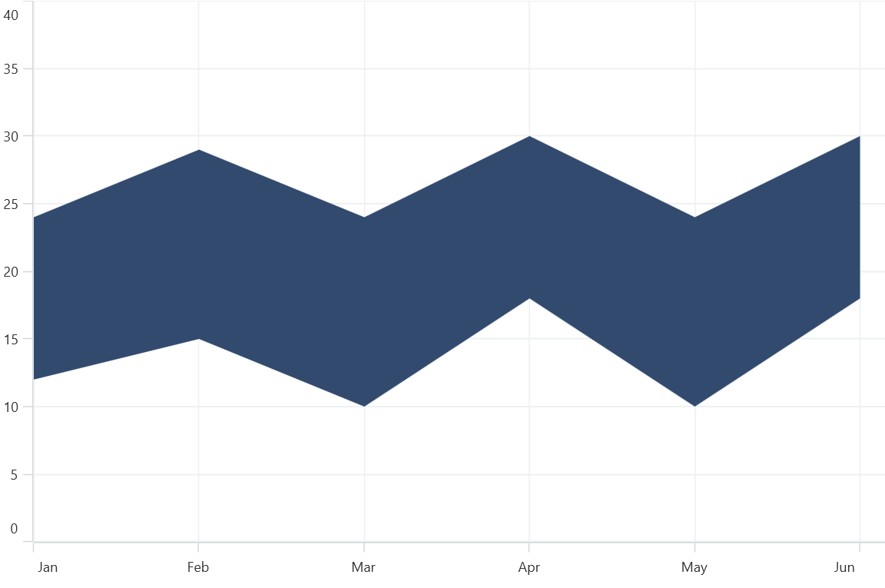

# Area Chart in .NET MAUI Chart

## Area Chart

The area chart is rendered by using a collection of line segments connected to form a closed loop area, filled with the specified color. To render a area chart, create an instance of [AreaSeries](https://help.syncfusion.com/cr/maui/Syncfusion.Maui.Charts.AreaSeries.html?tabs=tabid-1) and add it to the [Series](https://help.syncfusion.com/cr/maui/Syncfusion.Maui.Charts.SfCartesianChart.html#Syncfusion_Maui_Charts_SfCartesianChart_Series) collection property of the chart.

N> The cartesian chart has [Series](https://help.syncfusion.com/cr/maui/Syncfusion.Maui.Charts.SfCartesianChart.html#Syncfusion_Maui_Charts_SfCartesianChart_Series) as its default content.





<chart:SfCartesianChart>
    
    <chart:SfCartesianChart.XAxes>
        <chart:CategoryAxis />
    </chart:SfCartesianChart.XAxes>

    <chart:SfCartesianChart.YAxes>
        <chart:NumericalAxis />
    </chart:SfCartesianChart.YAxes>   

    <chart:AreaSeries ItemsSource="{Binding Data}"
					  XBindingPath="Demand"
					  YBindingPath="Year2010"/>  

</chart:SfCartesianChart>





SfCartesianChart chart = new SfCartesianChart();
CategoryAxis primaryAxis = new CategoryAxis();
chart.XAxes.Add(primaryAxis);
NumericalAxis secondaryAxis = new NumericalAxis();
chart.YAxes.Add(secondaryAxis);

AreaSeries series = new AreaSeries()
{
    ItemsSource = new ViewModel().Data,
    XBindingPath = "Demand",
    YBindingPath = "Year2010",
};

chart.Series.Add(series);
this.Content = chart;





## Spline Area Chart

The [SplineAreaSeries](https://help.syncfusion.com/cr/maui/Syncfusion.Maui.Charts.SplineAreaSeries.html?tabs=tabid-1) connects a series of data points using smooth bezier line curves, with the underlying areas filled.





<chart:SfCartesianChart>

    <chart:SfCartesianChart.XAxes>
        <chart:CategoryAxis />
    </chart:SfCartesianChart.XAxes>

    <chart:SfCartesianChart.YAxes>
        <chart:NumericalAxis />
    </chart:SfCartesianChart.YAxes>
            
    <chart:SplineAreaSeries ItemsSource="{Binding Data}"
							XBindingPath="Demand" 
							YBindingPath="Year2010"/>  

</chart:SfCartesianChart>





SfCartesianChart chart = new SfCartesianChart();
CategoryAxis primaryAxis = new CategoryAxis();
chart.XAxes.Add(primaryAxis);
NumericalAxis secondaryAxis = new NumericalAxis();
chart.YAxes.Add(secondaryAxis);

SplineAreaSeries series = new SplineAreaSeries()
{
    ItemsSource = new ViewModel().Data,
    XBindingPath = "Demand",
    YBindingPath = "Year2010",
};

chart.Series.Add(series);
this.Content = chart;





## Enable Marker

A marker, also known as a symbol, is used to determine or highlight the position of the data point. To enable markers in the series, set the [ShowMarkers](https://help.syncfusion.com/cr/maui/Syncfusion.Maui.Charts.AreaSeries.html#Syncfusion_Maui_Charts_AreaSeries_ShowMarkers) property to true.





<chart:SfCartesianChart>
...
 <chart:AreaSeries XBindingPath="Year"
                   YBindingPath="Percentage"
                   ItemsSource="{Binding Data}"
                   ShowMarkers="True"/>

</chart:SfCartesianChart>





SfCartesianChart chart = new SfCartesianChart();

...
AreaSeries series = new LineSeries()
{
    XBindingPath = "Year",
    YBindingPath = "Percentage",
    ItemsSource = new ViewModel().Data,
    ShowMarkers= true,
 };

chart.Series.Add(series);
this.Content= chart;





### Marker customization

In order to change the series markers appearance, create an instance of the [MarkerSettings](https://help.syncfusion.com/cr/maui/Syncfusion.Maui.Charts.AreaSeries.html#Syncfusion_Maui_Charts_AreaSeries_MarkerSettings) property. The following properties are used to customize marker appearance.

* [Type](https://help.syncfusion.com/cr/maui/Syncfusion.Maui.Charts.ChartMarkerSettings.html#Syncfusion_Maui_Charts_ChartMarkerSettings_Type), of type `ShapeType`, describes the shape of the series marker. The default value of this property is [ShapeType.Circle]().
* [Stroke](https://help.syncfusion.com/cr/maui/Syncfusion.Maui.Charts.ChartMarkerSettings.html#Syncfusion_Maui_Charts_ChartMarkerSettings_Stroke), of type `Brush`, indicates the brush used to paint the marker border.
* [StrokeWidth](https://help.syncfusion.com/cr/maui/Syncfusion.Maui.Charts.ChartMarkerSettings.html#Syncfusion_Maui_Charts_ChartMarkerSettings_StrokeWidth), of type `double`, indicates the width of the marker border.
* [Fill](https://help.syncfusion.com/cr/maui/Syncfusion.Maui.Charts.ChartMarkerSettings.html#Syncfusion_Maui_Charts_ChartMarkerSettings_Fill), of type `Brush`, indicates the color of the marker.
* [Width](https://help.syncfusion.com/cr/maui/Syncfusion.Maui.Charts.ChartMarkerSettings.html#Syncfusion_Maui_Charts_ChartMarkerSettings_Width), of type `double`, indicates the width of the marker.
* [Height](https://help.syncfusion.com/cr/maui/Syncfusion.Maui.Charts.ChartMarkerSettings.html#Syncfusion_Maui_Charts_ChartMarkerSettings_Height), of type `double`, indicates the height of the marker.





<chart:SfCartesianChart>
...
 <chart:AreaSeries XBindingPath="Year"
                   YBindingPath="Percentage"
                   ItemsSource="{Binding Data}"
                   ShowMarkers="True">
    <chart:AreaSeries.MarkerSettings>
        <chart:ChartMarkerSettings Type="Diamond"
                                   Fill="Brown"
                                   Stroke="Black"
                                   StrokeWidth="1"
                                   Height="8"
                                   Width="8"/>
    </chart:AreaSeries.MarkerSettings>
 </chart:AreaSeries>

</chart:SfCartesianChart>





SfCartesianChart chart = new SfCartesianChart();

...
ChartMarkerSettings chartMarker= new ChartMarkerSettings();
        chartMarker.Type = ShapeType.Diamond;
        chartMarker.Fill = Colors.Brown;
        chartMarker.Stroke = Colors.Black;
        chartMarker.StrokeWidth= 1;
        chartMarker.Height = 8;
        chartMarker.Width = 8;

AreaSeries series = new LineSeries()
{
   XBindingPath = "Year",
   YBindingPath = "Percentage",
   ItemsSource = new ViewModel().Data,
   ShowMarkers = true,
 };

chart.Series.Add(series);
this.Content = chart;





## Step Area Chart
The step area chart displays data that changes over time or across different categories. 
In a step area chart, the data points are connected by horizontal and vertical lines to create a series of steps. Each step represents a specific time interval or category. The area between the steps is then filled with a color or shading. To render an area chart, create an instance of [StepAreaSeries](https://help.syncfusion.com/cr/maui/Syncfusion.Maui.Charts.StepAreaSeries.html), and add it to the [Series](https://help.syncfusion.com/cr/maui/Syncfusion.Maui.Charts.SfCartesianChart.html#Syncfusion_Maui_Charts_SfCartesianChart_Series) collection property of the [SfCartesianChart](https://help.syncfusion.com/cr/maui/Syncfusion.Maui.Charts.SfCartesianChart.html?tabs=tabid-1). 

N> The cartesian chart has [Series](https://help.syncfusion.com/cr/maui/Syncfusion.Maui.Charts.SfCartesianChart.html#Syncfusion_Maui_Charts_SfCartesianChart_Series) as its default content.





<chart:SfCartesianChart>
    
    <chart:SfCartesianChart.XAxes>
        <chart:DateTimeAxis/>
    </chart:SfCartesianChart.XAxes>

    <chart:SfCartesianChart.YAxes>
        <chart:NumericalAxis/>
    </chart:SfCartesianChart.YAxes>   
    <chart:StepAreaSeries ItemsSource="{Binding Data}"
                          XBindingPath="Month"
                          YBindingPath="Value"/>

</chart:SfCartesianChart>





SfCartesianChart chart = new SfCartesianChart();
DateTimeAxis primaryAxis = new DateTimeAxis();
chart.XAxes.Add(primaryAxis);
NumericalAxis secondaryAxis = new NumericalAxis();
chart.YAxes.Add(secondaryAxis);

StepAreaSeries series = new StepAreaSeries()
{
    ItemsSource = new ViewModel().Data,
    XBindingPath = "Month",
    YBindingPath = "Value",
};

chart.Series.Add(series);
this.Content = chart;





### Enable Marker

A marker, also known as a symbol, determines or highlights the data point’s position. To enable markers in the series, set the [ShowMarkers](https://help.syncfusion.com/cr/maui/Syncfusion.Maui.Charts.AreaSeries.html#Syncfusion_Maui_Charts_AreaSeries_ShowMarkers) property to true.





<chart:SfCartesianChart>
...
 <chart:StepAreaSeries XBindingPath="Month"
                       YBindingPath="Value"
                       ItemsSource="{Binding Data}"
                       ShowMarkers="True"/>

</chart:SfCartesianChart>





SfCartesianChart chart = new SfCartesianChart();
...
StepAreaSeries series = new StepAreaSeries()
{
    XBindingPath = "Month",
    YBindingPath = "Value",
    ItemsSource = new ViewModel().Data,
    ShowMarkers= true,
 };

chart.Series.Add(series);
this.Content= chart;





#### Marker customization

To change the series markers appearance, create an instance of the [MarkerSettings](https://help.syncfusion.com/cr/maui/Syncfusion.Maui.Charts.AreaSeries.html#Syncfusion_Maui_Charts_AreaSeries_MarkerSettings) property. The following properties are used to customize marker appearance.

* [Type](https://help.syncfusion.com/cr/maui/Syncfusion.Maui.Charts.ChartMarkerSettings.html#Syncfusion_Maui_Charts_ChartMarkerSettings_Type), of type `ShapeType`, describes the shape of the series marker. The default value of this property is [ShapeType.Circle]().
* [Stroke](https://help.syncfusion.com/cr/maui/Syncfusion.Maui.Charts.ChartMarkerSettings.html#Syncfusion_Maui_Charts_ChartMarkerSettings_Stroke), of type `Brush`, indicates the brush used to paint the marker border.
* [StrokeWidth](https://help.syncfusion.com/cr/maui/Syncfusion.Maui.Charts.ChartMarkerSettings.html#Syncfusion_Maui_Charts_ChartMarkerSettings_StrokeWidth), of type `double`, indicates the width of the marker border.
* [Fill](https://help.syncfusion.com/cr/maui/Syncfusion.Maui.Charts.ChartMarkerSettings.html#Syncfusion_Maui_Charts_ChartMarkerSettings_Fill), of type `Brush`, indicates the color of the marker.
* [Width](https://help.syncfusion.com/cr/maui/Syncfusion.Maui.Charts.ChartMarkerSettings.html#Syncfusion_Maui_Charts_ChartMarkerSettings_Width), of type `double`, indicates the width of the marker.
* [Height](https://help.syncfusion.com/cr/maui/Syncfusion.Maui.Charts.ChartMarkerSettings.html#Syncfusion_Maui_Charts_ChartMarkerSettings_Height), of type `double`, indicates the height of the marker.





<chart:SfCartesianChart>
...
 <chart:StepAreaSeries XBindingPath="Month"
                       YBindingPath="Value"
                       ItemsSource="{Binding Data}"
                       ShowMarkers="True">
    <chart:StepAreaSeries.MarkerSettings>
        <chart:ChartMarkerSettings Type="Diamond"
                                   Fill="Brown"
                                   Stroke="Black"
                                   StrokeWidth="1"
                                   Height="8"
                                   Width="8"/>
    </chart:StepAreaSeries.MarkerSettings>
 </chart:StepAreaSeries>

</chart:SfCartesianChart>





SfCartesianChart chart = new SfCartesianChart();
...
ChartMarkerSettings chartMarker= new ChartMarkerSettings();
        chartMarker.Type = ShapeType.Diamond;
        chartMarker.Fill = Colors.Brown;
        chartMarker.Stroke = Colors.Black;
        chartMarker.StrokeWidth= 1;
        chartMarker.Height = 8;
        chartMarker.Width = 8;

StepAreaSeries = new StepAreaSeries()
{
   XBindingPath = "Month",
   YBindingPath = "Value",
   ItemsSource = new ViewModel().Data,
   ShowMarkers = true,
 };

chart.Series.Add(series);
this.Content = chart;





## Range Area Chart

Range Area Chart is a type of data visualization useful for displaying the relationship between two variables over time. In this Series, the area between two lines is filled to indicate a range of values, such as a high and low price range or an upper and lower limit.

By displaying ranges of data, range area series can make it easier to compare multiple datasets at once.

To render a range area chart, create an instance of the [RangeAreaSeries](https://help.syncfusion.com/cr/maui/Syncfusion.Maui.Charts.RangeAreaSeries.html), and add it to the [Series](https://help.syncfusion.com/cr/maui/Syncfusion.Maui.Charts.SfCartesianChart.html#Syncfusion_Maui_Charts_SfCartesianChart_Series) collection property of the [SfCartesianChart](https://help.syncfusion.com/cr/maui/Syncfusion.Maui.Charts.SfCartesianChart.html?tabs=tabid-1).

Since the [RangeAreaSeries](https://help.syncfusion.com/cr/maui/Syncfusion.Maui.Charts.RangeAreaSeries.html) requires two Y values for each point, your data should contain both the high and low values. These high and low values specify the maximum and minimum ranges of the point.

N> The Cartesian chart has the [Series](https://help.syncfusion.com/cr/maui/Syncfusion.Maui.Charts.SfCartesianChart.html#Syncfusion_Maui_Charts_SfCartesianChart_Series) as its default content.





    <chart:SfCartesianChart>
    ...
    <chart:SfCartesianChart.XAxes>
        <chart:CategoryAxis/>
    </chart:SfCartesianChart.XAxes>

    <chart:SfCartesianChart.YAxes>
        <chart:NumericalAxis/>
    </chart:SfCartesianChart.YAxes>   
     
    <chart:RangeAreaSeries ItemsSource="{Binding Data}"
                           XBindingPath="XValue"
                           High="HighValue"
                           Low="LowValue"/>
    
    </chart:SfCartesianChart>





    SfCartesianChart chart = new SfCartesianChart();
    CategoryAxis primaryAxis = new CategoryAxis();
    chart.XAxes.Add(primaryAxis);
    NumericalAxis secondaryAxis = new NumericalAxis();
    chart.YAxes.Add(secondaryAxis);

    RangeAreaSeries series = new RangeAreaSeries()
    {
        ItemsSource = new ViewModel().Data,
        XBindingPath = "XValue",
        High="HighValue",
        Low="LowValue",
    };

    chart.Series.Add(series);
    this.Content = chart;





### Enable Marker

A marker, also known as a symbol, is used to determine or highlight the position of the data point. To enable markers in the series, set the [ShowMarkers](https://help.syncfusion.com/cr/maui/Syncfusion.Maui.Charts.RangeAreaSeries.html#Syncfusion_Maui_Charts_RangeAreaSeries_ShowMarkers) property to true.





    <chart:SfCartesianChart>
    ...
    <chart:RangeAreaSeries XBindingPath="XValue"
                           High="HighValue"
                           Low="LowValue"
                           ItemsSource="{Binding Data}"
                           ShowMarkers="True"/>

    </chart:SfCartesianChart>





    SfCartesianChart chart = new SfCartesianChart();
    ...
    RangeAreaSeries series = new RangeAreaSeries()
    {
        XBindingPath = "XValue",
        High = "HighValue",
        Low = "LowValue",
        ItemsSource = new ViewModel().Data,
        ShowMarkers= true,
    };

    chart.Series.Add(series);
    this.Content= chart;





#### Marker Customization

In order to change the series markers’ appearance, create an instance of the [MarkerSettings](https://help.syncfusion.com/cr/maui/Syncfusion.Maui.Charts.RangeAreaSeries.html#Syncfusion_Maui_Charts_RangeAreaSeries_MarkerSettings) property. The following properties are used to customize marker appearance.

* [Type](https://help.syncfusion.com/cr/maui/Syncfusion.Maui.Charts.ChartMarkerSettings.html#Syncfusion_Maui_Charts_ChartMarkerSettings_Type), of type `ShapeType`, describes the shape of the series marker. The default value of this property is the [ShapeType.Circle]().
* [Stroke](https://help.syncfusion.com/cr/maui/Syncfusion.Maui.Charts.ChartMarkerSettings.html#Syncfusion_Maui_Charts_ChartMarkerSettings_Stroke), of type `Brush`, indicates the brush used to paint the marker border.
* [StrokeWidth](https://help.syncfusion.com/cr/maui/Syncfusion.Maui.Charts.ChartMarkerSettings.html#Syncfusion_Maui_Charts_ChartMarkerSettings_StrokeWidth), of type `double`, indicates the width of the marker border.
* [Fill](https://help.syncfusion.com/cr/maui/Syncfusion.Maui.Charts.ChartMarkerSettings.html#Syncfusion_Maui_Charts_ChartMarkerSettings_Fill), of type `Brush`, indicates the color of the marker.
* [Width](https://help.syncfusion.com/cr/maui/Syncfusion.Maui.Charts.ChartMarkerSettings.html#Syncfusion_Maui_Charts_ChartMarkerSettings_Width), of type `double`, indicates the width of the marker.
* [Height](https://help.syncfusion.com/cr/maui/Syncfusion.Maui.Charts.ChartMarkerSettings.html#Syncfusion_Maui_Charts_ChartMarkerSettings_Height), of type `double`, indicates the height of the marker.





    <chart:SfCartesianChart>
    ...
    <chart:RangeAreaSeries XBindingPath="XValue"
                           High="HighValue"
                           Low="LowValue"
                           ItemsSource="{Binding Data}"
                           ShowMarkers="True">
        <chart:RangeAreaSeries.MarkerSettings>
            <chart:ChartMarkerSettings Type="Diamond"
                                       Fill="Brown"
                                       Stroke="Black"
                                       StrokeWidth="1"
                                       Height="8"
                                       Width="8"/>
        </chart:RangeAreaSeries.MarkerSettings>
    </chart:RangeAreaSeries>
    
    </chart:SfCartesianChart>





    SfCartesianChart chart = new SfCartesianChart();
    ...
    ChartMarkerSettings chartMarker= new ChartMarkerSettings();
        chartMarker.Type = ShapeType.Diamond;
        chartMarker.Fill = Colors.Brown;
        chartMarker.Stroke = Colors.Black;
        chartMarker.StrokeWidth= 1;
        chartMarker.Height = 8;
        chartMarker.Width = 8;

    RangeAreaSeries series = new RangeAreaSeries()
    {
        XBindingPath = "XValue",
        High = "HighValue",
        Low = "LowValue",
        ItemsSource = new ViewModel().Data,
        ShowMarkers = true,
    };

    chart.Series.Add(series);
    this.Content = chart;





