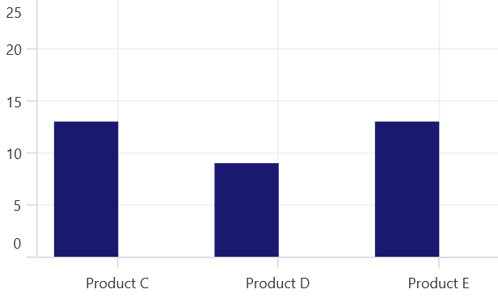
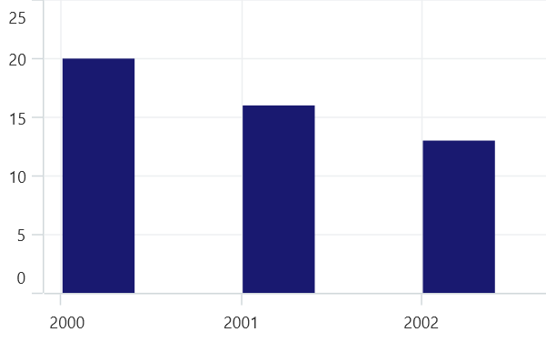

# Auto scrolling in .NET MAUI Chart

The auto-scrolling of [SfCartesianChart]() ensures that the specified range of data is always visible in the chart. It always shows the recently added data points at the end, and scrolling will be reset to the end of the range whenever a new point is added. The [AutoScrollingDelta]() property of the chart axis can be used to set the number of data points to be always visible in the chart.

By adding [ChartZoomPanBehavior]() to the chart, you can scroll to see the previous data points.





    <chart:SfCartesianChart>
        . . .
        <chart:SfCartesianChart.XAxes>
            <chart:CategoryAxis AutoScrollingDelta="3" />
        </chart:SfCartesianChart.XAxes>

         <chart:SfCartesianChart.ZoomPanBehavior>
             <chart:ChartZoomPanBehavior EnablePanning="True"></chart:ChartZoomPanBehavior>
        </chart:SfCartesianChart.ZoomPanBehavior>

    </chart:SfCartesianChart>





    SfCartesianChart chart = new SfCartesianChart();
    . . .
    CategoryAxis primaryAxis = new CategoryAxis()
    {
        AutoScrollingDelta = 3,
    };
    chart.XAxes.Add(primaryAxis);

    ChartZoomPanBehavior zooming = new ChartZoomPanBehavior()
    {
        EnablePanning = true,
    };
    chart.ZoomPanBehavior = zooming;





## AutoScrollingMode

[AutoScrollingMode]() property can be used to determine whether the axis should be scrolled from start position or end position. The default value of [AutoScrollingMode]() is End.





    <chart:SfCartesianChart>
        . . .
        <chart:SfCartesianChart.XAxes>
            <chart:CategoryAxis AutoScrollingDelta="3" AutoScrollingMode="Start"/>
        </chart:SfCartesianChart.XAxes>

    </chart:SfCartesianChart>





    SfCartesianChart chart = new SfCartesianChart();
    . . .
    CategoryAxis primaryAxis = new CategoryAxis()
    {
        AutoScrollingDelta = 3,
        AutoScrollingMode = ChartAutoScrollingMode.start,
    };
    chart.XAxes.Add(primaryAxis);





## AutoScrollingDeltaType

In [DateTimeAxis](), you can apply auto scrolling delta value in [Years](), [Months](), [Days](), [Hours](), [Minutes](), [Seconds]() and [Milliseconds]() by setting [AutoScrollingDeltaType]() property. The default value of this property is [Auto](), and the delta will be calculated automatically based on range.





    <chart:SfCartesianChart>
        . . .
        <chart:SfCartesianChart.XAxes>
            <chart:DateTimeAxis AutoScrollingDelta="3" AutoScrollingDeltaType="Days"/>
        </chart:SfCartesianChart.XAxes>

    </chart:SfCartesianChart>





    SfCartesianChart chart = new SfCartesianChart();
    . . .
    DateTimeAxis primaryAxis = new DateTimeAxis()
    {
        AutoScrollingDelta = 3,
        AutoScrollingDeltaType = DateTimeDeltaType.Days,
    };
    chart.XAxes.Add(primaryAxis);





