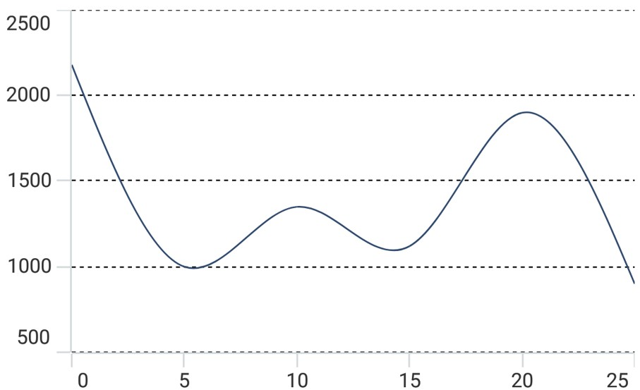

# Grid Lines in .NET MAUI Chart

## Major Grid Lines

By default, major gridlines are automatically added to the [ChartAxis](https://help.syncfusion.com/cr/maui/Syncfusion.Maui.Charts.ChartAxis.html) in its defined intervals. The visibility of the major gridlines can be controlled using the [ShowMajorGridLines](https://help.syncfusion.com/cr/maui/Syncfusion.Maui.Charts.ChartAxis.html#Syncfusion_Maui_Charts_ChartAxis_ShowMajorGridLines) property. The default value of [ShowMajorGridLines](https://help.syncfusion.com/cr/maui/Syncfusion.Maui.Charts.ChartAxis.html#Syncfusion_Maui_Charts_ChartAxis_ShowMajorGridLines) is true. 





<chart:SfCartesianChart>
    <chart:SfCartesianChart.PrimaryAxis>
        <chart:NumericalAxis ShowMajorGridLines="False" />
    </chart:SfCartesianChart.PrimaryAxis>
    <chart:SfCartesianChart.SecondaryAxis>
        <chart:NumericalAxis />
    </chart:SfCartesianChart.SecondaryAxis>
    . . .
</chart:SfCartesianChart>





SfCartesianChart chart = new SfCartesianChart();
. . .
NumericalAxis primaryAxis = new NumericalAxis();
primaryAxis.ShowMajorGridLines = false;
chart.PrimaryAxis = primaryAxis;

chart.SecondaryAxis = new NumericalAxis();





### Customization

The [MajorGridLineStyle](https://help.syncfusion.com/cr/maui/Syncfusion.Maui.Charts.ChartAxis.html#Syncfusion_Maui_Charts_ChartAxis_MajorGridLineStyle) property in the chart axis is used to customize the appearance of major gridlines.




<chart:SfCartesianChart>
    . . .
    <chart:SfCartesianChart.Resources>
        <DoubleCollection x:Key="dashArray">
            <x:Double>3</x:Double>
            <x:Double>3</x:Double>
        </DoubleCollection>
    </chart:SfCartesianChart.Resources>
    
    <chart:SfCartesianChart.PrimaryAxis>
        <chart:NumericalAxis>
            <chart:NumericalAxis.MajorGridLineStyle>
                <chart:ChartLineStyle StrokeDashArray="{StaticResource dashArray}" Stroke="Black" StrokeWidth="2" />
            </chart:NumericalAxis.MajorGridLineStyle>
        <chart:NumericalAxis />
    </chart:SfCartesianChart.PrimaryAxis>

    <chart:SfCartesianChart.SecondaryAxis>
        <chart:NumericalAxis />
    </chart:SfCartesianChart.SecondaryAxis>
</chart:SfCartesianChart>





SfCartesianChart chart = new SfCartesianChart();
    . . .
DoubleCollection doubleCollection = new DoubleCollection();
doubleCollection.Add(3);
doubleCollection.Add(3);

NumericalAxis primaryAxis = new NumericalAxis();
ChartLineStyle axisLineStyle = new ChartLineStyle();
axisLineStyle.Stroke = Colors.Black;
axisLineStyle.StrokeWidth = 2;
axisLineStyle.StrokeDashArray = doubleCollection
primaryAxis.MajorGridLineStyle = axisLineStyle;
chart.PrimaryAxis = primaryAxis;

chart.SecondaryAxis = new NumericalAxis();





## Minor Grid Lines

Minor gridlines will be added automatically when the small tick lines is defined and using the [MinorTicksPerInterval](https://help.syncfusion.com/cr/maui/Syncfusion.Maui.Charts.RangeAxisBase.html#Syncfusion_Maui_Charts_RangeAxisBase_MinorTicksPerInterval) property of chart axis.





<chart:SfCartesianChart>
    <chart:SfCartesianChart.PrimaryAxis>
        <chart:NumericalAxis/>
    </chart:SfCartesianChart.PrimaryAxis>

    <chart:SfCartesianChart.SecondaryAxis>
        <chart:NumericalAxis MinorTicksPerInterval="3" />
    </chart:SfCartesianChart.SecondaryAxis>
    . . .
</chart:SfCartesianChart>





SfCartesianChart chart = new SfCartesianChart();
chart.PrimaryAxis = new NumericalAxis();
chart.SecondaryAxis = new NumericalAxis()
{
    MinorTicksPerInterval = 3,
};
. . .





### Customization

The [MinorGridLineStyle](https://help.syncfusion.com/cr/maui/Syncfusion.Maui.Charts.RangeAxisBase.html#Syncfusion_Maui_Charts_RangeAxisBase_MinorGridLineStyle) property in the chart axis is used to customize the appearance of minor gridlines.





<chart:SfCartesianChart>
    . . .
    <chart:SfCartesianChart.Resources>
        <DoubleCollection x:Key="dashArray">
            <x:Double>3</x:Double>
            <x:Double>3</x:Double>
        </DoubleCollection>
    </chart:SfCartesianChart.Resources>

    <chart:SfCartesianChart.PrimaryAxis>
        <chart:NumericalAxis/>
    </chart:SfCartesianChart.PrimaryAxis>

    <chart:SfCartesianChart.SecondaryAxis>
        <chart:NumericalAxis ShowMinorGridLines="True" MinorTicksPerInterval="2">
            <chart:NumericalAxis.MajorGridLineStyle>
                <chart:ChartLineStyle StrokeDashArray="{StaticResource dashArray}" Stroke="Black" StrokeWidth="0.8"  />
            </chart:NumericalAxis.MajorGridLineStyle>
        </chart:NumericalAxis>
    </chart:SfCartesianChart.SecondaryAxis>
    . . .
</chart:SfCartesianChart>





SfCartesianChart chart = new SfCartesianChart();
chart.PrimaryAxis = new NumericalAxis();

DoubleCollection doubleCollection = new DoubleCollection();
doubleCollection.Add(3);
doubleCollection.Add(3);

NumericalAxis secondaryAxis = new NumericalAxis();
ChartLineStyle axisLineStyle = new ChartLineStyle();
axisLineStyle.Stroke = Colors.Black;
axisLineStyle.StrokeWidth = 0.8;
axisLineStyle.StrokeDashArray = doubleCollection
secondaryAxis.MinorGridLineStyle = axisLineStyle;
chart.SecondaryAxis = secondaryAxis;





