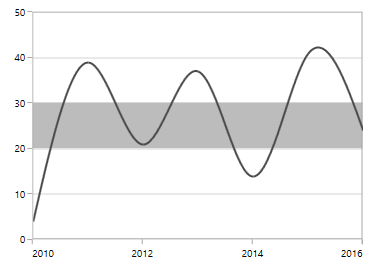
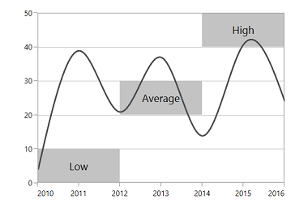

# Plot Band in .NET MAUI Chart

## Plot Band

Strip lines are also konwn as plot band. They are used to shade the different ranges in plot area in different colors to improve the readability of the chart. You can annotate it with text to indicate what that particular region indicates. You can also enable the strip lines to be drawn repeatedly at regular intervals – this will be useful when you want to mark an event that occurs recursively along the timeline of the chart.

## Plot Band in Category axis

Plot band can be added to the category axis by specifying index values to the [Start]() which determines the beginning of the plot band, and with the specified [Width]()





    <chart:SfCartesianChart>
        . . .
        <chart:SfCartesianChart.XAxes>
            <chart:CategoryAxis >
                <chart:CategoryAxis.PlotBands>
                    <chart:NumericalPlotBand Start="2" Width="2" 
                                             Fill="Orange"/>
                </chart:CategoryAxis.PlotBands>
            </chart:CategoryAxis>
        </chart:SfCartesianChart.XAxes>
        <chart:SfCartesianChart.YAxes>
            <chart:NumericalAxis/>
        </chart:SfCartesianChart.YAxes>
        . . .
    </chart:SfCartesianChart>





    SfCartesianChart chart = new SfCartesianChart();
    . . .
    CategoryAxis categoryAxis = new CategoryAxis();
    NumericalPlotBand plotBand = new NumericalPlotBand
    {
        Start = 2,
        Width = 2,
        Fill = Color.Orange
    };

    categoryAxis.PlotBands.Add(plotBand);
    chart.XAxes.Add(categoryAxis);

    NumericalAxis secondaryAxis = new NumericalAxis();
    chart.YAxes.Add(secondaryAxis);





## Plot Band in Numerical axis

Plot band can be added to the numerical axis by specifying numerical values to the [Start]() which determines the beginning of the plot band, and with the specified [Width]()





    <chart:SfCartesianChart>
        . . .
        <chart:SfCartesianChart.XAxes>
            <chart:CategoryAxis/>
        </chart:SfCartesianChart.XAxes>
        <chart:SfCartesianChart.YAxes>
            <chart:NumericalAxis>
                <chart:NumericalAxis.PlotBands>
                    <chart:NumericalPlotBand Start="28" Width="10" Fill="Orange"/>
                </chart:NumericalAxis.PlotBands>
            </chart:NumericalAxis>
        </chart:SfCartesianChart.YAxes>
        . . .
    </chart:SfCartesianChart>





    SfCartesianChart chart = new SfCartesianChart();
    . . .
    CategoryAxis primaryAxis = new CategoryAxis();
    chart.XAxes.Add(primaryAxis);

    NumericalAxis numericalAxis = new NumericalAxis();
    NumericalPlotBand plotBand = new NumericalPlotBand
    {
        Start = 28,
        Width = 10,
        Fill = Color.Orange
    };

    numericalAxis.PlotBands.Add(plotBand);
    chart.YAxes.Add(numericalAxis);





## Plot Band in DateTime axis

A plot band can be applied to a date-time axis by specifying [Start]() date and [Width]() values. The start value determines the beginning of the plot band , along with the specified width and WidthType, determines the duration and appearance of the plot band on the date-time axis.





    <chart:SfCartesianChart>
        . . .
        <chart:SfCartesianChart.XAxes>
            <chart:DateTimeAxis>
                <chart:DateTimeAxis.PlotBands>
                        <chart:DateTimePlotBand Start="2024-01-24" Width="2" 
                                                WidthType="Days" Fill="Orange"/>
                </chart:DateTimeAxis.PlotBands>
            </chart:DateTimeAxis>
        </chart:SfCartesianChart.XAxes>
        <chart:SfCartesianChart.YAxes>
            <chart:NumericalAxis/>
        </chart:SfCartesianChart.YAxes>

    </chart:SfCartesianChart>





    SfCartesianChart chart = new SfCartesianChart();
    . . .
    DateTimeAxis dateTimeAxis = new DateTimeAxis();
    DateTimePlotBand plotBand = new DateTimePlotBand
    {
        Start = new DateTime(2024, 1, 24),
        Width = 2,
        WidthType = DateTimeUnits.Days,
        Fill = Color.Orange
    };

    dateTimeAxis.PlotBands.Add(plotBand);
    chart.XAxes.Add(dateTimeAxis);

    NumericalAxis secondaryAxis = new NumericalAxis();
    chart.YAxes.Add(secondaryAxis);





## Plot Band Recurrence

The Plot band recurrence is used to enable the plot bands to be drawn repeatedly at the regular intervals. This will be useful when you need to mark an event that occurs recursively along the timeline of the chart. The following properties are used to configure this feature:

* [`RepeatEvery`]() - Changes the frequency of the plot band being repeated.
* [`RepeatUntil`]() - Specifies the end value at which point strip line has to stop repeating.





    <chart:SfCartesianChart>
        . . .
        <chart:SfCartesianChart.XAxes>
            <chart:CategoryAxis/>
        </chart:SfCartesianChart.XAxes>
        <chart:SfCartesianChart.YAxes>
            <chart:NumericalAxis>
                <chart:NumericalAxis.PlotBands>
                    <chart:NumericalPlotBand Start="28" Width="2" Fill="Orange"
                                             RepeatEvery="10" RepeatUntil="55"/>
                </chart:NumericalAxis.PlotBands>
            </chart:NumericalAxis>
        </chart:SfCartesianChart.YAxes>

    </chart:SfCartesianChart>





    SfCartesianChart chart = new SfCartesianChart();
    . . .
    CategoryAxis primaryAxis = new CategoryAxis();
    chart.XAxes.Add(primaryAxis);

    NumericalAxis numericalAxis = new NumericalAxis();
    NumericalPlotBand plotBand = new NumericalPlotBand
    {
        Start = 28,
        Width = 2,
        Fill = Color.Orange,
        RepeatEvery = 10,
        RepeatUntil = 55
    };

    numericalAxis.PlotBands.Add(plotBand);
    chart.YAxes.Add(numericalAxis);





## Segmented Plot Band

If you need to draw a plot band that should not stretch along its associated axis, you have to set the [SegmentStart]() and [SegmentEnd]() properties.





    <chart:SfCartesianChart>
        . . .
        <chart:SfCartesianChart.XAxes>
            <chart:CategoryAxis/>
        </chart:SfCartesianChart.XAxes>
        <chart:SfCartesianChart.YAxes>
            <chart:NumericalAxis>
                <chart:NumericalAxis.PlotBands>
                    <chart:NumericalPlotBand Start="28" Width="2" RepeatEvery="10" 
                                            RepeatUntil="55" Fill="Orange" IsSegmented="True" 
                                            SegmentStart="0" SegmentEnd="1"/>
                </chart:NumericalAxis.PlotBands>
            </chart:NumericalAxis>
        </chart:SfCartesianChart.YAxes>
        . . .
    </chart:SfCartesianChart>





    SfCartesianChart chart = new SfCartesianChart();
    . . .
    CategoryAxis primaryAxis = new CategoryAxis();
    chart.XAxes.Add(primaryAxis);

    NumericalAxis numericalAxis = new NumericalAxis();
    NumericalPlotBand plotBand = new NumericalPlotBand
    {
        Start = 28,
        Width = 2,
        RepeatEvery = 10,
        RepeatUntil = 55,
        Fill = Color.Orange,
        IsSegmented = true,
        SegmentStart = 0,
        SegmentEnd = 1
    };

    numericalAxis.PlotBands.Add(plotBand);
    chart.YAxes.Add(numericalAxis);





## Customized Text

You can able to add a text in the plot band using the [Text]() property.Also there was a text customization support achieved by [ChartPlotBandLabelStyle]() through [LabelStyle]()





    <chart:SfCartesianChart>
        . . .
        <chart:SfCartesianChart.XAxes>
            <chart:CategoryAxis/>
        </chart:SfCartesianChart.XAxes>
        <chart:SfCartesianChart.YAxes>
            <chart:NumericalAxis>
                <chart:NumericalAxis.PlotBands>
                    <chart:NumericalPlotBand Start="28" Width="10" Fill="Orange" Text="Plot Band">
                        <chart:NumericalPlotBand.LabelStyle>
                            <chart:ChartPlotBandLabelStyle TextColor="Blue" FontSize="12" 
                                                           FontAttributes="Bold"/>
                        </chart:NumericalPlotBand.LabelStyle>
                    </chart:NumericalPlotBand>
                </chart:NumericalAxis.PlotBands>
            </chart:NumericalAxis>
        </chart:SfCartesianChart.YAxes>
        . . .
    </chart:SfCartesianChart>





    SfCartesianChart chart = new SfCartesianChart();
    . . .
    CategoryAxis primaryAxis = new CategoryAxis();
    chart.XAxes.Add(primaryAxis);

    NumericalAxis numericalAxis = new NumericalAxis();
    NumericalPlotBand plotBand = new NumericalPlotBand
    {
        Start = 28,
        Width = 10,
        Fill = Color.Orange,
        Text = "Plot Band"
    };

    ChartPlotBandLabelStyle labelStyle = new ChartPlotBandLabelStyle
    {
        TextColor = Color.Blue,
        FontSize = 12,
        FontAttributes = FontAttributes.Bold
    };

    plotBand.LabelStyle = labelStyle;
    numericalAxis.PlotBands.Add(plotBand);
    chart.YAxes.Add(numericalAxis);





