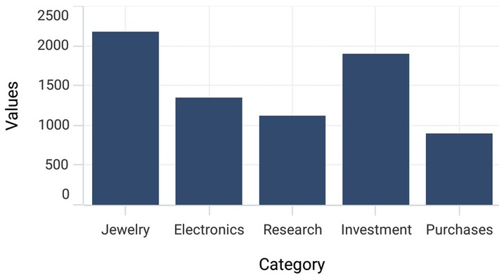

# Axis Title in MAUI Chart

The [Title](https://help.syncfusion.com/cr/maui/Syncfusion.Maui.Charts.ChartAxis.html#Syncfusion_Maui_Charts_ChartAxis_Title) property is used to set the title for the chart axis.





<chart:SfCartesianChart>
    . . .
    <chart:SfCartesianChart.XAxes>
        <chart:CategoryAxis>
            <chart:CategoryAxis.Title>
                <chart:ChartAxisTitle Text="Category"/>
            </chart:CategoryAxis.Title>
        </chart:CategoryAxis>
    </chart:SfCartesianChart.XAxes>
    <chart:SfCartesianChart.YAxes>
        <chart:NumericalAxis>
            <chart:NumericalAxis.Title>
                <chart:ChartAxisTitle Text="Values"/>
            </chart:NumericalAxis.Title>
        </chart:NumericalAxis>
    </chart:SfCartesianChart.YAxes>
</chart:SfCartesianChart>





SfCartesianChart chart = new SfCartesianChart();
. . .
CategoryAxis primaryAxis = new CategoryAxis();
primaryAxis.Title = new ChartAxisTitle()
{
    Text = "Category"
};
chart.XAxes.Add(primaryAxis);

NumericalAxis secondaryAxis = new NumericalAxis();
secondaryAxis.Title = new ChartAxisTitle()
{
    Text = "Values"
};
chart.YAxes.Add(secondaryAxis);

this.Content = chart;





## Customization

The [Title](https://help.syncfusion.com/cr/maui/Syncfusion.Maui.Charts.ChartAxis.html#Syncfusion_Maui_Charts_ChartAxis_Title) property in axis provides options to customize the text and font of axis title. Axis does not display title by default. The title can be customized using following properties,

* `Text` - Gets or sets the title for axis.
* `Background` - Gets or sets the background color of the labels.
* `CornerRadius` - Gets or sets a value that defines the rounded corners for labels.
* `FontAttributes` - Gets or sets the font style for the label.
* `FontFamily` - Gets or sets the font family name for the label.
* `FontSize` - Gets or sets the font size for the label.
* `Margin` - Gets or sets the margin of the label to customize the appearance of label. 
* `Stroke` - Gets or sets the border stroke color of the labels.
* `StrokeWidth` - Gets or sets the border thickness of the label.
* `TextColor` - Gets or sets the color for the text of the label.

## Label extent

The [LabelExtent](https://help.syncfusion.com/cr/maui/Syncfusion.Maui.Charts.ChartAxis.html#Syncfusion_Maui_Charts_ChartAxis_LabelExtent) property allows to set the gap between axis labels and title. This is typically used to maintain the fixed gap between axis labels and title when the digits of the axis value changed in live update.





<chart:SfCartesianChart>
    . . .
    <chart:SfCartesianChart.XAxes>
        <chart:CategoryAxis LabelExtent="60">
            <chart:CategoryAxis.Title>
                <chart:ChartAxisTitle Text="Category"/>
            </chart:CategoryAxis.Title>
        </chart:CategoryAxis>
    </chart:SfCartesianChart.XAxes>
</chart:SfCartesianChart>





SfCartesianChart chart = new SfCartesianChart();
. . .
CategoryAxis primaryAxis = new CategoryAxis();
primaryAxis.LabelExtent = 60;
primaryAxis.Title = new ChartAxisTitle()
{
    Text = "Category"
};
chart.XAxes.Add(primaryAxis);
this.Content = chart;




