# Types of Axis in .NET MAUI Cartesian Chart

Cartesian chart supports the following types of chart axis.

* NumericalAxis
* CategoryAxis
* DateTimeAxis
* DateTimeCategoryAxis
* LogarithmicAxis

## Numerical Axis

[NumericalAxis](https://help.syncfusion.com/cr/maui/Syncfusion.Maui.Charts.NumericalAxis.html) is used to plot numerical values to the chart. [NumericalAxis](https://help.syncfusion.com/cr/maui/Syncfusion.Maui.Charts.NumericalAxis.html) can be defined for both [XAxes](https://help.syncfusion.com/cr/maui/Syncfusion.Maui.Charts.SfCartesianChart.html#Syncfusion_Maui_Charts_SfCartesianChart_XAxes) and [YAxes](https://help.syncfusion.com/cr/maui/Syncfusion.Maui.Charts.SfCartesianChart.html#Syncfusion_Maui_Charts_SfCartesianChart_YAxes).





<chart:SfCartesianChart>
    . . .
    <chart:SfCartesianChart.XAxes>
        <chart:NumericalAxis/>
    </chart:SfCartesianChart.XAxes>
    <chart:SfCartesianChart.YAxes>
        <chart:NumericalAxis/>
    </chart:SfCartesianChart.YAxes>
</chart:SfCartesianChart>





SfCartesianChart chart = new SfCartesianChart();
. . .
NumericalAxis primaryAxis = new NumericalAxis();
chart.XAxes.Add(primaryAxis);

NumericalAxis secondaryAxis = new NumericalAxis();
chart.YAxes.Add(secondaryAxis);

this.Content = chart;





To customize the [NumericalAxis](https://help.syncfusion.com/cr/maui/Syncfusion.Maui.Charts.NumericalAxis.html) in .NET MAUI Cartesian Charts, you can check the below video.



### Interval

Axis interval can be customized by using the [Interval](https://help.syncfusion.com/cr/maui/Syncfusion.Maui.Charts.NumericalAxis.html#Syncfusion_Maui_Charts_NumericalAxis_Interval) property. By default, interval will be calculated based on the minimum and maximum value of the provided data.





<chart:SfCartesianChart>
    . . .
    <chart:SfCartesianChart.XAxes>
        <chart:NumericalAxis Interval="10"/>
    </chart:SfCartesianChart.XAxes>
    <chart:SfCartesianChart.YAxes>
        <chart:NumericalAxis/>
    </chart:SfCartesianChart.YAxes>
</chart:SfCartesianChart>





SfCartesianChart chart = new SfCartesianChart();
. . .
NumericalAxis primaryAxis = new NumericalAxis()
{
    Interval = 10, 
};
chart.XAxes.Add(primaryAxis);

NumericalAxis secondaryAxis = new NumericalAxis();
chart.YAxes.Add(secondaryAxis);

this.Content = chart;





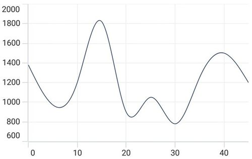

### Customizing the Range

[Maximum](https://help.syncfusion.com/cr/maui/Syncfusion.Maui.Charts.NumericalAxis.html#Syncfusion_Maui_Charts_NumericalAxis_Maximum) and [Minimum](https://help.syncfusion.com/cr/maui/Syncfusion.Maui.Charts.NumericalAxis.html#Syncfusion_Maui_Charts_NumericalAxis_Minimum) properties of axis is used for setting the maximum and minimum value of the axis range respectively.

N> If minimum or maximum value is set, the other value is calculated by default internally.





<chart:SfCartesianChart>
    . . .
    <chart:SfCartesianChart.YAxes>
      <chart:NumericalAxis Maximum="2750" Minimum="250" Interval="250"/>
    </chart:SfCartesianChart.YAxes>

</chart:SfCartesianChart>





SfCartesianChart chart = new SfCartesianChart();

NumericalAxis secondaryAxis = new NumericalAxis()
{
    Maximum = 2750,
    Minimum = 250,
    Interval = 250
};
chart.YAxes.Add(secondaryAxis);





## Category Axis

The [CategoryAxis](https://help.syncfusion.com/cr/maui/Syncfusion.Maui.Charts.CategoryAxis.html) is an indexed based axis that plots values based on the index of the data point collection. The points are equally spaced here.





<chart:SfCartesianChart>
    . . .
    <chart:SfCartesianChart.XAxes>
        <chart:CategoryAxis/>
    </chart:SfCartesianChart.XAxes>
</chart:SfCartesianChart>





SfCartesianChart chart = new SfCartesianChart();
. . .
CategoryAxis primaryAxis = new CategoryAxis();
chart.XAxes.Add(primaryAxis);
this.Content = chart;





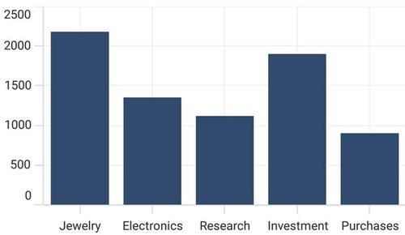

To customize the [CategoryAxis](https://help.syncfusion.com/cr/maui/Syncfusion.Maui.Charts.CategoryAxis.html) in .NET MAUI Cartesian Charts, you can check the below video.



### Label placement

The [LabelPlacement](https://help.syncfusion.com/cr/maui/Syncfusion.Maui.Charts.CategoryAxis.html#Syncfusion_Maui_Charts_CategoryAxis_LabelPlacement) property in [CategoryAxis](https://help.syncfusion.com/cr/maui/Syncfusion.Maui.Charts.CategoryAxis.html) is used to placed the axis labels based on ticks and between ticks. The default value of [LabelPlacement](https://help.syncfusion.com/cr/maui/Syncfusion.Maui.Charts.CategoryAxis.html#Syncfusion_Maui_Charts_CategoryAxis_LabelPlacement) is [OnTicks](https://help.syncfusion.com/cr/maui/Syncfusion.Maui.Charts.LabelPlacement.html#Syncfusion_Maui_Charts_LabelPlacement_OnTicks).





<chart:SfCartesianChart>
    . . .
    <chart:SfCartesianChart.XAxes>
        <chart:CategoryAxis LabelPlacement="BetweenTicks"/>
    </chart:SfCartesianChart.XAxes>
</chart:SfCartesianChart>





SfCartesianChart chart = new SfCartesianChart();
. . .
CategoryAxis primaryAxis = new CategoryAxis()
{
    LabelPlacement = LabelPlacement.BetweenTicks
};
chart.XAxes.Add(primaryAxis);
this.Content = chart;





### Interval

By default, the [CategoryAxis](https://help.syncfusion.com/cr/maui/Syncfusion.Maui.Charts.CategoryAxis.html) axis labels are display with fixed interval 1. It can customized by using the [Interval](https://help.syncfusion.com/cr/maui/Syncfusion.Maui.Charts.CategoryAxis.html#Syncfusion_Maui_Charts_CategoryAxis_Interval) property of axis.





<chart:SfCartesianChart>
    . . .
    <chart:SfCartesianChart.XAxes>
        <chart:CategoryAxis Interval="2"/>
    </chart:SfCartesianChart.XAxes>
</chart:SfCartesianChart>





SfCartesianChart chart = new SfCartesianChart();
. . .
CategoryAxis primaryAxis = new CategoryAxis()
{
    Interval = 2, 
};
chart.XAxes.Add(primaryAxis);

this.Content = chart;





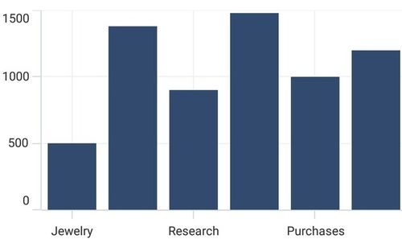

### Indexed category axis

In Cartesian Charts, the [ArrangeByIndex](https://help.syncfusion.com/cr/maui/Syncfusion.Maui.Charts.CategoryAxis.html#Syncfusion_Maui_Charts_CategoryAxis_ArrangeByIndex) property is used to determine how the items in a category axis are arranged. 

If [ArrangeByIndex](https://help.syncfusion.com/cr/maui/Syncfusion.Maui.Charts.CategoryAxis.html#Syncfusion_Maui_Charts_CategoryAxis_ArrangeByIndex) is set to true, then the items in the category axis will be arranged according to their index values.

If [ArrangeByIndex](https://help.syncfusion.com/cr/maui/Syncfusion.Maui.Charts.CategoryAxis.html#Syncfusion_Maui_Charts_CategoryAxis_ArrangeByIndex) is set to false, then the items in the category axis will be arranged according to their values. By default, [ArrangeByIndex](https://help.syncfusion.com/cr/maui/Syncfusion.Maui.Charts.CategoryAxis.html#Syncfusion_Maui_Charts_CategoryAxis_ArrangeByIndex) is true.

The following code illustrates how to define the property [ArrangeByIndex](https://help.syncfusion.com/cr/maui/Syncfusion.Maui.Charts.CategoryAxis.html#Syncfusion_Maui_Charts_CategoryAxis_ArrangeByIndex) in chart.





<chart:SfCartesianChart>
    . . .
    <chart:SfCartesianChart.XAxes>
        <chart:CategoryAxis ArrangeByIndex="False"/>
    </chart:SfCartesianChart.XAxes>
    
    <chart:SfCartesianChart.YAxes>
        <chart:NumericalAxis/>
    </chart:SfCartesianChart.YAxes>

    <chart:ColumnSeries ItemsSource="{Binding Data1}"
                        XBindingPath="Year"
                        YBindingPath="Value"/>

    <chart:ColumnSeries ItemsSource="{Binding Data2}"
                        XBindingPath="Year"
                        YBindingPath="Value"/>
</chart:SfCartesianChart>





SfCartesianChart chart = new SfCartesianChart();
. . .
CategoryAxis primaryAxis = new CategoryAxis()
{
    ArrangeByIndex = false, 
};
chart.XAxes.Add(primaryAxis);

NumericalAxis secondaryAxis = new NumericalAxis();
chart.YAxes.Add(secondaryAxis);  

ColumnSeries series1 = new ColumnSeries();
series1.ItemsSource = Data1; 
series1.XBindingPath = "Year";
series1.YBindingPath = "Value";

ColumnSeries series2 = new ColumnSeries();
series2.ItemsSource = Data2;  
series2.XBindingPath = "Year";
series2.YBindingPath = "Value";

chart.Series.Add(series1);
chart.Series.Add(series2);  

this.Content = chart;



    

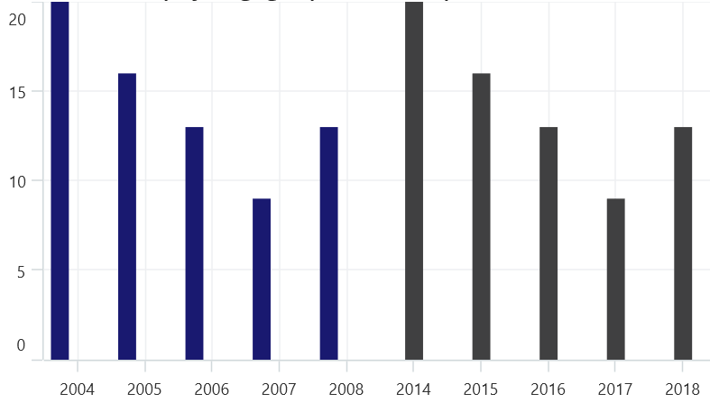

## DateTime Axis

[DateTimeAxis](https://help.syncfusion.com/cr/maui/Syncfusion.Maui.Charts.DateTimeAxis.html) is used to plot `DateTime` values. The [DateTimeAxis](https://help.syncfusion.com/cr/maui/Syncfusion.Maui.Charts.DateTimeAxis.html) is widely used to make financial charts in places like the Stock Market, where index plotting is done every day.





<chart:SfCartesianChart>
    . . .
    <chart:SfCartesianChart.XAxes>
        <chart:DateTimeAxis/>
    </chart:SfCartesianChart.XAxes>
</chart:SfCartesianChart>





SfCartesianChart chart = new SfCartesianChart();
. . .
DateTimeAxis primaryAxis = new DateTimeAxis();
chart.XAxes.Add(primaryAxis);

this.Content = chart;





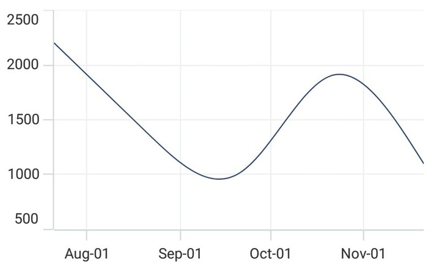

To customize the [DateTimeAxis](https://help.syncfusion.com/cr/maui/Syncfusion.Maui.Charts.DateTimeAxis.html) in .NET MAUI Cartesian Charts, you can check the below video.



### Interval

In [DateTimeAxis](https://help.syncfusion.com/cr/maui/Syncfusion.Maui.Charts.DateTimeAxis.html), intervals can be customized by using the [Interval](https://help.syncfusion.com/cr/maui/Syncfusion.Maui.Charts.DateTimeAxis.html#Syncfusion_Maui_Charts_DateTimeAxis_Interval) and [IntervalType](https://help.syncfusion.com/cr/maui/Syncfusion.Maui.Charts.DateTimeAxis.html#Syncfusion_Maui_Charts_DateTimeAxis_IntervalType) properties. For example, setting [Interval](https://help.syncfusion.com/cr/maui/Syncfusion.Maui.Charts.DateTimeAxis.html#Syncfusion_Maui_Charts_DateTimeAxis_Interval) as 6 and [IntervalType](https://help.syncfusion.com/cr/maui/Syncfusion.Maui.Charts.DateTimeAxis.html#Syncfusion_Maui_Charts_DateTimeAxis_IntervalType) as [Months](https://help.syncfusion.com/cr/maui/Syncfusion.Maui.Charts.DateTimeIntervalType.html#Syncfusion_Maui_Charts_DateTimeIntervalType_Months) will consider 6 months as interval.





<chart:SfCartesianChart>
    ...
    <chart:SfCartesianChart.XAxes>
        <chart:DateTimeAxis Interval="6" IntervalType="Months"/>
    </chart:SfCartesianChart.XAxes>
</chart:SfCartesianChart>





SfCartesianChart chart = new SfCartesianChart();
. . .
DateTimeAxis primaryAxis = new DateTimeAxis()
{
    Interval = 6, 
    IntervalType = DateTimeIntervalType.Months
};
chart.XAxes.Add(primaryAxis);

this.Content = chart;





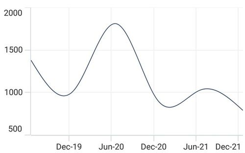

### Customizing the Range

[Minimum](https://help.syncfusion.com/cr/maui/Syncfusion.Maui.Charts.DateTimeAxis.html#Syncfusion_Maui_Charts_DateTimeAxis_Minimum) and [Maximum](https://help.syncfusion.com/cr/maui/Syncfusion.Maui.Charts.DateTimeAxis.html#Syncfusion_Maui_Charts_DateTimeAxis_Maximum) properties behavior is same as in [NumericalAxis](https://help.syncfusion.com/cr/maui/Syncfusion.Maui.Charts.NumericalAxis.html) instead of setting numerical value, have to set date time values.





<chart:SfCartesianChart>
    . . .
    <chart:SfCartesianChart.XAxes>
        <chart:DateTimeAxis Minimum="2021/05/10" Maximum="2021/11/01"/>
    </chart:SfCartesianChart.XAxes>
</chart:SfCartesianChart>





SfCartesianChart chart = new SfCartesianChart();
. . .
DateTimeAxis primaryAxis = new DateTimeAxis()
{
    Minimum = new DateTime(2021,05,10),
    Maximum = new DateTime(2021,11,01),
};
chart.XAxes.Add(primaryAxis);

this.Content = chart;





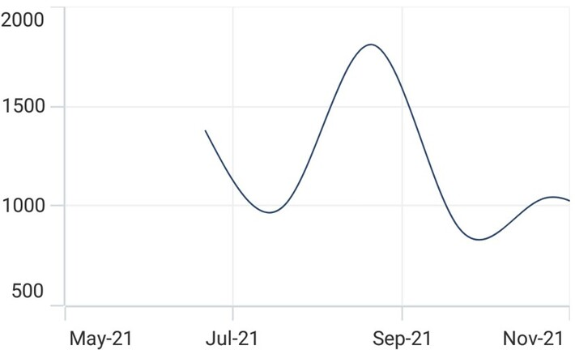

## DateTimeCategoryAxis

The [DateTimeCategoryAxis](https://help.syncfusion.com/cr/maui/Syncfusion.Maui.Charts.DateTimeCategoryAxis.html) is a specialized type of axis primarily used with financial series. Similar to the [CategoryAxis](https://help.syncfusion.com/cr/maui/Syncfusion.Maui.Charts.CategoryAxis.html), all data points are plotted with equal spacing, eliminating gaps for missing dates. The intervals and ranges for this axis are calculated similarly to the [DateTimeAxis](https://help.syncfusion.com/cr/maui/Syncfusion.Maui.Charts.DateTimeAxis.html). There are no visual gaps between points, even if the difference between two points exceeds a year.





<chart:SfCartesianChart>
    . . .
    <chart:SfCartesianChart.XAxes>
        <chart:DateTimeCategoryAxis/>
    </chart:SfCartesianChart.XAxes>
    . . .
</chart:SfCartesianChart>





SfCartesianChart chart = new SfCartesianChart(); 
. . . 
// Create an instance of the DateTimeCategoryAxis, used for displaying DateTime values as categories 
DateTimeCategoryAxis primaryAxis = new DateTimeCategoryAxis(); 
// Add the DateTimeCategoryAxis instance to the chart's XAxes collection 
chart.XAxes.Add(primaryAxis);

this.Content = chart; 





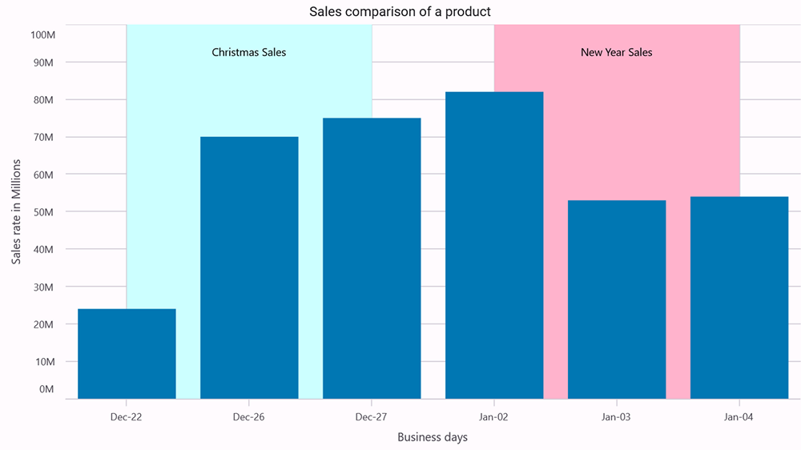

### Interval

In [DateTimeCategoryAxis](https://help.syncfusion.com/cr/maui/Syncfusion.Maui.Charts.DateTimeCategoryAxis.html), intervals can be customized by using the Interval and IntervalType properties, similar to [DateTimeAxis](https://help.syncfusion.com/cr/maui/Syncfusion.Maui.Charts.DateTimeAxis.html). For example, setting [Interval](https://help.syncfusion.com/cr/maui/Syncfusion.Maui.Charts.DateTimeCategoryAxis.html#Syncfusion_Maui_Charts_DateTimeCategoryAxis_Interval) as 5 and [IntervalType](https://help.syncfusion.com/cr/maui/Syncfusion.Maui.Charts.DateTimeCategoryAxis.html#Syncfusion_Maui_Charts_DateTimeCategoryAxis_IntervalType) as [Days](https://help.syncfusion.com/cr/maui/Syncfusion.Maui.Charts.DateTimeIntervalType.html#Syncfusion_Maui_Charts_DateTimeIntervalType_Days) will consider 5 days as an interval.




<chart:SfCartesianChart> 
    . . .
        <chart:SfCartesianChart.XAxes>
            <chart:DateTimeCategoryAxis Interval="5" 
                                        IntervalType="Days"/> 
        </chart:SfCartesianChart.XAxes> 
    . . .
</chart:SfCartesianChart>





SfCartesianChart chart = new SfCartesianChart(); 
. . .
DateTimeCategoryAxis primaryAxis = new DateTimeCategoryAxis() 
{ 
    Interval = 5, 
    IntervalType = DateTimeIntervalType.Days 
}; 
chart.XAxes.Add(primaryAxis);
. . .
this.Content = chart; 





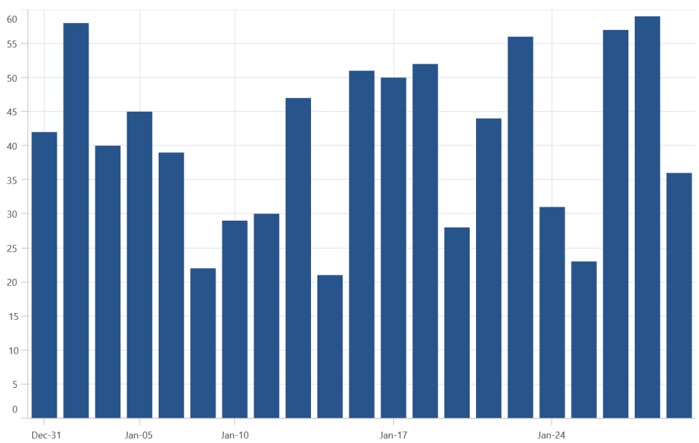

## Logarithmic Axis

The [LogarithmicAxis](https://help.syncfusion.com/cr/maui/Syncfusion.Maui.Charts.LogarithmicAxis.html) uses a logarithmic scale, and it is very useful in visualizing data when the given data range has a big difference. It can be used either on the x-axis or the chart's y-axis.





<chart:SfCartesianChart>
    . . .
    <chart:SfCartesianChart.YAxes>
        <chart:LogarithmicAxis/>
    </chart:SfCartesianChart.YAxes>
</chart:SfCartesianChart>





SfCartesianChart chart = new SfCartesianChart();
. . .
LogarithmicAxis secondaryAxis = new LogarithmicAxis();
chart.YAxes.Add(secondaryAxis);

this.Content = chart;





To customize the [LogarithmicAxis](https://help.syncfusion.com/cr/maui/Syncfusion.Maui.Charts.LogarithmicAxis.html) in .NET MAUI Cartesian Charts, you can check the below video.



### Interval

Axis interval can be customized using the [Interval](https://help.syncfusion.com/cr/maui/Syncfusion.Maui.Charts.LogarithmicAxis.html#Syncfusion_Maui_Charts_LogarithmicAxis_Interval) property of the axis. By default, interval will be calculated based on the minimum and maximum value of the provided data. And the default value of the interval is 1. 





<chart:SfCartesianChart>
    . . .
    <chart:SfCartesianChart.YAxes>
        <chart:LogarithmicAxis Interval="2"/>
    </chart:SfCartesianChart.YAxes>
</chart:SfCartesianChart>





SfCartesianChart chart = new SfCartesianChart();
. . .
LogarithmicAxis secondaryAxis = new LogarithmicAxis()
{
    Interval = 2 
};
chart.YAxes.Add(secondaryAxis);

this.Content = chart;





### Range customization

To customize the range of the log axis, you can use the [Minimum](https://help.syncfusion.com/cr/maui/Syncfusion.Maui.Charts.LogarithmicAxis.html#Syncfusion_Maui_Charts_LogarithmicAxis_Minimum), [Maximum](https://help.syncfusion.com/cr/maui/Syncfusion.Maui.Charts.LogarithmicAxis.html#Syncfusion_Maui_Charts_LogarithmicAxis_Maximum) properties of the [LogarithmicAxis](https://help.syncfusion.com/cr/maui/Syncfusion.Maui.Charts.LogarithmicAxis.html). By default, an excellent range will be calculated automatically based on the provided data. 





<chart:SfCartesianChart>
    . . .
    <chart:SfCartesianChart.YAxes>
        <chart:LogarithmicAxis Minimum="100" Maximum="10000"/>
    </chart:SfCartesianChart.YAxes>
</chart:SfCartesianChart>





SfCartesianChart chart = new SfCartesianChart();
. . .
LogarithmicAxis secondaryAxis = new LogarithmicAxis()
{
    Minimum = 100, 
    Maximum = 10000 
};
chart.YAxes.Add(secondaryAxis);

this.Content = chart;





### Base customization

The logarithmic axis base can be customized using the [LogarithmicBase](https://help.syncfusion.com/cr/maui/Syncfusion.Maui.Charts.LogarithmicAxis.html#Syncfusion_Maui_Charts_LogarithmicAxis_LogarithmicBase) property of the axis. By default, the base value is 10.





<chart:SfCartesianChart>
    . . .
    <chart:SfCartesianChart.YAxes>
        <chart:LogarithmicAxis LogarithmicBase="5"/>
    </chart:SfCartesianChart.YAxes>
</chart:SfCartesianChart>





SfCartesianChart chart = new SfCartesianChart();
. . .
LogarithmicAxis secondaryAxis = new LogarithmicAxis()
{
    LogarithmicBase = 5 
};
chart.YAxes.Add(secondaryAxis);

this.Content = chart;





To customize the [ChartAxis](https://help.syncfusion.com/cr/maui/Syncfusion.Maui.Charts.ChartAxis.html) in .NET MAUI Cartesian Charts, you can check the below video.



## Inversed

Axis can be inverted by using the [IsInversed](https://help.syncfusion.com/cr/maui/Syncfusion.Maui.Charts.ChartAxis.html#Syncfusion_Maui_Charts_ChartAxis_IsInversed) property. The default value of this property is `False`.





<chart:SfCartesianChart>
    . . .
    <chart:SfCartesianChart.YAxes>
        <chart:NumericalAxis IsInversed="True"/>
    </chart:SfCartesianChart.YAxes>
</chart:SfCartesianChart>





SfCartesianChart chart = new SfCartesianChart();
. . .
NumericalAxis secondaryAxis = new NumericalAxis();
secondaryAxis.IsInversed = true;
chart.YAxes.Add(secondaryAxis);

this.Content = chart;





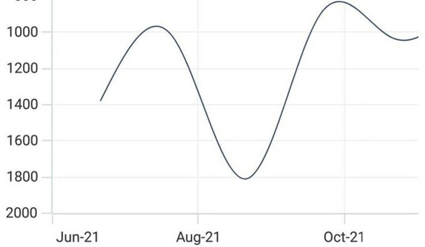

## Axis Visibility

Axis visibility can be controlled using the [IsVisible](https://help.syncfusion.com/cr/maui/Syncfusion.Maui.Charts.ChartAxis.html#Syncfusion_Maui_Charts_ChartAxis_IsVisible) property of axis. Default value of [IsVisible](https://help.syncfusion.com/cr/maui/Syncfusion.Maui.Charts.ChartAxis.html#Syncfusion_Maui_Charts_ChartAxis_IsVisible) property is `True`.





<chart:SfCartesianChart>
    . . .
    <chart:SfCartesianChart.YAxes>
        <chart:NumericalAxis IsVisible="False"/>
    </chart:SfCartesianChart.YAxes>
</chart:SfCartesianChart>





SfCartesianChart chart = new SfCartesianChart();
. . .
NumericalAxis secondaryAxis = new NumericalAxis() 
{
	IsVisible = false 
};
chart.YAxes.Add(secondaryAxis);

this.Content = chart;





## Multiple Axes

Cartesian charts provides support to arrange the multiple series inside the same chart area with specified x-axis and y-axis. There are two properties [XAxisName](https://help.syncfusion.com/cr/maui/Syncfusion.Maui.Charts.CartesianSeries.html#Syncfusion_Maui_Charts_CartesianSeries_XAxisName) and [YAxisName](https://help.syncfusion.com/cr/maui/Syncfusion.Maui.Charts.CartesianSeries.html#Syncfusion_Maui_Charts_CartesianSeries_YAxisName) in all the Cartesian series type, which is used to provide multiple axes support. These axes can be arranged in a stacking order or in a side by side pattern.

By default, The 0th index value of XAxes and YAxes is used to plot all of the series.





<ContentPage xmlns="http://schemas.microsoft.com/dotnet/2021/maui"
             xmlns:x="http://schemas.microsoft.com/winfx/2009/xaml"
             xmlns:sys="clr-namespace:System;assembly=mscorlib"
             xmlns:chart="clr-namespace:Syncfusion.Maui.Charts;assembly=Syncfusion.Maui.Charts">

    <chart:SfCartesianChart>
        . . .
        <chart:SfCartesianChart.XAxes>
            <chart:DateTimeAxis ShowMajorGridLines="False"/>
        </chart:SfCartesianChart.XAxes>

        <chart:SfCartesianChart.YAxes>
            <chart:NumericalAxis ShowMajorGridLines="False"/>
            <chart:NumericalAxis Name="series_YAxis" CrossesAt="{Static x:Double.MaxValue}" ShowMajorGridLines="False"/>
        </chart:SfCartesianChart.YAxes>

        <chart:ColumnSeries ItemsSource="{Binding Demands}" 
                            XBindingPath="Demand"
                            YBindingPath="Year2011" 
                            YAxisName="series_YAxis"/>
        <chart:SplineSeries ItemsSource="{Binding Demands}" 
                            XBindingPath="Date"
                            YBindingPath="Year2011"/>
    </chart:SfCartesianChart>
</ContentPage>





SfCartesianChart chart = new SfCartesianChart();

DateTimeAxis primaryAxis = new DateTimeAxis()
{
    ShowMajorGridLines = false
};
chart.XAxes.Add(primaryAxis);

NumericalAxis secondaryAxis = new NumericalAxis()
{
    CrossesAt = double.MaxValue,
    ShowMajorGridLines = false
};
secondaryAxis.Name = "series_YAxis";
chart.YAxes.Add(secondaryAxis);

NumericalAxis secondaryAxis1 = new NumericalAxis();
chart.YAxes.Add(secondaryAxis1);

ColumnSeries series1 = new ColumnSeries()
{
    ItemsSource = new ViewModel().Demands,
    XBindingPath = "Demand",
    YBindingPath = "Year2011"
    YAxisName = "series_YAxis"
};

SplineSeries series2 = new SplineSeries()
{
    ItemsSource = new ViewModel().Demands,
    XBindingPath = "Date",
    YBindingPath = "Year2011",
};

chart.Series.Add(series1);
chart.Series.Add(series2);

this.Content = chart;





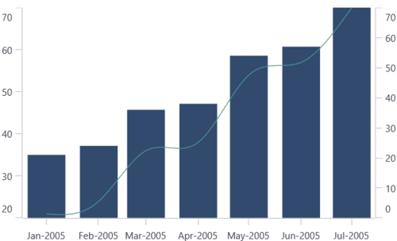

In the above image, the [ColumnSeries](https://help.syncfusion.com/cr/maui/Syncfusion.Maui.Charts.ColumnSeries.html) is plotted based on additional axes of [YAxes](https://help.syncfusion.com/cr/maui/Syncfusion.Maui.Charts.SfCartesianChart.html#Syncfusion_Maui_Charts_SfCartesianChart_YAxes) collection, and [SplineSeries](https://help.syncfusion.com/cr/maui/Syncfusion.Maui.Charts.SplineSeries.html) is plotted based on axis of the collection's 0th index.

## Axis Crossing

The chart allows you to customize the origin, by default the axis will be rendered with (0,0) as the origin in x and y-axes. An axis can be positioned anywhere in the chart area by using the [CrossesAt](https://help.syncfusion.com/cr/maui/Syncfusion.Maui.Charts.ChartAxis.html#Syncfusion_Maui_Charts_ChartAxis_CrossesAt) property. This property specifies where the horizontal axis intersects or crosses the vertical axis, and vice versa. The default value of the CrossesAt property is `double.NaN`.





<chart:SfCartesianChart>

    <chart:SfCartesianChart.XAxes>
        <chart:NumericalAxis CrossesAt="0"
                             Minimum="-8"
                             Maximum="8"
                             ShowMajorGridLines="False"/>
    </chart:SfCartesianChart.XAxes>

    <chart:SfCartesianChart.YAxes>
        <chart:NumericalAxis CrossesAt="0"
                             Minimum="-8"
                             Maximum="8"
                             ShowMajorGridLines="False"/>
    </chart:SfCartesianChart.YAxes>

</chart:SfCartesianChart>





SfCartesianChart chart = new SfCartesianChart();

NumericalAxis primaryAxis = new NumericalAxis();
primaryAxis.CrossesAt = 0;
primaryAxis.Minimum = -8;
primaryAxis.Maximum = 8;
primaryAxis.ShowMajorGridLines = false;
chart.XAxes.Add(primaryAxis);

NumericalAxis secondaryAxis = new NumericalAxis();
secondaryAxis.CrossesAt = 0;
secondaryAxis.Minimum = -8;
secondaryAxis.Maximum = 8;
secondaryAxis.ShowMajorGridLines = false;
chart.YAxes.Add(secondaryAxis);

this.Content = chart;





### Positioning the axis elements while crossing

The [RenderNextToCrossingValue](https://help.syncfusion.com/cr/maui/Syncfusion.Maui.Charts.ChartAxis.html#Syncfusion_Maui_Charts_ChartAxis_RenderNextToCrossingValue) property is used to determine whether the crossing axis should be placed at crossing position or not. The default value of [RenderNextToCrossingValue](https://help.syncfusion.com/cr/maui/Syncfusion.Maui.Charts.ChartAxis.html#Syncfusion_Maui_Charts_ChartAxis_RenderNextToCrossingValue) property is true.





<chart:SfCartesianChart>
    
    <chart:SfCartesianChart.XAxes>
        <chart:NumericalAxis CrossesAt="0" RenderNextToCrossingValue="False"/>
    </chart:SfCartesianChart.XAxes>

    <chart:SfCartesianChart.YAxes>
        <chart:NumericalAxis CrossesAt="0"/>
    </chart:SfCartesianChart.YAxes>

</chart:SfCartesianChart>





SfCartesianChart chart = new SfCartesianChart();
NumericalAxis primaryAxis = new NumericalAxis();
primaryAxis.CrossesAt = 0;
primaryAxis.RenderNextToCrossingValue = false;
chart.XAxes.Add(primaryAxis);
NumericalAxis secondaryAxis = new NumericalAxis();
secondaryAxis.CrossesAt = 0;
chart.YAxes.Add(secondaryAxis);
this.Content = chart;





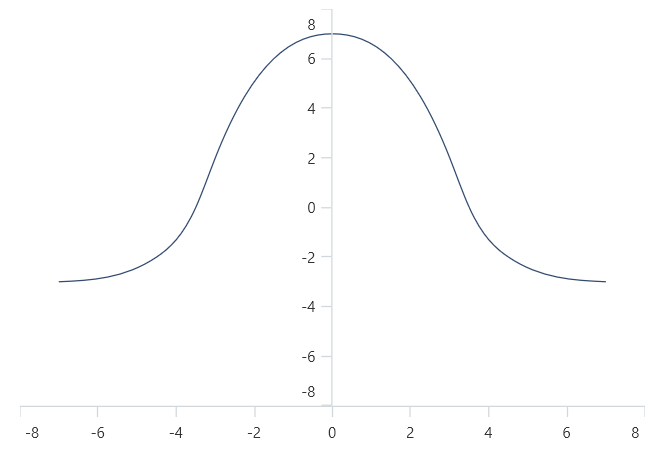

### Crossing the date-time axis

For the crossing in date time horizontal axis, date object should be provided as value for `CrossesAt` property of vertical axis.





<chart:SfCartesianChart>
    
    <chart:SfCartesianChart.XAxes>
        <chart:DateTimeAxis />
    </chart:SfCartesianChart.XAxes>

    <chart:SfCartesianChart.yAxes>
        <chart:NumericalAxis CrossesAt="2021-01-01"/>
    </chart:SfCartesianChart.yAxes>

</chart:SfCartesianChart>





SfCartesianChart chart = new SfCartesianChart();

DateTimeAxis primaryAxis = new DateTimeAxis();
chart.XAxes.Add(primaryAxis);

NumericalAxis secondaryAxis = new NumericalAxis();
secondaryAxis.CrossesAt = new DateTime(2021, 01, 01);;
chart.YAxes.Add(secondaryAxis);

this.Content = chart;





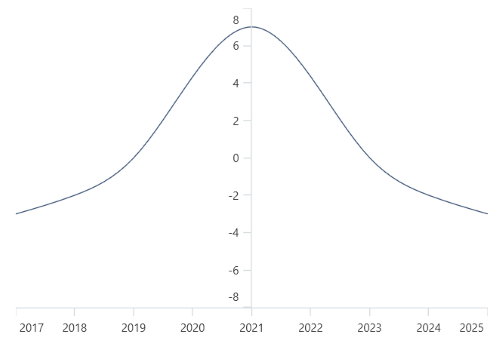

### Opposite Side Axis with CrossesAt

The chart allows you to position the axis to opposed position by setting the value as `double.MaxValue` to the [CrossesAt](https://help.syncfusion.com/cr/maui/Syncfusion.Maui.Charts.ChartAxis.html#Syncfusion_Maui_Charts_ChartAxis_CrossesAt) property.





<chart:SfCartesianChart>

    <chart:SfCartesianChart.XAxes>
        <chart:NumericalAxis/>
    </chart:SfCartesianChart.XAxes>

    <chart:SfCartesianChart.YAxes>
        <chart:NumericalAxis CrossesAt="{Static x:Double.MaxValue}"/>
    </chart:SfCartesianChart.YAxes>

</chart:SfCartesianChart>





SfCartesianChart chart = new SfCartesianChart();
NumericalAxis primaryAxis = new NumericalAxis();
chart.XAxes.Add(primaryAxis);
NumericalAxis secondaryAxis = new NumericalAxis();
secondaryAxis.CrossesAt = double.MaxValue;
chart.YAxes.Add(secondaryAxis);
this.Content = chart;





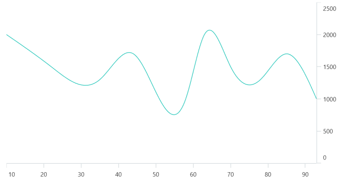

## Events

### ActualRangeChanged

The [ActualRangeChanged](https://help.syncfusion.com/cr/maui/Syncfusion.Maui.Charts.ActualRangeChangedEventArgs.html) event is triggered when the actual range of the axis is changed. The argument contains the following information:

* [ActualMinimum](https://help.syncfusion.com/cr/maui/Syncfusion.Maui.Charts.ActualRangeChangedEventArgs.html#Syncfusion_Maui_Charts_ActualRangeChangedEventArgs_ActualMinimum) - used to get the actual minimum value of the axis.
* [ActualMaximum](https://help.syncfusion.com/cr/maui/Syncfusion.Maui.Charts.ActualRangeChangedEventArgs.html#Syncfusion_Maui_Charts_ActualRangeChangedEventArgs_ActualMaximum) - used to get the actual maximum value of the axis.

N> The actual range is changed by specifying the [ZoomPosition](https://help.syncfusion.com/cr/maui/Syncfusion.Maui.Charts.ChartAxis.html#Syncfusion_Maui_Charts_ChartAxis_ZoomPosition) and [ZoomFactor](https://help.syncfusion.com/cr/maui/Syncfusion.Maui.Charts.ChartAxis.html#Syncfusion_Maui_Charts_ChartAxis_ZoomFactor) properties or zooming the chart interactively.

### LabelCreated

The [LabelCreated](https://help.syncfusion.com/cr/maui/Syncfusion.Maui.Charts.ChartAxis.html#Syncfusion_Maui_Charts_ChartAxis_LabelCreated) event is triggered when the axis label is created. The argument contains the following information:

* [Label](https://help.syncfusion.com/cr/maui/Syncfusion.Maui.Charts.ChartAxisLabelEventArgs.html#Syncfusion_Maui_Charts_ChartAxisLabelEventArgs_Label) - Used to get or set the text of axis label.
* [Position](https://help.syncfusion.com/cr/maui/Syncfusion.Maui.Charts.ChartAxisLabelEventArgs.html#Syncfusion_Maui_Charts_ChartAxisLabelEventArgs_Position) - Used to get the position of label.
* [LabelStyle](https://help.syncfusion.com/cr/maui/Syncfusion.Maui.Charts.ChartAxisLabelEventArgs.html#Syncfusion_Maui_Charts_ChartAxisLabelEventArgs_LabelStyle) - Used to customize the appearance of axis labels.
