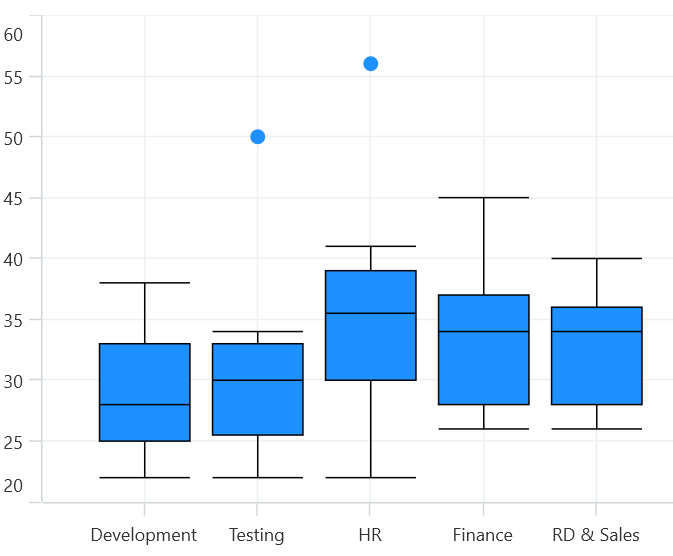
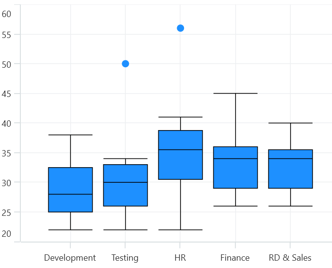
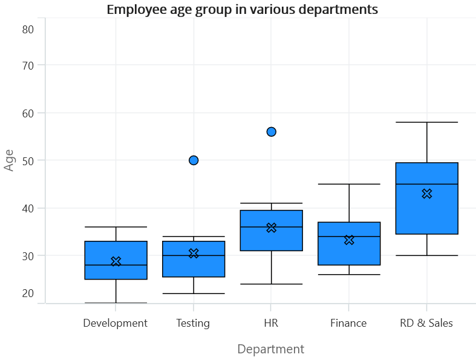
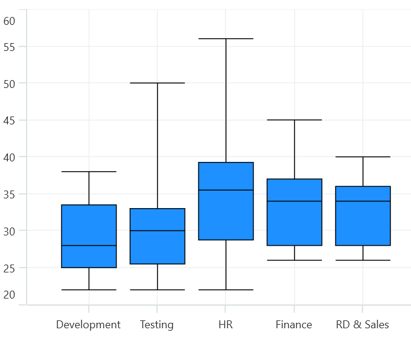

# Box and Whisker Chart in .NET MAUI Chart

Box plot chart is used to show the distribution of data within a population. To render a BoxAndWhisker chart, create an instance of [BoxAndWhiskerSeries](), and add it to the [Series]() collection property of [SfCartesianChart](https://help.syncfusion.com/cr/maui/Syncfusion.Maui.Charts.SfCartesianChart.html?tabs=tabid-1).

Box plots are great for comparing the distribution of multiple datasets side by side. By comparing the median, quartiles, and range of the boxes, you can quickly identify differences in the center, spread, and skewness of the distributions.The following code illustrates how to define the series in chart.

N> The Cartesian chart has [Series](https://help.syncfusion.com/cr/maui/Syncfusion.Maui.Charts.SfCartesianChart.html#Syncfusion_Maui_Charts_SfCartesianChart_Series) as its default content.





    <chart:SfCartesianChart>

    <chart:SfCartesianChart.XAxes>
        <chart:CategoryAxis />
    </chart:SfCartesianChart.XAxes>

    <chart:SfCartesianChart.YAxes>
        <chart:NumericalAxis />
    </chart:SfCartesianChart.YAxes>   

    <chart:BoxAndWhiskerSeries ItemsSource="{Binding BoxWhiskerData}"
                               XBindingPath="Department"
                               YBindingPath="Age"/>

    </chart:SfCartesianChart>





    SfCartesianChart chart = new SfCartesianChart();
    CategoryAxis primaryAxis = new CategoryAxis();
    chart.XAxes.Add(primaryAxis);
    NumericalAxis secondaryAxis = new NumericalAxis();
    chart.YAxes.Add(secondaryAxis);

    BoxAndWhiskerSeries series = new BoxAndWhiskerSeries()
    {
        ItemsSource = new ViewModel().BoxWhiskerData,
        XBindingPath = "Department",
        YBindingPath = "Age",
    };

    chart.Series.Add(series);
    this.Content = chart;





## Customize the series Box mode
The series box plotting mode can be changed by using [BoxPlotMode]() property of [BoxAndWhiskerSeries](). The plotting mode of series can be calculated as follows:

* [`Exclusive`]()-The quartile values are calculated by using the formula (N+1) * P (N count, P percentile) and its index value starts from 1 in the list.

* [`Inclusive`]()- The quartile values are calculated by using the formula (N−1) * P (N count, P percentile) and its index value starts from 0 in the list.

* [`Normal`]()-The quartile values are calculated by splitting the list and getting the median values.

By default,[BoxPlotMode]() value is [Exclusive]().

## Normal
In Normal mode, the whiskers extend to the minimum and maximum data points within two times the standard deviation of the data. This method assumes that the data is normally distributed.The following code illustrate how to define property [BoxPlotMode]() value as [Normal]().





    <chart:SfCartesianChart>

    <chart:SfCartesianChart.XAxes>
        <chart:CategoryAxis />
    </chart:SfCartesianChart.XAxes>

    <chart:SfCartesianChart.YAxes>
        <chart:NumericalAxis />
    </chart:SfCartesianChart.YAxes>  

    <chart:BoxAndWhiskerSeries ItemsSource="{Binding BoxWhiskerData}"
                               XBindingPath="Department"
                               YBindingPath="Age"
                               BoxPlotMode="Normal"/>

    </chart:SfCartesianChart>





    SfCartesianChart chart = new SfCartesianChart();
    CategoryAxis primaryAxis = new CategoryAxis();
    chart.XAxes.Add(primaryAxis);
    NumericalAxis secondaryAxis = new NumericalAxis();
    chart.YAxes.Add(secondaryAxis);

    BoxAndWhiskerSeries series = new BoxAndWhiskerSeries()
    {
        ItemsSource = new ViewModel().BoxWhiskerData,
        XBindingPath = "Department",
        YBindingPath = "Age",
        BoxPlotMode = "Normal"/>
    };

    chart.Series.Add(series);
    this.Content = chart;





## Inclusive
In Inclusive mode, the whiskers extend to the minimum and maximum data points within 1.5 times the IQR. Any points beyond this range are considered outliers.The following code illustrate how to define property [BoxPlotMode]() value as [Inclusive]().





    <chart:SfCartesianChart>

    <chart:SfCartesianChart.XAxes>
        <chart:CategoryAxis />
    </chart:SfCartesianChart.XAxes>

    <chart:SfCartesianChart.YAxes>
        <chart:NumericalAxis />
    </chart:SfCartesianChart.YAxes>  

    <chart:BoxAndWhiskerSeries ItemsSource="{Binding BoxWhiskerData}"
                               XBindingPath="Department"
                               YBindingPath="Age"
                               BoxPlotMode="Inclusive"/>

    </chart:SfCartesianChart>





    SfCartesianChart chart = new SfCartesianChart();
    CategoryAxis primaryAxis = new CategoryAxis();
    chart.XAxes.Add(primaryAxis);
    NumericalAxis secondaryAxis = new NumericalAxis();
    chart.YAxes.Add(secondaryAxis);

    BoxAndWhiskerSeries series = new BoxAndWhiskerSeries()
    {
        ItemsSource = new ViewModel().BoxWhiskerData,
        XBindingPath = "Department",
        YBindingPath = "Age",
        BoxPlotMode = "Inclusive"/>
    };

    chart.Series.Add(series);
    this.Content = chart;





## ShowMedian
The Median values of given dataset is viewed by enabling the [ShowMedian]() property of [BoxAndWhiskerSeries]().By default, the ShowMedian property value is False.The following code illustrates how to enable the [ShowMedian]() property.





    <chart:SfCartesianChart>

    <chart:SfCartesianChart.XAxes>
        <chart:CategoryAxis />
    </chart:SfCartesianChart.XAxes>

    <chart:SfCartesianChart.YAxes>
        <chart:NumericalAxis />
    </chart:SfCartesianChart.YAxes>  

    <chart:BoxAndWhiskerSeries ItemsSource="{Binding BoxWhiskerData}"
                               XBindingPath="Department"
                               YBindingPath="Age"
                               ShowMedian="True"/>

    </chart:SfCartesianChart>





    SfCartesianChart chart = new SfCartesianChart();
    CategoryAxis primaryAxis = new CategoryAxis();
    chart.XAxes.Add(primaryAxis);
    NumericalAxis secondaryAxis = new NumericalAxis();
    chart.YAxes.Add(secondaryAxis);

    BoxAndWhiskerSeries series = new BoxAndWhiskerSeries()
    {
        ItemsSource = new ViewModel().BoxWhiskerData,
        XBindingPath = "Department",
        YBindingPath = "Age",
        ShowMedian = "True"/>
    };

    chart.Series.Add(series);
    this.Content = chart;





N>

 * The middle number of data points is the median for the odd number of data points.
 * The average of the middle two numbers is a median for the even number of data points.

## Outlier
The outlier displays the outlier point that lies either under the lower whisker or above the upper whisker line. It is an observation numerically distant from the rest of the data.

## ShowOutlier
The outlier value in the box plot can be viewed by enabling the [ShowOutlier]() property of [BoxAndWhiskerSeries]().By default, [ShowOutlier] value is true.The following code demonstrates how to disable the [ShowOutlier]() property.





    <chart:SfCartesianChart>

    <chart:SfCartesianChart.XAxes>
        <chart:CategoryAxis />
    </chart:SfCartesianChart.XAxes>

    <chart:SfCartesianChart.YAxes>
        <chart:NumericalAxis />
    </chart:SfCartesianChart.YAxes>  

    <chart:BoxAndWhiskerSeries ItemsSource="{Binding BoxWhiskerData}"
                                XBindingPath="Department"
                                YBindingPath="Age"
                                ShowOutlier="False"/>

    </chart:SfCartesianChart>





    SfCartesianChart chart = new SfCartesianChart();
    CategoryAxis primaryAxis = new CategoryAxis();
    chart.XAxes.Add(primaryAxis);
    NumericalAxis secondaryAxis = new NumericalAxis();
    chart.YAxes.Add(secondaryAxis);

    BoxAndWhiskerSeries series = new BoxAndWhiskerSeries()
    {
        ItemsSource = new ViewModel().BoxWhiskerData,
        XBindingPath = "Department",
        YBindingPath = "Age",
        ShowOutlier = "False"/>
    };

    chart.Series.Add(series);
    this.Content = chart;





## OutlierShapeType

The [OutlierShapeType]() displays the outlier point with different symbols. The available symbols are Cross, Diamond, Ellipse, Hexagon, InvertedTriangle, Pentagon, Plus, Rectangle and Triangle. By default, [OutlierShapeType]() value is [Ellipse]().

The following code shows how to set the [OutlierShapeType]() value as [Cross]().OutlierShapeType.





    <chart:SfCartesianChart>

    <chart:SfCartesianChart.XAxes>
        <chart:CategoryAxis />
    </chart:SfCartesianChart.XAxes>

    <chart:SfCartesianChart.YAxes>
        <chart:NumericalAxis />
    </chart:SfCartesianChart.YAxes>  

    <chart:BoxAndWhiskerSeries ItemsSource="{Binding BoxWhiskerData}"
                                XBindingPath="Department"
                                YBindingPath="Age"
                                OutlierShapeType="Cross"/>

    </chart:SfCartesianChart>





    SfCartesianChart chart = new SfCartesianChart();
    CategoryAxis primaryAxis = new CategoryAxis();
    chart.XAxes.Add(primaryAxis);
    NumericalAxis secondaryAxis = new NumericalAxis();
    chart.YAxes.Add(secondaryAxis);

    BoxAndWhiskerSeries series = new BoxAndWhiskerSeries()
    {
        ItemsSource = new ViewModel().BoxWhiskerData,
        XBindingPath = "Department",
        YBindingPath = "Age",
        OutlierShapeType = ShapeType.Cross/>
    };

    chart.Series.Add(series);
    this.Content = chart;





