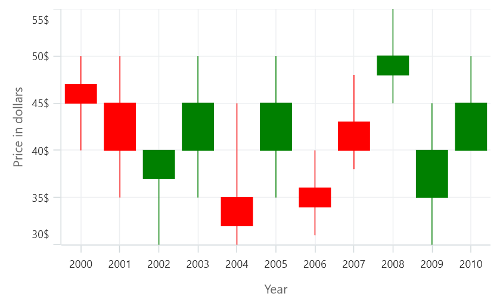

# Candle Chart in .NET MAUI Chart

Candle charts are a type of financial chart used to represent the price movement of an asset over time. The chart is made up of a series of rectangular bars, called candlesticks, that represent a specific time, typically one day. To render a candle chart, create an instance of [CandleSeries](), and add it to the [Series](https://help.syncfusion.com/cr/maui/Syncfusion.Maui.Charts.SfCartesianChart.html#Syncfusion_Maui_Charts_SfCartesianChart_Series) collection property of [SfCartesianChart](https://help.syncfusion.com/cr/maui/Syncfusion.Maui.Charts.SfCartesianChart.html?tabs=tabid-1).

N> The cartesian chart has [Series](https://help.syncfusion.com/cr/maui/Syncfusion.Maui.Charts.SfCartesianChart.html#Syncfusion_Maui_Charts_SfCartesianChart_Series) as its default content.

To plot a point on a candlestick chart, a collection of five values is required, including the X-value, open value, high value, low value, and close value. You can use the below collection.





    ObservableCollection<Model> StockData = new ObservableCollection<Model>();
    StockData.Add(new Model { Year = "2000", High = 50, Low = 40, Open = 47, Close = 45 });
    StockData.Add(new Model { Year = "2001", High = 50, Low = 35, Open = 45, Close = 40 });
    StockData.Add(new Model { Year = "2002", High = 40, Low = 30, Open = 37, Close = 40 });
    StockData.Add(new Model { Year = "2003", High = 50, Low = 35, Open = 40, Close = 45 });
    StockData.Add(new Model { Year = "2004", High = 45, Low = 30, Open = 35, Close = 32 });
    StockData.Add(new Model { Year = "2005", High = 50, Low = 35, Open = 40, Close = 45 });
    StockData.Add(new Model { Year = "2006", High = 40, Low = 31, Open = 36, Close = 34 });
    StockData.Add(new Model { Year = "2007", High = 48, Low = 38, Open = 43, Close = 40 });
    StockData.Add(new Model { Year = "2008", High = 55, Low = 45, Open = 48, Close = 50 });
    StockData.Add(new Model { Year = "2009", High = 45, Low = 30, Open = 35, Close = 40 });
    StockData.Add(new Model { Year = "2010", High = 50, Low = 40, Open = 40, Close = 35 });





<chart:SfCartesianChart>

    <chart:SfCartesianChart.XAxes>
        <chart:CategoryAxis/>
    </chart:SfCartesianChart.XAxes>

    <chart:SfCartesianChart.YAxes>
        <chart:NumericalAxis/>
    </chart:SfCartesianChart.YAxes>   

    <chart:CandleSeries ItemsSource="{Binding StockData}"
                        XBindingPath="Year"
                        Open="Open"
                        High="High"
                        Low="Low"
                        Close="Close"/>

</chart:SfCartesianChart>





    SfCartesianChart chart = new SfCartesianChart();
    CategoryAxis primaryAxis = new CategoryAxis();
    chart.XAxes.Add(primaryAxis);
    NumericalAxis secondaryAxis = new NumericalAxis();
    chart.YAxes.Add(secondaryAxis);

    CandleSeries series = new CandleSeries()
    {
        ItemsSource = new ViewModel().StockData,
        XBindingPath = "Year",
        Open = "Open",
        High = "High",
        Low = "Low",
        Close = "Close",
    };

    chart.Series.Add(series);
    this.Content = chart;





## Bull and Bear Color

In the Candle chart, the [BullishFill]() property is used to specify a fill color for the segments that indicates an increase in the stock price in the measured time interval, and the [BearishFill]() property is used to specify a fill color for the segments that indicates a decrease in the stock price in the measured time interval.





<chart:SfCartesianChart>

    <chart:SfCartesianChart.XAxes>
        <chart:CategoryAxis/>
    </chart:SfCartesianChart.XAxes>

    <chart:SfCartesianChart.YAxes>
        <chart:NumericalAxis/>
    </chart:SfCartesianChart.YAxes>   

    <chart:CandleSeries ItemsSource="{Binding StockData}"
                        XBindingPath="Year"
                        Open="Open"
                        High="High"
                        Low="Low"
                        Close="Close"
                        BullishFill="Blue"
                        BearishFill="Yellow"/>

</chart:SfCartesianChart>





    SfCartesianChart chart = new SfCartesianChart();
    CategoryAxis primaryAxis = new CategoryAxis();
    chart.XAxes.Add(primaryAxis);
    NumericalAxis secondaryAxis = new NumericalAxis();
    chart.YAxes.Add(secondaryAxis);

    CandleSeries series = new CandleSeries()
    {
        ItemsSource = new ViewModel().StockData,
        XBindingPath = "Year",
        Open = "Open",
        High = "High",
        Low = "Low",
        Close = "Close",
        BullishFill = Colors.Blue,
        BearishFill = Colors.Yellow,
    };

    chart.Series.Add(series);
    this.Content = chart;





## EnableSolidCandle

In Candle Series, the [EnableSolidCandle]() property is used to specify whether the candle segment should be filled or hollow. The default value of this property is false.





<chart:SfCartesianChart>

    <chart:SfCartesianChart.XAxes>
        <chart:CategoryAxis/>
    </chart:SfCartesianChart.XAxes>

    <chart:SfCartesianChart.YAxes>
        <chart:NumericalAxis/>
    </chart:SfCartesianChart.YAxes>   

    <chart:CandleSeries ItemsSource="{Binding StockData}"
                        XBindingPath="Year"
                        Open="Open"
                        High="High"
                        Low="Low"
                        Close="Close"
                        EnableSolidCandle="True"/>

</chart:SfCartesianChart>





    SfCartesianChart chart = new SfCartesianChart();
    CategoryAxis primaryAxis = new CategoryAxis();
    chart.XAxes.Add(primaryAxis);
    NumericalAxis secondaryAxis = new NumericalAxis();
    chart.YAxes.Add(secondaryAxis);

    CandleSeries series = new CandleSeries()
    {
        ItemsSource = new ViewModel().StockData,
        XBindingPath = "Year",
        Open = "Open",
        High = "High",
        Low = "Low",
        Close = "Close",
        EnableSolidCandle=true,
    };

    chart.Series.Add(series);
    this.Content = chart;





