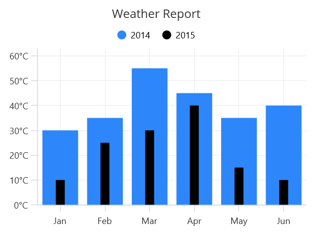

# Column Chart in .NET MAUI Chart

## Column Chart

Column chart is used to plot discrete rectangles for the given data point values. To render a column chart, create an instance of [ColumnSeries](https://help.syncfusion.com/cr/maui/Syncfusion.Maui.Charts.ColumnSeries.html?tabs=tabid-1), and add it to the [Series](https://help.syncfusion.com/cr/maui/Syncfusion.Maui.Charts.SfCartesianChart.html#Syncfusion_Maui_Charts_SfCartesianChart_Series) collection property of [SfCartesianChart](https://help.syncfusion.com/cr/maui/Syncfusion.Maui.Charts.SfCartesianChart.html?tabs=tabid-1).

N> The cartesian chart has [Series](https://help.syncfusion.com/cr/maui/Syncfusion.Maui.Charts.SfCartesianChart.html#Syncfusion_Maui_Charts_SfCartesianChart_Series) as its default content.





<chart:SfCartesianChart>
    <chart:SfCartesianChart.XAxes>
        <chart:CategoryAxis/>
    </chart:SfCartesianChart.XAxes>

    <chart:SfCartesianChart.YAxes>
        <chart:NumericalAxis/>
    </chart:SfCartesianChart.YAxes>   

    <chart:ColumnSeries ItemsSource="{Binding Data}"
                        XBindingPath="XValue"
                        YBindingPath="YValue"/>
</chart:SfCartesianChart>





SfCartesianChart chart = new SfCartesianChart();
CategoryAxis primaryAxis = new CategoryAxis();
chart.XAxes.Add(primaryAxis);
NumericalAxis secondaryAxis = new NumericalAxis();
chart.YAxes.Add(secondaryAxis);

ColumnSeries series = new ColumnSeries()
{
    ItemsSource = new ViewModel().Data,
    XBindingPath = "XValue",
    YBindingPath = "YValue",
};

chart.Series.Add(series);
this.Content = chart;





## Spacing and Width

The [Spacing](https://help.syncfusion.com/cr/maui/Syncfusion.Maui.Charts.ColumnSeries.html#Syncfusion_Maui_Charts_ColumnSeries_Spacing) property is used to change the spacing between two segments. The default value of spacing is 0, and the value ranges from 0 to 1. Here, 1 and 0 correspond to 100% and 0% of the available space, respectively. 

The [Width](https://help.syncfusion.com/cr/maui/Syncfusion.Maui.Charts.ColumnSeries.html#Syncfusion_Maui_Charts_ColumnSeries_Width) property is used to change the width of the rectangle. The default value of the width is 0.8, and the value ranges from 0 to 1.





<chart:SfCartesianChart>

    <chart:SfCartesianChart.XAxes>
        <chart:CategoryAxis/>
    </chart:SfCartesianChart.XAxes>

    <chart:SfCartesianChart.YAxes>
        <chart:NumericalAxis/>
    </chart:SfCartesianChart.YAxes>  

    <chart:ColumnSeries ItemsSource="{Binding Data}"
						XBindingPath="XValue"
						YBindingPath="YValue"
						Spacing="0.5"
						Width="0.6"/>

</chart:SfCartesianChart>





SfCartesianChart chart = new SfCartesianChart();
CategoryAxis primaryAxis = new CategoryAxis();
chart.XAxes.Add(primaryAxis);
NumericalAxis secondaryAxis = new NumericalAxis();
chart.YAxes.Add(secondaryAxis);

ColumnSeries series = new ColumnSeries()
{
    ItemsSource = new ViewModel().Data,
    XBindingPath = "XValue",
    YBindingPath = "YValue",
    Spacing = 0.5,
    Width = 0.6
};

chart.Series.Add(series);
this.Content = chart;





## Overlapped Placement

By default, all the column series which have the same x and y axes are placed side by side in a chart. To place the series one over the other (overlapped), set the [EnableSideBySideSeriesPlacement](https://help.syncfusion.com/cr/maui/Syncfusion.Maui.Charts.SfCartesianChart.html#Syncfusion_Maui_Charts_SfCartesianChart_EnableSideBySideSeriesPlacement) property of SfCartesianChart to false and configure the Width property to differentiate the series. The following code sample and screenshot illustrate the overlapped placement of the column series.



 

<chart:SfCartesianChart EnableSideBySideSeriesPlacement="False">
    <chart:SfCartesianChart.XAxes>
        <chart:CategoryAxis/>
    </chart:SfCartesianChart.XAxes>

    <chart:SfCartesianChart.YAxes>
        <chart:NumericalAxis/>
    </chart:SfCartesianChart.YAxes>  

    <chart:ColumnSeries ItemsSource="{Binding Data1}"
                        XBindingPath="XValue"
                        YBindingPath="YValue"/>
                         
    <chart:ColumnSeries ItemsSource="{Binding Data2}"
                        XBindingPath="XValue"
                        YBindingPath="YValue"
                        Width="0.2"/>                    
</chart:SfCartesianChart>

  


    
SfCartesianChart chart = new SfCartesianChart();
chart.EnableSideBySideSeriesPlacement = false;
CategoryAxis primaryAxis = new CategoryAxis();
chart.XAxes.Add(primaryAxis);
NumericalAxis secondaryAxis = new NumericalAxis();
chart.YAxes.Add(secondaryAxis);

ColumnSeries series1 = new ColumnSeries()
{
    ItemsSource = new ViewModel().Data1,
    XBindingPath = "XValue",
    YBindingPath = "YValue",
};

ColumnSeries series2 = new ColumnSeries()
{
    ItemsSource = new ViewModel().Data2,
    XBindingPath = "XValue",
    YBindingPath = "YValue",
    Width = 0.2;
};

chart.Series.Add(series1);
chart.Series.Add(series2);
this.Content = chart;





